# (PART) Meeldetuletus {-} 


# Sissejuhatus R-i  


## Päris algus

**Mis see R on?**

- Analüüsikeskkond
- Programmeerimiskeel
- Vabavara
- Põhineb kasutajate kirjutatud pakkettidel, ehk siis pidevalt arenev
- Andmeanalüüsi seisukohalt praktiliselt piiramatute võimalustega
- Järjest enam kasutatav
- Publikatsioonitaseme andmegraafika
- Suhteliselt järsu õppimiskõveraga, aga kui see ületatud, siis läheb lihtsamaks :) 

**Miks R?**

- Kui on vajadus natukenegi tõsisemalt andmeanalüüsi või andmegraafikaga tegeleda, siis tuleb mingi hetk nii ehk naa R ära õppida (või siis näiteks Python).
- Kui vahest harva on vaja mõni analüüs teha, siis ei ole ju mingit mõtet selle jaoks kallist (ja ebaefektiivset) kommertstarkvara soetada. R see-eest on tasuta.
- Seega küsimus võiks pigem kõlada, et miks SPSS, Stata, SAS või Mplus?


**Mida R'i kasutamiseks vaja on?**


Baasprogramm  
https://cran.r-project.org/

RStudio kasutajaliides  
https://www.rstudio.com/

Saab tegelikult hakkama ka ainult baasprogrammiga. Kuid RStudio teeb töö päris palju mugavamaks ja efektiivsemaks ning lisab võimalusi (näiteks R Markdown analüüside kommunikeerimiseks, projektihaldus jne).    
On ka teisi kasutajaliideseid ja scriptide kirjutamise abivahendeid, kuid RStudio on neist kahtlemata kõige populaarsem, funktsionaalsem ja mugavam.


**Kuidas R'i ja RStudiot kasutada?**

R'is ei ole rippmenüüsid, OK nuppe ega avanevaid aknaid. Kõik käsud tuleb käsureale sisse trükkida. Ühest küljest nõuab see kasutajalt mõnevõrra põhjalikumat arusaamist oma tegevusest, teisalt võimaldab tegevusi kombineerida, neist head ülevaadet saada ning tehtud analüüse lihtsalt korrata (*reproducible research*).

- Projektide haldamine  
RStudio võimaldab erinevaid töid hallata projektidena. Igal projektil on projektikaust (nn juurkataloog), kuhu saab salvestada kõik antud projektiga seonduvad scriptid, andmed jne. Uue projekti loomiseks klikkige _File -> New Project_, misjärel saab valida kataloogi, kuhu projekt (ja seega kõik projektiga seotud matejalid) salvestub.  

- Skriptide loomine  
Kõik, mida me andmetega teeme, tuleks salvestada skripti (tegelikult on tegemist kõige tavalisema tekstifailiga). Uue skripti saab teha valides RStudios _File -> New File -> R Script_  
Skriptide kaudu on meil ülevaade kõigest, mida me andmetega teinud oleme (andmeteisendused, analüüsikäik jne) ning samas saame iga hetk oma analüüsi korrata.    
Skriptis olevat koodi saame jooksutada kui märgime vajaliku koodi ära ja vajutame _Cntr+Enter_ või kasutame scriptiakna üleval paremas servas asuvat nuppu _Run_.

**R kui kalkulaator**


```r
2 + 3
```

```
## [1] 5
```

```r
(4 - 2) / 2 # sulud toimivad nii nagu nad toimima peavad
```

```
## [1] 1
```

```r
10 * 10 # korrutamine
```

```
## [1] 100
```

```r
10 / 5 # jagamine
```

```
## [1] 2
```

```r
3^2 #astendamine
```

```
## [1] 9
```

```r
3**2 # ka nii saab astendada
```

```
## [1] 9
```


**Loogilised tehted**


```r
2 == 2 # võrdub
```

```
## [1] TRUE
```

```r
1 != 2 # ei võrdu
```

```
## [1] TRUE
```

```r
2 >= 2 # suurem kui või võrdne
```

```
## [1] TRUE
```

```r
1 < 2  # väiksem kui
```

```
## [1] TRUE
```

```r
(3<6) | (6<3) # loogiline või
```

```
## [1] TRUE
```

```r
(3<6) & (6<3) # loogiline ja
```

```
## [1] FALSE
```

**Andmeobjektid**


R töötab andmeobjektidega ehk andmetega, mis on salvestatud mingisse objekti. Andmeobjekt võib sisaldada üksikut numbrilist väärtust (või ka näiteks sõna), aga ka mitut üksiväärtus koondavat vektorit (seega tunnus) või hoopis mitut andmevektorit koondavat andmestikku.  
Andmeobjektile väärtuse omistamine toimub "<-" märgiga.  


```r
x <- 1
```

Omistasime objektile *x* väärtuse 1. Nüüd käsitleb R *x*'i kui 1'te ja me saame sellega näiteks tehteid teha.


```r
x + 1
```

```
## [1] 2
```


```r
a <- 10
a
```

```
## [1] 10
```

```r
a <- a + 10 # kirjutame algse a üle ja omistame talle uue väärtuse
a
```

```
## [1] 20
```

Andmeobjektide nimed ei tohi sisaldada tehtemärke või tühikut ega alata numbriga. Sõnu võib vajadusel eristada näiteks punkti või alakriipsuga: a.1, a_1 . Ei ole ka soovitatav kasutada ka täpitähti (kuigi üldjuhul R neid tunnistab).  
R eristab suuri ja väikeseid tähti. R ei võrdu r'iga.

Andmeobjektid võivad sisaldada ka sõnu, lauseid või terveid lõike.


```r
linn <- "Tallinn"
linn
```

```
## [1] "Tallinn"
```

```r
kool <- "Tallinna Ülikool"
kool
```

```
## [1] "Tallinna Ülikool"
```

Jutumärgid annavad R'ile teada, et tegemist on tekstiga ja mitte teise andmeobjekti või funktsiooniga.

**Loogilised andmed (TRUE või FALSE)**


```r
a <- TRUE
a
```

```
## [1] TRUE
```

```r
b <- FALSE
b
```

```
## [1] FALSE
```

Loogilisi väärtused on tulemuseks loogilistele tehetele.


```r
c <- 3 > 2
c
```

```
## [1] TRUE
```

R käsitleb loogilisi väärtusi sisemiselt 1 ja 0'ina, seega saame ka nendega tehteid teha:


```r
a
```

```
## [1] TRUE
```

```r
b
```

```
## [1] FALSE
```

```r
a + b
```

```
## [1] 1
```

**Puuduvad väärtused**

Puuduvate väärtuste jaoks on tähis NA.


```r
c <- NA
c
```

```
## [1] NA
```

```r
a
```

```
## [1] TRUE
```

```r
c + a
```

```
## [1] NA
```

Miks on tulemuseks *NA*? Kui me liidame mingi arvu millelegi, mida me ei tea, siis me ju ei tea ka vastust.


::: {.teie-kord}
Ülesanne!  

1. tehke andmeobjekt *synniaasta*, mille väärtuseks on Teie sünniaasta
2. tehke andmeobjekt *aasta*, mille väärtuseks on 2017
3. arvutage kui vana te olete?
4. kontrollige looglise tehtega, kas Teie sünniaasta ikka on väiksem kui 2019
5. tehke andmeobjekt *nimi*, mille väärtuseks on Teie nimi
:::


**Funktsioonid**


Enamik toimingutest toimub R'is funktsioonide abil.

```r
sqrt(4) # ruutjuure funktsioon
```

```
## [1] 2
```

Funktsioonile järgnevad alati sulud, milles tuleb määrata funktsiooni argument (antud juhul 4, ehk number millest tahame ruutjuurt võtta). Argumente võib olla ka rohkem kui üks (ja üldjuhul ongi). Sellisel juhul on nad eraldatud komaga.  Funktsioonil `log()` on kaks argumenti: `x`, ehk arv millest me tahame logaritmi võtta ja `base` ehk logaritmi alus.


```r
log(x = 100, base = 10)
```

```
## [1] 2
```

Kui me teame argumentide järjekorda, siis me ei pea nende tähiseid eksplitsiitselt välja kirjutama.


```r
log(100, 10)
```

```
## [1] 2
```

Osadel argumentidel on vaikeväärtused ( näit `log()` funktsiooni puhul `base` argumendi vaikeväärtuseks *e* ehk 2.7) Kui me vaikeväärtusega argumenti välja ei kirjuta, kasutatakse vaikeväärtust.


```r
log(x=100)
```

```
## [1] 4.60517
```

See kehtib muidugi ainult sellisel juhul kui teisel argumendil on vaikeväärtus. Kuidas me seda aga teadma peaksime? Kõige lihtsam on vaadata funktsiooni abilehte, kus on kõik selle argumendid loetletud.

**Kuidas abi saada?**


Iga funktsiooni kohta on R'is abileht millele pääseb ligi kirjutade funktsiooni nime ette `?`.    

```r
?log
help(log) # saab ka nii
```

Kui on spetsiifilisemad probleemid, saab alati googeldada. Erinevaid materjale, tutoriale, foorumeid jne on väga palju. 


**Vektorid**


Üldiselt ei tööta me üksikväärtustega (skalaaridega) vaid andmejadade ehk vektoritega. Vektori loomine ehk mitmest väärtusest andmeobjekti loomine käib `c()` funktsiooniga.


```r
see <- c(3,6,1,4,10)
see
```

```
## [1]  3  6  1  4 10
```

```r
too <- c("a", "b", "c") # vektor võib sisaldada ka teksti
too
```

```
## [1] "a" "b" "c"
```

Sarnaselt üksikväärtustega saab ka vektoritega tehteid teha.  


```r
see
```

```
## [1]  3  6  1  4 10
```

```r
too <- see * 2
too
```

```
## [1]  6 12  2  8 20
```

```r
see + too
```

```
## [1]  9 18  3 12 30
```

Kui üks vektor on teisest lühem, siis R taaskasutab lühema vektori väärtusi.


```r
pikk <- c(1,1,2,2,3,3)
lyhike <- c(10, 100)
pikk * lyhike
```

```
## [1]  10 100  20 200  30 300
```

See juhtub ka siis, kui lühem vektor ei ole pikema täisarvuline jagatis:


```r
pikk <- c(1,1,2,2,3,3, 4)
lyhike <- c(10, 100)
pikk * lyhike
```

```
## [1]  10 100  20 200  30 300  40
```

Üldiselt me sellist asja teha ei taha. Õnneks antakse taolisest olukorrast meile ka hoiatusteatega märku. Aga miks taoline vektoriseeritus üldse vajalik peaks olema? Asi on selles, et R käsitleb kõiki objekte vektoritena. Ka üksik number on vektor, mille pikkus on 1. Ehk siis just vektoriseeritus võimaldab meil teha nii:


```r
c(1,2,3,4) * 2
```

```
## [1] 2 4 6 8
```

Ja midagi taolist tahame me teha päris tihti.  


Vektori elementidele saab ka nimesi anda (ja üksikväärtustele muidugi ka)


```r
see2 <- c(a=1, b=2, c=3)
see2
```

```
## a b c 
## 1 2 3
```

**Indekseerimine**

Kuidas üksikuid väärtusi vektorist kätte saada? Neile saab ligi kasutades [ ] funktsiooni koos soovitava väärtuse indeksiga (positsiooninumbriga).


```r
see <- c(3,6,1,4,10)
see[2] # tahame teada vektori teist väärtust
```

```
## [1] 6
```

```r
a <- see[2] # tahame selle kirjutada uude andmeobjekti
a
```

```
## [1] 6
```

```r
see[3:4] # saame välja võtta mitu väärtust. ":" on "kuni" märk (teine kuni kolmas positsioon)
```

```
## [1] 1 4
```

Andmeobjekti elemnte saab ka välja jätta.


```r
see[-2] # kõik elemendid välja arvatud teine
```

```
## [1]  3  1  4 10
```

Indekseerida saab ka nimega.


```r
see2 <- c(a=1, b=2, c=3) # teeme nimedega vektori
see2["a"] # jällegi peame kasutama jutumärke, kuna ei viita mitte andmeobjektile, 
```

```
## a 
## 1
```

```r
          # vaid selle väärtusele
```

Kui tahame nimega indekseerida mitut väärtust, peame kasutama indeksite vektorit, mille teeme `c()` funktsiooniga. Viitame indeksite vektoriga andmevektorile.


```r
see2
```

```
## a b c 
## 1 2 3
```

```r
see2[c("a","b")]
```

```
## a b 
## 1 2
```

Viidata saab ka loogiliste tehete või loogiliste vektoritega. Saame loogilise tehtega luua loogilise vektori, mida siis saab kasutada väärtuste väljavõtmiseks.


```r
see <- c(3,6,1,4,10)
see > 5 # loogiline vektor
```

```
## [1] FALSE  TRUE FALSE FALSE  TRUE
```

```r
see[see > 5] # kasutame loogilist vektorit indekseerimiseks
```

```
## [1]  6 10
```

```r
# see[c(F,T,F,F,T)] # kui me kirjutaks loogilise vektori välja
```


::: {.teie-kord}
Ülesanne!  

1. looge vektor *a* milles sisalduvad numbrid 2 8 3 6 7
2. looge vektor *b* milles sisalduvad numbrid 3 4 5 7 2
3. looge vektor *c*, mis on kahe eelmise summa
4. looge andmeobjekt *d*, mis sisaldab *c* esimest väärtust
5. looge vektor *e*, kus on *c* väärtuseid, mis on suuremad kui 10
:::


**Maatriksid**


Andmevektoreid saab omakorda ühendada.

```r
see <- c(12,5)
too <- c(6,9)
loo <- cbind(see, too) # cbind ühendab vektorid veergude kaupa, 
                       # ridade kaupa ühendamiseks on funktsioon rbind()
loo
```

```
##      see too
## [1,]  12   6
## [2,]   5   9
```

Tulemuseks on uus andmeobjekt, mis kuulub klassi *matrix*.  

Saame ka `matrix()` funktsiooniga maatrikseid teha:


```r
loo <- matrix(c(12,5,6,9), nrow = 2, ncol = 2, byrow = T)
loo
```

```
##      [,1] [,2]
## [1,]   12    5
## [2,]    6    9
```

Maatriksi veergudele ja ridadele saame nimesid anda:


```r
colnames(loo) <- c("esimene_veerg", "teine_veerg")
rownames(loo) <- c("esimene_rida", "teine_rida")
loo
```

```
##              esimene_veerg teine_veerg
## esimene_rida            12           5
## teine_rida               6           9
```


**Andmeobjektide klassid**


Erinevatel andmeobjektidel on erinevad klassid. Klassid tulenevad sellest, millist tüüpi andmed selles andmeobjektis on (numbrilised, tekstilised, loogilised jne).  

```r
class(see)
```

```
## [1] "numeric"
```

```r
class(loo)
```

```
## [1] "matrix" "array"
```


Enamikes andmeobjektides saab olla vaid ühte tüüpi elemente. Kui numbrilises vektoris on näiteks üks tekstiline väärtus, siis arvestab R seda vektorit kui tekstilist (kuna numrit on võimalik tekstiliseks teha, kuid teksti numbriks mitte). Näiteks maatriksis võivad olla vaid numbrilised väärtused.    
  
Üks andmeobjekt on siinkohal erandlik. Selleks on "list", kus võib korraga olla erinevat tüüpi andmeid.  

```r
x <- list(1, c("b", "d"))
x
```

```
## [[1]]
## [1] 1
## 
## [[2]]
## [1] "b" "d"
```


::: {.teie-kord}
Ülesanne!  

1. teil on andmevektorid *a, b, c*. Ühendage need veergupidi andmestikuks *koos*
2. mis on selle andmeobjekti klass?
:::


**Data frame (andmestik)**

Kui meil on mingi andmestik, siis üldjuhul on seal erinevat liiki tunnuseid, nii arvtunnuseid kui kategoriaalseid ehk faktortunnuseid jne. Sellise andmebaasi jaoks on R'is eraldi andmeobjekti formaat - *data.frame*.  
*data.frame* on iseenesest list, aga omapärane selles mõttes, et tema read peavad olema ühepikkused ja veerud peavad olema ühepikkused. Põhimõtteliselt on data.frame siis selline andmeobjekt, kus ridadeks on vaatlused ja veergudeks tunnused.


```r
nimi <- c("Jaan", "Mari", "Kadri", "Mati")
vanus <- c(29, 42, 35, 52)
hinnang <- c(1.438, 2.763, 1.548, 2)
see <- data.frame(nimi, vanus, hinnang) # ühendame tunnused andmestikuks
see
```

```
##    nimi vanus hinnang
## 1  Jaan    29   1.438
## 2  Mari    42   2.763
## 3 Kadri    35   1.548
## 4  Mati    52   2.000
```

```r
# saab ka nii (siin peame kasutama võrdusmärki)
see <- data.frame(nimi = c("Jaan", "Mari", "Kadri", "Mati"),
                  vanus = c(29, 42, 35, 52),
                  hinnang = c(1.438, 2.763, 1.548, 2))
```

Kui meil juba on mingi andmetabel, näiteks maatriks, saame selle muuta data.frameiks funktsiooniga `as.data.frame()`


```r
loo <- cbind(c(12,5), c(6,9))

as.data.frame(loo)
```

Sarnaselt vektoritele saame indekseerida ka data.frame'i (maatrikseid samuti). Kuna aga data.frame on kahedimensionaalne, peame kasutama kahte indeksit. Esiteks rea ja teiseks veeru indeks.
Tahame teada Kadri vanust, seega 3 rida ja 2 veerg:


```r
see[2,3]
```

```
## [1] 2.763
```

Kui jätame veeru koha tühjaks, valitakse kõik veerud.  

```r
see[2,]
```

```
##   nimi vanus hinnang
## 2 Mari    42   2.763
```
Kui jätame rea koha tühjaks, valitakse kõik read

```r
see[,3]
```

```
## [1] 1.438 2.763 1.548 2.000
```

Kui tahame valida mingit tunnust (veergu) siis võime kasutada selle numbrilist või nimelist indeksit

```r
see[,"nimi"] # tahame nime veeru kõiki ridu, seega jätame indekseerimisel rea koha tühjaks 
```

```
## [1] "Jaan"  "Mari"  "Kadri" "Mati"
```

Võime valida ka mitu veergu või rida korraga.

```r
see[1:2,1:2]
```

```
##   nimi vanus
## 1 Jaan    29
## 2 Mari    42
```
Seega saame valida ainult mingi, meile vajaliku osa datasetist

Teine viis veeru ehk tunnuse valimiseks on $ märk

```r
see$nimi
```

```
## [1] "Jaan"  "Mari"  "Kadri" "Mati"
```


::: {.teie-kord}
Ülesanne!  

1. Teil on andmestik *koos*. Tehke see data.frameiks
2. Võtke sealt välja esimene rida
3. Võtke sealt välja veerg *c* ja salvestage see eraldi andmeobjektina
4. Kasutades alternatiivset viisi, võtke välja veerg *b* 
:::


**Data frame'i modifitseerimine**


Data.frame'i väärtuste muutmisel saame jälle indekseid kasutada:

```r
see$hinnang[1] <- 1 # muudame hinnangu tunnuse esimese väärtuse 1-ks
see[1, 3] <- 1 # sama mis eelmine
see
```

```
##    nimi vanus hinnang
## 1  Jaan    29   1.000
## 2  Mari    42   2.763
## 3 Kadri    35   1.548
## 4  Mati    52   2.000
```

Data.frame'i uute tunnuste lisamine:

```r
see$rahulolu <- c(2, 4, 3, 5)
see$sugu <- c("m", "n", "n", "m")
see
```

```
##    nimi vanus hinnang rahulolu sugu
## 1  Jaan    29   1.000        2    m
## 2  Mari    42   2.763        4    n
## 3 Kadri    35   1.548        3    n
## 4  Mati    52   2.000        5    m
```

Data.frame'i tunnuste kustutamine:

```r
see$rahulolu <- NULL
see
```

```
##    nimi vanus hinnang sugu
## 1  Jaan    29   1.000    m
## 2  Mari    42   2.763    n
## 3 Kadri    35   1.548    n
## 4  Mati    52   2.000    m
```

Saame ridade valimiseks (indekseerimiseks) kasutada loogilisi tehteid ja seega välja võtta just need vaatlused mida vajame.

```r
see[see$vanus < 40, ]
```

```
##    nimi vanus hinnang sugu
## 1  Jaan    29   1.000    m
## 3 Kadri    35   1.548    n
```

Samal ajal saame saame võtta ka ainult vajalikud veerud:

```r
see[see$vanus < 40, c("nimi", "vanus")]
```

```
##    nimi vanus
## 1  Jaan    29
## 3 Kadri    35
```

Nii saame teha andmestikust alamandmestiku, is vastab konkreetsetele tingimustele (subseti loomine):

```r
uus <- see[see$sugu == "n", c("nimi", "hinnang")]
uus
```

```
##    nimi hinnang
## 2  Mari   2.763
## 3 Kadri   1.548
```

Selleks saab kasutada ka `subset()` funktsiooni:

```r
subset(see, sugu == "n", select = c("nimi", "hinnang"))
```

```
##    nimi hinnang
## 2  Mari   2.763
## 3 Kadri   1.548
```


::: {.teie-kord}
Ülesanne!  

1. Lisage oma andmeobjektile *koos* uus tunnus *f*, milles sisalduvad tähed a i a i a
2. Looge uus data.frame, mis sisaldab tunnuseid *a, b* ja ainult ridu, mille väärtus tunnuses *f* on a
:::


**Faktorid**

Faktorid on R'i kategoriaalsed tunnused. Mõned meetodid vajavad sisendiks faktoreid. Võime tekstilise tunnuse (või ka numbrilise) muuta faktoriks funktsiooniga `as.factor()`.


```r
x1 <- as.factor(c("punane", "roheline", "sinine", "sinine"))
x1
```

```
## [1] punane   roheline sinine   sinine  
## Levels: punane roheline sinine
```
Aga faktortasemed on järjestatud tähestiku järgi. Üldjuhul on meil ikkagi mingi oma järjekord. Peaksime selle määrama nii:


```r
x1 <- c("punane", "roheline", "sinine", "sinine")
x1 <- factor(x1, levels = c("sinine", "roheline", "punane"))
x1
```

```
## [1] punane   roheline sinine   sinine  
## Levels: sinine roheline punane
```
Mis aga juhtub kui me ühe taseme kogemata ära unustame:


```r
x1 <- c("punane", "roheline", "sinine", "sinine")
x1 <- factor(x1, levels = c("sinine", "roheline"))
x1
```

```
## [1] <NA>     roheline sinine   sinine  
## Levels: sinine roheline
```
Seega faktorid võivad teatud kohtades natukene ohtlikud olla ning nende kasutamisel peab tähelepanelik olema.

::: {.teie-kord}
Ülesanne!  

1. looge oma andmestikku *koos* juurde faktortunnus *g*, milles sisalduvad tähed r t r t r
:::


**Andmeobjektide kustutamine**

R jätab kõik konkreetse sessiooni ajal loodud või imporditud andmeobjektid mällu. 
Andmeobjektide kustutamine käib funktsiooniga `rm()`.

```r
rm(x)
```

Kui tahame kustutada kõik mälus olevad andmeobjektid, siis ...


```r
rm(list=ls())
```


**R'i paketid**

Paljud funktsioonid on kaasas "baas"R'iga. Lisaks neile on aga suur hulk funktsioone, mida on võimalik pakettidena juurde installida.   
Paketid on kasutajate eneste poolt kirjutatud. Mõned neist on väga spetsiifilised, teised jällegi väga laialdaselt kasutatavad. Hetkel on ligi 13 700 paketti (kaks aastat tagasi oli neid veel 10 000).  
Et paketti kasutada, tuleb see esmalt installida.


```r
install.packages("ggplot2") # jutumärgid on vajalikud
```

Kui pakett on installitud, tuleb see R'i mällu laadida (igaks sessiooniks uuesti).


```r
library(ggplot2) # jutumärgid ei ole vajalikud
```

Miks peab enne igat sessiooni paketi uuesti laadima?  
Kuna pakette on väga palju ja neis funktsioone veelgi rohkem, siis hakkavad funktsioonide nimed korduma. Et seda vältida, ongi mõistlik laadida vaid need paketid, mida konkreetse sessiooni ajal otseselt vaja on.  
Funktsioonide nimed võivad kattuda isegi väheste laaditud pakettide korral. Sellisel juhul kasutab R viimati laetud paketi funktsiooni.


## Andmetega töötamine

**Andmete sisselugemine**

Andmete sisselugemiseks on mitmeid erinevaid funktsioone, mille valik sõltub sellest mis formaadis meie andmed on.  
Kõige mõistlikum viis andmeid hoida on .csv fail (*comma separated value*). Näiteks Excelis saab andmetabeli csv'ks salvestada (save as). Samuti Statas, SPSS'is jne. Olenevalt sellest mida me numbri komakohana kasutame ("." või ","), saab csv faili laadida funktsiooniga `read.csv()` või `read.csv2`.  

```r
andmed <- read.csv("C:/Users/Mina/Kvant analüüsi meetodid II (2019)/Andmed/andmed.csv")
```
Kindlasti tuleb andmed kuhugi andmeobjekti (data.frame'i) sisse lugeda, muidu kuvatakse nad lihtsalt konsooli.  
*faili path* peab olema jutumärkides. Kaldkriipsud on teistpidi kui folderi käsujoonel.  

Aegajalt juhtub, et loete täiesti korralikud andmed sisse, kuid kui neid R-is vaatate, siis on ü-de, ä-de ö-de või õ-de asemel mingid imelikud krõnksud. Sellisel puhul on üldjuhul tegemist *encoding*'u probleemiga, st R ei saa aru kuidas arvutikeelt (see kuidas kõik tekstid ja andmed jne arvutisiseselt salvestatud on) inimkeelde tõlkida. Maailmas kasutatakse selleks erinevaid kodeeringuid, mis lähtuvad erinevatest tähestikest ja sümbolitest. Üks univesaalseid kodeeringuid, mis tuleb toime praktiliselt kõikvõimalike sümolite ja tähestikega on *UTF-8*. Kui nüüd juhtub, et teie sissetõmmatud andmete puhul esineb taoline *encoding*'u probleem, siis `read.csv()` funktsioonil on vastav parameeter, millega saate sobiliku *encoding*'u määrata.  


```r
andmed <- read.csv("C:/Users/Mina/Kvant analüüsi meetodid II (2019)/Andmed/andmed.csv",
                   fileEncoding = "UTF-8")
```

On ka üks mugav pakett *csv* failide sissetõmbamiseks, kus see *encoding* on juba automaatselt määratud - *readr* ja selle funktsioon `read_csv()` (või `read_csv2()`).


```r
install.packages("readr")
andmed <- read_csv("C:/Users/Mina/Kvant analüüsi meetodid II (2019)/Andmed/andmed.csv"
```


Kui andmed on näiteks SPSS faili kujul (ja teil ei ole SPSS'i, et neid ümber salvestada) aitab pakett *haven* ja funktsioon `read_spss()` (Stata faili puhul `read_dta()`). Exceli faile saab sisse tõmmata paketi *readxl* funktsiooniga `read_excel()`.


```r
install.packages("haven")
install.packages("readxl")
library(haven)
andmed <- read_spss("andmed.sav")
```

Viimase funktsiooniga ei kasutanud ma faili pathi. Kui me oleme määranud *working directory*'ks ehk Ri konkreetse sessiooni töökataloogiks selle kataloogi, kus andmed parajasti on, siis ei ole seda vaja teha. *working directory* saab määrata ka funktsiooniga `setwd()`.


```r
setwd("C:/Users/Mina/Kvant analüüsi meetodid II (2019)/Andmed")
```

*Working directory*'sse salvestuvad ka kõik asjad mida me R'is salvestame (graafikud, andmed jne). Kui Kasutame R'i projekti, siis on projektikataloog automaatselt töökataloog (see on ka üks põhjustest miks peaks alati projekte kasutama).


**Andmete salvestamine**

Andmete salvestamine .csv formaati käib `write.csv()` funktsiooniga (ja üldiselt me tahame neid sellesse formaati salvestada).

```r
write.csv(andmed, file="C:/Users/Mina/Kvant analüüsi meetodid II/Andmed/andmed.csv")
```

Teine (ja tegelikult eelistatum) salvestamisviis on *readr* funktsioon `write_csv()`.

R'il on ka oma salvestusformaat. Kui on aga plaanis andmeid pikemalt salvestada, teise arvutiga kasutada või kellegagi jagada, siis ei ole mõistlik Rdata salvestusvisi kasutada, kuna RData fail on konkreetse Ri konfiguratsiooni spetsiifiline.


```r
save(see, file = "see.RData") #salvestamine
rm(see)
load("see.RData") # sisse laadimine
```


**Andestikust ülevaate saamine**

R'is on mitmeid näidisandmestikke. Võtame neist ühe ja salvestame eraldi andmeobjekti.


```r
dat <- iris
```

Vaatame andmestiku struktuuri


```r
str(dat)
```

```
## 'data.frame':	150 obs. of  5 variables:
##  $ Sepal.Length: num  5.1 4.9 4.7 4.6 5 5.4 4.6 5 4.4 4.9 ...
##  $ Sepal.Width : num  3.5 3 3.2 3.1 3.6 3.9 3.4 3.4 2.9 3.1 ...
##  $ Petal.Length: num  1.4 1.4 1.3 1.5 1.4 1.7 1.4 1.5 1.4 1.5 ...
##  $ Petal.Width : num  0.2 0.2 0.2 0.2 0.2 0.4 0.3 0.2 0.2 0.1 ...
##  $ Species     : Factor w/ 3 levels "setosa","versicolor",..: 1 1 1 1 1 1 1 1 1 1 ...
```

Mitu rida ja mitu veergu andmestikus on (ehk siis dimensioonid)?


```r
dim(dat)
```

```
## [1] 150   5
```

Tunnuste nimed


```r
names(dat)
```

```
## [1] "Sepal.Length" "Sepal.Width"  "Petal.Length" "Petal.Width"  "Species"
```

Andmestiku esimesed read


```r
head(dat)
```

```
##   Sepal.Length Sepal.Width Petal.Length Petal.Width Species
## 1          5.1         3.5          1.4         0.2  setosa
## 2          4.9         3.0          1.4         0.2  setosa
## 3          4.7         3.2          1.3         0.2  setosa
## 4          4.6         3.1          1.5         0.2  setosa
## 5          5.0         3.6          1.4         0.2  setosa
## 6          5.4         3.9          1.7         0.4  setosa
```

Kuna R eristab suuri ja väikesi tähti, siis oleks lihtsam kui kõik tunnuste nimed olekid väikestes tähtedes. Kasutame funktsiooni `tolower()`: 

```r
names(dat) <- tolower(names(dat))
```
Vaatame, mis klassist on tunnus *species*:

```r
class(dat$species)
```

```
## [1] "factor"
```
Mhh. Faktor. Mis faktorlevelid on?

```r
levels(dat$species)
```

```
## [1] "setosa"     "versicolor" "virginica"
```

Ülevaade kõikidest tunnustest (kui on suur andmebaas, siis oleks mõistlik valida ainult mõned tunnused (indeksitega siis)):

```r
summary(dat)
```

```
##   sepal.length    sepal.width     petal.length    petal.width   
##  Min.   :4.300   Min.   :2.000   Min.   :1.000   Min.   :0.100  
##  1st Qu.:5.100   1st Qu.:2.800   1st Qu.:1.600   1st Qu.:0.300  
##  Median :5.800   Median :3.000   Median :4.350   Median :1.300  
##  Mean   :5.843   Mean   :3.057   Mean   :3.758   Mean   :1.199  
##  3rd Qu.:6.400   3rd Qu.:3.300   3rd Qu.:5.100   3rd Qu.:1.800  
##  Max.   :7.900   Max.   :4.400   Max.   :6.900   Max.   :2.500  
##        species  
##  setosa    :50  
##  versicolor:50  
##  virginica :50  
##                 
##                 
## 
```


**Kirjeldav statistika**

Mõned olulisemad funktsioonid

```r
mean(dat$sepal.length) #aritmeetiline keskmine
```

```
## [1] 5.843333
```

```r
median(dat$sepal.length) # mediaan
```

```
## [1] 5.8
```

```r
sd(dat$sepal.length) # standardhälve
```

```
## [1] 0.8280661
```

```r
var(dat$sepal.length) #dispersioon
```

```
## [1] 0.6856935
```

```r
max(dat$sepal.length) #maksimaalne väärtus
```

```
## [1] 7.9
```

```r
min(dat$sepal.length) #minimaalne väärtus
```

```
## [1] 4.3
```

```r
length(dat$sepal.length) #vaatluste arv, tunnuse pikkus
```

```
## [1] 150
```

```r
sum(dat$sepal.length) #summa
```

```
## [1] 876.5
```

```r
cor(dat$sepal.length, dat$sepal.width) #korrelatsioon
```

```
## [1] -0.1175698
```

Kui tunnuses on puuduvad väärtused, siis paljud funktsioonid ei tööta

```r
x <- dat$sepal.length
x[3] <- NA # muudame ühe väärtuse puuduolevaks
mean(x)
```

```
## [1] NA
```
Et puuduvaid väärtusi mitte arvestada, kasutame `na.rm` argumenti (mõnedel funktsioonidel on teistsugused missingute argumendid, vaadake help'i)

```r
mean(x, na.rm=TRUE)
```

```
## [1] 5.851007
```


::: {.teie-kord}
Ülesanne!  

1. Leidke tunnuse *sepal.width* keskmine ilma funktsiooni `mean()` kasutamata
2. Tegime tunnusest *sepal.length* uue andmeobjekti *x* (kus on üks puuduv väärtus). Leidke *x*'i korrelatsioon *sepal.width*'iga (vajadusel kasutage helpi) 
:::


**Tabelid**

Kategoriaalsetele tunnustele tabelid

```r
table(dat$species)
```

```
## 
##     setosa versicolor  virginica 
##         50         50         50
```

Risttabeli jaoks on meil ka teist faktortunnust (või tekstilist tunnust) vaja. Teeme ise ühe

```r
dat$kat <- cut(dat$sepal.length, breaks = 3, labels = c("L", "K", "P")) # funktsioon cut() lõikab arvtunnuse kategooriateks, breaks argumendiga saab määrata mitmeks kategooriaks (võib ka cut-pointid ette anda, nt breaks=c(2,3,4))
```

Risttabel

```r
table(dat$species, dat$kat)
```

```
##             
##               L  K  P
##   setosa     47  3  0
##   versicolor 11 36  3
##   virginica   1 32 17
```

Saame juurde panna rea ja veeru summad (selleks peab tabel enne olemas olema)

```r
x <- table(dat$species, dat$kat)
addmargins(x)
```

```
##             
##                L   K   P Sum
##   setosa      47   3   0  50
##   versicolor  11  36   3  50
##   virginica    1  32  17  50
##   Sum         59  71  20 150
```

*Margin*'eid võib lisada ka ainult veerule või ainult reale, samuti võivad need midagi muud kui summa olla (vaata funktsiooni helpi)

Proportsioonide tabel

```r
prop.table(x)
```

```
##             
##                        L           K           P
##   setosa     0.313333333 0.020000000 0.000000000
##   versicolor 0.073333333 0.240000000 0.020000000
##   virginica  0.006666667 0.213333333 0.113333333
```

*Default* on proportsioon kogusummast. Aga võime ka argumendiga 1 määrata rea proportsiooni või argumendiga 2 veeru proportsiooni.


```r
prop.table(x, 1)
prop.table(x, 2)
```


### dplyr

*Dplyr* on väga funktsionaalne pakett data.frame'is olevate andmete töötlemiseks, kirjeldamiseks ja transformeerimiseks.  
Praktiliselt kogu andmetöötluse saab *dplyr*'i abil ära teha.  
*Dplyr* põhineb viiel peamisel funktsioonil:  
- `filter()` - vaatluste filtreerimine mingite kriteeriumite alusel  
- `select()` - tunnuste valimine  
- `arrange()` - andmete järjestamine mingi tunnuse põhjal  
- `mutate()` - uue tunnuse tegemine  
- `summarise()` - tunnuste summeerimine  

Lisaks veel funktsioon `group_by()`, millega saab andmestiku mingi tunnuse alusel gruppideks jaotada ja siis igale grupile näiteks summarise() funktsiooni rakendada. 

Kõigepealt installime ja laadime dplyr'i ja ühe näidisandmestiku

```r
install.packages("dplyr")
install.packages("nycflights13")
```


```r
library(dplyr)
```

```
## 
## Attaching package: 'dplyr'
```

```
## The following objects are masked from 'package:stats':
## 
##     filter, lag
```

```
## The following objects are masked from 'package:base':
## 
##     intersect, setdiff, setequal, union
```

```r
library(nycflights13)
```

Salvestame paketist *nycflights13* andmestiku  *flights* käepärasema nimega :

```r
dat <- flights
```

Vaatame, mis andmestikuga tegu on

```r
head(dat)
```

```
## # A tibble: 6 x 19
##    year month   day dep_time sched_dep~1 dep_d~2 arr_t~3 sched~4 arr_d~5 carrier
##   <int> <int> <int>    <int>       <int>   <dbl>   <int>   <int>   <dbl> <chr>  
## 1  2013     1     1      517         515       2     830     819      11 UA     
## 2  2013     1     1      533         529       4     850     830      20 UA     
## 3  2013     1     1      542         540       2     923     850      33 AA     
## 4  2013     1     1      544         545      -1    1004    1022     -18 B6     
## 5  2013     1     1      554         600      -6     812     837     -25 DL     
## 6  2013     1     1      554         558      -4     740     728      12 UA     
## # ... with 9 more variables: flight <int>, tailnum <chr>, origin <chr>,
## #   dest <chr>, air_time <dbl>, distance <dbl>, hour <dbl>, minute <dbl>,
## #   time_hour <dttm>, and abbreviated variable names 1: sched_dep_time,
## #   2: dep_delay, 3: arr_time, 4: sched_arr_time, 5: arr_delay
```


```r
names(dat)
```

```
##  [1] "year"           "month"          "day"            "dep_time"      
##  [5] "sched_dep_time" "dep_delay"      "arr_time"       "sched_arr_time"
##  [9] "arr_delay"      "carrier"        "flight"         "tailnum"       
## [13] "origin"         "dest"           "air_time"       "distance"      
## [17] "hour"           "minute"         "time_hour"
```

**dplyr: filter**

Valime ainult need vaatlused, kus lennufirmaks on AA (tunnus *carrier*) ja mis toimusid jaanuari- või veebruarikuus (*dplyr*'i funktsioonides on andmestik alati esimeseks argumeniks)

```r
dat.aa <- filter(dat, carrier=="AA" & (month==1 | month==2))
table(dat.aa$month)
```

```
## 
##    1    2 
## 2794 2517
```

```r
table(dat.aa$carrier)
```

```
## 
##   AA 
## 5311
```

**dplyr: select**

Valime *dat.aa* andmestikust tunnused *month*, *arr_delay* ja *tailnum*


```r
dat.aa1 <- select(dat.aa, month, arr_delay, tailnum)
head(dat.aa1)
```

```
## # A tibble: 6 x 3
##   month arr_delay tailnum
##   <int>     <dbl> <chr>  
## 1     1        33 N619AA 
## 2     1         8 N3ALAA 
## 3     1        31 N3DUAA 
## 4     1       -12 N633AA 
## 5     1         5 N3EMAA 
## 6     1        -3 N3BAAA
```

Küllaltki kasulikud on `select()`'i lisavõimalused, mis lasevad valida tunnuseid vastavalt sellele, mis tähekombinatsiooniga tunnusenimi algab, lõpeb või mida sisaldab (täpsemalt vaata `select()` helpi).


```r
dat.aa2 <- select(dat.aa, contains("arr"))
```

**dplyr: arrange**

Järjestame *dat.aa1* andmedtiku *arr_delay* tunnuse järgi

```r
dat.aa1 <- arrange(dat.aa1, arr_delay)
head(dat.aa1)
```

```
## # A tibble: 6 x 3
##   month arr_delay tailnum
##   <int>     <dbl> <chr>  
## 1     2       -69 N3EAAA 
## 2     2       -65 N320AA 
## 3     2       -60 N3FAAA 
## 4     1       -54 N335AA 
## 5     2       -54 N4UBAA 
## 6     2       -54 N350AA
```
Suuremast väiksemaks järjestamieks tuleb kasutada `desc()` lisavõimalust

```r
dat.aa1 <- arrange(dat.aa1, desc(arr_delay))
```

**dplyr: mutate**

Teeme uue tunnuse, kus hilinemise aeg oleks tundides.


```r
dat.aa1 <- mutate(dat.aa1, tunnid=arr_delay/60)
head(dat.aa1)
```

```
## # A tibble: 6 x 4
##   month arr_delay tailnum tunnid
##   <int>     <dbl> <chr>    <dbl>
## 1     2       -69 N3EAAA   -1.15
## 2     2       -65 N320AA   -1.08
## 3     2       -60 N3FAAA   -1   
## 4     1       -54 N335AA   -0.9 
## 5     2       -54 N4UBAA   -0.9 
## 6     2       -54 N350AA   -0.9
```

Saab luua ka funktsioonide alusel uusi tunnuseid, näiteks kui tahame mingil põhjusel tunnust, kus oleks kõikide hilinemiste keskmine.


```r
mutate(dat.aa1, keskmine=mean(arr_delay, na.rm=T))
```

**dplyr: summarise** 

Tahame summeerida hilinemised keskmise, standardhälbe, maksimumi ja miinimumi alusel.


```r
summarise(dat.aa1, 
          keskmine=mean(arr_delay, na.rm=T),
          sdh=sd(arr_delay, na.rm=T),
          maks=max(arr_delay, na.rm=T),
          min=min(arr_delay, na.rm=T))
```

```
## # A tibble: 1 x 4
##   keskmine   sdh  maks   min
##      <dbl> <dbl> <dbl> <dbl>
## 1     1.03  34.1   368   -69
```

**dplyr: group_by**

Tahame teada keskmist hilinemist kuude lõikes.

```r
summarise(group_by(dat.aa1, month), keskmine=mean(tunnid, na.rm=T))
```

```
## # A tibble: 2 x 2
##   month keskmine
##   <int>    <dbl>
## 1     1   0.0164
## 2     2   0.0182
```

**dplyr: piping**


dplyr toetab nn piping'ut. Kombinatsiooniga %>% saab saab ühe funktsiooni tulemuse võtta sisendiks järgmisele funktsioonile. Seega saame kõik vajalikud toimingud ühes reas ära teha. Kõikide dplyr'i funktsioonide puhul on esimene argument *data*. Kui kasutame %>%, ei pea me enam *data*'t defineerima ja dplyr saab ise aru, et andmeteks on eelmise funktsiooni tulemused.  
Nii saame kõik eelnevad käsud panna ühte jadasse:

```r
dat %>% #algsed andmed
  filter(carrier=="AA", month==1 | month==2) %>%
  select(month, arr_delay, tailnum) %>%
  arrange(arr_delay) %>%
  mutate(tunnid=arr_delay/60) %>%
  group_by(month) %>%
  summarise(keskmine=mean(tunnid, na.rm=T))
```

```
## # A tibble: 2 x 2
##   month keskmine
##   <int>    <dbl>
## 1     1   0.0164
## 2     2   0.0182
```

Kui me tahame tulemusi kuhugi salvestada, peame uue andmeobjekti alguses määrama.

```r
dat1 <- dat %>%
  select(month, arr_delay, tailnum)
```

Tänu piping'ule saab küllaltki keerulisi andmeteisendusi teha väga lihtsalt ja elegantselt (puhta ja arusaadava koodiga). Näiteks tunnus, milles on kõikide lennufirmade keskmine hilinemine kõikide kuude lõikes:


```r
dat1 <- dat%>%
  group_by(carrier, month) %>% # saame grupeerida ka mitme tunnuse lõikes
  mutate(keskmine = mean(arr_delay, na.rm=T))
```


**Veel mõned kasulikud funktsioonid**

Kui on vaja välja jätta dubleerivad vaatlused:


```r
flights %>% 
  distinct(carrier, flight)
```

```
## # A tibble: 5,725 x 2
##    carrier flight
##    <chr>    <int>
##  1 UA        1545
##  2 UA        1714
##  3 AA        1141
##  4 B6         725
##  5 DL         461
##  6 UA        1696
##  7 B6         507
##  8 EV        5708
##  9 B6          79
## 10 AA         301
## # ... with 5,715 more rows
```

Kui on vaja vaatluste arvu:


```r
flights %>% 
  summarise(n())
```

```
## # A tibble: 1 x 1
##    `n()`
##    <int>
## 1 336776
```

```r
# Või vaatluste arv gruppide lõikes
flights %>% 
  group_by(carrier) %>% 
  summarise(kokku = n())
```

```
## # A tibble: 16 x 2
##    carrier kokku
##    <chr>   <int>
##  1 9E      18460
##  2 AA      32729
##  3 AS        714
##  4 B6      54635
##  5 DL      48110
##  6 EV      54173
##  7 F9        685
##  8 FL       3260
##  9 HA        342
## 10 MQ      26397
## 11 OO         32
## 12 UA      58665
## 13 US      20536
## 14 VX       5162
## 15 WN      12275
## 16 YV        601
```

Kui tahame välja võtta juhuvalimi:

```r
# Võtame välja 10 juhuslikku rida
flights %>% 
  sample_n(10)
```

```
## # A tibble: 10 x 19
##     year month   day dep_time sched_de~1 dep_d~2 arr_t~3 sched~4 arr_d~5 carrier
##    <int> <int> <int>    <int>      <int>   <dbl>   <int>   <int>   <dbl> <chr>  
##  1  2013     3    11     1227       1235      -8    1532    1552     -20 DL     
##  2  2013     4    23     2116       2019      57    2242    2157      45 UA     
##  3  2013     2    14      853        859      -6    1044    1049      -5 UA     
##  4  2013    10    25      629        629       0     932     929       3 AA     
##  5  2013     4    22       NA       1815      NA      NA    2036      NA 9E     
##  6  2013     3    31     1458       1500      -2    1628    1638     -10 9E     
##  7  2013     8    24     1946       2000     -14    2242    2315     -33 AA     
##  8  2013     4    17     1143       1135       8    1507    1447      20 DL     
##  9  2013     4    12      843        850      -7    1251    1300      -9 AA     
## 10  2013     6    12     1132       1120      12    1237    1226      11 B6     
## # ... with 9 more variables: flight <int>, tailnum <chr>, origin <chr>,
## #   dest <chr>, air_time <dbl>, distance <dbl>, hour <dbl>, minute <dbl>,
## #   time_hour <dttm>, and abbreviated variable names 1: sched_dep_time,
## #   2: dep_delay, 3: arr_time, 4: sched_arr_time, 5: arr_delay
```

Kui tahame välja võtta konkreetsed read:

```r
# Võtame välja esimesed 5 rida
flights %>% 
  slice(1:5)
```

```
## # A tibble: 5 x 19
##    year month   day dep_time sched_dep~1 dep_d~2 arr_t~3 sched~4 arr_d~5 carrier
##   <int> <int> <int>    <int>       <int>   <dbl>   <int>   <int>   <dbl> <chr>  
## 1  2013     1     1      517         515       2     830     819      11 UA     
## 2  2013     1     1      533         529       4     850     830      20 UA     
## 3  2013     1     1      542         540       2     923     850      33 AA     
## 4  2013     1     1      544         545      -1    1004    1022     -18 B6     
## 5  2013     1     1      554         600      -6     812     837     -25 DL     
## # ... with 9 more variables: flight <int>, tailnum <chr>, origin <chr>,
## #   dest <chr>, air_time <dbl>, distance <dbl>, hour <dbl>, minute <dbl>,
## #   time_hour <dttm>, and abbreviated variable names 1: sched_dep_time,
## #   2: dep_delay, 3: arr_time, 4: sched_arr_time, 5: arr_delay
```


### Andmete ühendamine

Andmestike ühendamisel võib olla kaks eesmärki: tahame lisada ridu või tahame lisada tunnuseid (veergusid).

Ridade lisamiseks on dplyr'is funktsioon `bind_row()`:


```r
#Teeme kaks andmestikku
dt1 <- data.frame(a = c("a", "b", "c", "d", "e"), b = 1:5)
dt1
```

```
##   a b
## 1 a 1
## 2 b 2
## 3 c 3
## 4 d 4
## 5 e 5
```

```r
dt2 <- data.frame(a = c("a", "b", "e", "f"), c = 6:9)
dt2
```

```
##   a c
## 1 a 6
## 2 b 7
## 3 e 8
## 4 f 9
```

```r
# Ühendame andmestikud ridadena
bind_rows(dt1, dt2)
```

```
##   a  b  c
## 1 a  1 NA
## 2 b  2 NA
## 3 c  3 NA
## 4 d  4 NA
## 5 e  5 NA
## 6 a NA  6
## 7 b NA  7
## 8 e NA  8
## 9 f NA  9
```

Andmestike tunnuste kaupa ühendamiseks on meil vaja ID-tunnust või tunnuseid, mis identifitseeriks unikaalsed vaatlused. Antud juhul on meil selleks tunnus "a".


```r
# Ühendame teise andmestiku esimese külge 
# (ehk siis alles jäävad kõik esimese andmestiku vaatlused)
left_join(dt1, dt2, by = "a")
```

```
##   a b  c
## 1 a 1  6
## 2 b 2  7
## 3 c 3 NA
## 4 d 4 NA
## 5 e 5  8
```

```r
# Ühendame esimese andmestiku teise külge 
# (ehk siis alles jäävad kõik teise andmestiku vaatlused)
right_join(dt1, dt2, by = "a")
```

```
##   a  b c
## 1 a  1 6
## 2 b  2 7
## 3 e  5 8
## 4 f NA 9
```

```r
# Ühendame andmestikud nii, et alles jäävad kõik vaatlused mõlemast andmestikust
full_join(dt1, dt2)
```

```
## Joining, by = "a"
```

```
##   a  b  c
## 1 a  1  6
## 2 b  2  7
## 3 c  3 NA
## 4 d  4 NA
## 5 e  5  8
## 6 f NA  9
```

```r
# Ühendame andmestikud nii, et alles jäävad need vaatlused, mis mõlemas andmestikus olemas on
inner_join(dt1, dt2)
```

```
## Joining, by = "a"
```

```
##   a b c
## 1 a 1 6
## 2 b 2 7
## 3 e 5 8
```

```r
# Ühendame andmestikud nii, et alles jäävad need vaatlused, mida ei ole kummaski andmestikus
anti_join(dt1, dt2)
```

```
## Joining, by = "a"
```

```
##   a b
## 1 c 3
## 2 d 4
```


### Andmestiku kuju muutmine


Andmestik võib olla nn "pikal kujul" või "laial kujul". Pikad andmed on sellised, mille puhul kõik muutujad on kirjeldatud tunnustena. Laial kujul andmed on sellised, mille puhul mõni muutuja on jaotatad erinevateks tunnusteks. *tidyr* pakett võimaldab mugavalt andmestiku ühelt kujult teise tranformeerimist:


```r
library(tidyr)

# Teeme "laia" näidisandmestiku
lai <- data.frame(nimi = c("Jüri", "Mari", "Jaan"), 
                 test_1 = c(3,5,2), 
                 test_2 = c(8,4,5),
                 test_3 = c(2,5,4))

lai
```

```
##   nimi test_1 test_2 test_3
## 1 Jüri      3      8      2
## 2 Mari      5      4      5
## 3 Jaan      2      5      4
```

```r
# Antud andmestikus on erinevad testid eri tunnustena. 
# Aga kui me tahaksime, et test oleks tunnus. 
# Keerame andmestiku pikale kujule

pikk <- lai %>%
  pivot_longer(cols = starts_with("test_"), 
               names_to = "test", 
               values_to = "tulemus",
               names_prefix = "test_")
pikk
```

```
## # A tibble: 9 x 3
##   nimi  test  tulemus
##   <chr> <chr>   <dbl>
## 1 Jüri  1           3
## 2 Jüri  2           8
## 3 Jüri  3           2
## 4 Mari  1           5
## 5 Mari  2           4
## 6 Mari  3           5
## 7 Jaan  1           2
## 8 Jaan  2           5
## 9 Jaan  3           4
```

```r
# Keerame tagasi laiale kujule
lai <- pikk %>% 
  pivot_wider(names_from = "test", values_from = "tulemus", names_prefix = "test_")
lai
```

```
## # A tibble: 3 x 4
##   nimi  test_1 test_2 test_3
##   <chr>  <dbl>  <dbl>  <dbl>
## 1 Jüri       3      8      2
## 2 Mari       5      4      5
## 3 Jaan       2      5      4
```


### Kuupäevad


Ris käsitletakse kuupevi ja kellaaegu eraldi "Date" klassina. See tagab, et kupäevad ja kellaajad on alati ühtses formaadis ning võimaldab nendega tehteid teha. Aja tunnustega tegelemiseks on mugav kasutada paketti *lubridate*.

Numbriliste või tekstiliste tunnuste kuupäevadeks muutmine:


```r
library(lubridate)
```

```
## 
## Attaching package: 'lubridate'
```

```
## The following objects are masked from 'package:base':
## 
##     date, intersect, setdiff, union
```

```r
# Kui kuupäeva järjekord on kuupäev (d), kuu (m), aasta (y), siis:
dmy('24.03.2017')
```

```
## [1] "2017-03-24"
```

```r
# või
dmy(24032017)
```

```
## [1] "2017-03-24"
```

```r
# või
dmy('24-03-2017')
```

```
## [1] "2017-03-24"
```

```r
# või
dmy('24/03/2017')
```

```
## [1] "2017-03-24"
```

```r
# Kui järjekord on teine, siis tuleb lihtsalt tähed funktsiooninimes vastavalt vahetada
mdy('03-24-2017')
```

```
## [1] "2017-03-24"
```

```r
ymd('2017/03/24')
```

```
## [1] "2017-03-24"
```

```r
# jne
```

Kui tahame kuupevast aastat, kuud, päeva vms:


```r
kp <- dmy(24032017)

year(kp)
```

```
## [1] 2017
```

```r
month(kp)
```

```
## [1] 3
```

```r
week(kp)
```

```
## [1] 12
```

```r
day(kp)
```

```
## [1] 24
```

```r
wday(kp)
```

```
## [1] 6
```

```r
# või
wday(kp, label = T)
```

```
## [1] Fri
## Levels: Sun < Mon < Tue < Wed < Thu < Fri < Sat
```

Praegune aeg:

```r
today()
```

```
## [1] "2023-02-04"
```

```r
now()
```

```
## [1] "2023-02-04 01:18:31 EET"
```

Kestus:

```r
# Mitu sekundit kestab päev
duration(day = 1)
```

```
## [1] "86400s (~1 days)"
```

```r
# mitu sekundit kestab nädal
duration(week = 1)
```

```
## [1] "604800s (~1 weeks)"
```

```r
# aasta
duration(1, "year")
```

```
## [1] "31557600s (~1 years)"
```

Interval:

```r
kp1 <- dmy(24032017)
kp2 <- dmy(26062017)

interval(kp1, kp2)
```

```
## [1] 2017-03-24 UTC--2017-06-26 UTC
```

```r
# või
kp1 %--% kp2
```

```
## [1] 2017-03-24 UTC--2017-06-26 UTC
```

```r
# mitu päeva interval kestab
kp1 %--% kp2 %/% days(1)
```

```
## [1] 94
```

```r
# Kas mingi kuupäev jääb intervalli sisse
dmy(23032017) %within% interval(kp1, kp2)
```

```
## [1] FALSE
```

```r
dmy(25032017) %within% interval(kp1, kp2)
```

```
## [1] TRUE
```


### Tekstilised tunnused


Tekstiliste tunnuste jaoks on pakett *stringr*


```r
library(stringr)

# Teeme vektori tekstidega (stringidega)
tekst <- c("Tekstiliste", "tunnuste", "jaoks", "on", "pakett", "stringr")

# Mitu tähemärki on igas sõnas
str_length(tekst) 
```

```
## [1] 11  8  5  2  6  7
```

```r
# Paneme erinevad sõnad kokku
str_c(tekst, collapse = " ")
```

```
## [1] "Tekstiliste tunnuste jaoks on pakett stringr"
```

```r
# võtame välja iga sõna esimese ja teise tähemärgi
str_sub(tekst, start = 1, end = 2)
```

```
## [1] "Te" "tu" "ja" "on" "pa" "st"
```

```r
# Võtame välja sõnad, mis sisaldavad "t" tähte
str_subset(tekst, "t")
```

```
## [1] "Tekstiliste" "tunnuste"    "pakett"      "stringr"
```

```r
# Võtame välja sõnad, mis sisaldavad "a" või "o" tähte
str_subset(tekst, "[ao]")
```

```
## [1] "jaoks"  "on"     "pakett"
```

```r
# Kas sõnas on "a" või "o" täht
str_detect(tekst, "[ao]")
```

```
## [1] FALSE FALSE  TRUE  TRUE  TRUE FALSE
```

```r
# Võtame sõnadest välja "te" tähekombinatsioonid
str_extract(tekst, "te")
```

```
## [1] "te" "te" NA   NA   NA   NA
```

```r
# Mitu "t" tähte igas sõnas on
str_count(tekst, "t")
```

```
## [1] 2 2 0 0 2 1
```

```r
# Asendame kõik "t" tähed "T" tähega
str_replace(tekst, "t", "T")
```

```
## [1] "TeksTiliste" "Tunnuste"    "jaoks"       "on"          "pakeTt"     
## [6] "sTringr"
```

```r
# Nagu näha, siis asendati ainult sõna esimene "t" täht
# Kui tahame kõik "t" tähed asendada, siis:
str_replace_all(tekst, "t", "T")
```

```
## [1] "TeksTilisTe" "TunnusTe"    "jaoks"       "on"          "pakeTT"     
## [6] "sTringr"
```


## R markdown

R markdown teeb tulemuste esitamise (koos koodiga) või raporti tegemise väga lihtsaks. Kõigepealt on vaja installida pakett "rmarkdown" (RStudio'ga tuleb see defaultis kaasa). Seejärel saame scriptifaili asemel valida *markdown*'i dokumendi: File > New File > R Markdown. Saab valida formaadi, mida väljundina tahame saada (html, pdf, word). Avaneb markdown'i dokument, millesse saab kirjutada nii tavalist teksti kui ka R'i koodi, ning mille väljundis sisalduvad (kui me seda muidugi tahame) ka analüüsitulemused. Väljundi loomiseks tuleb vajutada Knit nuppu.

Lisainfo jaoks võite vaadata:  
Help > Markdown Quick Reference  
http://rmarkdown.rstudio.com/


## Andmegraafika


Edward Tufte, üks andmegraafika legende, kirjeldab oma raamatutes *Beautiful Evidence* ja *The Visual Display of Quantitative Information* peamisi andmegraafika põhialuseid:  

- Graafikul esitatud tunnuste representatsioonid peavad olema proportsionaalsed mõõdetud tunnustega reaalses maailmas
- Graafikul esitatule peab olema selge, detailne ja läbiv tähistus ning selgitus
- Esita andmete varieerumist, mitte graafiku disainist tulenevat varieerumist
- Informatsiooni edastavaid dimensioone ei tohiks esitada rohkem kui andmed seda võimaldavad (3D tulpdiagrammid on saatanast)
- Graafik peab edastama ainult andmetest lähtuvat informatsiooni (mida saaks graafikul kustudada, ilma et selle infoedastusvõime kannataks?)
- Võrdlusmoment
  + Mingi kvantiteet (keskmine, sagedus, hajuvusnäitaja jne) omab mõtet vaid suhestudes mingi teise kvantiteedi või referentsiga
  + Sisukas hüpotees võrdluses nullhüpoteesiga
- Mitmemõõtmelisus
  + Maailma on alati mitmemõõtmeline
  + Näita võimalikult palju andmeid (aga mitte rohkem kui võimalik)
- Esitatud andmed peavad olema olulised (mõttekad)

Millekes üldse graafikud?

- Andmete mõistmine
- Mustrite leidmine
- Vigade leidmine
- **Tulemuste kommunikeerimine**


### R'i baasgraafikud

Baas-R'is on väga võimekas graafikamootor, millega on võimalik väga ilusaid ja sisukaid graafikuid teha. Tänapäeval kasutab aga enamik andmeanalüütikuid baas-R'i asemel paketti "ggplot2", kus on jooniste tegemine muudetud mõnevõrra lihtsamaks, loogilisemaks ja võimalusterohkemaks. Kuid, et oleksite vähemalt tuttav ka baas-R'i võimalustega, vaatame kiirelt üle ka selles leiduvad võimalused.


```r
dt <- iris #Kasutame Iris'e näidisandmestikku
names(dt) <- tolower(names(dt))
```


**Scatterplot**


```r
plot(x = dt$sepal.length, y = dt$sepal.width)
```


Saab kasutada ka ainult ühte argumenti.


```r
plot(x = dt$sepal.length)
```

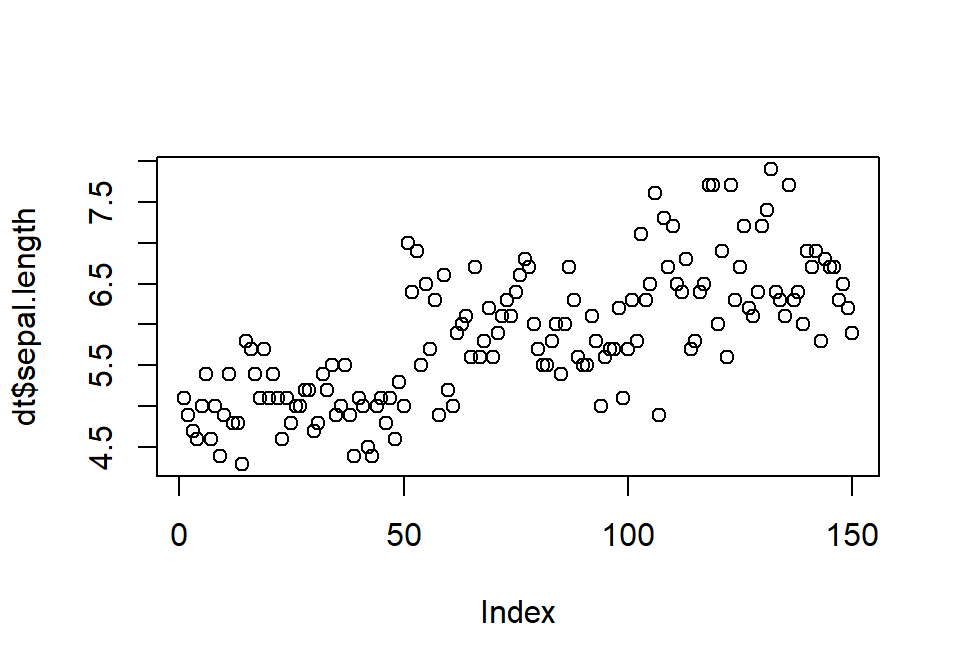

Argumendiga *type=* saab määrata graafiku tüübi. Näiteks "l" joongraafik, "b" jooned ja sümolid koos jne (vaata ?plot). 

```r
plot(dt$sepal.length, type= "b")
```

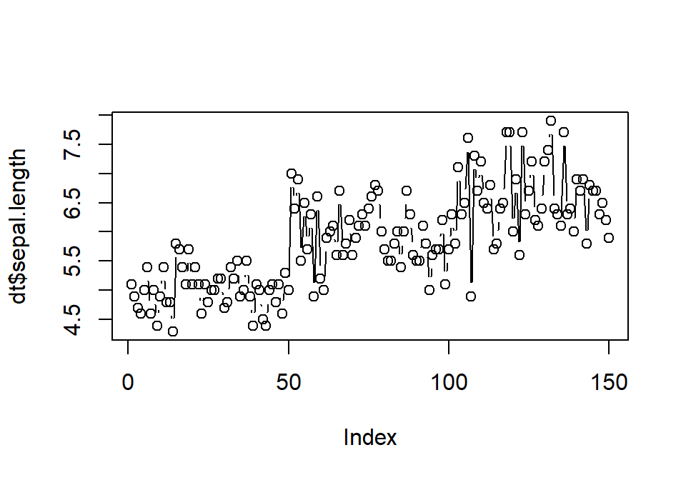


**Histogram**


```r
hist(x = dt$sepal.length)
```


```r
hist(x = dt$sepal.length, breaks = 20)
```


**Boxplot**

Ühele grupile

```r
boxplot(dt$sepal.length)
```

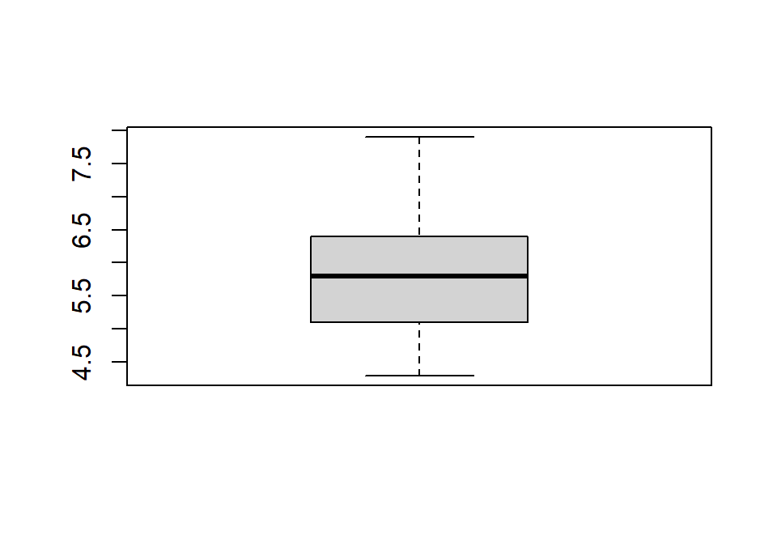


Mitme grupi lõikes peab kasutama *formula* märki (~)

```r
boxplot(dt$sepal.length ~ dt$species)
```

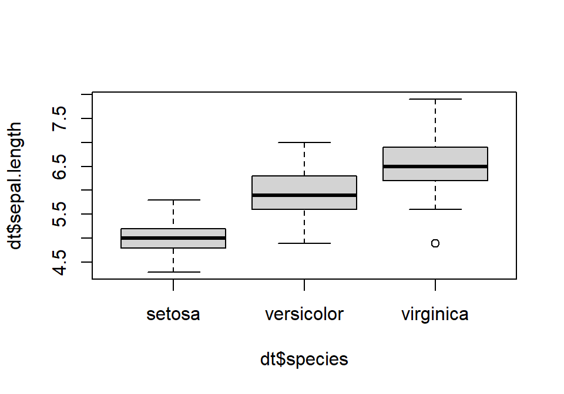

**Barplot**

Barplot'i jaoks on sisendiks vaja tabelit


```r
library(dplyr)
d_bar <- dt%>%
  filter(sepal.length>5.5)%>%
  select(species)%>%
  table()
d_bar
```

```
## .
##     setosa versicolor  virginica 
##          3         39         49
```


```r
barplot(d_bar)
```


**Baasgraafikute parameetrid**  

+ pch: graafikul esitatv sümbol (vaikimisi ring)
+ lty: joone tüüp (vaikimisi tavaline)
+ ldw: joone laius (numbriline vaikimisi 1)
+ col: värv (colors() funktsiooniga näeb võimalikke värve)
+ xlab ja ylab: telgede nimed (tekstiline väärtus)
+ xlim ja ylim: telgede limiidid (kui on vaja neid suurenda või vähendada)  


```r
plot(x = dt$sepal.length, y = dt$sepal.width,
     pch=2,
     col="red",
     xlab="Sepal length",
     ylab="Sepal width")
```

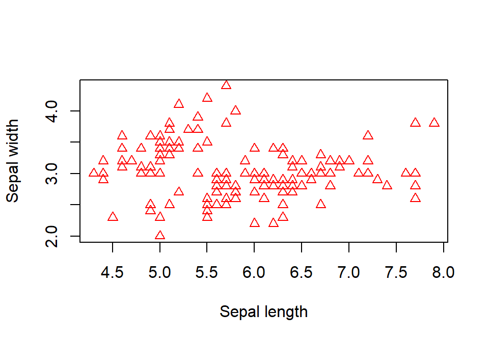


`par()` funktsiooniga saab seada *globaalseid* parameetrieid. Näiteks saab panna mitu graafikut üksteise kõrvale:  


```r
par(mfrow=c(1,2))
```

Mis värviparameeter on vaikimisi *globaalselt* määratletud?


```r
par("col")
```

```
## [1] "black"
```

**Baasgraafikute ehitamine**

Graafikutele saab lisada erinevaid komponente või ka teisi graafikuid. nii on võimalik vajalik graafik kokku ehitada. Mõned võimalused:

+ lines() joonte lisamine
+ points() punktide lisamine
+ text() teksti lisamine
+ title() palkirja lisamine
+ legend() legendi lisamine


```r
plot(x = dt$sepal.length, y = dt$sepal.width,
     xlab="Sepal length",
     ylab="Sepal width")
dt2 <- dt %>%
  filter(species=="setosa")
points(dt2$sepal.length, dt2$sepal.width, col="red")
legend("topright", pch=1, col=c("black", "red"),legend = c("muu", "seotsa"))
title(main = "Pealkiri")
```

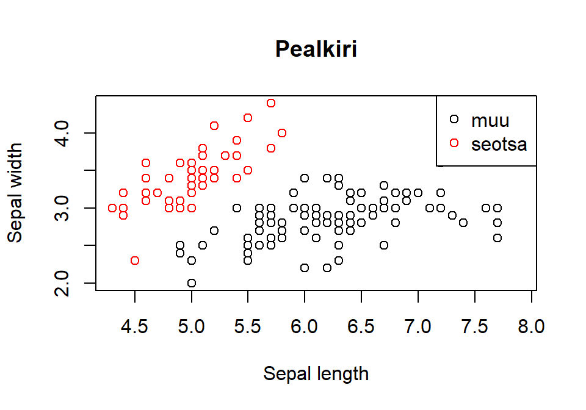


### ggplot


ggplot'i lähtekohaks on Leland Wilkinsoni *graafika grammatika*, mis lähtub põhimõttest, et graafiku võib lahutada eraldiseisvateks komponentideks ja neist komponentidest saab saab uusi tervikuid ehitada.
> "... the grammar tells us that a statistical graphic is a **mapping from data** to 
> **aesthetic attributes** (colour, shape, size) of **geometric objects** (points, 
> lines, bars). The plot may also contain **statistical transformations** of the data 
> and is drawn on a specific **coordinate system**. **Facetting** can be used to generate 
> the same plot for diferent subsets of the dataset. It is the combination of these 
> independent components that make up a graphic." 
> (Hadley Wickham, "ggplot2: Elegant Graphics for Data Analysis")

**ggploti elemendid**

- `data` : andmed. Üldiselt peaks olema dataframe kujul
- `geom` : geomeetriline objekt, mille läbi me oma anmdeid esitame (punktid, jooned, tulbad jne)
- `aes` : *aesthetic* ehk siis kuidas ja mille läbi me oma andmeid geomeetriliste objektidega suhestame (mis on x ja y telg, värv, kuju, suurus). Need on joonise objektide visuaalsed omadused
- `facet` : tahud ehk kuidas joonist alamosadeks (tahkudeks) jagada
- `stat` : milliseid statistilisi transformatsioone on vaja kasutada
- `scales` : kuidas andmete reaalsed väärtused joonise väärtusteks tõlgendatakse
- `coord` : mis koordinaatsüsteemi kasutada. Üldiselt `cartesian`
- `positsion` : andmeobjektide positsioonide nihutamine
- `guides` : teljed, legendid jne
- `theme` : joonise üldine kujundus (kus asub legend, mis värvi on tagapõhi jne)


Installime ggplot'i (kui me seda jua teinud ei ole) ja laadime selleks sessiooniks. Üritame teha regressioonijoontega *scatterploti*.


```r
#install.packages("ggplot2")
library(ggplot2)
dt <- iris
names(dt) <- tolower(names(dt))
```

**Scatterplot**

Kõigepealt `ggplot`i peafunktsioon, kus märgime andmestiku (tegelikult võime seda teha ka *geom*'i sees). Seejärel lisame *geom*'i kihi. Liidame selle peafunktsioonile otsa (kasutatdes `+` märki). Tahame punktdiagrammi, seega `geom_point` (et saada aimu erinevatest võimalikest *geom*'idest, võib uurida ggplot'i kodulehte https://ggplot2.tidyverse.org/reference/ või *cheatsheet*'i (Help > Cheatsheets > Data visualization with ggplot2)). Defineerime `aes`*thetic*'u ehk siis *mapime* tunnused x ja y teljele.


```r
ggplot(data=dt)+
  geom_point(mapping = aes(x=sepal.width, y=sepal.length))
```


Tegelikult ei pea argumente välja kirjutama, vaid järjekord on tähtis. Saab ka nii:


```r
ggplot(dt)+
  geom_point(aes(sepal.width, sepal.length))
```

Tahame erinevad iirise liigid erinevate värvidega grupeerida. Kuna me tahame määrata seda, kuidas andmeid esitatakse (tunnuseid graafikule *mapitakse*), peame seda tegema `aes`'i argumendi sees.


```r
ggplot(data=dt)+
  geom_point(mapping = aes(x=sepal.width, y=sepal.length, color=species))
```

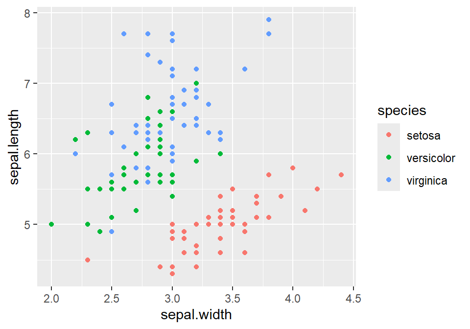

Saaksime neid eristada ka näiteks kuju `shape=` või suuruse `size=` või ka läbipaistvuse `alpha=` järgi.


```r
ggplot(data=dt)+
  geom_point(mapping = aes(x=sepal.width, y=sepal.length, shape=species))
```


Kui me tahame lihtsalt punktide värvi muuta (ja mitte lähtuda mingist grupeerivast tunnusest), saame seda teha väljaspool `aes()` argumenti.


```r
ggplot(data=dt)+
  geom_point(mapping = aes(x=sepal.width, y=sepal.length), color="green")
```


Oleks vaja joonisele ka regressioonijooned saada. Selleks lisame lihtsalt järgmise kihi (kasutades `+` märki).   
Regressioonijoone joonistamiseks võime kasutada `geom_abline()`'i, aga sellisel juhul peame regressioonikoefitsiendid enne välja arvutama (`geam_abline()` vajab sisendiks *intercept*'i ning *slope*'i). Lihtsam on kasutada `geom_smooth()`'i.


```r
ggplot(data=dt)+
  geom_point(mapping = aes(x=sepal.width, y=sepal.length, color=species))+
  geom_smooth(aes(x=sepal.width, y=sepal.length))
```

```
## `geom_smooth()` using method = 'loess' and formula 'y ~ x'
```


Mhh, joon ei meenuta regressioonijoont. Asi on selles, et tegemist on küll regressioonijoonega, kuid mitte harjumuspärase lineaarse regressioonijoonega. `geom_smooth` kasutab vaikimisi nn *Local Polynomial Regression Fitting*'ut, mis üritab *predictida* y väärtuse sõltuvust x'i väärtusest võimalikult täpselt ja lähtudes x'i lähiümbrusest. Aga saame tellida ka tavalise lineaarse regressioonijoone, kasutades argumenti `method="lm"`.


```r
ggplot(data=dt)+
  geom_point(mapping = aes(x=sepal.width, y=sepal.length, color=species))+
  geom_smooth(aes(x=sepal.width, y=sepal.length), method="lm")
```

```
## `geom_smooth()` using formula 'y ~ x'
```

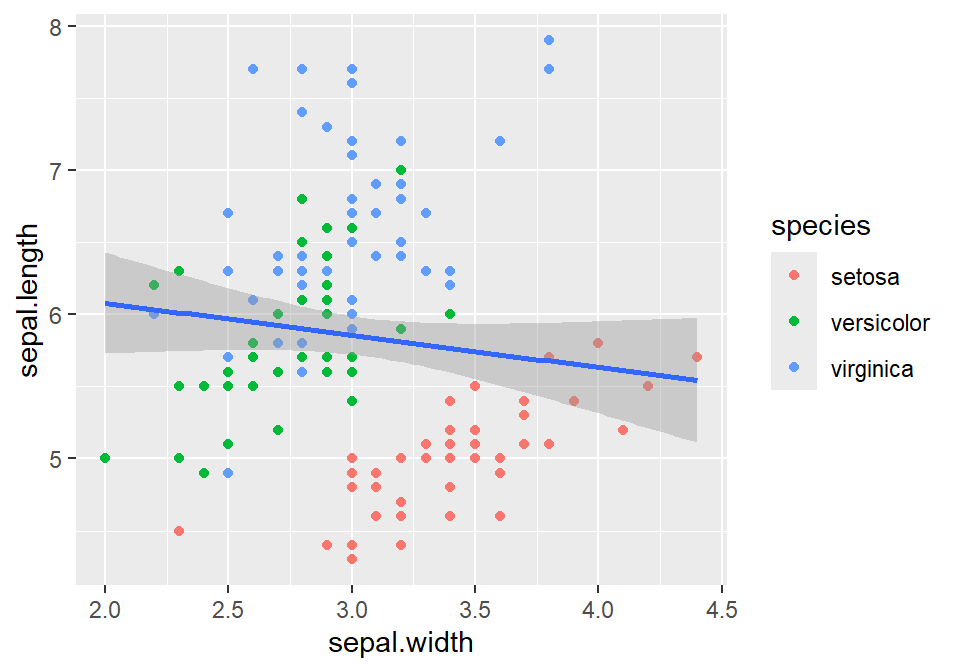

Kõikide iirise liikide kohta eraldi joonte saamiseks tuleb jällegi määrata grupeerimine `geom_smooth()`'i `aes()`'i sees (kuna see on eraldi kiht ja eelmise kihi määrangud siin enam ei kehti). Kui me usaldusintervalle mingil põhjusel ei taha, võime need tühistada argumendiga `se=F`.


```r
ggplot(data=dt)+
  geom_point(mapping = aes(x=sepal.width, y=sepal.length, color=species))+
  geom_smooth(aes(x=sepal.width, y=sepal.length, color=species), method="lm", se=F)
```

```
## `geom_smooth()` using formula 'y ~ x'
```


Pidime `aes()` argumendi määrangud kaks korda järjest välja kirjutama, kuigi nad on identsed. Ei tundu väga mõistlik. Õnneks saab ka lihtsamalt. Võime need määrata ka `ggplot()` funktsiooni enda sees. Sellisel juhul kehtivad nad ka kõikide järgenvate kihtide kohta (välja arvatud juhul kui järgenvates kihtides on teisiti määratud).


```r
ggplot(dt, aes(sepal.width, sepal.length, color=species))+
  geom_point()+
  geom_smooth(method="lm", se=F)
```

**Facetid**

Gruppe saab eristada ka neid erinevatele tahkudele pannes, kasutades selleks `facet_wrap()`'i või `facet_grid`'i. `facet_wrap()` eristab ühe tunnuse lõikes, `facet_grid()` mitme tunnuse lõikes. Mõlema puhul tuleb kasutada *formula* määrangut, st. tuleb kasutada ~ märki (tegelikult ggplot'i viimase versiooni puhul saame kasutada ka argumente `rows=` ja `cols=`).


```r
ggplot(dt, aes(sepal.width, sepal.length))+
  geom_point()+
  geom_smooth(method="lm", se=F)+
  facet_wrap(~species)
```

```
## `geom_smooth()` using formula 'y ~ x'
```


Kui tahame tahkusid näiteks ainult kahes tulbas, saame kasutada argumenti `nrow=` või `ncol=`.


```r
ggplot(dt, aes(sepal.width, sepal.length))+
  geom_point()+
  geom_smooth(method="lm", se=F)+
  facet_wrap(~species, ncol=2)
```

```
## `geom_smooth()` using formula 'y ~ x'
```


`facet_grid()`'i ja kahe tunnuse lõikes tahkude illustreerimiseks meil *iris*'e andmestikus piisavalt kategoriaalseid tunnuseid ei ole. Aga ggplotiga tuleb kaasa `diamonds` andmebaas. Vaatame seda:


```r
dt1 <- diamonds
str(dt1)
```

```
## tibble [53,940 x 10] (S3: tbl_df/tbl/data.frame)
##  $ carat  : num [1:53940] 0.23 0.21 0.23 0.29 0.31 0.24 0.24 0.26 0.22 0.23 ...
##  $ cut    : Ord.factor w/ 5 levels "Fair"<"Good"<..: 5 4 2 4 2 3 3 3 1 3 ...
##  $ color  : Ord.factor w/ 7 levels "D"<"E"<"F"<"G"<..: 2 2 2 6 7 7 6 5 2 5 ...
##  $ clarity: Ord.factor w/ 8 levels "I1"<"SI2"<"SI1"<..: 2 3 5 4 2 6 7 3 4 5 ...
##  $ depth  : num [1:53940] 61.5 59.8 56.9 62.4 63.3 62.8 62.3 61.9 65.1 59.4 ...
##  $ table  : num [1:53940] 55 61 65 58 58 57 57 55 61 61 ...
##  $ price  : int [1:53940] 326 326 327 334 335 336 336 337 337 338 ...
##  $ x      : num [1:53940] 3.95 3.89 4.05 4.2 4.34 3.94 3.95 4.07 3.87 4 ...
##  $ y      : num [1:53940] 3.98 3.84 4.07 4.23 4.35 3.96 3.98 4.11 3.78 4.05 ...
##  $ z      : num [1:53940] 2.43 2.31 2.31 2.63 2.75 2.48 2.47 2.53 2.49 2.39 ...
```

Kuidas on seotud teemandite karaadid (*carat*) ja nende hind (*price*)?


```r
ggplot(dt1)+
  geom_point(mapping = aes(x=carat, y=price))
```

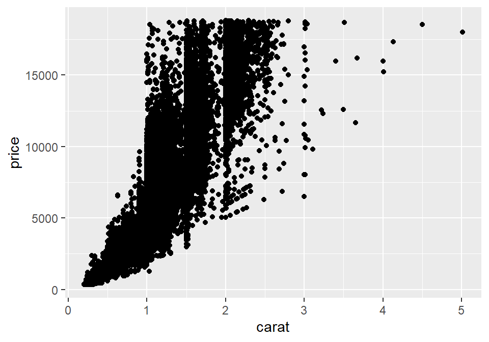

Kuidas siia suhestub teemandite selgus (*clarity*)?


```r
ggplot(dt1)+
  geom_point(mapping = aes(x=carat, y=price, color=clarity))
```

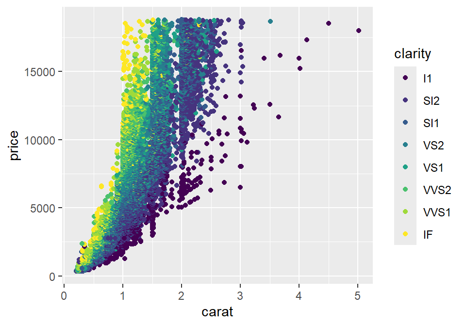

Aga nende lõige *cut*? kasutame selleks `facet_grid()`'i. Kui tahame `facet_grid()`'iga ainult ühe tunnuse lõikes tahke tekitada, tuleb teise tunnuse asemel kasuatada punkti. Seda, kas tahud on tulbas või reas, saab määrata sellega, kuhupoole ~ märki punkt panna.


```r
ggplot(dt1)+
  geom_point(mapping = aes(x=carat, y=price, color=clarity))+
  facet_grid(cut ~ .)
```


Lisame veel phe tunnuse, mille lõikes teemantide erisusi vaadata, värvi (*color*).


```r
ggplot(dt1)+
  geom_point(mapping = aes(x=carat, y=price, color=clarity))+
  facet_grid(cut ~ color)
```


**Geomid ja aestetikud**

Erinevaid `geom`'e on päris palju. Kõik nad on üles loetletud ggplot'i kodulehel (koos suure hulga muu infoga): https://ggplot2.tidyverse.org/reference/. Aga mõned olulisemad:  

- `geom_bar()`
- `geom_histogram()` ja `geom_freqpoly()`
- `geom_boxplot()` ja `geom_violin()`
- `geom_line()` ja `geom_path()`
- `geom_density()`
- `geom_abline()`, `geom_hline()` ja `geom_vline()`
- `geom_text()`

**Barplot**


Tavaline *barplot*

```r
ggplot(dt1)+
  geom_bar(aes(clarity))
```


Kahe tunnuse lõikes tulpdiagrammi jaoks peame kasutama `aes()` sees argumenti `fill=`.

```r
ggplot(dt1)+
  geom_bar(aes(clarity, fill=cut))
```


Mhh, see vist ei ole päris see mida me silmas pidasime. Pigem tahaksime, et gruppide tulbad asuksid kõrvuti. Selleks peame määratlema geomi positsiooni:


```r
ggplot(dt1)+
  geom_bar(aes(clarity, fill=cut), position="dodge")
```

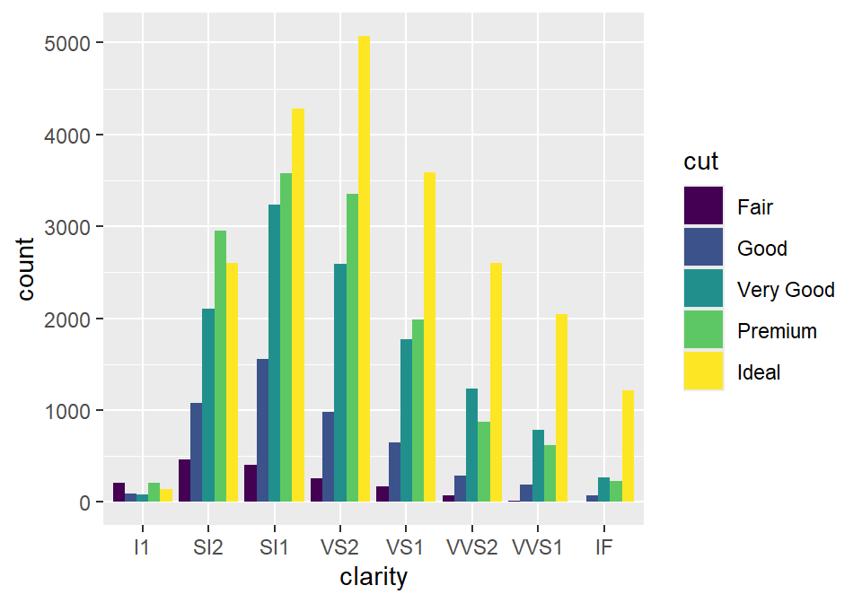

Või siis kui tahame 100% barplot

```r
ggplot(dt1)+
  geom_bar(aes(clarity, fill=cut), position = "fill")
```


**Boxplot ja violin plot**


```r
ggplot(dt1)+
  geom_boxplot(aes(x=color, y=carat))
```


```r
ggplot(dt1)+
  geom_violin(aes(x=color, y=carat))
```


**Histogram ja frequency polygon**


```r
ggplot(dt1)+
  geom_histogram(aes(x=carat), bins = 50, color="white")
```

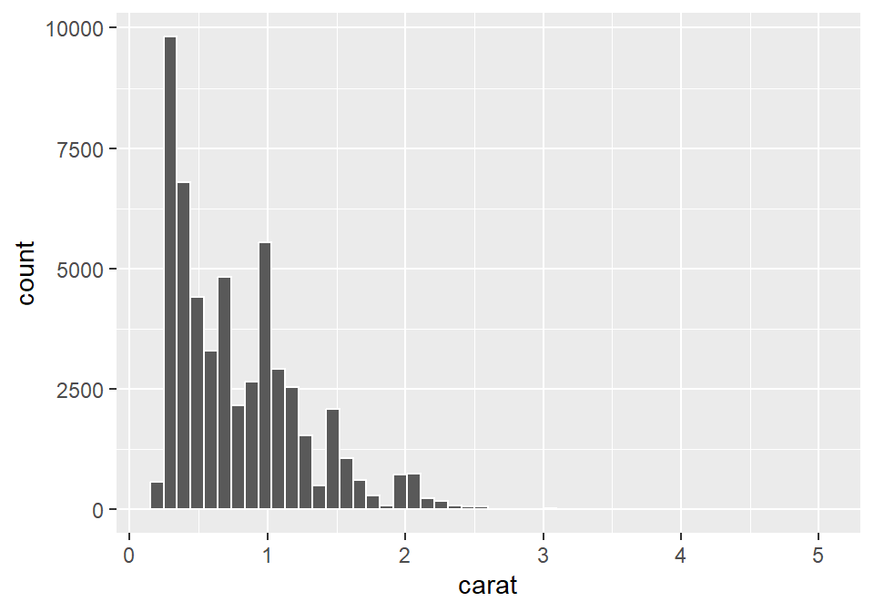


```r
ggplot(dt1)+
  geom_freqpoly(aes(x=carat))
```

```
## `stat_bin()` using `bins = 30`. Pick better value with `binwidth`.
```

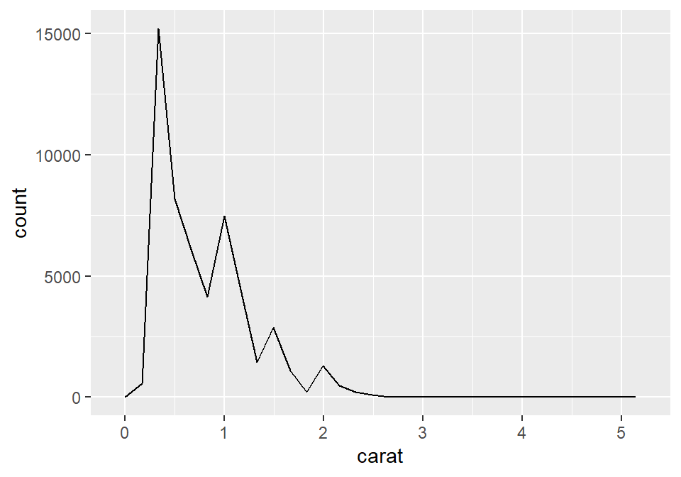


**Keskmised ja usalduspiirid**

Väga tihti on meil vaja esitada keskmiste või proportsioonide punkthinnanguid mingite gruppide lõikes koos usaldusintervallidega. Selleks on meil kõigepealt vaja keskmisi ja usaldusintervalle. ggplot neid ise ei arvuta. Aga *dplyr*'i abil saab need võrdlemisi lihtsalt kätte. t-jaotuse kvartiilid on leitavad `qt(p, df)` funktsiooniga (p on siis tõenäosus).  
Leiame teemantite keskmised hinnad koos usalduspiiridega teemadite lõiketi (*cut*):

```r
library(dplyr)
keskmised <- dt1 %>%
  group_by(cut)%>%
  summarise(keskmine=mean(price),
            se=sd(price)/sqrt(length(price)),
            l.ci=keskmine-qt(0.975, length(price)-1)*se,
            u.ci=keskmine+qt(0.975, length(price)-1)*se)
keskmised
```

```
## # A tibble: 5 x 5
##   cut       keskmine    se  l.ci  u.ci
##   <ord>        <dbl> <dbl> <dbl> <dbl>
## 1 Fair         4359.  88.7 4185. 4533.
## 2 Good         3929.  52.6 3826. 4032.
## 3 Very Good    3982.  35.8 3912. 4052.
## 4 Premium      4584.  37.0 4512. 4657.
## 5 Ideal        3458.  25.9 3407. 3508.
```


Kasutame `geom_point()`'i keskmiste visualiseerimiseks ja `geom_linerange()`'i usalduspiiride märkimiseks

```r
ggplot(keskmised, aes(cut, keskmine))+
  geom_point()+
  geom_linerange(aes(ymin=l.ci, ymax=u.ci))+
  coord_flip() # saame joonise teljed ära vahetada
```


**Joonise disain**

ggplot võimaldab kontrollida praktiliselt kogu joonise väljanägemist. Vaatame mõnda olulisemat võimalust: telgede nimed ja joonise pealkiri  


```r
ggplot(keskmised, aes(cut, keskmine))+
  geom_point()+
  geom_linerange(aes(ymin=l.ci, ymax=u.ci))+
  coord_flip()+
  ylab("Hind")+
  xlab("Lõige")+
  ggtitle("Teemantite hind")
```


Kui me tahame telgede nimedest lahti saada:


```r
ggplot(keskmised, aes(cut, keskmine))+
  geom_point()+
  geom_linerange(aes(ymin=l.ci, ymax=u.ci))+
  coord_flip()+
  ylab(NULL)+
  xlab(NULL)
```


```r
# või ka nii:
# ggplot(keskmised, aes(cut, keskmine))+
#   geom_point()+
#   geom_linerange(aes(ymin=l.ci, ymax=u.ci))+
#   coord_flip()+
#   labs(x = NULL, y = NULL)
```

`xlab` ja `ylab` on tegelikult mugavdatud variandid `scale` funktsioonidest. `scale` funktsioonid kontrollivad seda kuidas andmed mappitakse `aes()`'i. Võetakse andmed ja teakse neist midagi joonisel nähtavat. Igal *aestheticul* on oma `scale`:  
- Kui x telg on pidev: `scale_x_continuous`
- Kui y telg on kategoriaalne: `scale_y_discrete`
- Kui kasutame `fill` `aes`'i: `scale_fill_discrete`


```r
ggplot(keskmised, aes(cut, keskmine))+
  geom_point()+
  geom_linerange(aes(ymin=l.ci, ymax=u.ci))+
  coord_flip()+
  scale_x_discrete(name="Lõige")+
  scale_y_continuous(name="Hind")
```

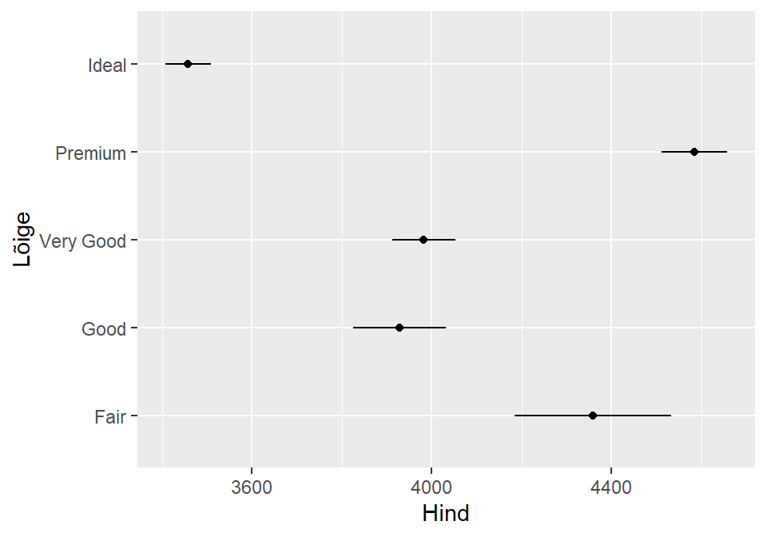


Saame kontrollida ka *tick mark*'e ja *label*'eid


```r
ggplot(keskmised, aes(cut, keskmine))+
  geom_point()+
  geom_linerange(aes(ymin=l.ci, ymax=u.ci))+
  coord_flip()+
  scale_x_discrete(name="Lõige", labels=c(1:5))+
  scale_y_continuous(name="Hind", breaks = seq(3000,5000, by=100))
```


Kõige võimsam joonise visuaali tööriist, millega saab kontrollida pea kõike, on `theme()`. Täpsemalt saab selle kohta lugeda https://ggplot2.tidyverse.org/reference/theme.html. Vaatame näiteks, kuidas `theme()` abil muula legendi asukohta ning kustutada x-telje skaala:


```r
dt <- iris
names(dt) <- tolower(names(dt))
ggplot(dt, aes(sepal.width, sepal.length, color=species))+
  geom_point()+
  theme(legend.position="bottom",
        axis.text.x = element_blank())
```


Saame üksikasjalikult muuta praktiliselt kogu joonise väljanägemist. Saame kasutada ka juba mõningaid valmistehtud `theme()`'ide *template*'e. Näiteks `theme_bw()`.


```r
dt <- iris
names(dt) <- tolower(names(dt))
ggplot(dt, aes(sepal.width, sepal.length, color=species))+
  geom_point()+
  theme_bw()
```


## Edasiseks lugemiseks 


- R'i baasteadmised  
  + Daniel Navarro, "Learning statistics with R: A tutorial for psychology students and other beginners", peatükid 3, 4, 5, 7  
- dplyr  
  + https://cran.r-project.org/web/packages/dplyr/vignettes/dplyr.html
- ggplot
  + Grolemund, G., Wickham, H., "R for Data Science"., peatükk 3 "Data visualisation" http://r4ds.had.co.nz/


