# Lineaarne regressioon


## Lihtne lineaarne regressioon

Lihtne lineaarne regressioon (*simple linear regression*) on statistiline meetod mis võimaldab hinnata ja kvantifitseerida kahe arvtunnuse vahelist suhet. Regressioonisuhte puhul eeldatakse, et üks tunnustest oleks nn sõltuv tunnus ja teine sõltumatu^[Inglisekeelses terminoloogias kasutatakse sõltuva tunnuse puhul peale *dependent variable* ka nimetusi *response* või *outcome variable* ja sõltumatu tunnuse puhul peale *independent variable* ka *predictor* või *explanatory variable*. Prediktor on ka eesti keeles kasutusel.], kus sõltuva tunnuse väärtus on mõjutatud (sõltub) sõltumatu tunnuse väärtusest. Kui sõltumatuid tunnuseid on rohkem kui üks, on tegemist mitmese regressiooniga (sellest hiljem), ühe sõltumatu tunnuse korral nimetatakse mudelit nn "lihtsaks" regressiooniks (*simple linear regression*). Keskendume esialgu sellele "lihtsale" variandile.

Kasutame näitena Piaaci andmestikku. Tõmbame andmestiku sisse ja uurime graafiliselt sissetuleku (*sissetulek*) ning matemaatilise kirjaokuse (*numeracy*) vahelist seost.


```r
# Loeme kõigepealt sisse vajalikud paketid
library(dplyr)
library(ggplot2)
library(readr)

# Tõmbame  sisse andmestiku
piaac <- read_csv("https://github.com/mrksom/kvant/raw/master/data/piaac.csv")

piaac %>% 
  ggplot(aes(x = numeracy, y = sissetulek))+
  geom_point(size = 0.5, alpha = 0.3)+
  theme_minimal()
```


Tundub, et nende kahe tunnuse vahel on seos olemas. Mida kõrgem on matemaatilise kirjaoskuse skoor, seda kõrgem on sissetulek. Me saame selle suhte kokku võtta regressioonisirge abil. ggplotis on olemas vastav funktsioon `geom_smooth()`, mis selle joone meile graafikule paneb. Kuna me tahame saada lineaarse regressiooni sirget, siis peame `geom_smooth`'is kasutama argumenti `method = "lm"`^[*Defaultis* annab `geom_smooth` meile mittelineaarse regressioonijoone (vastavalt sellele palju vaatlusi on, kas *gam* või *loess*), mis üritab tunnustevahelist suhet andmete kõikides punktides võimalikult täpselt kirjeldada.]


```r
piaac %>% 
  ggplot(aes(x = numeracy, y = sissetulek))+
  geom_point(size = 0.5, alpha = 0.2)+
  geom_smooth(method = "lm", se = F, color = "#972D15")+
  theme_minimal()
```


Regressioonisirge on väljendatav tavalise joone võrrandiga:

\begin{equation}
Y=a+bX
\end{equation}

kus $a$ on vabaliige (*intercept*) ja $b$ on sirge tõus (*slope*). Regressiooni kontekstis kutsutakse seda sirge tõusu regressioonikoefitsiendiks või regressioonikordajaks. Vabaliige tähistab $Y$ väärtust juhul kui $X$ on $0$ (sirge lõikumine y-teljega) ja sirge tõus ühikulist muutust $Y$ väärtuses kui $X$-i väärtus muutub ühe ühiku võrra. Kui sirge tõus on positiivne, siis $X$'i väärtuse kasvades $Y$ väärtus suureneb, kui negatiivne, siis kahaneb. Kui sirge tõus on aga $0$, siis seos kahe tunnuse vahel puudub (iga $X$ väärtuse korral on keskmine $Y$ sama).

Linaarse regressioonanalüüsi eesmärgiks ongi leida parim võimalik sirge (st leida vabaliige ja regressioonikoefitsient, mis seda sirget määratlevad) tunnustevahelise lineaarse suhte kirjeldamiseks. Parim võimalik tähendab siinjuures seda, et see sirge läheb andmepunktide parvest läbi võimalikult keskelt, st kirjeldab kõiki punkte võimalikult hästi. 

## Regressioon R-is

R-is käib lihtsa regressioonimudeli tegemine `lm()` (*linear model*) funktsiooniga. Loomulikult on ka teisi funktsioone, mis regressiooni jooksutamisega hakkama saavad ja hea tahtmise korral võib vastava funktsiooni ka mõningase vaevaga ise valmis kirjutada. Kuid jätame teised variandid hetkel kõrvale.  

`lm()` funktsioonis tuleb defineerida regressioonivõrrand. Selleks  peame määratlema sõltuva tunnuse, seejärel kasutama tildet (`~`) ning seejärel määratlema sõltumatu(d) tunnuse(d): `sõltuv_tunnus ~ sõltumatu_tunnus`^[Hiljem, kui meil on mitu sõltumatut tunnust, eristame tunnused plussiga: `sõltuv_tunnus ~ sõltumatu_tunnus_1 + sõltumatu_tunnus_2 + ...`]. 

Saaksime ka vabaliikme võrrandisse sisse kirjutada: `sõltuv_tunnus ~ 1 + sõltumatu_tunnus`. Vabaliige on alati tähistatud `1`-ga ja kuna ta on alati mudelis olemas, siis R lisab selle ise vaikimisi võrrandisse ning seega me tegelikult ei pea seda eksplitsiitselt välja kirjutama. Küll aga saame selle abil moodustada ainult vabaliikmega mudeli. See oleks nn nullmudel ehk tegelikult lihtsalt sõltuva tunnuse keskmise mudel. Defineerime sellise mudeli:


```r
lm(sissetulek ~ 1, data = piaac)
```

```
## 
## Call:
## lm(formula = sissetulek ~ 1, data = piaac)
## 
## Coefficients:
## (Intercept)  
##       855.5
```
Tulemiks on mudeli vabaliikme *(Intercept)* väärtus, mis juhul kui ühtegi sõltumatut tunnust mudelis ei ole, on lihtsalt keskmine sissetulek. Täpselt sama tulemuse saame `mean()` funktsiooniga:


```r
mean(piaac$sissetulek, na.rm = T)
```

```
## [1] 855.4557
```

Kui me tahame inimeste heaolu või hakkamasaamist uurida, siis annab keskmise sissetulek meile selle jaoks kindlasti mingit lähtekoha, kuid lihtne keskmine ei ole just aga ülemäära informatiivne. Me ju teame, et erinevatel inimestel on erinevad sissetulekud, ning tegelikult huvitaks meid asjaolud mis seda sissetulekute erinevust põhjustavad.

Siin tulebki mängu regressioonanalüüs, mis võimaldab uurida kuidas eri tunnused mõjutavad sissetulekute erinevust. Näiteks saaksime vaadata, kas matemaatilise kirjaoskuse tase mõjutab mingitpidi keskmist sissetulekut, ehk siis kas erineva matemaatilise kirjaoskusega inimeste keskmised sissetulekud erinevad. Ja kui erinevad, siis kui palju nad erinevad.

Defineerimegi järgmisena regressioonimudeli, kuhu lisame sõltumatu tunnusena matemaatilise kirjaoskuse ja millega hindame matemaatilise kirjaoskuse mõju sissetulekule^[Tegelikult ei ole selline mudel korrektne. Sissetuleku jaotus ei vasta hästi regressiooni nõuetele. Miks ei vasta ja kuidas see vastama panna, sellest natuke hiljem. Kuid hetkel kasutame seda puhtalt didaktilistest kaalutustest lähtuvalt.]:


```r
lm(sissetulek ~ numeracy, data = piaac)
```

```
## 
## Call:
## lm(formula = sissetulek ~ numeracy, data = piaac)
## 
## Coefficients:
## (Intercept)     numeracy  
##    -140.887        3.606
```

Lihtsalt `lm()` funktsiooni jookustades saame nüüd kaks numbrit - vabaliikme (*intercept*), mis antud näite puhul on $-140$, ja regressioonikoefitsiendi (*regression coefficient*), mis antud näite puhul on $3.6$. Mida need meile ütlevad? Nagu eelnevalt juttu oli, siis vabaliige on $Y$ väärtus kui $X$ on $0$, ehk siis inimesel, kelle matemaatilise kirjaoskuse skoor on $0$, peaks meie mudeli kohaselt sissetulek olema $-140$. Regressioonikoefitsient aga annab meile teada kui palju $Y$ muutub, kui $X$ muutub ühe ühiku võrra, ehk siis kui matemaatilise kirjaoskuse skoor tõuseb ühe punkti võrra, tõuseb sissetulek keskmiselt $3.6$ euro võrra.

Näeme, et vabaliikme väärtus on negatiivne, mis ei ole ju tegelikult reaalselt võimalik olukord - sissetulek ei saa olla negatiivne. Taoline olukord tekkis seetõttu, et Piaaci testis ei saa ka matemaatilise kirjaoskuse skoor $0$ olla ning seega ebareaalsele sõltumatu tunnuse väärtusele vastab mudelis ebareaalne sõltuva tunnuse väärtus. Selliseid olukordi, kus sõltumatu tunnuse $0$ väärtus on ebareaalne (näiteks pikkus, kaal jne), tuleb päris sageli ette, mis tähendab, et üldjuhul ei ole vabaliikme väärtus omaette sisuliselt oluline (küll aga on see oluline terve mudeli kontekstis). Tegelikult saame sõltumatuid tunnuseid transformeerides (näiteks kui standardiseerime matemaatilise kirjaoskuse taseme nii, et keskmine tase oleks 0) selle väärtuse ka sisukaks teha, kuid sellest natuke hiljem.

Nüüd, kui teame mudeli parameetreid, saame nende abil regressioonijoone graafikule kanda ka ilma `geom_smooth`'ita:


```r
piaac %>% 
  ggplot(aes(x = numeracy, y = sissetulek))+
  geom_point(size = 0.3, alpha = 0.2)+
  geom_abline(slope = 3.6, intercept = -140, color = "#972D15")+
  coord_cartesian(xlim = c(0,450), ylim = c(0,3500))+
  theme_minimal()
```

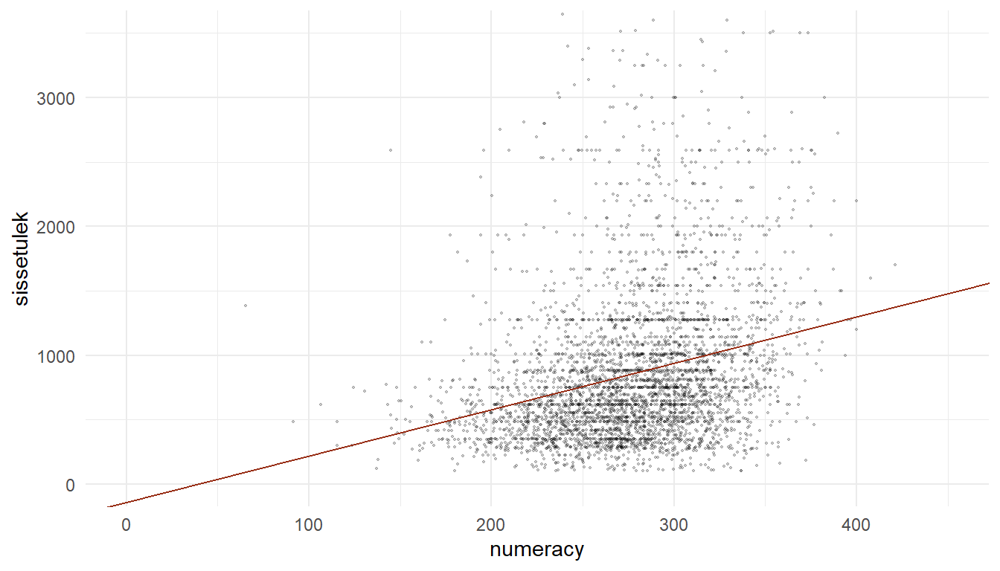


Kui me peaksime prognoosima mõnele inimesele tema sissetulekud, siis nullmudeli puhul oleks meie parim pakkumine kogu populatsiooni keskmine sissetulek. Regressioonimudeliga saame teha juba täpsema prognoosid ja arvesse võtta ka sõltumatust tunnusest tulevat variatiivsust keskmises sissetulekus.  Kui me teame regressioonisirge tõusu ehk regressioonikoefitsienti ja vabaliiget, siis lähtuvalt sõltumatu tunnuse väärtustest saame prognoosida sõltuva tunnuse väärtuse: 

\begin{equation}
  \hat{y}_i=b_0+b_1x_i
\end{equation}

$\hat{y}_i$ antud võrrandis tähistab hinnatud või prognoositud $y$ väärtust (sellest ka see müts $y$ peal) vaatlusele $i$. Kui meil on regressioonivõrrand $\hat{y}_i=-140+3.6x_i$ ja meil on mingi vaatlus $i$, mille $x$ väärtus on näiteks 200, siis saame sellele vaatlusele prognoosida $y$ väärtuseks:

\begin{equation}
  -140+3.6\times200=580
\end{equation}

Ehk siis inimesel, kelle matemaatilise kirjaoskuse skoor on 200, peaks meie mudeli järgi sissetulek olema keskmiselt *ca* 580 eurot. Inimesel, kelle matemaatilise kirjaoskuse skoor on 400, peaks sissetulek olema keskmiselt $-140+3.6\times400=1300$ eurot

<div class="figure">
<p class="caption">(\#fig:reg-plot-4)Prognoosime y väärtust kui x on 200 ja kui x = 400</p>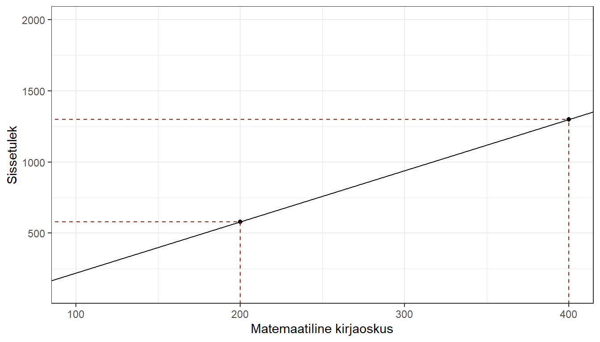</div>

## Regressiooni jäägid

Kui me prognoosime oma regressioonisirge alusel kellelegi sissetulekut, siis peame arvestama, et prognoositav keskmine sisaldab alati ka teatavat viga (samamoodi, nagu tavaline keskmine sisaldab viga, mis on väljendatav standardhälbena). Võimatu on ühe sirgega kõiki punkte ideaalselt kirjeldada. Iga punkti ja sirge vahele jääb alati mingi viga, või teisisõnu, kõik punktid (või vähemalt enamus neist) hälbivad suuremal või vähemal määral regressioonisirgest.  

Mida suuremad need hälbed on, seda vähem suudab on meie mudel (regressioonisirge) kirjeldada sõltuva tunnuse variatsiooni ja seda suurem on vea määr meie mudelis. Neid hälbeid kutusutakse **regressiooni jääkideks** (*regression residuals*). 

<div class="figure">
<p class="caption">(\#fig:reg-plot-5)Regressiooni jäägid</p>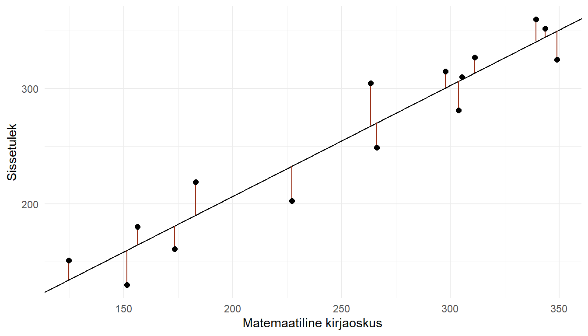</div>

Ehk siis iga kord, kui prognoosime $\hat{y}_i=\beta_0+\beta_1x_i$ abil $y_i$ väärtust, teeme me mingi vea^[Mida saab väljendada kui $\epsilon_i=y_i-\hat{y}_i$]. Seetõttu tuleb regressioonivõrrandile lisada vea komponent ($\epsilon$) ning võrrand ise muutub vastavalt:

\begin{equation}
  \hat{y_i}=\beta_0+\beta x_i+\epsilon_i
\end{equation}

Kõige parem regressioonisirge annab joon, mille puhul jäägid on minimaalsed, ehk siis joon, mille puhul kõikide vaatluste jääkide summa oleks võimalikult väike. Kuna me ei saa jääke kokku võtta neid lihtsalt kokku liites (*ca* pooled jäägid on väiksemad kui regressioonijoon ja *ca* pooled suuremad, seega nende summa oleks $0$), siis tuleb nad enne liitmist ruutu panna. Ja meie eesmärgiks on nüüd leida regressioonisirge, mis minimeeriks **ruutjääkide summa** (*residual sum of squares* ehk $RSS$) ehk siis regressioonisirge, mille puhul $RSS$ oleks võimalikult väike^[$RSS= = e_1^2 + e_2^2 + ... + e_n = \sum_{i=1}^{n}(y_i-\hat{y}_i)^2$].

Eelnevast lähtuvalt on ka küllaltki loogiline, et meetodit, millega $RSS$ minimeeritakse ja regressioonisirge ning vastavad koefitsiendid leitakse, nimetatakse **vähimruutude meetodiks**. 


::: {.teie-kord}
Ülesanne!  

* Kasutades ggplot'i ja tehke punktdiagramm `geom_point()` matemaatilise kirjaoskuse (*numeracy*) ja funktsionaalse lugemisoskuse (*literacy*) vahelisest seosest. Pange *numeracy* x-teljele ja *literacy* y-teljele.  
* Kasutades `geom_abline()`'i, lisage joonisele lineaarne regressioonijoon (seega peate eelnevalt `lm()` funktsiooniga leidma regressioonijoone vabaliikme ja regressioonikoefitsiendi)
:::


## Regressioonimudeli sobitumine

Olles leidnud joone, mis kirjeldab kahe tunnuse vahelist seost kõige paremini, võiks ju eeldada, et ülesanne on täidetud. Aga kas ikka on? Ükskõik, millisest punktiparvest võib regressioonijoone läbi panna. Kuid tulenevalt regressioonijääkide (vaatluste hälbed regressioonijoonest) suurusest saame selle joone kohta teha väga erinevaid järeldusi. Kui jäägid on väikesed, siis võime suhteliselt täpselt prognoosida sõltuva tunnuse väärtust või teha järeldusi seose kohta. Kuid mida suuremad on jäägid, seda ebatäpsem on ka meie prognoos/järeldus. 

Üldjuhul kasutame regresioonanalüüsi, et teha valimi baasil järeldusi mingi üldkogumi kohta. Meid huvitab, kas see seos, mida näeme oma valimi andmete põhjal, kehtib ka üldkogumis. Saame küll eeldada, et valimipõhiselt leitud regressioonisirge on suhteliselt sarnane üldkogumi sirgele (sirge, mille me saaksime, kui kaasaksime analüüsi kõik üldkogumi liikmed), aga kui sarnane, seda me ei tea. Kui me võtaksime samast üldkogumist teise valimi, siis juhul kui mõlemad valimid on võetud korrektselt^[Korrektse valimi võtmise all peame siinkohal silmas eelkõige juhuvalikut. Kõikidel populatsiooni liikmetel/elementidel peab olema võrdne võimalus valimisse sattuda. Kui üldpopulatsiooniks on Eesti elanikkond, aga valimisse võtaksime ainult Tallinna elanikud, siis antud valimi põhjal tehtavad järeldused ei oleks kuidagi üldistatavad kõigile Eesti elanikele, vaid ikkagi ainult tallinnlastele. Lisaks juhuvalimile on veel terve rida spetsiifilisemaid valimidisaine (stratifitseeritud valim, klastervalim jne) mida me hetkel ei käsitle. Kuid tuleb meeles pidada, et keerulisemate valimidisainide puhul tuleb hilisemas analüüsis ja järelduste tegemise käigus valimi moodustamise loogikat arvesse võtta.] ja valimid on piisavalt suured, siis peaksid nende põhjal leitud regressioonisirged olema suhteliselt sarnased, aga identsed ei ole nad praktiliselt kunagi. Kõikide võimalike valimite puhul me mingil määral alahindame või ülehindame tegelikku, populatsiooni regressioonikoefitsienti (ja ka vabaliiget). Seega, et saada aimu valimipõhise hinnangu täpsusest (vastavusest tegelikule tegelikule üldkogumi parameetrile), peaksime kuidagi välja selgitama valimi kasutamisest tuleneva vea võimaliku suuruse.

Et hinnata mudeli sobivust andmetega ja sellega leitud hinnagute täpsust, vajame mudeli kohta täiendavat infot. Eelnevalt regressioonimudelit `lm()` funktsiooniga jooksutades oli väljund väga lakooniline. Saime teada ainult vabaliikme ja regressioonikoefitsinedi väärtused. Tegelikult on `lm()` tulem muidugi märksa põhjalikum. Muule mudeliga kaasnevale infole saame ligi kui salvestame mudeli esmalt mingisse andmeobjekti ja kasutame selle andmeobjekti peal `summary()` käsku^[Ka `summary()` ei anna välja kogu mudeliobjektis sisalduvat infot. Et näha mida mudeliobjekt veel sisaldab, võib kasutada `str(mudeliobjekt)` käsku.]. 


```r
mudel1 <- lm(sissetulek ~ numeracy, data = piaac)
summary(mudel1)
```

```
## 
## Call:
## lm(formula = sissetulek ~ numeracy, data = piaac)
## 
## Residuals:
##     Min      1Q  Median      3Q     Max 
## -1016.7  -351.5  -129.1   179.4  2923.4 
## 
## Coefficients:
##             Estimate Std. Error t value Pr(>|t|)    
## (Intercept) -140.887     56.510  -2.493   0.0127 *  
## numeracy       3.606      0.202  17.849   <2e-16 ***
## ---
## Signif. codes:  0 '***' 0.001 '**' 0.01 '*' 0.05 '.' 0.1 ' ' 1
## 
## Residual standard error: 555.8 on 3982 degrees of freedom
##   (3648 observations deleted due to missingness)
## Multiple R-squared:  0.07408,	Adjusted R-squared:  0.07385 
## F-statistic: 318.6 on 1 and 3982 DF,  p-value: < 2.2e-16
```


```r
# Kui me ei taha mudelit salvestada, siis saab ka nii:
summary(lm(numeracy ~ literacy, data = piaac))
```


Nüüd näeme juba märksa põhjalikumat väljundit. Vaatame mis seal kirjas on ja kuidas seda tõlgendada. Käime väljundi sektsioonide kaupa läbi (v.a. esimene rida, mis on vist niigi suht selge)

### Jääkide jaotus


```
## Residuals:
##     Min      1Q  Median      3Q     Max 
## -1016.7  -351.5  -129.1   179.4  2923.4
```

Väljundis on kirjeldatud regressiooni jääkide (*residuals*) jaotus. Enne nägime, et regressiooni jäägid on regressioonijoone ja tegelike, vaadeldud väärtuste vahe. Mida väiksemad on jäägid, seda täpsemini kirjeldab regressioonijoon andmete vahelist seost. Nägime ka, et pooled jäägid peaksid ideaalis olema suuremad (positiivse märgiga) kui regressioonisirge ja pooled väiksemad (negatiivse märgiga). Seega peaks jääkide keskmine olema ligikaudu $0$ ning jääkide jaotus normaaljaotuse sarnane, kus esimene ja kolmas kvartiil, aga ka maksimum ja miinimum, on keskväärtusest umbes sama kaugel. Hiljem vaatame jääkide jaotust ka graafiliselt, mis on märksa mõistlikum viis neid uurida, kuid esmase mulje saab ka siit kätte.

### Regressioonikoefitsiendid ja nende olulisus


```
##             Estimate Std. Error t value Pr(>|t|)    
## (Intercept) -140.887     56.510  -2.493   0.0127 *  
## numeracy       3.606      0.202  17.849   <2e-16 ***
## ---
## Signif. codes:  0 '***' 0.001 '**' 0.01 '*' 0.05 '.' 0.1 ' ' 1
```

Koefitsientide sektsioonis on esitatud mudeli oluliseim info. __*Estimate*__ on hinnang mudeliga leitud regressioonikoefitsientidele. Lihtsa regressiooni puhul on meil ainult vabaliige ja ühe sõltumatu tunnuse koefitsient. Hiljem, mitmese regressiooni kontekstis, on neid koefitsiente rohkem. Vabaliikmeid on aga mudeli kohta alati üks.  

Tulbas __*Std. Error*__ on toodud koefitsientide standardvead. Standardviga kirjeldab meie mudeli hinnangus sisalduvat määramatust. Me kasutame regressioonikoefitsientide leidmiseks üldjuhul valimipõhiseid andmeid, kuigi tegelikult huvitavad meid ju üldkogums esinevad seosed. Valimipõhine hinnang peaks piisavalt suure valimi korral olema tõenäoliselt küllaltki sarnane üldkogumi vastavale parameetrile, kuid väikese valimi korral puhta juhuse läbi sellest arvestatavalt erineda. Standardviga näitabki kui kindlad me oma mudeli hinnangus olla saame. Mida väiksem on standardviga (võrreldes hinnangu endaga), seda kindlamad võime olla ka oma hinnangus. Standardvea suurs sõltub eelkõige jääkide hajuvusest ja valimi suurusest. Mida väiksemad on jäägid ja mida suurem on valim, seda väiksem on ka standardviga.  

Standardvea abil saame *t*-testi abil testida, kas regressioonikoefitsient erineb oluliselt nullist (kui koefitsient on null, siis seos tunnuste vahel puudub). *t*-testi tulemust näitab veerg __*t value*__. *t*-väärtus ütleb meile kui mitme standardvea kaugusel meie regressioonikoefitsient 0-st on. Kui on piisavalt kaugel, siis saame järeldada, et leitud koefitsient on ka üldkogumis 0-st erinev. Kui kaugel on aga piisavalt kaugel? See sõltub sellest, kui suurt vea tõenäosust me oleme valmis tolereerima (mingi vea tõenäosus jääb seejuures alati). Üldjuhul valitakse selleks tõenäosuseks $5\%$ (ütleme, et regressioonikoefitsient on statistiliselt oluline usaldusnivool $95 \%$ või olulisusnivool $p < 0.05$), aga see võib olla ka $1\%$ või $10\%$. Siin tegelikult ei ole mingit väga konkreetset piirmäära, millest juhinduda. Kui me aga lepime kokku, et võimaliku vea tõenäosusena aktsepteerime $5$-te protsenti, siis peab *t*-väärtus olema suurem kui *ca* $\pm2$ (täpne väärtus sõltub vaatluste arvust). Antud näite puhul on *t*-väärtused $-2.5$ ja $17.8$, ehk siis mõnevõrra suuremad kui $\pm2$ ja me võime järeldada, et nii vabaliige kui regressioonikoefitsient erinevad olulisusnivool $95\%$ oluliselt nullist (kuigi jah, vabaliige on suhteliselt piiri peal).  

Õnneks ei pea me seda täpset *t*-väärtuse piirmäära ise välja nuputama. R arvutab meile automaatselt võimaliku vea tõenäosuse konkreetse *t*-väärtuse kohta. See tõenäosus on ära toodud veerus __*Pr(>|t|)*__ ja seda nimetatakse *p*-väärtuseks. *p*-väärtuse tõlgendus on: kui tõenäoline on, et me saaksime niivõrd suure või suurema *t*-väärtuse nagu me saime, kui regressioonikoefitsient oleks üldkogumis tegelikult $0$. Seega kui *p*-väärtus on näiteks $0.04$, siis oleks tõenäosus, et me saaksime sellise regressioonikoefitsiendi, juhul kui üldkogumis oleks regressioonikoefitsient tegelikult $0$ (ehk tunnuste vahe seost ei oleks), $0.04$ ehk $4$% või väiksem. Üldjuhul tahaksime näha *p*-väärtust, mis on väiksem kui $0.05$. Sellisel juhul oleks koefitsient statistiliselt oluline usaldusnivool $95\%$. Antud näites on meil regressioonikoefitsiendi puhul tegemist väga väikeste *p* väärtustega (<2e-16 tähendab väiksem kui $2\times10^{-16}$) ja me võime olla päris kindlad, et koefitsient erineb nullist. Vabaliikme *p*-väärtus on aga $0.012$, ehk kui me kasutaksime usaldusnivood $99\%$ (mille puhul *p*-väärtus peaks olema väiksem kui $0.01$), siis me ei saaks järeldada, et see on statistiliselt oluliselt erinev nullist. Lisaks kuvab R iga *p*-väärtuse taha ka tärnid, mis indikeerivad selle väärtuse suurust lähtuvalt allolevast legendist.  

Miks meil on üldse vaja teada kas koefitsiendid erinevad oluliselt nullist? Aga sellepärast, et kui regressioonisirge oleks $0$, siis meie tunnuste vahel ei oleks seost (kui $X$ muutub $1$ ühiku võrra, siis $Y$ muutub $0$ ühiku võrra, ehk siis $Y$ väärtus ei sõltu $X$'i väärtusest). Aga kuidas on lood vabaliikmega? Kas ka see peab erinema nullist, et meie mudelist mingit tolku oleks? Tegelikult ju ei pea. Võib täitsa vabalt juhtuda, et regressioonisirge lähebki läbi $X$ ja $Y$ telgede ristumiskoha ($Y$ on $0$ kui $X$ on $0$). Sellisel juhul oleks vabaliikme *t*-väärtus väiksem kui $2$ ja *p*-väärtus suurem kui 0.05, kuid mudeli tõlgendust see ei mõjutaks. Ehk siis tavaliselt meid vabaliikme *p* ja *t* väärtused väga ei huvita. Küll aga peaks jälgima, et standardviga väga suur (võrreldes vabaliikme endaga) ei oleks.

### Jääkide standardviga


```
## Residual standard error: 555.8 on 3982 degrees of freedom
##   (3648 observations deleted due to missingness)
```

Kuidas hinnata regressiooniprognoosi täpsust, ehk siis seda kui hästi regressioonimudel sobitub andmetega (*model fit*)? Üheks võimaluseks on lähtuda samast loogikast mida kasutame tunnuse keskväärtuse täpsuse hindamisel. Ehk kui palju vaatlused keskmiselt erinevad keskväärtusest. Regressioonijoone puhul ei ole meil ühte keskväärtust, mille suhtes vaatluste hälbimist määrata. Kuid iga vaatluse sõltumatu tunnuse väärtuse $x$ kohta on meil "hinnatud" sõltuva tunnuse väärtus $\hat{y}$. Seega tuleb meil lihtsalt vaadata kui palju vaatluste $y$ ja $\hat{y}$ väärtused keskmiselt erinevad, ehk kui suur on keskmine viga meie mudelis. Regressioonanalüüsi kontekstis kutsutakse seda vaatluste varieeruvuse näitajat keskmiseks ruutveaks (*mean squared error*) ehk lühidalt $MSE$:

 
\begin{equation}
  MSE=\frac{\sum_{i=1}^{n}(y_i-\hat{y}_i)^2}{n-k}
\end{equation}

kus $n$ on vaatluste arv ja $k$ on regressioonikoefitsientide arv (kaasa arvatud vabaliige).

Kuna aga $MSE$ väärtus on ruudus, siis on seda keeruline interpreteerida (samamoodi nagu ka dispersiooni). Kui me võtame ruutjuure $MSE$'st, $\sqrt{MSE}$, saame regressiooni jääkide standardhälbe, mida nimetatakse **jääkide standardveaks** (*residual standard error* ehk RSE). RSE näitab kui palju vaatlused keskmiselt hälbivad regressioonijoonest (analoogne keskmise standardhälbega). Mida väiksem on mudeli RSE, seda paremini mudel andmetega sobitub (seda vähem hälbivad vaatlused regressioonijoonest ehk seda väiksemad on regresiooni jäägid). See, kui väike peaks RSE väärtus hea mudeli korral olema, sõltub sõltuva tunnuse skaalast (samamoodi nagu keskväärtuse standardhälve). Mingeid konkreetseid piirväärtusi siinkohal tuua ei ole võimalik.  
Lisaks on siin ära toodud ka *degrees of freedom* ehk vabadusastmete arv jääkide standardvea arvutamisel. Sisuliselt on siin kirjas analüüsi kaasatud vaatluste arv (miinus regressioonikordajate arv, siinses mudelis 2). Ära on toodud ka analüüsist välja jäetud vaatluste arv. Need on need, kellel puudus väärtus vähemalt ühe analüüsitava tunnuse jaoks.

### R ruut


```
## Multiple R-squared:  0.07408,	Adjusted R-squared:  0.07385
```

Vast oluliseimaks mudeli headuse näitajaks on $R^2$. Regressioonanalüüsi eesmärk on seletada mingit osa sõltuva tunnuse variatiivsusest sõltumatu tunnuse abil. Seega saame regressioonimudeli puhul hinnata ja mudeli kvaliteedi iseloomustusena kasutada sõltumatu tunnuse poolt seletatud variatiivsuse osakaalu sõltuva tunnuse koguvariatiivsusest. Sõltuva tunnuse variatiivsuse (seda nimetatakse $TSS$ ehk *total sums of squares*) saab jagada komponentideks: variatiivsus, mis on seletatud regressioonijoone poolt ($ESS$ ehk *explained sums of squares*) ja variatiivsus, mis ei ole regressioonijoone poolt seletatud ehk siis mudeli seisukohast viga ($RSS$ ehk *residual sums of squares*): 

$$TSS=RSS+ESS$$


\begin{equation}
  ESS=\sum_{i=1}^{n}(\hat{y}_i-\bar{y})^2
\end{equation}

\begin{equation}
  RSS=\sum_{i=1}^{n}(y_i-\hat{y}_i)^2
\end{equation}

\begin{equation}
  TSS=\sum_{i=1}^{n}(y_i-\bar{y})^2
\end{equation}


<div class="figure">
<p class="caption">(\#fig:ss)Variatsiivsuse jagunemine</p></div>

Teades erinevaid variatiivsuse komponente, saame määrata kui suur osa (mitu protsenti) sõltuva tunnuse koguvariatsioonist on seletatav regressioonijoone poolt (ehk siis sõltumatu tunnuse poolt). Seda suurust nimetatakse **determinatsioonikordajaks** ehk lühidalt $R^2$-ks. 

\begin{equation}
  R^2=\frac{TSS-RSS}{TSS}=1-\frac{RSS}{TSS}
\end{equation}

$R^2$ jääb vahemikku $0-1$. See mõõdab seose tugevust, st mida lähemal $R^2$ on $1$'le, seda tugevam lineaarne seos tunnuste vahel on ja seda enam sõltumatu tunnus sõltuva tunnuse variatsiooni seletab, seega seda efektiivsem on regressioonifunktsiooni kasutamine selle asemel, et lihtsalt sõltuva tunnuse keskmist hinnata (kui $R^2$ on $0$, siis regressioonijoon langeb kokku sõltuva tunnuse keskmist tähistava joonega, st et $ESS=0$ ja $TSS=RSS$).  

R annab meile lisaks tavalisele $R^2$ väärtusele (*Multiple R-squared*) ka nn korrigeeritud $R^2$ väärtuse (*Adjusted R-squared*). Korrigeeritud $R^2$ puhul võetakse arvesse ka sõltumatute tunnuste arvu. Iga lisanduva sõltumatu tunnusega läheb "tavaline" $R^2$ suuremaks. Kui lisanduv tunnus eriti midagi ei seleta, siis võib see tõus olla väga väike, kuid mingi tõus paratamatult on. Korrigeeritud $R^2$, arvestades oma valemis ka sõltumatute tunnuste arvu, annab mitme sõltumatu tunnuse korral korrektsema tulemuse. Hetkel, lihtsa regressiooni kontekstis, kus meil on ainult üks sõltumatu tunnus, annavad mõlemad variandid (enam-vähem) sama tulemuse. 

### F-väärtus ja F-test


```
## F-statistic: 318.6 on 1 and 3982 DF,  p-value: < 2.2e-16
```

*F*-väärtus, sarnaselt *t*-väärtusele, aitab meil hinnata kas meie mudel on statistiliselt oluline, ehk siis kas meie analüüsitavate tunnuste vahel on oluline lineaarne seos. *F*-väärtuseks nimetatakse mudeli abil seletatud variatiivsuse ja seletamata variatiivsuse suhet:

\begin{equation}
\text{F-suhe} = \frac{\text{regressioonimudeli poolt seletatud variatiivsus}}{\text{regressioonimudeli poolt seletamata variatiivus}}
\end{equation}


Natuke täpsemalt väljendades: 

$$F = \frac{(TSS-RSS)/(k-1)}{RSS/(n-k)}$$ 

kus $n$ on valimi suurus ja $k$ on regressioonikoefitsientide (sõltumatute muutujate) arv.

Kui mudeli regressioonisirge on $0$, siis peaks see suhe olema $1$. See tähendab, et regressioonisirge ei seleta üldse sõltuva tunnuse varieeruvust. Kui regressioonisirge on suurem kui $0$ siis peaks regressioonisirge poolt seletatud varieeruvus (koos juhusliku varieeruvusega) olema suurem kui ainult juhuslik dispersioon. Saame jällegi kasutada *F*-väärtusega kaasnevat *p* väärtust, et hinnata kas see *F*-väärtus on piisavalt suur, et saaksime mudelist lähtuvalt mingeid sisukaid järeldusi teha.  

Võite märgata, et t-test ja F-test annavad meie mudeli puhul sama *p* väärtuse. Ja tegelikult annavad nad ka sama teststatistiku. *t*-statistik on lihtsalt ruutjuur *F*-statistikust^[$(t^{*}_{(n-2)})^2=F^{*}_{(1,n-2)}$]. Võib tekkida küsimus, et miks me siis kahte testi peame kasutama. Ühe sõltumatu tunnusega regressioonimudelis otseselt ei peagi. Samas kui meil on mitu sõltumatut tunnust (nagu meil hiljem on), siis *F* ja *t* väärtused muutuvad. *F*-testiga saab sel juhul testida terve mudeli headust, st kas meie sõltumatud tunnused koos suudavad seletada piisavalt sõltuva tunnuse variatiivsust (tegelikult testib *F*-test seda, et kas vähemalt üks koefitsientidest erineb nullist). *t*-statistikud aga arvutatakse igale regressioonikoefitsiendile eraldi ning nendega saame kontrollida iga üksiku koefitsiendi erinevust nullist.


::: {.teie-kord}
Ülesanne!  

* Looge regressioonimudel, millega hindate *numeracy* mõju *literacy*'le.  
* Salvestage see mudel ja uurige `summary()` funktsiooniga. 
* Kas *numeracy* mõju *literacy*'le on statistiliselt oluline?  
* Mitu protsenti *literacy* variatsioonist on selgitatav läbi *numeracy*?
:::


## Kategoriaalsed tunnused regressioonis

### Üks binaarne sõltumatu tunnus

Siiani oleme käsitlenud ainult mudeleid, kus sõltumatuteks tunnusteks on pidevad muutujad. Kuid me saame mudelisse lülitada ka kategoriaalseid tunnuseid. Vaatame esmalt mudelit, kus on üks kategoriaalne sõltumatu muutuja^[Sellist mudelit nimetatakse ka ANOVA-ks või täpsemlat One-Way ANOVA-ks (kuna tegemist on ainult ühe kategoriaalse sõltumatu muutujaga)]. Teeme Piaaci andmete põhjal mudeli, millega hindame soo mõju sissetulekule. 

Kõigepealt peame kategoriaalse tunnuse dihhotomiseerima. Binaarse tunnuse puhul, nagu sugu, on see lihtne. Kodeerime selle lihtsalt ümber väärtusteks $0$ ja $1$ (vastavalt mees ja naine)?

\[ x_{i} =
  \begin{cases}
    1  & \quad \text{kui on naine}\\
    0  & \quad \text{kui on mees}
  \end{cases}
\]   

Tegelikult R oskab selle dihhotomiseerimise ise ära teha ja me saame võrrandisse sisestada tunnuse tema algsel kujul. Kuid oluline on teada, et mudeli siseselt on tegemist $1/0$ tunnusega.

Seega, meil on tunnus $x$ (sugu) kahe kategooriaga, kus $0$ - mees ja $1$ - naine. Kui me selle tunnuse nüüd regressioonivõrrandisse paneme, siis mis on $y_i$ väärtus kui $x_i$ on $1$ (ehk siis vaatluse sugu on naine) ja mis on $y_i$ väärtus kui $x_i$ on $0$ (ehk siis vaatluse sugu on mees)? 

\[ \hat{y_i}=\beta_0+\beta_1 x_i =
  \begin{cases}
    \beta_0+(\beta_1 \times 1) = \beta_0+\beta_1  & \quad \text{kui on naine}\\
    \beta_0+(\beta_1 \times 0) = \beta_0  & \quad \text{kui on mees}
  \end{cases}
\]  


Kui $x_i$ väärtus on $0$ (mehed), siis võrdub $\hat{y_i}$ vabaliikmega $\beta_0$ (sest $\beta_1$ korrutatakse läbi nulliga) ja kui $x_i$ väärtus on $1$ (naised), siis vabaliikme ja regressioonikoefitsiendi summaga $\beta_0+\beta$. 

Mida $\hat{y}$ antud juhul üldse tähistab? Pidevmuutujaga regressioonis tähistas see keskmist $y$-i väärtust erinevate $x$ väärtuste korral. Ja siin täpselt samamoodi. Aga nüüd on meil ainult kaks $x$ väärtust ja $\hat{y}$ on vastavate gruppide (meeste ja naiste) keskmine $y$.

Seega saame regressioonivõrrandiga väljenda binaarse tunnuse mõju sõltuva tunnuse keskmisele. Lihtsalt käsitleme ühte kategooriat nn **referentskategooriana** ja kodeerime selle $0$'ks. Kui $x$ on $0$, siis $y$ väärtus on võrdne vabaliikme väärtusega. Ja kui sõltumatu tunnuse väärtus muutub ühe ühiku võrra (ja rohkem ta ei saagi muutuda), siis on $y$ väärtus võrdne vabaliikme väärtus pluss regressioonikoefitsiendi väärtus. Regressioonikoefitsient ($\beta_1$) eraldivõetuna on aga lihtsalt kahe grupi erinevus.

Defineerime mudeli:


```r
mudel2 <- lm(sissetulek ~ sugu, data = piaac)
summary(mudel2)
```

```
## 
## Call:
## lm(formula = sissetulek ~ sugu, data = piaac)
## 
## Residuals:
##    Min     1Q Median     3Q    Max 
## -974.0 -344.0 -122.7  198.1 2755.2 
## 
## Coefficients:
##             Estimate Std. Error t value Pr(>|t|)    
## (Intercept)  1077.90      13.35   80.73   <2e-16 ***
## suguNaine    -383.15      17.52  -21.86   <2e-16 ***
## ---
## Signif. codes:  0 '***' 0.001 '**' 0.01 '*' 0.05 '.' 0.1 ' ' 1
## 
## Residual standard error: 545.8 on 3982 degrees of freedom
##   (3648 observations deleted due to missingness)
## Multiple R-squared:  0.1072,	Adjusted R-squared:  0.107 
## F-statistic:   478 on 1 and 3982 DF,  p-value: < 2.2e-16
```

Kuidas me eelneva valguses oma näidet siis tõlgendama peaksime? 

*Sugu* oli tekstiline tunnus. R saab aru, et tegemist on kategoriaalse tunnusega ja kodeerib selle sisemiselt ümber $0$-ks ja $1$-ks. Antud juhul määras ta kategooria *Naine* $1$-ks ja kategooria *Mees* $0$-ks. Kuna tegemist oli tekstilise tunnusega, siis lähtub R siin tähestikulisest järjekorrast. Ümberkodeeritud (dihhotomiseeritud) tunnuse nimeks on alati mitte-referentskategooria. Antud juhul siis *suguNaine*. Regressioonivõrrand oli järgmine:

\[\hat{y_i}=\beta_0+\beta x_i+\epsilon\]  

kus

\begin{align}
x_{i} =
  \begin{cases}
    1  & \quad \text{kui on naine}\\
    0  & \quad \text{kui on mees}
  \end{cases}
\end{align}

Paneme mudeli tulemused sellesse võrrandisse:

\begin{align}
\text{keskmine sissetulek}&=1077.90+(-383.15)\times \text{sugu}\\
&=
  \begin{cases}
    1077.90-383.15\times 1 & \quad \text{kui on naine}\\
    1077.90-383.15\times 0 & \quad \text{kui on mees}
  \end{cases}\\
&=
  \begin{cases}
    1077.90-383.15 & \quad \text{kui on naine}\\
    1077.90-0 & \quad \text{kui on mees}
  \end{cases}\\
&=
  \begin{cases}
    694.75 & \quad \text{kui on naine}\\
    1077.90 & \quad \text{kui on mees}
  \end{cases}
\end{align}

Ehk siis meeste keskmine sissetulek on $1077.9$ eurot (vabaliige) ja naiste keskmine sissetulek on $694.8$ eurot (vabaliige + regressioonikoefitsient). 

Naiste keskmine sissetulek on meeste omast $383$ euro võrra väiksem (regressioonikoefitsient). Erinevus on statistiliselt oluline, kuna *p*-väärtused nii koefitsiendi *t*-testi kui ka mudeli *F*-testi puhul olid olulisusnivool $95\%$ olulised (väiksemad kui $0.05$).

Kui me paneme gruppide keskmised joonisele ja ühendame nad joonega, näeme, et selle joone tõus (*slope*) on võrdne regressioonikoefitsiendiga, täpselt samuti nagu pidevtunnusega regressioonis.

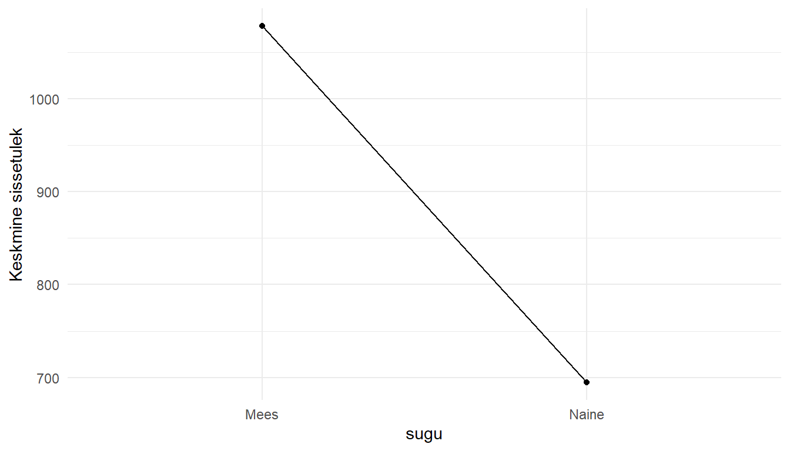

### Kolme või enama kategooriaga sõltumatu tunnus

Kusjuures me ei pea piirduma vaid binaarsete tunnustega. Aga kui kategooriaid on rohkem, tuleb meil nad binaarseks teha ehk dihhotomiseerida. Määratleme ühe kategooria referentskategooriana ja ülejäänud kategooriad kodeerime erinevates tunnustes $1$'ks. Seega, kui meil on näiteks hariduse tunnus kolme kategooriaga (põhiharidus, keskharidus, kõrgharidus), peame määratlema ühe referentskategooria (näiteks põhiharidus) ja tegema kaks uut tunnust (vastavalt keskhariduse ja kõrghariduse kategooriatele):


\[ kesk_{i} =
  \begin{cases}
    1  & \quad \text{kui inimene on keskharidusega}\\
    0  & \quad \text{kui inimene ei ole keskharidusega}
  \end{cases}
\]  

\[ korg_{i} =
  \begin{cases}
    1  & \quad \text{kui inimene on kõrgharidusega}\\
    0  & \quad \text{kui inimene ei ole kõrgaridusega}
  \end{cases}
\]

Nüüd saame iga inimese hariduse määratleda nende kahe tunnuse kaudu. Ehk siis inimene, kelle puhul $kesk = 1$ ja $korg = 0$, on keskharidusega; inimene, kelle puhul $kesk = 0$ ja $korg = 1$, on kõrgharidusega ja inimene, kelle puhul $kesk = 0$ ja $korg = 0$, on põhiharidusega. 

$y$ väärtus kujuneb täpselt samamoodi nagu binaarse tunnuse puhul:


$$y_i=\beta_0+\beta_1 \times kesk_i+\beta_2 \times korg_i$$


\begin{align}
&=
  \begin{cases}
    \beta_0+\beta_1 \times 1+\beta_2 \times 0  & \quad \text{keskharidusega}\\
    \beta_0+\beta_1 \times 0+\beta_2 \times 1  & \quad \text{kõrgaridusega}\\
    \beta_0+\beta_1 \times 0+\beta_2 \times 0  & \quad \text{põhiharidusega}
  \end{cases}\\
&=
  \begin{cases}
    \beta_0+\beta_1  & \quad \text{keskharidusega}\\
    \beta_0+\beta_2  & \quad \text{kõrgaridusega}\\
    \beta_0  & \quad \text{põhiharidusega}
  \end{cases}
\end{align}


Vaatame kuidas see kõik R-is välja näeb. Hindame hariduse (tunnus *haridustase*) mõju sissetulekule:


```r
mudel3 <- lm(sissetulek ~ haridustase, data = piaac)
summary(mudel3)
```

```
## 
## Call:
## lm(formula = sissetulek ~ haridustase, data = piaac)
## 
## Residuals:
##    Min     1Q Median     3Q    Max 
## -868.3 -362.5 -145.2  187.1 2881.2 
## 
## Coefficients:
##                  Estimate Std. Error t value Pr(>|t|)    
## (Intercept)        763.35      13.33  57.279   <2e-16 ***
## haridustaseKõrge   217.23      19.06  11.400   <2e-16 ***
## haridustaseMadal   -22.20      30.17  -0.736    0.462    
## ---
## Signif. codes:  0 '***' 0.001 '**' 0.01 '*' 0.05 '.' 0.1 ' ' 1
## 
## Residual standard error: 567.1 on 3981 degrees of freedom
##   (3648 observations deleted due to missingness)
## Multiple R-squared:  0.03631,	Adjusted R-squared:  0.03583 
## F-statistic:    75 on 2 and 3981 DF,  p-value: < 2.2e-16
```

R sai jällegi ise aru, et *haridustase* on tekstiline tunnus ja dihotomiseeris selle automaatselt ära, tehes kaks uut tunnust: *haridustaseKõrge* (kus kõik kõrgharitud on kodeeritud $1$-na ja kõik teised $0$-na) ja *haridustaseMadal* (kus kõik madala haridustasemega on kodeeritud $1$-na ja kõik teised $0$-na). Referentskategooriaks võttis ta tähestiku järjekorras esimese kategooria *Keskmine* (kõik vaatlused, mille puhul nii *haridustaseKõrge* kui ka *haridustaseMadal* on $0$-d, on keskmise haridustasemega).  

Tulemuste interpreteerimine toimub samamoodi nagu binaarse tunnuse puhul. Vabaliige tähistab referentskategooria, ehk antud juhul keskmise haridustasemega inimeste, keskmist sissetulekut ($763.35$), *haridustaseKõrge* regressioonikordaja tähistab kõrge haridustasemega inimeste keskmise sissetuleku erinevust  ja *haridustaseMadal* madala haridustasemega inimeste keskmise sissetuleku erinevust referentskategooria ehk keskmise haridustasemega inimeste keskmisest sissetulekust (vabaliikmest).

Võrrandi kujul näeb tulem välja järgmine:
$$y_i=\beta_0+\beta_1 \times korge_i+\beta_2 \times madal_i$$

\begin{align}
&=
  \begin{cases}
    763.35+217.23 \times 1+(-22.20) \times 0 & \quad \text{kõrge haridustase}\\
    763.35+217.23 \times 0+(-22.20) \times 1 & \quad \text{madal haridustase}\\
    763.35+217.23 \times 0+(-22.20) \times 0 & \quad \text{keskmine haridustase}
  \end{cases}\\
&=
  \begin{cases}
    763.35+217.23+0  & \quad \text{kõrge haridustase}\\
    763.35+0-22.20  & \quad \text{madal haridustase}\\
    763.35+0+0  & \quad \text{keskmine haridustase}
  \end{cases}\\
&=
  \begin{cases}
    980.58  & \quad \text{kõrge haridustase}\\
    741.15  & \quad \text{madal haridustase}\\
    763.35  & \quad \text{keskmine haridustase}
  \end{cases}
\end{align}


Kui kategoriaalne sõltumatu tunnus on tekstiline (*character*), siis valib R referentskategooriaks tähestikuliselt esimese kategooria. Kui tunnus on faktortunnus (*factor*), siis valib R esimese faktortaseme. Faktortasemeid saame me aga muuta. Tihti tahame referentskategooria ise valida (näiteks kõige suurema grupi või grupi, mida on loogiline teistega võrrelda). Näiteks tahame haridustasemete puhul määrata referentskategooriaks põhihariduse. Selleks teeme tunnuse faktoriks ja määrame tasemete järjestuse nii, et madal haridustase oleks esimene:


```r
# vaatame kõigepealt mis kategooriad tunnuses on
unique(piaac$haridustase)
```

```
## [1] "Keskmine" "Madal"    "Kõrge"    NA
```

```r
# Laeme forcats paketti, millega on mugav faktoritega toimetada
library(forcats)
# Kasutame funktsiooni fct_relevel()
# Meil on antud juhul vaja määrata ainult esimene tasand,
#  ülejäänud tulevad tähestiku järjekorras.
piaac <- piaac %>% 
  mutate(haridustase_f = fct_relevel(haridustase, "Madal"))

# Baas-R-is käiks faktori tegemine nii:
#piaac$haridustase_f <- factor(piaac$haridustase, 
#                              levels = c("Madal","Keskmine","Kõrge"))

# ja kui me nüüd regressiooni jooksutame, on referentsiks madal tase
summary(lm(sissetulek ~ haridustase_f, data = piaac))
```

```
## 
## Call:
## lm(formula = sissetulek ~ haridustase_f, data = piaac)
## 
## Residuals:
##    Min     1Q Median     3Q    Max 
## -868.3 -362.5 -145.2  187.1 2881.2 
## 
## Coefficients:
##                       Estimate Std. Error t value Pr(>|t|)    
## (Intercept)             741.15      27.07  27.381  < 2e-16 ***
## haridustase_fKeskmine    22.20      30.17   0.736    0.462    
## haridustase_fKõrge      239.43      30.30   7.902 3.54e-15 ***
## ---
## Signif. codes:  0 '***' 0.001 '**' 0.01 '*' 0.05 '.' 0.1 ' ' 1
## 
## Residual standard error: 567.1 on 3981 degrees of freedom
##   (3648 observations deleted due to missingness)
## Multiple R-squared:  0.03631,	Adjusted R-squared:  0.03583 
## F-statistic:    75 on 2 and 3981 DF,  p-value: < 2.2e-16
```

Kui meil juba on faktortunnus, aga tahame selle tasemete järjekorda muuta, saame jälle kasutada käsku `fct_relevel()`. Muudame haridustaseme faktortunnuses kõrgema hariduse esimeseks tasemeks:


```r
piaac$haridustase_f <- fct_relevel(piaac$haridustase_f, "Kõrge")

# Baas-R-is käiks see nii:
#piaac$haridustase_f <- relevel(piaac$haridustase_f, ref = "Kõrge")

summary(lm(numeracy ~ haridustase_f, data = piaac))
```

```
## 
## Call:
## lm(formula = numeracy ~ haridustase_f, data = piaac)
## 
## Residuals:
##      Min       1Q   Median       3Q      Max 
## -202.991  -26.446    2.328   28.800  150.020 
## 
## Coefficients:
##                       Estimate Std. Error t value Pr(>|t|)    
## (Intercept)           289.2173     0.8172  353.93   <2e-16 ***
## haridustase_fMadal    -40.8718     1.4011  -29.17   <2e-16 ***
## haridustase_fKeskmine -21.0568     1.0944  -19.24   <2e-16 ***
## ---
## Signif. codes:  0 '***' 0.001 '**' 0.01 '*' 0.05 '.' 0.1 ' ' 1
## 
## Residual standard error: 42.72 on 7583 degrees of freedom
##   (46 observations deleted due to missingness)
## Multiple R-squared:  0.1065,	Adjusted R-squared:  0.1063 
## F-statistic: 451.9 on 2 and 7583 DF,  p-value: < 2.2e-16
```


::: {.teie-kord}
Ülesanne!  

* Piaaci andmestikus on tunnus *meeldib_oppida*. Tehke see faktortunnuseks nii, et esimene kategooria oleks "Mõningal määral" (kategooriate nimed saate teada näiteks funnktsiooniga `unique(piaac$meeldib_oppida)`)
* Tehke regressioonimudel, kus hindate õppimishimu mõju sissetulekule 
:::


## Mitmene regressioon

Siiani oleme käsitlenud lineaarset regressiooni, kus sõltumatuid tunnuseid oli üks. Aga on võimalik lülitada ühte mudelisse ka mitu sõltumatut tunnust. Miks see hea peaks olema?  

Valdavalt üritame välja selgitada (või tegelikult mingi teooria põhjal testida) mingi tunnuse kausaalset mõju teisele tunnusele (sõltumatu tunnuse mõju sõltuvale tunnusele). Kausaalsusel on aga teatud eeldused:  

1. Tunnuste vaheline seos (seose olemasolu ei tähenda muidugi kohe põhjalikkust)  
2. Ajaline järgnevus (vastupidi ei saaks ju kuidagi olla)  
3. Alternatiivse seletuse/põhjuse kõrvaldamine (sõltuv tunnus võib olla sõltumatu tunnuse poolt mõjutatud läbi mõne muu tunnuse, st kaudselt)  

Mitmene regressioon võimaldabki meil testida sõltumatute tunnuste otsest mõju sõltuvale tunnusele, kontrollides samal ajal teiste mudelisse lülitatud sõltumatute tunnuste mõjude suhtes (hoides teisi tunnuseid konstantsetena). Regressioonivõrrand mitme sõltumatu tunnuse puhul on sarnane ühese regressiooni võrrandiga, välja arvatud siis sõltumatute tunnuste arv. Mudel $y$ prognoosimiseks $p$ sõltumatute tunnuste kaudu on väljendatav järgmiselt:    

\begin{equation}  
y_{i}=\beta_{0}+\beta_{1}x_{i,1}+\beta_{2}x_{i,2}+\ldots+\beta_{p}x_{i,p}+\epsilon_{i}
\end{equation}

Kus:  

$\beta_0$ on vabaliige (ehk $y$ väärtus kui kõik sõltumatud tunnused on $0$'id)

$\beta_1$ regressioonikoeffitsient esimesele sõltumatule tunnusele $x_1$  

$\beta_2$ regressioonikoeffitsient teisele sõltumatule tunnusele $x_2$  

$\beta_{p}$ regressioonikoeffitsient tunnusele $x_{p}$  

$\epsilon$ on mudeli jääk igale vaatlusele

$\beta$ coefitsinedid on leitud nii, et nendega kaalutud tunnuste väärtused minimeerivad $\epsilon$'i ehk mudeli viga (kogu mudeli mõistes minimeerivad ruuthälvete summat). $\beta$ väärtus on tõlgendatav kui muutus $y$ väärtuses, kui vastava sõltumatu tunnuse väärtus muutub ühe ühiku võrra, hoides samal ajal teisi sõltumatuid tunnuseid konstantsetena. See tähendab, et koefitsientides on teiste tunnuste mõju arvesse võetud ja meie tulemused peegeldavad nn "puhast" mõju. 

Mudeli defineerimisel R-is saame sõltumatuid tunnuseid lisada `+` märgi abil:


```r
mudel4 <- lm(sissetulek ~ numeracy + sugu, data = piaac)
summary(mudel4)
```

```
## 
## Call:
## lm(formula = sissetulek ~ numeracy + sugu, data = piaac)
## 
## Residuals:
##      Min       1Q   Median       3Q      Max 
## -1181.73  -323.46   -98.77   167.86  2813.48 
## 
## Coefficients:
##              Estimate Std. Error t value Pr(>|t|)    
## (Intercept)  140.7631    55.0470   2.557   0.0106 *  
## numeracy       3.3533     0.1915  17.509   <2e-16 ***
## suguNaine   -365.0623    16.9196 -21.576   <2e-16 ***
## ---
## Signif. codes:  0 '***' 0.001 '**' 0.01 '*' 0.05 '.' 0.1 ' ' 1
## 
## Residual standard error: 526 on 3981 degrees of freedom
##   (3648 observations deleted due to missingness)
## Multiple R-squared:  0.171,	Adjusted R-squared:  0.1706 
## F-statistic: 410.7 on 2 and 3981 DF,  p-value: < 2.2e-16
```

Mitmese regressiooni tõlgendus on analoogne lihtsa regressiooni tõlgendusega. Võrrandi kujul on see väljendatav järgmiselt:

$$\hat{y}_{sissetulek}=\beta_0+\beta_1 \times numeracy + \beta_2 \times naine$$

\begin{align}
&=
  \begin{cases}
    \beta_0+\beta_1 \times numeracy + \beta_2 \times 1 =  & \quad \text{naine}\\
    \beta_0+\beta_1 \times numeracy + \beta_2 \times 0 =  & \quad \text{mees}
  \end{cases}\\
&=
  \begin{cases}
    (\beta_0+\beta_2)+\beta_1 \times numeracy  & \quad \text{naine}\\
    \beta_0+\beta_1 \times numeracy & \quad \text{mees}
  \end{cases}\\
\end{align}


Vabaliige näitab kategoriaalse tunnuse referentskategooria (antud juhul mees) keskmist sõltuva tunnuse väärtust. Aga kuna nüüd on meil mudelis ka sõltumatu pidevtunnus, siis on see referentskategooria keskmine juhul, kui ka sõltumatu pidevtunnus on $0$. Ehk siis meie näite puhul tähistab vabaliige ($140.8$) meeste sissetulekut juhul kui nende matemaatilise kirjaoskuse skoor on $0$. *suguNaine* regressioonikordaja näitab naiste sissetuleku erinevust meestest. See võtab arvesse ka matemaatilise kirjaoskuse skoori. Ehk siis kõikide matemaatilise kirjaoskuse väärtuste puhul on on naiste sissetulek $365$ eurot meestest madalam (st soo mõju on kontrollitud matemaatilise kirjaoskuse suhtes). *numeracy* regressioonikordaja näitab jällegi sissetuleku muutust ($3.35$) kui matemaatiline kirjaoskus muutub ühe ühiku võrra. Kuna ka sugu on mudelis arvesse võetud, kehtib see muutus võrdselt nii naistele kui meestele (mõju on kontrollitud soo suhtes).  

Vaatame, milliseks kujunevad mudeli järgi meeste ja naiste keskmised sissetulekud, kui nende *numeracy* skoor on 300. 

$$\hat{y}_{sissetulek}=140.8+3.35 \times numeracy + (-365) \times naine$$

\begin{align}
&=
  \begin{cases}
    140.8+3.35 \times 300 + (-365) \times 1  & \quad \text{naine}\\
    140.8+3.35 \times 300 + (-365) \times 0  & \quad \text{mees}
  \end{cases}\\
&=
  \begin{cases}
    (140.8-365)+3.35 \times 300  & \quad \text{naine}\\
    140.8+3.35 \times 300 & \quad \text{mees}
  \end{cases}\\
&=
  \begin{cases}
    -224.2+1005  & \quad \text{naine}\\
    140.8+1005 & \quad \text{mees}
  \end{cases}\\
&=
  \begin{cases}
    780.8  & \quad \text{naine}\\
    1145.8 & \quad \text{mees}
  \end{cases}
\end{align}


Mõnevõrra lihtsam on seda tulemust interpreteerida graafiliselt: 


```r
piaac %>% 
  ggplot(aes(x = numeracy, y = sissetulek, color = sugu))+
  geom_point(alpha = 0.1, size = 0.6)+
  geom_abline(intercept = 140.8, slope = 3.35, color = "#972D15", size = 1)+
  geom_abline(intercept = 140.8-365, slope = 3.35, color = "#02401B", size = 1)+
  scale_colour_manual(values = c("Mees" = "#972D15", "Naine" = "#02401B"))+
  theme_minimal()+
  guides(color = guide_legend(override.aes = list(size = 2, alpha = 1)))
```


Lihtsam võimalus seoseid graafiliselt esitada on kasutada paketist `interactions` funktsiooni `interaction_plot()`. See on küll mõeldud eelkõige koosmõjude plottimiseks, kuid toimib ka tavalisete seoste kujutamisel.


```r
library(interactions)
interact_plot(mudel4, pred = numeracy, modx = sugu, colors = c("#972D15", "#02401B"))
```


### Kaks pidevat sõltumatut muutujat

Vaatame ka olukorda, kus meil on kaks pidevat sõltumatut tunnust - matemaatiline kirjaoskus ja vanus:


```r
mudel5 <- lm(sissetulek~numeracy+vanus, data = piaac)
summary(mudel5)
```

```
## 
## Call:
## lm(formula = sissetulek ~ numeracy + vanus, data = piaac)
## 
## Residuals:
##     Min      1Q  Median      3Q     Max 
## -1036.6  -349.5  -128.9   178.7  2944.0 
## 
## Coefficients:
##             Estimate Std. Error t value Pr(>|t|)    
## (Intercept)  25.3372    67.3417   0.376    0.707    
## numeracy      3.4841     0.2033  17.137  < 2e-16 ***
## vanus        -3.2210     0.7138  -4.512 6.59e-06 ***
## ---
## Signif. codes:  0 '***' 0.001 '**' 0.01 '*' 0.05 '.' 0.1 ' ' 1
## 
## Residual standard error: 554.5 on 3981 degrees of freedom
##   (3648 observations deleted due to missingness)
## Multiple R-squared:  0.07879,	Adjusted R-squared:  0.07833 
## F-statistic: 170.3 on 2 and 3981 DF,  p-value: < 2.2e-16
```

Tõlgendame seda järmiselt: 

1. Kui matemaatiline kirjaoskus tõuseb ühe punkti võrra, siis sissetulek tõuseb $3.48$ euro võrra, hoides vanust konstantsena (st see seos kehtib kõikide vanuste jaoks).  
2. Kui vanus tõuseb ühe aasta võrra, siis sissetulek langeb $3.2$ euro võrra, hoides matemaatilist kirjaoskust konstantsena (st see seos kehtib kogu matemaatilise kirjaoskuse skaala ulatuses).  
3. Juhul kui nii vanus oleks $0$ aastat ja matemaatiline kirjaoskus oleks $0$ punkti, oleks sissetulek $25.3$ eurot (kuna selline olukord on suhteliselt võimatu, siis me sellistel puhkudel vabaliiget ei interpreteeri).  

Et taolisest mudelist paremini aru saada võime kasutada 3D punktdiagrammi


```r
#library(car)
#scatter3d(piaac$numeracy,piaac$sissetulek, piaac$vanus)
```


::: {.teie-kord}
Ülesanne!  

* Looge regressioonimudel, millega hindate *numeracy*, *vanus*, *sugu* ja *haridustase* mõju sissetulekule.
* Milliste tunnuste mõju sissetulekule on statistiliselt oluline?
* Esitage vanuse ja soo mõju sissetulekule graafiliselt.
:::


## Koosmõjud
Eelnevas näites vaatasime sissetuleku sõltuvust matemaatilise kirjaoskuse tasemest soo lõikes, ja nägime, et kui lisame mudelisse soo tunnuse, siis saame klasside kohta eraldi regressioonijooned. Kuid need regressioonijooned olid paralleelsed, mis tähendab et nii meeste kui naiste hulgas oli matemaatilise kirjaoskuse mõju sissetulekule mudeli järgi sama. Kuid kas see on alati väga realistlik eeldus? Võib ju vabalt olla, et see seos erineb soo lõikes.  

Kui me arvame, et see võib nii olla, st sõltumatu tunnuse mõju sõltuvale tunnusele sõltub omakorda mingist muust tunnusest, saame mudelisse lisada nende kahe tunnuse koosmõju (interaktsiooni). Selleks peame moodustame uue tunnuse, mis tuleneb nende tunnuste, mille suhtes me koosmõju hinnata tahame, korrutisest. Kui me nüüd selle uue tunnuse mudelisse kaasame, siis hindame sellele ka regressioonikoefitsiendi. Regressioonivõrrand pidevtunnuse ja kategoriaalse tunnuse koosmõjuga näeks välja nii:


$$\hat{y}_{sissetulek}=\beta_0+\beta_1 \times numeracy + \beta_2 \times naine + \beta_3 \times naine \times numeracy $$

\begin{align}
&=
  \begin{cases}
    \beta_0+\beta_1 \times numeracy + \beta_2 \times 1 + \beta_3 \times 1 \times numeracy  & \quad \text{naised}\\
    \beta_0+\beta_1 \times numeracy + \beta_2 \times 0 + \beta_3 \times 0 \times numeracy & \quad \text{mehed}
  \end{cases}\\
&=
  \begin{cases}
    (\beta_0+\beta_2)+(\beta_1+\beta_3) \times numeracy  & \quad \text{naised}\\
    \beta_0+\beta_1 \times numeracy & \quad \text{mehed}
  \end{cases}
\end{align}

Mis siin nüüd siis toimub? Meeste keskmine sissetulek on, nagu varasemaltki, defineeritud vabaliikme ja $\beta_1$ regressioonikoefitsiendiga (ülejäänud kaks koefitsienti lähevad meeste jaoks $0$-ks, kuna *naine* tunnus on nende jaoks $0$). Naistel on aga lisaks veel kaks koefitsienti. $\beta_2$, mis, nagu varasemaltki, kirjeldab naiste vabaliikme erinevust meeste vabaliikmest, ning siis veel $\beta_3$, mis kirjeldab naiste regressioonisirge erinevust meeste regressioonisirgest. Koosmõjudega mudelis on naiste *numeracy* koefitsient $\beta_1+\beta_3$ (sest $\beta_1 \times numeracy + \beta_3 \times numeracy = (\beta_1+\beta_3) \times numeracy$).

R-is saame koosmõjudega mudeli defineerida kui kasutame tunnuste vahel, mille koosmõjusid tahame kodelleerida, $*$ märki. Ehk kui tahame matemaatilise kirjaoskuse ja soo koosmõju, siis peame defineerima mudeli nii:


```r
mudel8 <- lm(sissetulek ~ numeracy * sugu, data = piaac)
summary(mudel8)
```

```
## 
## Call:
## lm(formula = sissetulek ~ numeracy * sugu, data = piaac)
## 
## Residuals:
##      Min       1Q   Median       3Q      Max 
## -1213.35  -322.79   -99.79   166.87  2802.32 
## 
## Coefficients:
##                     Estimate Std. Error t value Pr(>|t|)    
## (Intercept)          28.4609    79.7161   0.357   0.7211    
## numeracy              3.7552     0.2815  13.340   <2e-16 ***
## suguNaine          -157.9875   107.6870  -1.467   0.1424    
## numeracy:suguNaine   -0.7476     0.3840  -1.947   0.0516 .  
## ---
## Signif. codes:  0 '***' 0.001 '**' 0.01 '*' 0.05 '.' 0.1 ' ' 1
## 
## Residual standard error: 525.8 on 3980 degrees of freedom
##   (3648 observations deleted due to missingness)
## Multiple R-squared:  0.1718,	Adjusted R-squared:  0.1712 
## F-statistic: 275.2 on 3 and 3980 DF,  p-value: < 2.2e-16
```

```r
# Sama tulemuse saaksime, kui kirjutaksime:
#lm(numeracy ~ literacy + sugu + literacy:sugu, data = piaac)
```

Mida saadud koefitsiendid meile ütlevad?

- Vabaliige on meeste, kelle *numeracy* skoor on 0, keskmine sissetulek.  
- *numeracy* koefitsient näitab palju muutub meeste keskmine sissetulek iga lisanduva matemaatilise kirjaoskuse punktiga.  
- *suguNaine* koefitsient näitab palju erineb naiste sissetulek meeste omast kui nende mõlema *numeracy* skoor on 0.  
- *numeracy:suguNaine* koefitsient näitab naiste *numeracy* koefitsiendi erinevust meeste *numeracy* koefitsiendist (naiste puhul on sissetuleku kasv iga lisanduva matemaatilise kirjaoskuse punkti puhul 0,7 euro võrra väiksem kui meestel, ehk siis nende regressioonisirge on laugem).

Nagu näeme, siis koefitsiendid iseseisvalt on suhteliselt keeruliselt tõlgendatavad ja osaliselt ka sisutud, kuna *numeracy* skoor ei saa 0 olla (tunnuseid transformeerides saame nad tegelikult natukene interpreteeritavamateks teha, kuid sellest natuke hiljem).  

Parema pildi saame, kui lihtsutame regressioonivõrrandit. Koosmõjudega mudeli vabaliikmed ja regressioonikoefitsiendid kujunevad järgmiselt:

$$\hat{y}_{sissetulek}=\beta_0+\beta_1 \times numeracy + \beta_2 \times naine + \beta_3 \times naine \times numeracy$$

\begin{align}
&=
  \begin{cases}
    28.5+3.8 \times numeracy + (-157) \times 1 + (-0.7) \times 1 \times numeracy & \quad \text{naised}\\
    28.5+3.8 \times numeracy + (-157) \times 0 + (-0.7) \times 0 \times numeracy & \quad \text{mehed}
  \end{cases}\\
&=
  \begin{cases}
    (28.5-157)+(3.8-0.7) \times numeracy  & \quad \text{naised}\\
    28.5+3.8 \times numeracy & \quad \text{mehed}
  \end{cases}\\
&=
  \begin{cases}
    -128.5+3.1 \times numeracy  & \quad \text{naised}\\
    28.5+3.8 \times numeracy & \quad \text{mehed}
  \end{cases}
\end{align}

Seega selles mudelis erinevad kategoriaalse tunnuse lõikes nii vabaliikme väärtused kui ka regressioonisirge tõusud. Kui me nüüd selle mudeli tulemused graafikule paneme, siis näeme, et regressioonisirged ei ole enam paralleelsed. Mida suurem on matemaatilise kirjaoskuse tase, seda suurem on erinevus meeste ja naiste sissetulekutes.


```r
interact_plot(mudel8, pred = numeracy, modx = sugu,  colors =  c("#972D15", "#02401B"))
```


Kõige parem ongi interaktsioonidega mudeleid graafiliselt vaadata.

### Koosmõjud kategoriaalsete tunnuste puhul

Enne oli juttu, et kahe kategoriaalse sõltumatu tunnusega mudel ilma koosmõjudeta pole väga mõistlik. Vaatame nüüd kuidas see koosmõjudega välja näeks:


```r
mudel9 <- lm(sissetulek ~ sugu * haridustase, data = piaac)
summary(mudel9)
```

```
## 
## Call:
## lm(formula = sissetulek ~ sugu * haridustase, data = piaac)
## 
## Residuals:
##      Min       1Q   Median       3Q      Max 
## -1126.25  -311.40   -99.32   163.85  2639.98 
## 
## Coefficients:
##                            Estimate Std. Error t value Pr(>|t|)    
## (Intercept)                 1004.53      17.95  55.967   <2e-16 ***
## suguNaine                   -458.80      24.76 -18.533   <2e-16 ***
## haridustaseKõrge             252.60      28.59   8.836   <2e-16 ***
## haridustaseMadal             -73.55      37.63  -1.955   0.0507 .  
## suguNaine:haridustaseKõrge    50.69      36.65   1.383   0.1667    
## suguNaine:haridustaseMadal    10.76      56.52   0.190   0.8491    
## ---
## Signif. codes:  0 '***' 0.001 '**' 0.01 '*' 0.05 '.' 0.1 ' ' 1
## 
## Residual standard error: 526.1 on 3978 degrees of freedom
##   (3648 observations deleted due to missingness)
## Multiple R-squared:  0.1715,	Adjusted R-squared:  0.1705 
## F-statistic: 164.7 on 5 and 3978 DF,  p-value: < 2.2e-16
```

Kui mudelis on ainult kategoorilised tunnused, siis on selle tõlgendamine suhteliselt lihtne. Sellisest mudelist saame välja lugeda kõikide gruppide ristlõigete (kõrge haridustasemega naised, kõrge haridustasemega mehed jne) keskmised või täpsemini kõikide gruppide ristlõigete erinevused referentsgrupist: 

- Vabaliige on referentsgrupi ehk keskmise haridustasemega meeste keskmine sissetulek.  
- *suguNaine* on keskmise keskmise haridustasemega naiste erinevus referentsgrupist.
- *haridustaseKõrge* on kõrge haridustasemega meeste erinevus referentsgrupist.
- *haridustaseMadal* on madala haridustasemega meeste erinevus referentsgrupist.
- *suguNaine:haridustaseKõrge* on kõrge haridustasemega naiste erinevus keskmise haridustasemega naistest.
- *suguNaine:haridustaseMadal* on madala haridustasemega naiste erinevus keskmise haridustasemega naistest.

Arvutame näiteks välja kõrge haridustasemega (*koh*) naiste ja madala haridustasemega (*mh*) meeste keskmised matemaatilise lugemisoskuse skoorid:

$$\hat{y}_{sissetulek}=\beta_0+\beta_1 \times naine + \beta_2 \times koh + \beta_3 \times mh + \beta_4 \times naine \times koh + \beta_5 \times naine \times mh$$

\begin{align}
&=
  \begin{cases}
    1004.5+(-458.8) \times 1 + 252.60 \times 1 + (-73.55) \times 0 + 50.69 \times 1 + 10.76 \times 0 & \quad \text{kõrge haridustasemega naised}\\
    1004.5+(-458.8) \times 0 + 252.60 \times 0 + (-73.55) \times 1 + 50.69 \times 0 + 10.76 \times 0 & \quad \text{madala haridustasemega mehed}
  \end{cases}\\
&=
  \begin{cases}
    1004.5+(-458.8) + 252.60 + 50.69 & \quad \text{kõrge haridustasemega naised}\\
    1004.5 + (-73.55) & \quad \text{madala haridustasemega mehed}
  \end{cases}\\
&=
  \begin{cases}
    849 & \quad \text{kõrge haridustasemega naised}\\
    931 & \quad \text{madala haridustasemega mehed}
  \end{cases}
\end{align}


Kõige mugavam on taolist mudelit interpreteerida aga jällegi graafiliselt (kasutame paketi `interactions` funktsiooni `cat_plot()`):


```r
cat_plot(mudel9, pred = haridustase, modx = sugu, colors =  c("#972D15", "#02401B"))
```

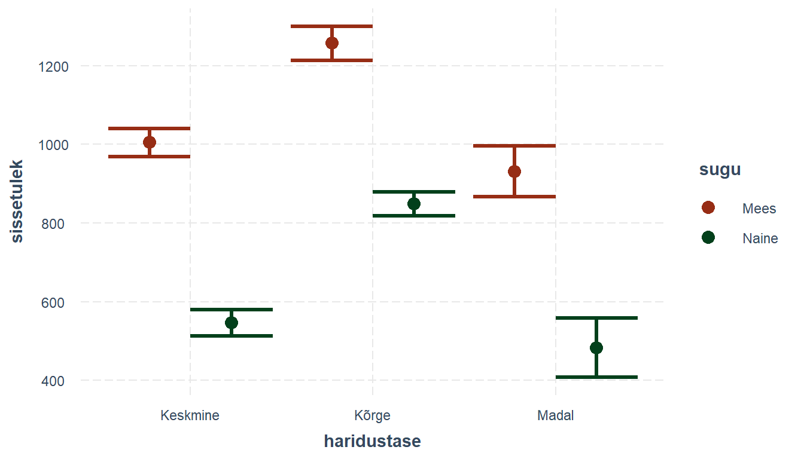


::: {.teie-kord}
Ülesanne!  

* Looge koosmõjuga regressioonimudel, millega hindate soo ja laste olemasolu mõju sissetulekule.
* Esitage koosmõjud graafikul (`cat_plot()` abiga) 
:::


## Mudelite võrdlemine
Milline on hea mudel? See peaks muidugi seletama võimalikult palju sõltuva tunnuse varieeruvusest. Samas peaks see olema ka võimalikult ökonoomne, st see peaks sisaldama ainult tunnuseid, mis mudelit oluliselt paremaks teevad. Siin on rõhk sõnal "oluliselt". Iga lisanduv tunnus teeb mudeli mingil määral paremaks, kuid see paranemine võib olla mikroskoopiline. Kuidas siis hinnata, kas mudel $n+1$ tunnusega on oluliselt parem kui $n$ tunnusega mudel?   

Me saame vaadata lisanduva tunnuse standardviga, *t*-väärtust ja sellega seonduvat *p*-väärtust. Kuid nagu enne jutuks oli, testib see ainult konkreetse koefitsiendi erinevust nullist. Meid aga huvitab kogu mudeli kvaliteet. Võimalus on ka võrrelda mudelite $R^2$ väärtusi, kuid need on pigem kirjeldavad, ega anna meile indikatsiooni sellest kas üks väärtus on oluliselt parem kui teine. 

Erinevate mudelite statistiliselt olulist erinevust saame testida hii-ruut testiga kasutades `anova()` funktsiooni. Seda saab teha ainult siis kui mudelid on omavehl seotud (*nested*), st keerukam (rohkemate tunnustega) mudel peab sisdaldama kõiki lihtsama mudeli tunnuseid.


```r
mudel_test1 <- lm(numeracy ~ literacy, data = piaac)
mudel_test2 <- lm(numeracy ~ literacy + sugu, data = piaac)
anova(mudel_test1, mudel_test2, test = "Chisq")
```

```
## Analysis of Variance Table
## 
## Model 1: numeracy ~ literacy
## Model 2: numeracy ~ literacy + sugu
##   Res.Df     RSS Df Sum of Sq  Pr(>Chi)    
## 1   7584 4848657                           
## 2   7583 4734885  1    113772 < 2.2e-16 ***
## ---
## Signif. codes:  0 '***' 0.001 '**' 0.01 '*' 0.05 '.' 0.1 ' ' 1
```

Tõlgendame jällegi testi *p*-väärtust. Kui see on väiksem kui $0.05$ (usaldusnivool $95\%$), siis võime järeldada, et mudelid on oluliselt erinevad, mis tähendab omakorda, et lisatud tunnus tõstis mudeli selgitusvõimet olulisel määral.


## Regressioonimudeli eeldused  

Nagu iga meetodi puhul, on ka lineaarsel regressioonanalüüsil rida eeldusi, mis peavad olema täidetud, et analüüsist korrektseid järeldusi oleks võimalik teha.

1. Kõige olulisem eeldus on **mudeli valiidsus**. See tähendab, et mudel peab vastama uurimisküsimusele. Täpsemalt sõltuv tunnus peab adekvaatselt kajastama uuritavat fenomeni, mudelisse peaksid olema kaasatud kõik olulised sõltumatud tunnused ja mudel peaks olema üldistatav populatsioonile mille kohta järeldusi teha tahsetakse.

2. Statistiliselt kõige olulisem eeldus on **lineaarne suhe sõltuva ja sõltumatu(te) tunnuse vahel**. Kõrvaloleval joonisel on esitatud neli andmestikku, mille regressioonisirged on identsed ($y=3+0.5x$). Tegelikult on identsed ka kõik muud andmete statistilised omadused ($x$'i keskmine, $y$'i keskmine, $x$'i dispersioon, $y$'i dispersioon ja ka korrelatsioon). Ometi on visuaalselt näha, et kõik seosed on väga erinevad. Seega peaks regressioonanalüüsi (või tegelikult ükskõik mis analüüsi) puhul olema alati esimene samm neid graafiliselt uurida. Kui tunnuste vaheline seos ei ole lineaarne, piisab mõnel juhul interaktsioonide lisamisest või tunnuste  mittelineaarsest transformeerimisest. Kui seos on eksponentsiaalne, siis võib kaaluda *log*-transformatsiooni. Kui seos on paraboolne, siis võib kaaluda ruutu tõstetud tunnuse lisamist ehk polünoomset regressiooni ($y = \beta_0+\beta_1x+\beta_2x^2$). Taoliste transformatsioonide juures peab meeles pidama, et koos nendega muutub ka mudeli tõlgendus.  

<div class="figure">
<p class="caption">(\#fig:anscombe)Anscombe kvartett</p>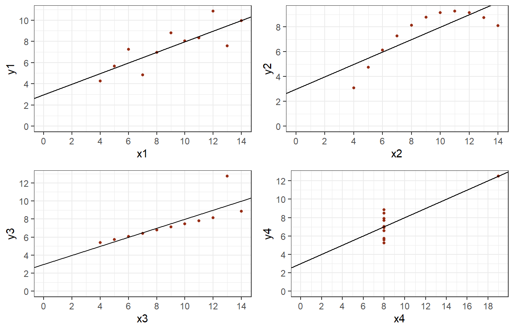</div>


3. **Jääkide sõltumatus**. Ühe vaatluse jäägid ei tohiks olla korreleeritud teise vaatluse jääkidega. Selline olukord võib tekkida näiteks siis kui mudelist on välja jäänud mingi oluline tunnus (ühe tunnuse regressiooni puhul on see muidugi vaid hüpoteetiline olukord), näiteks hindame õpilaste testiskoore lähtuvalt nende õppimisele kulunud ajast, kuid ei arvesta, et õpilased tulevad erinevatest koolidest, kus võib olla erinev õppetase. Seega õpilaste tulemused ei ole enam sõltumatud, vaid sõltuvad koolist. Regressioonikoefitsientide standardvigade arvutamisel lähtutakse eeldusest, et jäägid on sõltumatud. Kui jäägid on korreleeritud, siis võib juhtuda, et me alahindame standardvigade suurust ehk siis oleme oma tulemustes ülemäära kindlad (usaldusintervallid ning *p*-väärtused tulevad liialt väikesed) ning võime näha seoseid seal kus neid tegelikult ei ole. Lahenduseks võiks olla puuduolevate tunnuste lisamine mudelisse (konkrteetse näite puhul kooli tunnus), mitmetasandiline mudel (seda vaatame hiljem) või klasterdatud standardvead (*clustered standard errors* või ka *cluster-robust standard errors*).


```r
## Clustered standard errors

# Eeldame, et valim on klasterdatud haridusvaldkonna alusel
# Defineerime regressioonimudeli 
#  (jätame välja kõik vaatlused, kus haridusvaldkond on NA)
mudel6 <- lm(numeracy ~ literacy * sugu, 
             data = piaac[!is.na(piaac$hvaldkond),])


# Klasterdatud standardvigade arvutamiseks kasutame jälle sandwitch paketti ja
# selle funktsiooni vcovCL()
library(sandwich)
library(lmtest)

# Robustsete standardvigade jaoks tuleb meil arvutada uus 
#  'klasterdatud' koefitsientide variatsiooni-kovariatsiooni maatriks ehk nn 
#  Clustered Covariance Matrix. sandwitch paketis
#  on selleks funktsioon vcovCL(). Peame selles lisaks mudeliobjektile
#  määrama ka klastritunnuse

vcovCL(mudel6, cluster = ~hvaldkond) %>% 
  diag() %>% 
  sqrt()
```

```
##        (Intercept)           literacy          suguNaine literacy:suguNaine 
##         7.69411746         0.02019249         5.63277113         0.01773446
```

```r
# Et neid koos koefitsientide ja vastavate testidega kuvada, võime kasutada
#  jällegi lmtest paketi funktsiooni coeftest()
coeftest(mudel6, vcov. = vcovCL(mudel6, cluster = ~hvaldkond))
```

```
## 
## t test of coefficients:
## 
##                     Estimate Std. Error t value  Pr(>|t|)    
## (Intercept)        35.718804   7.694117  4.6424 3.503e-06 ***
## literacy            0.872964   0.020192 43.2321 < 2.2e-16 ***
## suguNaine           5.006361   5.632771  0.8888  0.374143    
## literacy:suguNaine -0.046464   0.017734 -2.6200  0.008812 ** 
## ---
## Signif. codes:  0 '***' 0.001 '**' 0.01 '*' 0.05 '.' 0.1 ' ' 1
```


4. **Jääkide dispersiooni homogeensus** (*homoscedasticity*). Jäägid peaksid hinnatud väärtuste lõikes olema homogeense ja konstantse variatiivsusega, st ühtlaselt jaotunud kõikide $\hat{y}$ väärtuste ümber. Selle eelduse rikkumine mõjutab eelkõige standardvigu (need ei kehti enam kõikidele $\hat{y}$ väärtustele ühtlaselt) ja seeläbi loomulikult ka usaldusintervalle ning *p*-väärtusi. Lahenduseks võivad olla nn robustsed standardvead (*robust standard errors*), mis võtavad varieeruvuse erinevust arvesse, või siis jällegi tunnuste transformeerimine.


```r
## Robust standard errors

# Defineerime regressioonimudeli 
mudel6 <- lm(numeracy ~ literacy * sugu, 
             data = piaac)

# summary() funktsiooniga saame kätte tavalised standardvead
summary(mudel6)
```

```
## 
## Call:
## lm(formula = numeracy ~ literacy * sugu, data = piaac)
## 
## Residuals:
##      Min       1Q   Median       3Q      Max 
## -102.441  -16.551   -0.094   16.867   88.714 
## 
## Coefficients:
##                     Estimate Std. Error t value Pr(>|t|)    
## (Intercept)        36.129029   2.620050  13.789  < 2e-16 ***
## literacy            0.871523   0.009417  92.543  < 2e-16 ***
## suguNaine           4.596729   3.619797   1.270 0.204164    
## literacy:suguNaine -0.044937   0.012972  -3.464 0.000535 ***
## ---
## Signif. codes:  0 '***' 0.001 '**' 0.01 '*' 0.05 '.' 0.1 ' ' 1
## 
## Residual standard error: 24.97 on 7582 degrees of freedom
##   (46 observations deleted due to missingness)
## Multiple R-squared:  0.6948,	Adjusted R-squared:  0.6946 
## F-statistic:  5753 on 3 and 7582 DF,  p-value: < 2.2e-16
```

```r
# Robustsete standardvigade arvutamiseks kasutame sandwitch paketti
#  ja nende kuvamiseks lmtest paketti
library(sandwich)
library(lmtest)

# Robustsete standardvigade jaoks tuleb meil arvutada uus 
#  'robustne' koefitsientide variatsiooni-kovariatsiooni maatriks ehk nn 
#  Heteroscedasticity-Consistent Covariance Matrix. sandwitch paketis
#  on selleks funktsioon vcovHC().

# Variatsiooni-kovariatsiooni maatriksi diagonaalis on koefitsientide 
#  dispersioonid (variance). Ruutjuur dispersioonist annab koefitsiendi 
#  standardhälbe, mis on ongi pareameetri standardviga
# Seega saame robustsed standardvead kätte nii:
vcovHC(mudel6) %>% 
  diag() %>% 
  sqrt()
```

```
##        (Intercept)           literacy          suguNaine literacy:suguNaine 
##        2.788735004        0.009897618        3.831308067        0.013555193
```

```r
# Et neid koos koefitsientide ja vastavate testidega kuvada, võime kasutada
#  lmtest paketi funktsiooni coeftest()
coeftest(mudel6, vcov. = vcovHC(mudel6))
```

```
## 
## t test of coefficients:
## 
##                      Estimate Std. Error t value  Pr(>|t|)    
## (Intercept)        36.1290294  2.7887350 12.9553 < 2.2e-16 ***
## literacy            0.8715229  0.0098976 88.0538 < 2.2e-16 ***
## suguNaine           4.5967288  3.8313081  1.1998 0.2302621    
## literacy:suguNaine -0.0449372  0.0135552 -3.3151 0.0009203 ***
## ---
## Signif. codes:  0 '***' 0.001 '**' 0.01 '*' 0.05 '.' 0.1 ' ' 1
```

```r
# Usalduspiirid robustsete standardvigade alusel saame kätte coefci() 
#  funktsiooniga
coefci(mudel6, vcov. = vcovHC(mudel6))
```

```
##                          2.5 %     97.5 %
## (Intercept)        30.66233656 41.5957223
## literacy            0.85212087  0.8909250
## suguNaine          -2.91369599 12.1071535
## literacy:suguNaine -0.07150916 -0.0183653
```


5. Lineaarse regressiooni puhul peaks tähelepanelik olema ka **erindite** (*outliers*)suhtes, st vaatluste suhtes, mis erinevad teistest väga olulisel määral (nagu ka kõrvalolevalt jooniselt näha). Mõnede andmete puhul on erindid paratamatud (näiteks sissetuleku puhul, kus suurem osa inimesi on koondunud keskmise sissetuleku ümber, kuid mõned üksikud teenivad sellest oluliselt enam). Sellisel juhul tasuks kaaluda jällegi tunnuse transformeerimist (sissetuleku puhul näiteks log-skaalale). Kui tegemist on mõne üksiku erindiga, võiks ju selle aluseks oleva vaatluse ka lihtsalt analüüsist välja jätta. Siin tuleks aga olla väga ettevaatlik. Andmete või sellest saadava informatsiooni tahtlik vähendamine (näiteks pidevtunnuste kategoriseerimine) ei ole üldiselt kunagi hea mõte. Seda enam ei ole hea mõte andmete vähendamine eesmärgiga mudelit paremaks teha. Kui aga erindite tekkimine on mingil moel teoreetiliselt seletatav või tulenenud näiteks veast andmekorjel, siis võib seda loomulikult teha.  


6. **Jääkide normaaljaotus**. Regressiooni jäägid peaksid olema normaaljaotusega $e_i \sim N(0, \sigma^2)$, seega enamus jääke peaks jääma nulli ümber ning mida suuremad jäägid, seda vähem neid olema peaks. See eeldus on eelkõige oluline regressioonikoefitsientide *t*-testi jaoks.


7. Kui kaks sõltumatut tunnust on teineteisega väga tugevalt seotud põhjusteab see nn **kollineaarsust**. See võib tekitada probleeme mudeli hindamisel ning ka tõlgendusel. Lisaks kipuvad standardvead liialt suureks minema, mis tähendab seda, et kaotame oma tulemuste täpsuses ja võime mitte näha seoseid seal, kus need tegelikult olemas on. Seega võiks tähele panna, et korrelatsioon sõltumatute muutujate vahel peaks alati olema väiksem kui korrelatsioon sõltuva ja sõltumatu muutuja vahel.


## Kuidas eelduste täidetust hinnata?

Eelduste hindamiseks on loomulikult mitmeid teste, kuid kõige lihtsam on seda mudeli diagnostiliste joonistega. Saaksime need ka ise teha, kuid lihtsam on kasutada käsku `plot()`, kui sellesse sisestada mudeliobjekti nimi, siis kuvab R järjest erinevad diagnostikaplotid (järgmise ploti nägemiseks peab Return'i vajutama). Teine võimalus on anda `plot()` käsule numbriline lisaprameeter (nagu ka järgnevalt on tehtud).

Defineerime kõigepealt mudeli:


```r
mod <- lm(formula = sissetulek ~ numeracy + vanus + sugu + haridustase, 
    data = piaac)
```


### Lineaarne seos ja jääkide dispersiooni homogeensus.

Vaatame kõigepealt jäägid vs hinnatud väärtused joonist. Kontrollime sellega mittelineaarse seose olemasolu ja jääkide dispersiooni homogeensust. Punktid peaksid olema kogu x-telje ulatuses ühtlaselt ümber keskmise 0-joone jaotunud nii, et igas x-telje punktis oleks jääkide keskmine 0 (punane joon ehk jääkide keskminepeaks langema kokku 0-joonega). Ei tohiks näha olla mingit ilmset mustrit. Kui jäägid ei ole ühtlaselt ümber kesjoone, siis on probleemiks lineaarsuse eeldus. Kui jäägid ei ole kogu skaala ulatuses ühtlaselt jaotunud, siis on probleem jääkide dispersiooniga.


```r
plot(mod, 1)
```


Siin ilmselgelt on muster olemas. Mida suurem on hinnatud väärtus, seda suurem on jääkide dispersioon. Samuti on positiivsed jäägid suuremad kui negatiivsed. Võib järeldada, et meie mudelil on probleeme nii lineaarsusega (suuremad positiivsed jäägid), kui ka jääkide dispersiooni homogeensusega (jääkide dispersioon on paremal, suuremate hinnatud väärtuste juures, oluliselt suurem kui vasakul).

Jääkide dispersiooni homogeensust saame ka fomraalsemalt kontrollida Breusch-Pagan testiga. Selle puhul on nullhüpoteesik konstantne varieeruvus (*homoscedasticity*) ja alternativvseks hüpoteesiks mittekonstantne varieeruvus (*heteroscedasticity*). Ehk siis me tahaksime näha võimalikult suurt *p* väärtust, mis tähendaks, et nullhüpoteesi kehtimise tõenäosus on suur (meil ei ole piisavalt tõendeid, et seda ümber lükata)


```r
# Breusch-Pagan test on olemas lmtest paketis.
lmtest::bptest(mod)
```

```
## 
## 	studentized Breusch-Pagan test
## 
## data:  mod
## BP = 192.88, df = 5, p-value < 2.2e-16
```
*p* väärtus on väga väike, seega saame kinnitust oma varasemale järeldusele, et jääkide dispoersioon ei ole homogeenne.

### Jääkide normaaljaotus

Jääkide normaaljaotuse eeldust saame kontrollida Q-Q plot'iga. Kui jäägid on normaalselt jaotunud, siis peaksid punktid enamvähem ühtima diagonaalse joonega. Jällegi tundub, et see eeldus on kaugel täidetust.


```r
plot(mod, 2)
```


Normaajaotuse kehtivust saame formaalselt kontrollida Shapiro-Wilk testiga, kus nullhüpoteesiks on normaaljaotus. Seega ootame jällegi võimalikult suurt *p* väärtust, mis kinnitaks meile, et meil ei ole põhjust nullhüpoteesi kummutada.


```r
# resid() funktsiooniga saame mudeliobjektist jäägid välja võtta
jaagid <- resid(mod)
shapiro.test(jaagid)
```

```
## 
## 	Shapiro-Wilk normality test
## 
## data:  jaagid
## W = 0.8749, p-value < 2.2e-16
```

*p* väärtus on väga väike, mis kinnitab meile, et jäägid ei ole normaalselt jaotunud.

### Jääkide dispersiooni homogeensus

Jääkide dispersiooni homogeensust saame kontrollida ka *scale-location* joonisega, kus on jällegi kuvatud jäägid vs hinnatud väärtused, kuid jäägid on siin standardiseeritud ja neist on ruutjuur võetud. Tahaksime näha, et punane joon (standardiseeritud jääkide keskmine) oleks paralleelne x-teljega. Jällegi, siinsel pildil see nii ei ole.


```r
plot(mod, 3)
```

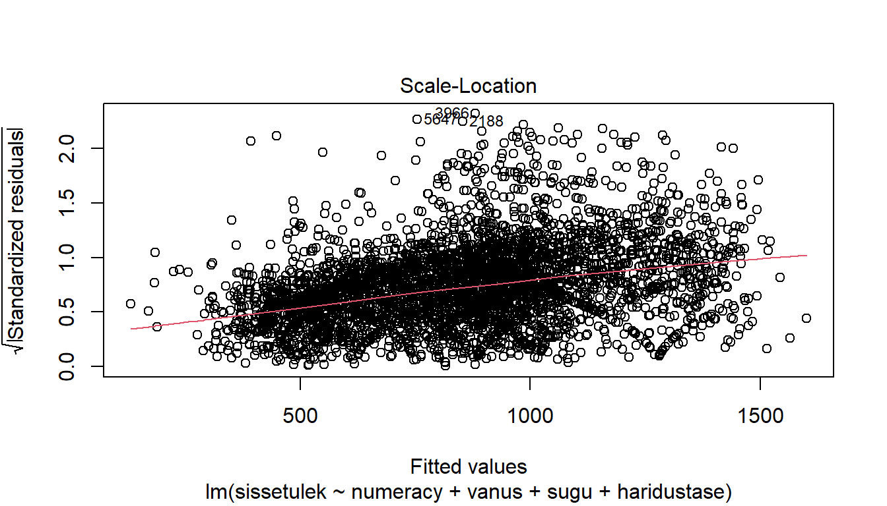

### Mõjukad vaatlused

*Cook's distance* joonisel on kuvatud iga vaatluse mõju suurus regressioonikoefitseintidele. Täpsemalt näitab see kui palju tulemused muutuksid, kui iga vaatlus järgemööda mudelist välja võtta. Mida kõrgem on vaatluse joon, seda mõjukam see on. Vaatlused, mis enam esile kerkivad vääriksid tähelepanu. Need võivad olla erindid, mis võivad tuleneda näiteks andmete sisestamisveast vms. Igal juhul ei ole nad nn tavapärased vaatlused, mille kohta me tahame järeldusi teha.

Märkimisväärseks *Cook*-i kauguse väärtuseks loetakse tegelikult 0.5 või isegi 1. Meie joonisel on nende numbritega võrreldes vaga tagasihoidlikud kaugused. Ehk siis võime järeldada, et mõjukaid vaatlusi meie mudelis ei ole.


```r
plot(mod, 4)
```

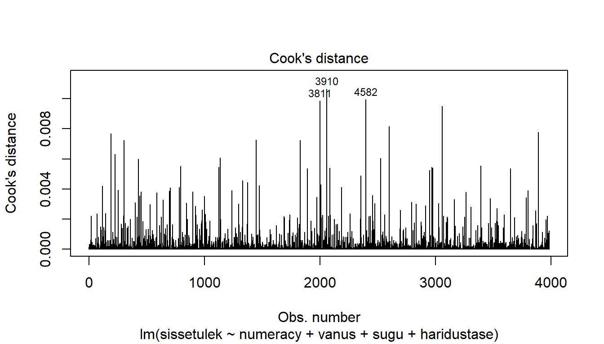

Ka *residuals vs leverage* joonis aitab esile tuua mõjukaid vaatlusi. Taolised vaatlused olema paremal all või paremal üleval nurgas ning kaugemal kui punktiirjoon (antud juhul neid ei ole ja seega ei ole ka punktiirjoont näha).


```r
plot(mod, 5)
```


## Tunnuste transformatsioonid

Oleme eelnevalt mitmel puhul maininud, et nii andmete tõlgendamisel kui regressiooni eelduste täitmisel võivad abiks olla tunnuste transformatsioonid. Need võivad olla nii lineaarsed (kus seosed iseenesest ei muutu, kuid muutub selle tõlgendus - eeldatavalt lihtsamaks) ja mitte-lineaarsed (millega muudetakse seose kuju). 

### Lineaarsed transformatsioonid

Nagu mainitud, siis lineaarsed transformatsioonid aitavad eelkõige mudeleid lihtsamini tõlgendada. Koosmõjude peatükis oli meil mudel, mille otsene interpretatsioon oli suhteliselt keerukas:


```r
mudel8 <- lm(sissetulek ~ numeracy * sugu, data = piaac)
summary(mudel8)
```

```
## 
## Call:
## lm(formula = sissetulek ~ numeracy * sugu, data = piaac)
## 
## Residuals:
##      Min       1Q   Median       3Q      Max 
## -1213.35  -322.79   -99.79   166.87  2802.32 
## 
## Coefficients:
##                     Estimate Std. Error t value Pr(>|t|)    
## (Intercept)          28.4609    79.7161   0.357   0.7211    
## numeracy              3.7552     0.2815  13.340   <2e-16 ***
## suguNaine          -157.9875   107.6870  -1.467   0.1424    
## numeracy:suguNaine   -0.7476     0.3840  -1.947   0.0516 .  
## ---
## Signif. codes:  0 '***' 0.001 '**' 0.01 '*' 0.05 '.' 0.1 ' ' 1
## 
## Residual standard error: 525.8 on 3980 degrees of freedom
##   (3648 observations deleted due to missingness)
## Multiple R-squared:  0.1718,	Adjusted R-squared:  0.1712 
## F-statistic: 275.2 on 3 and 3980 DF,  p-value: < 2.2e-16
```
Asi oli selles, et *numeracy* skoori 0-väärtus ei ole realistlik. Kuid meeste ja naiste sissetulekute erinevus on määratletud referentsgrupi (mehed, kelle *numeracy* on 0) suhtes.

#### Tunnuste standardiseerimine {.unnumbered}

Kuid me saame *numeracy* skaalat, ja seega ka referentspunkti, muuta. Selleks on mitmeid võimalusi, kuid üheks tavapärasemaks on tunnuste **standardiseerimine**. Standardiseeritud tunnuse väärtusi nimetatakse ka z-skoorideks. Standardiseeritud tunnuse keskmine on 0 ja ühikuks on tunnuse standardhälve. Standardiseerime *numeracy* tunnuse:


```r
# Lahutame tunnusest tunnuse keskmise ja jagame läbi tunnuse standardhälbega
piaac <- piaac %>% 
  mutate(z_num = (numeracy - mean(numeracy, na.rm = T))/sd(numeracy, na.rm = T))

# Lihtsam oleks tegelikult kasutada scale(funktsiooni). Selle väljund
# on maatriks, sellepärast peame ta ka numbriliseks tegema
piaac <- piaac %>% 
  mutate(z_num = as.numeric(scale(numeracy)))
```

Jooksutame nüüd standardiseeritud tunnusega uuesti mudelit:


```r
mudel_stnd <- lm(sissetulek ~ z_num * sugu, data = piaac)
summary(mudel_stnd)
```

```
## 
## Call:
## lm(formula = sissetulek ~ z_num * sugu, data = piaac)
## 
## Residuals:
##      Min       1Q   Median       3Q      Max 
## -1213.35  -322.79   -99.79   166.87  2802.32 
## 
## Coefficients:
##                 Estimate Std. Error t value Pr(>|t|)    
## (Intercept)      1050.12      13.03  80.587   <2e-16 ***
## z_num             169.69      12.72  13.340   <2e-16 ***
## suguNaine        -361.40      17.02 -21.236   <2e-16 ***
## z_num:suguNaine   -33.78      17.35  -1.947   0.0516 .  
## ---
## Signif. codes:  0 '***' 0.001 '**' 0.01 '*' 0.05 '.' 0.1 ' ' 1
## 
## Residual standard error: 525.8 on 3980 degrees of freedom
##   (3648 observations deleted due to missingness)
## Multiple R-squared:  0.1718,	Adjusted R-squared:  0.1712 
## F-statistic: 275.2 on 3 and 3980 DF,  p-value: < 2.2e-16
```
Enne oli jutuks, et lineaarsete transformatsioonide puhul mudel ise ei muutu, aga nüüd näeme, et standardiseeritud tunnusega mudelis on nii erinevad koefitsiendid, t-väärtused kui ka p-väärtused. Ja kui enne soo mõju ei olnud oluline, siis nüüd on. 

Kuid kui tulemeid lähemalt vaadata, siis näeme, et nii R2 väärtus, RSE väärtus kui F-statistik on mudelite puhul samad. Ehk siis tegelikult on tegemist ikkagi samade mudelitega. *suguNaine* koefitsient on erinev, kuna esimeses mudelis oli see soo erinevus *numeracy* 0 väärtuse korral, nüüd aga standardiseeritud *numeracy* 0 väärtuse korral, ehk siis tegelikult *numeracy* keskväärtuse korral. Kuna mudelis on defineeritud ka soo ja *numeracy* koosmõju, siis soo mõju on erinevate *numeracy* väärtuste korral erinev.

Tulemit saame tõlgendada järgnevalt:

- Vabaliige on meeste keskmine sissetulek populatsiooni keskmise *numeracy* skoori korral  
- *z_num* on keskmise sissetuleku muutus kui *numeracy* skoor muutub ühe standardhälbe võrra  
- *suguNaine* on popultasiooni keskmise *numeracy* skooriga naiste erinevus samaväärsetest meestest  
- *z_num:suguNaine* on naiste *z_num* koefitsiendi erinevus meeste *z_num* koefitsiendist, ehk siis naiste puhul on *numeracy* mõju sissetulekule laugem

Standardiseerimise puhul on positiivne, et saame võimalike erinevate skaaladega tunnused sarnasele standardhälbe skaalale panna. Kuid skaala ise muutub abstraktsemaks. Standardhälve ei ole ülemäära lihtsalt hoomatav suurus. 

#### Tunnuste tsentreerimine {.unnumbered}

Kui tahame skaalat säilitada, kui ikkagi mudeli interpreteeritavust parandada, siis on abiks tunnuste **tsentreerimine**, mis tähendab, et liigutame tunnuse keskpunkti nulli, kuid jätame skaala samaks:


```r
# Lahutame tunnusest tunnuse keskmise 
piaac <- piaac %>% 
  mutate(t_num = (numeracy - mean(numeracy, na.rm = T)))

# Lihtsam oleks tegelikult kasutada scale(funktsiooni). Selle väljund
# on maatrix, sellepärast peame ta ka numbriliseks tegema
piaac <- piaac %>% 
  mutate(t_num = as.numeric(scale(numeracy, scale = F)))
```


```r
mudel_stnd <- lm(sissetulek ~ t_num * sugu, data = piaac)
summary(mudel_stnd)
```

```
## 
## Call:
## lm(formula = sissetulek ~ t_num * sugu, data = piaac)
## 
## Residuals:
##      Min       1Q   Median       3Q      Max 
## -1213.35  -322.79   -99.79   166.87  2802.32 
## 
## Coefficients:
##                  Estimate Std. Error t value Pr(>|t|)    
## (Intercept)     1050.1190    13.0309  80.587   <2e-16 ***
## t_num              3.7552     0.2815  13.340   <2e-16 ***
## suguNaine       -361.3960    17.0182 -21.236   <2e-16 ***
## t_num:suguNaine   -0.7476     0.3840  -1.947   0.0516 .  
## ---
## Signif. codes:  0 '***' 0.001 '**' 0.01 '*' 0.05 '.' 0.1 ' ' 1
## 
## Residual standard error: 525.8 on 3980 degrees of freedom
##   (3648 observations deleted due to missingness)
## Multiple R-squared:  0.1718,	Adjusted R-squared:  0.1712 
## F-statistic: 275.2 on 3 and 3980 DF,  p-value: < 2.2e-16
```

Tõlgendus on täpselt sama mis standardiseeritud tunnuse puhul, välja arvatud see, et *z_num* puhul ei räägi me enam standardhälbest, vaid originaalsest *numeracy* skoorist:

- Vabaliige on meeste keskmine sissetulek populatsiooni keskmise *numeracy* skoori korral  
- *t_num* on keskmise sissetuleku muutus kui *numeracy* skoor muutub ühe ühiku võrra  
- *suguNaine* on popultasiooni keskmise *numeracy* skooriga naiste erinevus samaväärsetest meestest  
- *t_num:suguNaine* on naiste *t_num* koefitsiendi erinevus meeste *t_num* koefitsiendist, ehk siis naiste puhul on *numeracy* mõju sissetulekule laugem

Ja me ei pea tunnuseid tsentreerima nende keskväärtustest lähtuvalt. Kui meil on mõne tunnuse kohta mingi konkreetne sisuline väärtus, mida tahame referentsina kasutada, siis saame seda kasutada. Näiteks meil on mudelis vanuse tunnus ja valimis ainult täisealised - seega vanus 0 on jällegi täiesti sisutu. Kui nüüd tahame referentsina kasutada näiteks 30-aastaseid, siis saame vanuse tsentreerida lähtuvalt sellest punktist:


```r
piaac <- piaac %>% 
  mutate(vanus_30 = vanus - 30)
mudel_stnd <- lm(sissetulek ~ vanus_30, data = piaac)
```


### Mitte-lineaarsed transformatsioonid

Mitte-lineaarsed transformatsioonid tulevad mängu eelkõige siis, kui meil on probleeme mudeli eelduste täidetusega. Aga mitte ainult, teatud juhtudel võivad nad ka lihtsustada mudeli tõlgendust. Erinevaid transformatsioone on palju ja erisuguseid, kuid ülekaalukalt kaks kõige levinumat on log-transformatsioon ja polünoomide kaasamine.

#### Log-transformatsioonid {.unnumbered}

Log-transformatsiooni on võimalik tunnust, mille jaotus on paremale "välja veninud" (sellist jaotust nimetataksegi log-normaalseks jaotuseks) normaaljaotusele sarnasemaks teha. Näiteks sissetulek on väga tihti sellise väljaveninud jaotusega, kuna võrreldes keskmise palga saajatega on kõrge palga saajaid rohkem kui madala palga saajaid (joonis \@ref(fig:sissetulek-jaotus)). Sellist jaotust iseloomustab asjaolu, et selle keskmine ja mediaan ei ole samad (normaaljaotuse puhul peaksid need ühtima), vaid keskmine on mediaanist paremal. See on ka põhjus miks keskmise palga asmel räägitakse tihti mediaanpalgast. Mediaan jagab inimesed jaotuse pooleks (pooled saavad vähem ja pooled rohkem palka kui mediaan). Keskmisest kõrgemat palka saab aga vähem inimesi, kui keskmisest madalamat palka. 

<div class="figure">
<p class="caption">(\#fig:sissetulek-jaotus)Sissetuleku jaotus</p>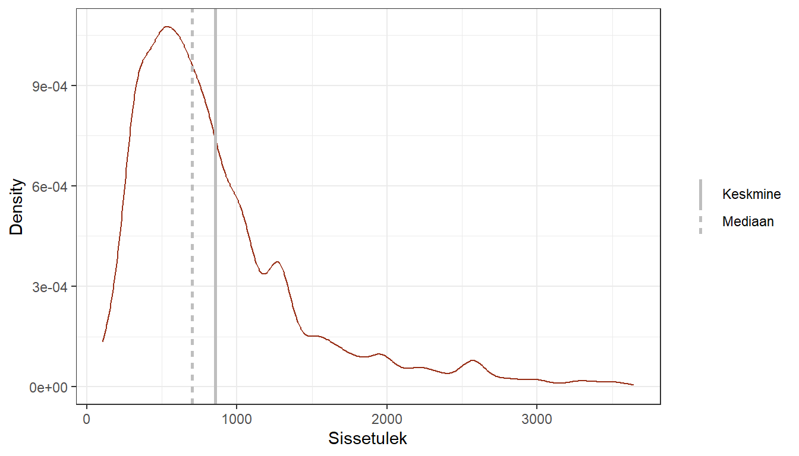</div>

Võttes sellisest tunnusest logaritmi, muudame jaotuse kuju rohkem normaaljaotuse sarnaseks.

##### Logaritm {.unnumbered}

Meeldetuletuseks, et mis see logaritm üldse on: 

$$\log_a{b} = x \, \iff \, b = a^x$$

ehk siis $x$ on arvu $b$ logaritm alusel $a$, kui $b = a^x$. Logaritmi alusena kasutame üldjuhul $e$ (ehk Euleri arv väärtusega *ca*  2,71828...). Logaritmi, mille aluse on $e$ nimetatakse ka naturaallogaritmiks. Ris on logaritmi funktsiooniks `log()` ja vaikimisi annabki see naturaallogaritmi. 

Tabelis \@ref(tab:tab-log) on näha erinevate väärtuste logaritmid. 0-i logaritm ei ole defineeritud, st 0-st logaritmi võtta ei saa. Seda tuleks siis ka tunnuste transformeerimisel meeles pidada - saame logaritmida ainult positiivsete väärtustega tunnuseid. 1-e logaritm on 0. Näeme, et logaritmimine vähendab suuri väärtusi ja suurendab väikeseid väärtusi.   


```{=html}
<table class="huxtable" style="border-collapse: collapse; border: 0px; margin-bottom: 2em; margin-top: 2em; ; margin-left: 0%; margin-right: auto;  " id="tab:tab-log">
<caption style="caption-side: top; text-align: left;">(#tab:tab-log) Logaritmid</caption><col style="width: 60%"><col style="width: 60%"><tr>
<th style="vertical-align: top; text-align: left; white-space: normal; border-style: solid solid solid solid; border-width: 0pt 0pt 0.4pt 0pt;    padding: 1pt 1pt 1pt 0pt; font-weight: bold;">b</th><th style="vertical-align: top; text-align: right; white-space: normal; border-style: solid solid solid solid; border-width: 0pt 0pt 0.4pt 0pt;    padding: 1pt 0pt 1pt 1pt; font-weight: bold;">log(b)</th></tr>
<tr>
<td style="vertical-align: top; text-align: left; white-space: normal; border-style: solid solid solid solid; border-width: 0.4pt 0pt 0pt 0pt;    padding: 1pt 1pt 1pt 0pt; font-weight: normal;">     0</td><td style="vertical-align: top; text-align: right; white-space: normal; border-style: solid solid solid solid; border-width: 0.4pt 0pt 0pt 0pt;    padding: 1pt 0pt 1pt 1pt; font-weight: normal;">-Inf&nbsp;&nbsp;&nbsp;&nbsp;</td></tr>
<tr>
<td style="vertical-align: top; text-align: left; white-space: normal; border-style: solid solid solid solid; border-width: 0pt 0pt 0pt 0pt;    padding: 1pt 1pt 1pt 0pt; font-weight: normal;">     0.00001</td><td style="vertical-align: top; text-align: right; white-space: normal; border-style: solid solid solid solid; border-width: 0pt 0pt 0pt 0pt;    padding: 1pt 0pt 1pt 1pt; font-weight: normal;">-11.5&nbsp;&nbsp;</td></tr>
<tr>
<td style="vertical-align: top; text-align: left; white-space: normal; border-style: solid solid solid solid; border-width: 0pt 0pt 0pt 0pt;    padding: 1pt 1pt 1pt 0pt; font-weight: normal;">     0.5</td><td style="vertical-align: top; text-align: right; white-space: normal; border-style: solid solid solid solid; border-width: 0pt 0pt 0pt 0pt;    padding: 1pt 0pt 1pt 1pt; font-weight: normal;">-0.693</td></tr>
<tr>
<td style="vertical-align: top; text-align: left; white-space: normal; border-style: solid solid solid solid; border-width: 0pt 0pt 0pt 0pt;    padding: 1pt 1pt 1pt 0pt; font-weight: normal;">     1</td><td style="vertical-align: top; text-align: right; white-space: normal; border-style: solid solid solid solid; border-width: 0pt 0pt 0pt 0pt;    padding: 1pt 0pt 1pt 1pt; font-weight: normal;">0&nbsp;&nbsp;&nbsp;&nbsp;</td></tr>
<tr>
<td style="vertical-align: top; text-align: left; white-space: normal; border-style: solid solid solid solid; border-width: 0pt 0pt 0pt 0pt;    padding: 1pt 1pt 1pt 0pt; font-weight: normal;">     2</td><td style="vertical-align: top; text-align: right; white-space: normal; border-style: solid solid solid solid; border-width: 0pt 0pt 0pt 0pt;    padding: 1pt 0pt 1pt 1pt; font-weight: normal;">0.693</td></tr>
<tr>
<td style="vertical-align: top; text-align: left; white-space: normal; border-style: solid solid solid solid; border-width: 0pt 0pt 0pt 0pt;    padding: 1pt 1pt 1pt 0pt; font-weight: normal;">    10</td><td style="vertical-align: top; text-align: right; white-space: normal; border-style: solid solid solid solid; border-width: 0pt 0pt 0pt 0pt;    padding: 1pt 0pt 1pt 1pt; font-weight: normal;">2.3&nbsp;&nbsp;</td></tr>
<tr>
<td style="vertical-align: top; text-align: left; white-space: normal; border-style: solid solid solid solid; border-width: 0pt 0pt 0pt 0pt;    padding: 1pt 1pt 1pt 0pt; font-weight: normal;">   100</td><td style="vertical-align: top; text-align: right; white-space: normal; border-style: solid solid solid solid; border-width: 0pt 0pt 0pt 0pt;    padding: 1pt 0pt 1pt 1pt; font-weight: normal;">4.61&nbsp;</td></tr>
<tr>
<td style="vertical-align: top; text-align: left; white-space: normal; border-style: solid solid solid solid; border-width: 0pt 0pt 0pt 0pt;    padding: 1pt 1pt 1pt 0pt; font-weight: normal;">  1000</td><td style="vertical-align: top; text-align: right; white-space: normal; border-style: solid solid solid solid; border-width: 0pt 0pt 0pt 0pt;    padding: 1pt 0pt 1pt 1pt; font-weight: normal;">6.91&nbsp;</td></tr>
<tr>
<td style="vertical-align: top; text-align: left; white-space: normal; border-style: solid solid solid solid; border-width: 0pt 0pt 0pt 0pt;    padding: 1pt 1pt 1pt 0pt; font-weight: normal;">100000</td><td style="vertical-align: top; text-align: right; white-space: normal; border-style: solid solid solid solid; border-width: 0pt 0pt 0pt 0pt;    padding: 1pt 0pt 1pt 1pt; font-weight: normal;">11.5&nbsp;&nbsp;</td></tr>
</table>

```

Vaatame kuidas näeb välja eelmisel joonisel kuvatud sissetuleku jaotus logaritmitud kujul:

<div class="figure">
<p class="caption">(\#fig:unnamed-chunk-39)Sissetuleku logaritmitud skaala võrdluses originaalskaalaga</p>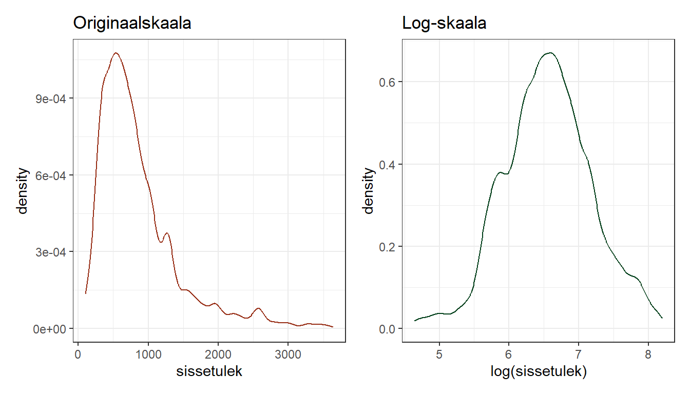</div>

Tundub märksa sarnasem normaaljaotusele.

Regressioonimudeli kontekstis tahame sõltuvat tunnust näha normaaljaotusena eelkõige sellepärast, et väljaveninud sabadega jaotused (või muud jaotused, mis ei vasta normaaljaotusele) kipuvad mõjutama jääkide jaotust ning nende seosed teiste tunnustega kipuvad olema mittelineaarsed.

Kui vaadata sissetuleku regressioonseost *numeracy*-ga (joonis \@ref(fig:log-reg)), siis on näha, et originaalskaala puhul on positiivsed (regressioonijoonest kõrgemale jäävaid) jäägid oluliselt suuremad kui negatiivsed, log-tranformeeritud skaala puhul on jäägid aga ühtlaselt ümber regressioonijoone jaotunud.


```r
p1 <- piaac %>% 
  ggplot()+
  aes(x = numeracy, y = sissetulek)+
  geom_point(alpha = 0.2)+
  geom_smooth(method = 'lm', se = F, color = "#972D15")+
  theme_bw()
p2 <- piaac %>% 
  ggplot()+
  aes(x = numeracy, y = log(sissetulek))+
  geom_point(alpha = 0.2)+
  geom_smooth(method = 'lm', se = F, color = "#972D15")+
  theme_bw()

p1+p2
```

<div class="figure">
<p class="caption">(\#fig:log-reg)Regressioonijooned ja jääkide jaotus originaalskaala ja log-transformeeritud skaala puhul.</p>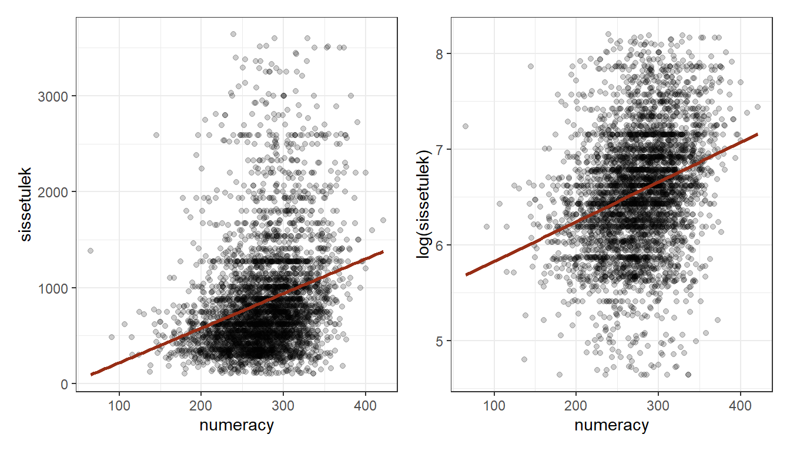</div>

##### Logaritmitud sõltuv muutuja {.unnumbered}

Kui kasutada regressioonimudelis logaritmitud sõltuvat tunnust, siis peab meeles pidama, et **tunnuse log-transformeerimine muudab koefitsientide tõlgendust**. Me ei hinda enam sissetulekut vaid log-sissetulekut:

$$\log(Y_i) = \beta_0 + \beta_1 x_i + \epsilon_i$$
ja seega $\beta_1$ tõlgendus on, et kui $x$ muutub ühe ühiku võrra, siis $log(Y)$ muutub $\beta_1$ võrra. Log-sissetulekut on aga suhteliselt keeruline tõlgendada, seetõttu viiakse mudel üldjuhul tagasi originaalsele $y$ skaalale, võttes võrrandi mõlemast poolest eksponendi (eksponent on logaritmi pöördtehe: $\exp(\log(10)) = 10$):

$$e^{(\log(Y_i))} = e^{(\beta_0 + \beta_1 x_i + \epsilon_i)}\Rightarrow Y_i = e^{(\beta_0)} \cdot e^{(\beta_1 x_i)} \cdot e^{(\epsilon_i)}$$
Nüüd on $Y$ küll originaalskaalal, kuid võrrand ise on muutunud multiplikatiivseks (sest $a^m \times a^n = a^{m+n}$). See tähendab, et kui **kui $x$ muutub ühe ühiku võrra, siis $Y$ muutub $\exp(\beta_1)$ korda**.

Defineerime log-transformeeritud sissetulekuga mudeli ja interpreteerime seda:


```r
# Me ei ilmtingimata andmestikku uut log-tunnust tegema. Saame ka lm()
# funktsiooni sees log() funktsiooni  kasutada.
mod <- lm(log(sissetulek) ~ numeracy, data = piaac)
summary(mod)
```

```
## 
## Call:
## lm(formula = log(sissetulek) ~ numeracy, data = piaac)
## 
## Residuals:
##      Min       1Q   Median       3Q      Max 
## -2.16429 -0.37750  0.00272  0.36621  1.84684 
## 
## Coefficients:
##             Estimate Std. Error t value Pr(>|t|)    
## (Intercept) 5.412322   0.060708   89.15   <2e-16 ***
## numeracy    0.004145   0.000217   19.10   <2e-16 ***
## ---
## Signif. codes:  0 '***' 0.001 '**' 0.01 '*' 0.05 '.' 0.1 ' ' 1
## 
## Residual standard error: 0.5971 on 3982 degrees of freedom
##   (3648 observations deleted due to missingness)
## Multiple R-squared:  0.08394,	Adjusted R-squared:  0.08371 
## F-statistic: 364.9 on 1 and 3982 DF,  p-value: < 2.2e-16
```

- Vabaliikme eksponent on sissetuleku geomeetriline keskmise (pane tähele, et mitte aritmeetilise keskmise) juhul kui *numeracy* skoor on 0, Seega $\exp(5.4123218) = 224.151415$.  
- *numeracy* eksponent näitab mitu korda keskmine geomeetriline sissetulek kasvab, kui *numeracy* skoor muutub ühe ühiku võrra. $\exp(0.0041452) = 1.0041539$, mis tähendab, et sissetulek kasvab 1.004 korda, ehk 0.4%. 10-punktine *numeracy* kasv tähendaks aga $\exp(0.0041\times 10) =1.042$ kordset kasvu ehk 4.19%-st kasvu. 

Kui $-0.1 < \beta < 0.1$, siis on päris täpne lähend $y$ protsentuaalsele muutusele $100 \times \beta$, ehk antud juhul oleks *numeracy* 10-punktine kasv võrdne $100 \times 0.0041 \times 10 = 4.1%$ sissetuleku kasvuga.

##### Logaritmitud sõltumatu muutuja {.unnumbered}

Kui me logaritmime sõltumatut muutuja $x$-i, siis **1% muutus $x$-is tähendab $\beta_1 \times \log(1.01)$ muutust $y$-is**.


```r
mod <- lm(sissetulek ~ log(numeracy), data = piaac)
summary(mod)
```

```
## 
## Call:
## lm(formula = sissetulek ~ log(numeracy), data = piaac)
## 
## Residuals:
##    Min     1Q Median     3Q    Max 
## -946.6 -352.4 -130.4  183.8 2905.3 
## 
## Coefficients:
##               Estimate Std. Error t value Pr(>|t|)    
## (Intercept)   -4106.25     294.42  -13.95   <2e-16 ***
## log(numeracy)   884.73      52.47   16.86   <2e-16 ***
## ---
## Signif. codes:  0 '***' 0.001 '**' 0.01 '*' 0.05 '.' 0.1 ' ' 1
## 
## Residual standard error: 558.1 on 3982 degrees of freedom
##   (3648 observations deleted due to missingness)
## Multiple R-squared:  0.06663,	Adjusted R-squared:  0.0664 
## F-statistic: 284.3 on 1 and 3982 DF,  p-value: < 2.2e-16
```

- Vabaliige on keskmine sissetulek, kui log(*numeracy*) on 0 ehk kui *numeracy* on 1 (sest $log(1) = 0$)
- Kui *numeracy* muutub 1% võrra, siis keskmine sissetulek kasvab $884.7341221 \times log(1.01) = 8.803$ euro võrra. 

Küllaltki täpse lähendi $y$ kasvule saame kui jagame koefitsiendi lihtsalt 100-ga läbi: $\frac{884.7341221}{100} = 8.847$.


##### Logaritmitud sõltuv ja sõltumatu muutuja {.unnumbered}

Kui me logaritmime nii sõltuva kui sõltumatu muutuja, siis **1% $x$ muutus  tähendab t $(1 + 0.01)^\beta$ kordset muutust $Y$-s** (või siis $\exp(\log(1 + 0.01) \times\beta)$). Kui $x$ muutub näiteks 10% võrra, siis on $y$ muutub $(1+0.1)^\beta$ korda jne. Saame seda näitajat käsitleda protsentuaalse muutusena $((1+0.1)^\beta-1)\times100$. Taolist näitajat nimetatakse majandusteadustes ka elastsuseks, mis näitab kui tundlik mingi näitaja on teise näitaja muutmise suhtes. 


```r
mod <- lm(log(sissetulek) ~ log(numeracy), data = piaac)
summary(mod)
```

```
## 
## Call:
## lm(formula = log(sissetulek) ~ log(numeracy), data = piaac)
## 
## Residuals:
##      Min       1Q   Median       3Q      Max 
## -2.13086 -0.37925  0.00297  0.37042  2.14653 
## 
## Coefficients:
##               Estimate Std. Error t value Pr(>|t|)    
## (Intercept)    0.79591    0.31621   2.517   0.0119 *  
## log(numeracy)  1.02742    0.05636  18.230   <2e-16 ***
## ---
## Signif. codes:  0 '***' 0.001 '**' 0.01 '*' 0.05 '.' 0.1 ' ' 1
## 
## Residual standard error: 0.5994 on 3982 degrees of freedom
##   (3648 observations deleted due to missingness)
## Multiple R-squared:  0.07703,	Adjusted R-squared:  0.0768 
## F-statistic: 332.3 on 1 and 3982 DF,  p-value: < 2.2e-16
```

- Kui *numeracy* muutub 1% võrra, siis keskmine sissetulek muutub $(1.01)^{1.0274152} = 1.0102756\%$ korda ehk $(1.0102756 - 1) * 100 = 1.0275556\%$ võrra.

Kui $\beta$ ei ole väga suur ($-10 < \beta < 10$), siis jällegi küllaltki heaks lähendiks $y$ muutuse hindamisel on tegelikult lihtsalt $\beta$, seega 1% muutus $x$-is tähendab $\beta\%$ muutust $y$-is.

#### Polünoomid {.unnumbered}

Teine väga levinud tunnuse transformeerimise viis on polünoomide mudelisse lisamine. Nende abil on võimalik modelleerida vägagi keerukaid seoseid, millel esmapilgul lineaarsusega mingit seost ei ole. 

Polünoomid on funktsioonid, mis koosnevad konstantsete kordajate ja astendatud muutujate summadest.

$$a_0 + a_1x^1 + a_2x^2 + a_3x^3 + a_px^p$$
Graafiliselt näevad polünoomid välja sellised:


Polünoomidega regressioonimudeliga saame taolisi ja väga paljusid muid kurve hinnata. Polünoomse regressiooni mudel ise näeb välja järgmine:

$$Y_i = \beta_0 + \beta_1 x_i + \beta_2 x_i^2 + \cdots + \beta_{p-1}x_i^{p-1} + \epsilon_i$$

Piaaci andmestikus on vanuse tunnus. Vaatame kuidas vanuse ja sissetuleku seos välja näeb:


```r
piaac %>% 
  ggplot(aes(x = vanus, y = sissetulek))+
  geom_point(alpha = 0.1)+
  geom_smooth(se = F, color = '#972D15')+
  theme_bw()
```


Tundub päris loogiline. Nooremate inimeste hulgas vanuse kasvades sissetulekud kasvavad, saavutavad 30-35-aastaste hulgas haripunkti ning hakkavad siis langema. Kuid tegemist ei ole mingil juhul lineaarse seosega ning originaalkujul me seda lineaarsesse mudelisse panna ei tohiks. 

Üks variant oleks vanus kategoriseerida ning kategoriaalse tunnusena mudelisse kaasata. Sellisel juhul kaotaksime osa infot. Et infokadu vähendada, peaksime tegema suhteliselt palju vanusegruppe. Kuid sellega läheks nende tõlgendamine keerulisemaks. 

Teine variant on kasutada polünoome. Sellisel puhul peame otsustama, mitmenda astme polünoomi meil vaja on. Mida kõrgem aste, seda täpsemalt saame seost modelleerida, kuid seda keerulisemaks hilisem tõlgendus läheb. Samuti suureneb oht mudelit *overfittida*. Rusikareegel on, et mida vähem astmeid, seda parem. Üldiselt tavapärases mudelis üle kolmanda astme ei soovitaks kasutada. 

Polünoomidega regressiooni mudeliga tehtavad prognoosid kehtivad üldjuhul ainult mudeli aluseks olevate andmete skaala ulatuses. Näiteks kui kasutame vanuse polünoome ja andmestikus on 20-60 aastased, siis ei tohiks mudeli alusel 80-aastaste inimeste hinnanguid. Väljaspool piiirkonda mille alusel mudel on hinnatud võivad $y$ väärtused väga ebarealistlikuks minna (või no tegelikult lähevad peaaegu kindlasti).

Defineerime esmalt teise astme polünoomiga mudeli. Selleks peame lisaks algsele *vanus* tunnusele lisama mudelile *vanus^2* tunnuse (lisades kõrgema astme koefitsienfi, peavad kõik madalama astme koefitsiendid mudelis olema, st kui lisame *vanus^2*, siis *vanus* peab ka mudelis olema, kui lisame *vanus^3*, siis peavad *vanus* ja *vanus^2* mudelis olema). Saaksime need enne andmestikus valmis arvutada, kuid lihtsam on need `lm()` funktsiooni sees defineerida: 


```r
# Et võrrandis tehteid teha (antud juhul astendamistehet), 
# tuleb kasutada I() notatsiooni
mod <- lm(sissetulek ~ vanus + I(vanus^2), data = piaac)
```

Teine viis polünoomide defineerimiseks on kasutada `poly()` funktsiooni, mille sisendina peame lisaks tunnusenimele määrama soovitava polünoomi astme. Vaikimisi arvutab `poly()` ortogonaalsed polünoomid (nende puhul on välditud $x$, $x^2$, $x^3$ jne korrelatsioone, andes nii stabiilsema tulemi). Kui tahta `poly()` funktsiooniga tavapäraseid, käsitsi arvutatavatega analoogseid polünoome, siis tuleb kasutada argumenti `raw = T`. 

Kui tahame hiljem koefitsiente tõlgendada, siis peaksime kasutama tavalisi (`raw = T`) polünoome, kui tahame mudelit kasutada prognoosimiseks (`predict()`), siis võiksime eelistada ortogonaalseid polünoome.

Defineerime teise astme polünoomiga mudeli:


```r
mod <- lm(sissetulek ~  poly(vanus, degree = 2), data = piaac)
summary(mod)
```

```
## 
## Call:
## lm(formula = sissetulek ~ poly(vanus, degree = 2), data = piaac)
## 
## Residuals:
##    Min     1Q Median     3Q    Max 
## -861.6 -368.8 -149.4  186.7 2991.2 
## 
## Coefficients:
##                            Estimate Std. Error t value Pr(>|t|)    
## (Intercept)                 822.988      9.494  86.688  < 2e-16 ***
## poly(vanus, degree = 2)1  -4549.436    913.238  -4.982 6.57e-07 ***
## poly(vanus, degree = 2)2 -10723.116    976.876 -10.977  < 2e-16 ***
## ---
## Signif. codes:  0 '***' 0.001 '**' 0.01 '*' 0.05 '.' 0.1 ' ' 1
## 
## Residual standard error: 566.1 on 3981 degrees of freedom
##   (3648 observations deleted due to missingness)
## Multiple R-squared:  0.03989,	Adjusted R-squared:  0.03941 
## F-statistic: 82.71 on 2 and 3981 DF,  p-value: < 2.2e-16
```

Teise tasandi polünoom on kurvi kujuga, seega seda on hea tahtmise korral võimalik ka koefitsientide abil kirjeldada. Näiteks kui $x^2$ on negatiivne, siis on kurv ülespoole kumer, kui positiivne, siis allapoole kumer. Kuid üldjuhul ei ole mõtet nii koefitsiente tõlgendama hakata. Kuna seos on mittelineaarne, st eri $x$-i väärtuste korral on see erinev, siis mingit ühest kirjeldust sellele nii ehk naa anda ei saa. Lihtsam on seost graafiliselt vaadata:


```r
piaac %>% 
  filter(!is.na(sissetulek), !is.na(vanus)) %>% 
  mutate(hinnang = fitted(mod)) %>% 
  ggplot()+
  aes(x = vanus, y = hinnang)+
  geom_line(size = 1, color = "#972D15")+
  theme_bw()
```


Teeme ka kolmanda astme polünoomidega mudeli:


```r
mod2 <- lm(sissetulek ~  poly(vanus, degree = 3), data = piaac)
```


<div class="figure">
<p class="caption">(\#fig:unnamed-chunk-49)Esimese astme polünoom (lineaarne mudel), teise astme polpnoom ja kolmanda astme polünoom võrreldes mittelineaarse GAM hinnanguga</p></div>


