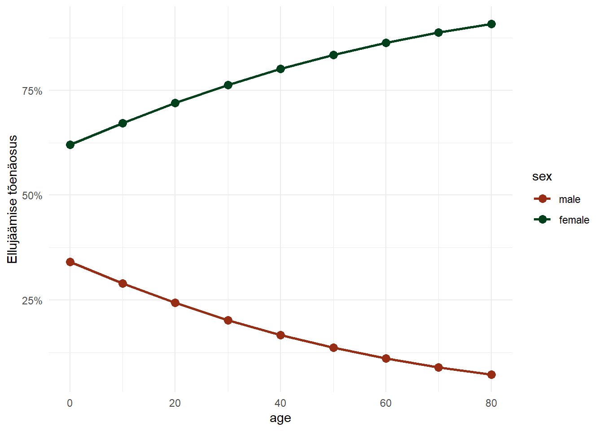
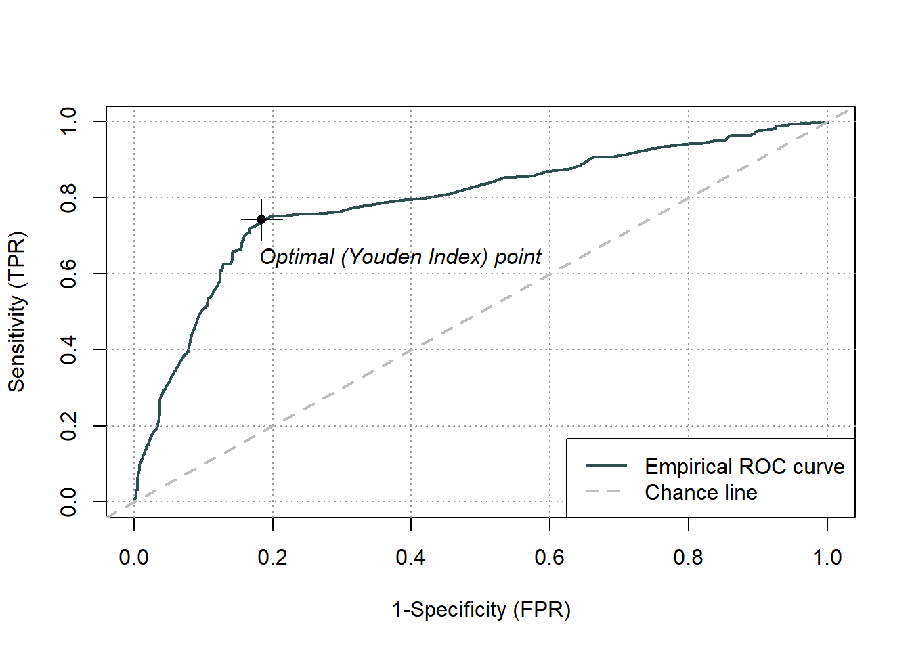

# (PART) Üldistatud lineaarsed mudelid {-} 

# Logistiline regressioon


Logistilise regressiooniga (logit-mudeliga) saame hinnata sõltumatute tunnuste mõju binaarsele sõltuvale tunnusele (töötav/töötu, käis valimas/ei käinud valimas, surnud/ei ole surnud). Teisisõnu, hindame kuidas mingid sõltumatud tunnused mõjutavad mingi sündmuse toimumise tõenäosust (näiteks kas haridus mõjutab hõives olemise tõenäosust või kas sotsiaalmajanduslik staatuse kasvades suureneb inimese tõenäosus valima minna). Seega sõltuvaks tunnuseks ei ole enam algne binaarne tulem, vaid seda iseloomustav tõenäosus (mitte jah/ei, vaid jah tõenäosus): $P(Y=1)=\pi$.  

## Logistiline funktsioon

Tavalise regressioonimudel oli väljendatav kui $\bar{y}=\beta_0+\beta_p x_p$. Miks me ei võiks pidevtunnuselise $y$ keskmist asendada $\pi$-ga: $\bar{\pi}=\beta_0+\beta_k x_k$? Binaarse tuynnuse keskmine (kui tunnus on $0/1$ kujul) ongi ju tõenäosus ja lineaarse regressiooniga me hindamegi ju $Y$ keskmist erinevate $X$ väärtuste korral. Aga sellepärast, et tõenäosus on piiritletud $0$ ja $1$-ga, samas kui lineaarne funktsioon hõlmab kõiki reaalarvulisi väärtusi. Seega on paratamatu, et mingite $x$-i väärtuste puhul on prognoositav $y$ väärtus suurem kui $1$ või väiksem kui $0$. 

<div class="figure">

<p class="caption">(\#fig:glm-1)Lineaarse regressiooni kasutamine binaarse sõltuva tunnusega</p>
</div>

Lisaks tekivad probleemid jääkide struktuuriga (tavaline regressioon eeldab normaaljaotust) ja jääkide dispersiooniga (tavaline regressioon eeldab konstantset hajuvust).

Seega, et hinnata tunnuste vahelist suhet adekvaatselt, peaksime tõenäosuse skaala ($0 \dots1$) kuidagi pidevaks skaalaks teisendama ($-\infty \dots \infty$).

### Šansid 
Et saada lahti maksimaalsest väärtusest ($1$), on võimalik kasutada sündmuse toimumise tõenäosuse asemel sündmuse toimumise šanssi (*odds*). Šanssideks nimetatakse sündmuse toimumise ja mittetoimumise suhet:

$$\text{šansid}=\frac{p}{(1-p)}$$
kus $p$ on sündmuse toimumise tõenäosus.  

Näiteks kulli ja kirja viskamisel on kulli saamise šanss $\frac{0.5}{(1-0.5)}=1$. 

Šanss võtta kaardipakist ruutu on $\frac{0.25}{(1-0.25)}=\frac{1}{3}=0.33$. 

<div class="figure">

<p class="caption">(\#fig:odds)Šansside ja tõenäosuse suhe</p>
</div>

Šansid saab omakorda teisenda tagasi tõenäosuseks:

$$p=\frac{\text{šansid}}{1+\text{šansid}}$$

### Logit    
Kuid šansside puhul jääb tõenäosuse alumine piir ikkagi alles. Ka šansid on altpoolt piiratud (nad ei saa olla väiksemad kui $0$). Lahenduseks on võtta šansside logaritm, millega eemaldame ka alumise piiri. Saadud väärtust nimetatakse **logit**-iks (*log odds*):  

$$\text{logit}=\log \bigg(\frac{p}{(1-p)}\bigg)$$

<div class="figure">

<p class="caption">(\#fig:glm-3)Logit-i ja tõenäosuse suhe</p>
</div>


Taolist funktsionaalset seost $x$ ja $y$ vahel nimetatakse **logistiliseks funktsiooniks**:

$$y = f(x) = \frac{\exp(x)}{1 + \exp(x)} = \frac{1}{1 + \exp(-x)}$$

## Logit mudel 

Logistilise regressiooni mudel moodustub järgmiselt:

$$\text{logit}(\pi_i)=\text{log} \left(\dfrac{\pi_i}{1-\pi_i}\right)=\beta_0+\beta_1 x_i$$  
ehk me hindame juba tuttava lineaarse võrrandi abil nüüd logitit.


Saame sama mudeli esitada ka otse logistilise funktsiooni kaudu:

$$\pi_i=Pr(Y_i=1|X_i=x_i)=\dfrac{e^{(\beta_0+\beta_1 x_i)}}{1+e^{(\beta_0+\beta_1 x_i)}}$$  

või siis ka nii:     

$$\pi_i=Pr(Y_i=1|X_i=x_i)=\frac{1}{1+e^{-(\beta_0+\beta_1 x_i)}}$$
Logistilise regressiooni seos eelneva näite puhul näeb aga välja selline:

<div class="figure">

<p class="caption">(\#fig:glm-2)Logistiline regressioon võrdluses lineaarse regressiooniga</p>
</div>

## Mudeli tõlgendus
Tavalise regresioonimudeliga saime prognoosida $y$ väärtust mingite $x$ väärtuste korral (ja $y$ muutust, kui $x$ muutub ühe ühiku võrra). Sama kehtib ka logistilise regressiooni puhul. Kuid mida me siinjuures täpsemalt prognoosime? Tahaksime kindlasti prognoosida (uuritava sündmuse toimumise) tõenäosust. Kuid kuna me teisendasime tõenäosuse logititeks, siis tegelikult saame prognoosida hoopis logitit. Ja ka ühe ühikuline muutus $x$-is ei peegelda mitte $y$ tõenäosuse muutust, vaid logit($y$)-i muutust. Logiteid ei oska me (vähemalt esialgu) kuidagi tõenäosuslikult tõlgendada. Mida siis teha? 

Lahenduseks on võtta *logit*-i võrrandi mõlemast poolest eksponent 

$$\exp(logit) = \exp(\beta_0+\beta_1 x_i) \implies \frac{\pi_i}{1-\pi_i}=e^{({\beta_0}+\beta_1 x_i)}$$ 

Sellisel juhul saab $\beta_0$-i tõlgendada kui $y$-i šansse juhul kui $x$ on $0$ ja $\beta_1$-te kui šanssides kordajat (mitu korda $x$-i ühe ühiku muutudes $y$ šansid suurenevad või vähenevad). Seda šansside muutust väljendavat kordajat nimetatakse **šansside suhteks**.

Miks me nüüd räägime $\beta_1$-st kui kordajast (lineaarse regressiooni puhul oli tegemist lisanduva muutusega)? Põhjus on eksponendi võtmises, kuna $e^{({\beta_0}+\beta_1 x_i)} = e^{{\beta_0}}\times e^{\beta_1 x_i}$.   

### Šansside suhe
Šansid saime leida valemiga:  

$$\text{šansid}=\frac{p}{(1-p)}$$  
Valemist võime välja lugeda järgmist:  

1. Šansid on alati positiivsed  
1. Kui šansid on $1$, siis on sündmuse toimumise ja mittetoimumise tõenäosus võrdsed ($p=0.5$).  
1. Kui šansid on suuremad kui $1$, siis on sündmuse toimumise tõenäosus suurem kui mittetoimumise tõenäosus ($p>0.5$) ja vastupidi.  
Näiteks kui sündmuse toimumise tõenäosus on $0.8$, siis on šansid $\frac{0.8}{1-0.8}=\frac{0.8}{0.2}=4$. Seega sündmuse toimumise tõenäosus on $4$ korda suurem kui selle mittetoimumise tõenäosus. Kui sündmuse toimumise tõenäosus on $0.2$, siis on šansid $\frac{0.2}{1-0.2}=\frac{0.2}{0.8}=\frac{1}{4}=0.25$. Sündmuse toimumise tõenäosus on $4$ korda väiksem kui selle mittetoimumise tõenäosus.  

Vaatame näidet, kus hindame hääletamise tõenäosust ning abielu mõju sellele:

<table class=" lightable-minimal" style='font-family: "Trebuchet MS", verdana, sans-serif; width: auto !important; margin-left: auto; margin-right: auto;'>
 <thead>
  <tr>
   <th style="text-align:left;">   </th>
   <th style="text-align:right;"> Hääletab </th>
   <th style="text-align:right;"> Ei hääleta </th>
  </tr>
 </thead>
<tbody>
  <tr>
   <td style="text-align:left;font-weight: bold;"> Abielus </td>
   <td style="text-align:right;"> 0.75 </td>
   <td style="text-align:right;"> 0.25 </td>
  </tr>
  <tr>
   <td style="text-align:left;font-weight: bold;"> Vallaline </td>
   <td style="text-align:right;"> 0.54 </td>
   <td style="text-align:right;"> 0.46 </td>
  </tr>
</tbody>
</table>


Abielus inimeste puhul on šanss hääletamiseks  $\frac{0.75}{0.25} = \frac{3}{1}= 3$ (st $3$ hääletajat iga mittehääletaja kohta).  

Vallaliste puhul on šanss hääletamiseks  $\frac{0.54}{0.46} = 1.17$ (st $1.17$ hääletajat iga mittehääletaja kohta).  

Meid huvitab kuidas sõltumatu tunnuse muutus sündmuse toimumise šansse mõjutab, ehk kui palju muutuvad šansid kui sõltumatu tunnus muutub ühe ühiku võrra. Seda muutust väljendabki šansside suhe (*odds ratio* ehk OR)

$$OR=\frac{y \text{ šanss juhul kui } x \text{ väärtus muutub ühe ühiku võrra}}{y \text{ šanss juhul kui } x \text{ väärtus jääb samaks}}$$

Abielus olijate ja vallaliste šansside suhe on $\frac{3}{1,17}=2.56$. Ehk siis abielus olijate šanss hääletada on kaks ja pool korda suurem. Abielu tunnuse ühe ühiku muutumisega muutuvad šansid $2.56$ korda ehk suurenevad $156\%$.


## Logistiline regressioon R-is

Võtame R-i näidisandmestiku `Titanic`, mis kirjeldab Titanicul hukkunute ja ellujäänute sugu, vanust ja reisijaklassi. Üritame hinnata kuidas ja kas need tunnused mõjutasid ellujäämist.  

Logistilise regressiooni mudeleid saab Ris hinnata `glm()` funktsiooniga. Selle loogika ja argumendid on sarnased `lm()` funktsiooni omadele. Peamiseks erinevuseks on see, et nüüd peame defineerima ka sõltuva tunnuse jaotuse ja linkfunktsiooni. See käib argumendiga `family`. Logistilise regressiooni jaoks peame defineerima `family = binomial(link = 'logit')` (sõltuva tunnuse jaotus on binoomjaotus ja linkfunktsioon on logit).  
Vaatame kõigepealt soo mõju:


```r
# Kasutame paket carData andmestikku TitanicSurvival

titanic <- carData::TitanicSurvival

# vaatame andmestiku esimesi ridu
head(titanic)
```

```
##                                 survived    sex     age passengerClass
## Allen, Miss. Elisabeth Walton        yes female 29.0000            1st
## Allison, Master. Hudson Trevor       yes   male  0.9167            1st
## Allison, Miss. Helen Loraine          no female  2.0000            1st
## Allison, Mr. Hudson Joshua Crei       no   male 30.0000            1st
## Allison, Mrs. Hudson J C (Bessi       no female 25.0000            1st
## Anderson, Mr. Harry                  yes   male 48.0000            1st
```

```r
# Ellujäämise tunnus (survived) on tekstiline. Muudame selle numbriliseks (0/1)
# või loogiliseks (TRUE/FALSE) tunnuseks

titanic$surv <- titanic$survived == "yes"

# Ja defineerime mudeli
mudel7 <- glm(surv~sex, data = titanic, family = binomial(link = 'logit'))

# Saaksime ka lihtsamalt.
# I(survived == "yes") notatsiooniga saame tekstilise tunnuse 
# võrrandi sees loogilisek tunnuseks teisendada 
# glm(I(survived == "yes")~sex, data = titanic, family = binomial(link = 'logit'))
#   
# Tulemus oleks sama

# Vaatme tulemusi
summary(mudel7)
```

```
## 
## Call:
## glm(formula = surv ~ sex, family = binomial(link = "logit"), 
##     data = titanic)
## 
## Deviance Residuals: 
##     Min       1Q   Median       3Q      Max  
## -1.6124  -0.6511  -0.6511   0.7977   1.8196  
## 
## Coefficients:
##             Estimate Std. Error z value Pr(>|z|)    
## (Intercept)   0.9818     0.1040   9.437   <2e-16 ***
## sexmale      -2.4254     0.1360 -17.832   <2e-16 ***
## ---
## Signif. codes:  0 '***' 0.001 '**' 0.01 '*' 0.05 '.' 0.1 ' ' 1
## 
## (Dispersion parameter for binomial family taken to be 1)
## 
##     Null deviance: 1741.0  on 1308  degrees of freedom
## Residual deviance: 1368.1  on 1307  degrees of freedom
## AIC: 1372.1
## 
## Number of Fisher Scoring iterations: 4
```


Väljund on väga sarnane `lm()` väljundile. Leiame seal regressioonikoefitsiendid, nende standardvead, z-väärtused ja z-testi *p*-väärtuse^[z-test puhul on tegemist t-testi analoogiga, mis ei lähtu mitte t-jaotusest, vaid normaaljaotusest. Tõlgendus on aga sama]. Kuid koefitsiendid on nüüd logititskaalal ja seepärast küllaltki raskesti tõlgendatavad. Saame siiski järeldada, et meeste tõenäosus ellu jääda oli väiksem kui naistel (koefitsient on negatiivne) ja naiste tõenäosus ellu jääda oli suurem kui 0.5 (vabaliige, ehk naiste ellujäämistõenäose *logit*, on positiivne). 

Mõnevõrra lihtsam on tõlgendada šansside suhet. Selleks peame koefitsientidest eksponendi võtma:


```r
exp(coef(mudel7))
```

```
## (Intercept)     sexmale 
##  2.66929134  0.08843935
```


- Vabaliiget tõlgendame kui referentsgrupi (antud juhul naiste) šansse ellu jääda. Seega naise šanss Titanicul ellu jääda oli $2.67$, ehk siis iga hukkunud mehe kohta jäi ellu $2.67$ naist, või vastupidi $1 / 2.67 = 0.37$, iga ellujäänud mehe kohta hukkus $0.3745318$ naist. Saame välja arvutada ka naiste ellujäämise tõenäosuse:

$$\pi=\frac{\text{šansid}}{1+\text{šansid}} = \frac{2.67}{1+2.67} = 0.73$$  

- Meeste puhul tõlgendame šansside suhet. Ehk kui palju muudab meheksolemine võrreldes naistega ellujäämise šansse. Tuleb välja, et ligi $0.09$ korda. Seega meeste šansid ellu jääda olid $0.09 \times 2.67 = 0.24$. Iga hukkunud naise kohta jäi 0.24 meest ellu. Meeste ellujäämise tõenäosus oli:

$$\pi=\frac{\text{šansid}}{1+\text{šansid}} = \frac{0.24}{1+0.24} = 0.19$$  

Saame selle tõenäosuse ka otse välja arvutada, kui paneme koefitsiendid regressioonivõrrandisse (eelnevalt toodud valemi järgi):

$$\pi=\dfrac{e^{(\beta_0+\beta_1 x_i)}}{1+e^{(\beta_0+\beta_1 x_i)}} = \dfrac{e^{(0.98+ -2.43 \times 1)}}{1+e^{(0.98+-2.43 \times 1)}} = 0.19$$

Me loomulikult ei pea kogu seda asja käsitsi välja arvutama. Logititest saame tõenäosused arvutada `plogis()` funktsiooni abil:


```r
# Naiste tõenäosus ellu jääda:
coef(mudel7)[1] %>% # Võtame esimese koefitsiendi
  as.numeric() %>% 
  plogis() 
```

```
## [1] 0.7274678
```

```r
# Meeste tõenäosus ellu jääda:
## nüüd tegeleme logititega, ehk lineaarse seosega. 
## seega liidame, mitte ei korruta
(coef(mudel7)[1] + coef(mudel7)[2]) %>% # esimene ja teine koefitsient
  as.numeric() %>% 
  plogis()
```

```
## [1] 0.1909846
```


### Mitu sõltumatut tunnust ja interaktsioon

Vaatme ka, kuidas muudab ellujäämise tõenäosust lisaks soole vanus. Eeldame ka soo ja vanuse koosmõju (st kontrollime kas erinevas vanuses meeste ja naiste elujäämistõenäosused erinevad). Tsentreerime intrepretatsiooni huvides vanuse tunnuse. Seeläbi saame mõistlikul viisil vabaliiget tõlgendada ning muudame ka soo koefitsiendi sisukaks. Interaktsiooni tõttu on soo mõju eri vanuste puhul erinev ning ilma tsentreerimata näitaks koefitsient soo erinevust ainult 0 vanuse puhul. Tsentreeritud vanuse korral aga soo erinevust keskmise vanuse puhul, mis on mõnevõrra sisukam näitaja.


```r
mudel8 <- glm(surv~sex*scale(age, scale = F), data = titanic, family = binomial())
summary(mudel8)
```

```
## 
## Call:
## glm(formula = surv ~ sex * scale(age, scale = F), family = binomial(), 
##     data = titanic)
## 
## Deviance Residuals: 
##     Min       1Q   Median       3Q      Max  
## -2.0247  -0.7158  -0.5776   0.7707   2.2960  
## 
## Coefficients:
##                                Estimate Std. Error z value Pr(>|z|)    
## (Intercept)                    1.166171   0.122558   9.515  < 2e-16 ***
## sexmale                       -2.536905   0.157220 -16.136  < 2e-16 ***
## scale(age, scale = F)          0.022516   0.008535   2.638  0.00834 ** 
## sexmale:scale(age, scale = F) -0.046276   0.011216  -4.126 3.69e-05 ***
## ---
## Signif. codes:  0 '***' 0.001 '**' 0.01 '*' 0.05 '.' 0.1 ' ' 1
## 
## (Dispersion parameter for binomial family taken to be 1)
## 
##     Null deviance: 1414.6  on 1045  degrees of freedom
## Residual deviance: 1083.4  on 1042  degrees of freedom
##   (263 observations deleted due to missingness)
## AIC: 1091.4
## 
## Number of Fisher Scoring iterations: 4
```


Täiskasvanuks olemine mõnevõrra tõstis ellujäämise tõenäosust, kuid seda ainult naiste puhul (soo ja vanuse interaktsioon on negatiivne ning meeste vanuse koefitsient on 0.02 + -0.05 = -0.03). Tulemuste tõlgendamiseks võtame jälle koefitsientidest eksponendi:


```r
exp(coef(mudel8))
```

```
##                   (Intercept)                       sexmale 
##                    3.20967979                    0.07911088 
##         scale(age, scale = F) sexmale:scale(age, scale = F) 
##                    1.02277095                    0.95477884
```

- *(Intercept)* ehk vabaliige kirjeldab ellujäämise šansse juhul kui sõltumatud tunnused on nullid. Ehk siis antud juhul ellujäämise šansse keskmise vanusega naiste puhul. Nende ellujäämise tõenäosus oli:

$$\pi = \frac{3.22}{1+3.22} = 0.76$$  

- *sexmale* - keskmise vanusega meeste (ainult keskmise vanusega, kuna muude vanuste puhul tuleb mängu koosmõju) ellujäämise šansid olid $0.08$ korda keskmises vanuses naiste šansid (ehk siis $92\%$  väiksemad). 

- *scale(age, scale = F)* - naiste (ainult naiste, kuna meeste puhul tuleb mängu koosmõju) šansid ellu jääda tõusid iga lisanudva eluaastaga $1.02$ korda ehk $2\%$. 

- *sexmale:scale(age, scale = F)* - meeste vanuse mõju puhul peame appi võtma koosmõju koefitsiendi. Meeste šansid ellu jääda kahanesid iga lisanudva eluaastaga $1.02 \times 0.95 = 0.969$ korda ehk $3.1\%$.

Näeme, et koosmõju on antud mudeli puhul vägagi sisukas. Meeste puhul vanuse kasv langetas ellujäämise šansse, naiste puhul aga tõstis.


::: {.teie-kord}
Ülesanne!  

* Piaaci andmestikus on tunnus *staatus3*. Võtke see aluseks ja tehke uus loogiline (TRUE/FALSE) tunnus *hoiv*, mis kirjeldaks kas inimene on või ei ole hõivatud.  
* Hinneke logistilise regressiooniga, kas hõivatus on mõjutatud inimese haridusest ja vanusest. 
:::


## Mudeli kvaliteet

Kuidas hinnata mudeli kvaliteeti? Meile ei anta ei jääkide standardviga ega determinatsioonikordajat. Küll on aga väljunis toodud *Null deviance* ja *Residual deviance*. *Deviance* kirjeldab mudeli hälvet ehk seda kui hästi (või õigem oleks öelda kui halvasti) meie mudel andmetega sobitub, ehk kui suur on erinevus meie andmete ja mudeli prognoosi vahel. Mida väiksem on *deviance*, seda väiksem on mudeli viga, ehk seda täpsemini sobitub mudel andmetega. 

- **Null deviance** kirjeldab küllastunud mudeli hälbimust nullmudelist.  
- **Residual deviance** ehk jääkhälbimus kirjeldab defineeritud mudeli hälbimust küllastunud mudelist. 

Nullmudel on ainult vabaliikmega mudel (ehk mudel kus ei ole ühtegi selgitavat tunnust peale $Y$-i keskmise). Küllastunud mudel on selline, kus on sama palju parameetreid kui andmepunkte (ehk mudel millega on kogu $Y$-i varieeruvus ära kirjeldatud).

### Mudeli sobivus

Mudeli sobivust andmetega (*goodness of fit*) saame hinnata jääkhälbimuse (*Residual deviance*) näitaja abil. Jääkhälbimus näitab kui palju mudeliga hinnatud $Y$ väärtused empiirilistest $Y$ väärtustest erinevad (analoogne asi lineaarse regressiooni puhul oli *residual sum of squares*). Jääkhälbimuse abil saame võrrelda kui palju meie sobitatud mudel erineb küllastunud (*saturated*) mudelist, st mudelist mis sobituks täiel määral andmetega. Jääkhälbimus näitabki sisuliselt meie mudeli ja küllastunud mudeli erinevust.  Mida väiksem on jääkhälbimus, seda paremini meie mudel andmetega "sobib". Seda, kas see on piisavalt väike (mis tähendab, et meie mudeli ja andmete vahel ei ole statistliselt olulist erinevust), saame testida hii-ruut testiga (arvestades mudeli  vabadusasteid (*degrees of freedom*).


```r
res_dev <- deviance(mudel8)
res_df <- df.residual(mudel8)
pchisq(res_dev, res_df, lower.tail = F)
```

```
## [1] 0.181289
```

`pchisq()` funktsiooniga saame testitulemusele ka *p*-väärtuse. Näeme, et see on suurem kui $0.05$, mis tähendab, et meie mudel ei erine küllastunud mudelist olulisel määra ja seega sobitub andmetega (siin tahame, et *p*-väärtus oleks võimalikult suur, st meie mudeli ja küllastunud mudeli vahel ei oleks statistilist erinevust). Reaaleluliste ja suurte andmetega on tegelikult suhteliselt keeruline hästi sobituvat mudelit leida. Seega isegi kui see test näitab, et mudel ei ole sobilik, siis üldjuhul me lihtsalt lepime asjaoluga, et meie mudel ei ole täiuslik ja jätame selle testi tähelepanuta.

Üks kasulik nipp on ka võrrelda jääkhälbimuse väärtust ja tema vabadusastmeid. Kui *Residual deviance* on oluliselt suurem kui tema *degrees of freedom*, siis annab see jällegi tunnistust halvast mudelist.

### Mudeli statistiline olulisus

Näeme, et meie sisuka mudeli hälve küllastunud mudelist (*Residual deviance*) on võrreldes nullmudeli erinevusega küllastunud mudelist (*Null deviance*) tunduvalt väiksem^[Peame siin arvestama ka erinevust vabadusastmetes. Kuigi sisuka mudeli hälve on väiksem, on selles ka vähem vabadusastmeid]. See tähendab, et tänu sõltumatutele tunnustele  suudame me sõltuva tunnuse variatsiooni seletada paremini kui ainult $Y$-i keskmise abil. Aga kas mudeli hälve läks väiksemaks piisavalt paju, et me saaksime selle kohta ka statistiliselt olulisi järeldusi teha? Ehk siis kas me saame järeldada, et sõltumatud tunnused seletavad statistiliselt olulisel määral sõltuva tunnuse variatsiooni ja meie mudel on parem kui lihtsalt sõltuva tunnuse keskmine? Saame seda testida  *likelihood ratio* testiga. 

Arvutame esmalt *Null deviance* ja *Residual deviance* erinevuse. Seeläbi saame enda defineeritud mudeli hälbe nullmudelist:


```r
dev_vahe <- mudel8$null.deviance - mudel8$deviance
dev_vahe
```

```
## [1] 331.1847
```

Ja ka vabadusasteme erinevuse:

```r
df_vahe <- mudel8$df.null-mudel8$df.residual
df_vahe
```

```
## [1] 3
```

Hälvete vahe on jaotunud hii-ruut jaotuse alusel, seega saame hii-ruut jaotuse põhjal määrata selle olulisust. Arvutame hälvete vahe olulisustõenäosuse. Kasutame selleks jälle hii-ruut jaotuse funktsiooni `pchisq()`, mis tahab sisendina teatstatisikut (hälvete vahe) ja vabadusastemeid (vabadusastemete vahe). Samuti peame ütlema, et meid huvitab jaotuse parempoolse saba alla jääv tõenäosus.


```r
pchisq(dev_vahe, df_vahe, lower.tail = F)
```

```
## [1] 1.767827e-71
```

Võime kasutada ka `anova()` funktsiooni, kus võrdleme enda mudelt ja ainult vabaliikmega mudelit:


```r
# ~1 tähistab vabaliiget
# et mudelites oleks sama palju vaatlusi, siis jätame 
# ka vabaliikmega mudelist kõik vanuse NA-d välja
anova(mudel8,
      glm(surv~1, data = filter(titanic, !is.na(age)), family = binomial),    
      test="Chisq")
```

```
## Analysis of Deviance Table
## 
## Model 1: surv ~ sex * scale(age, scale = F)
## Model 2: surv ~ 1
##   Resid. Df Resid. Dev Df Deviance  Pr(>Chi)    
## 1      1042     1083.4                          
## 2      1045     1414.6 -3  -331.18 < 2.2e-16 ***
## ---
## Signif. codes:  0 '***' 0.001 '**' 0.01 '*' 0.05 '.' 0.1 ' ' 1
```

Või kasutame `lmtest` paketi `lrtest()` funtsiooni:


```r
library(lmtest)
lrtest(mudel8)
```

```
## Likelihood ratio test
## 
## Model 1: surv ~ sex * scale(age, scale = F)
## Model 2: surv ~ 1
##   #Df  LogLik Df  Chisq Pr(>Chisq)    
## 1   4 -541.72                         
## 2   1 -707.31 -3 331.18  < 2.2e-16 ***
## ---
## Signif. codes:  0 '***' 0.001 '**' 0.01 '*' 0.05 '.' 0.1 ' ' 1
```

Kõik eelnevad testid näitavad sama asja ja kõikide puhul huvitab meid eelkõige *p* väärtus. Kui see on piisavalt väike (näiteks väiksem kui $0.05$), siis saame järeldada, et meie testitavad mudelid on piisavalt erinevad ehk siis sõltumatute tunnuste lisamine vähendas *deviance*'i olulisel määral. 

Eelnevates näidetes on *p*-väärtus on väga väike, seega meie mudel on võrreldes nullmudeliga oluliselt parem.  

`anova()`-ga saame ka testida kas uue sõltumatu tunnuse lisamine teeb mudeli oluliselt paremaks.


```r
# Lisame mudelisse reisijateklassi
# Kasutame update() funktsiooni, millega saame olemasolevat mudelit muuta
anova(mudel8, 
      update(mudel8, ~.+passengerClass),
      test = "Chisq")
```

```
## Analysis of Deviance Table
## 
## Model 1: surv ~ sex * scale(age, scale = F)
## Model 2: surv ~ sex + scale(age, scale = F) + passengerClass + sex:scale(age, 
##     scale = F)
##   Resid. Df Resid. Dev Df Deviance  Pr(>Chi)    
## 1      1042    1083.44                          
## 2      1040     961.92  2   121.52 < 2.2e-16 ***
## ---
## Signif. codes:  0 '***' 0.001 '**' 0.01 '*' 0.05 '.' 0.1 ' ' 1
```
Näeme, et kui lisame mudelisse ka reisijaklassi, siis muutub muutub oluliselt ($p < 0.05$) paremaks.

### Pseudo-$R^2$

Kui lineaarse regressiooni puhul hindasime mudeli sobivust andmetega determinatsioonikordaja ($R^2$) abil, siis GLM-ide puhul vastavat näitajat ei ole. Küll on aga nn pseudo-$R^2$ statistikud, mida võib analoogsel viisil kasutada (need ei näita küll päris sama asja, kuid tõlgendus on sama). Üheks selliseks on näiteks Mcfadden'i $R^2$. See jääb 0 ja 1 vahele ning mida suurem selle väärtus on, seda parem on mudeli *fit*. Üldiselt ei küündi see näitaja kunagi päris 1-ni ja nii loetakse näiteks väärtust 0.2-0.4 juba päris heaks *fit*-iks.


```r
library(pscl)
pR2(mudel8)
```

```
## fitting null model for pseudo-r2
```

```
##          llh      llhNull           G2     McFadden         r2ML         r2CU 
## -541.7178815 -707.3102248  331.1846867    0.2341156    0.2713925    0.3660622
```


## Predict

Sageli tahame oma mudeli alusel prognoosida mingitele kindlatele sõltumatute tunnuste väärtustele sõltuva tunnuse hinnanguid. Saame loomulikult need sõltumatute tunnuste väärtused regressioonivõrrandisse sisse panna ja hinnangu käsitsi välja arvutada. Aga on ka mugavam variant. Nimelt `predict()` funktsioon^[`predict()` funktsiooni saab kasutada ka tavalise regressiooni puhul].  

`predict()` vajab sisendiks mudelit ning referentsandmestikku vajalike sõltumatute tunnuste kategooriate kombinatsioonidega (vaikimisi, ilma uue andmestikuta, prognoosib ta mudelipõhised hinnangud igale mudeli andmestiku vaatlusele). Referentsandmestiku saame valmis teha käsitsi või kasutada näiteks `expand.grid()` funktsiooni.

Tahame teada `titanic` andmestiku põhjal 40 aastaste meeste tõenäosust ellu jääda:


```r
# Teeme referentsandmestiku
ref_data <- data.frame(sex = "male", age = 40)

# Kasutame predict() funktsiooni ja lisame referentsandmestikule
# pred tunnuse, millesse kirjutame prognoosi
# Kuna tegemist on logit mudeliga, siis defaultis
# prognoosib predict() logiteid. Kui tahame teada
# tõenäosusi, siis peame määrama type = 'response'

ref_data$pred <- predict(mudel8, newdata = ref_data, type = "response")
ref_data
```

```
##    sex age      pred
## 1 male  40 0.1664279
```

Kui tahame prognoosi rohkematele kategooriate kombinatsioonidele, saame kasutada `expand.grid()` funktsiooni:


```r
# Teeme kõigepealt uue andmestiku, kus on sees nii mehed kui naised 
# ning vanused 10 aastaste intervallidena
ref_data <- expand.grid(sex = c("male", "female"), 
                     age = seq(from = 0, to = 80, by = 10))

# Lisame andmestikule predictioni
ref_data$pred <- predict(mudel8, newdata = ref_data, type = "response")

ref_data %>% 
  head()
```

```
##      sex age      pred
## 1   male   0 0.3405693
## 2 female   0 0.6209025
## 3   male  10 0.2893880
## 4 female  10 0.6722846
## 5   male  20 0.2430633
## 6 female  20 0.7198448
```

Nüüd saame oma tulemused näiteks joonisele panna:


```r
ggplot(ref_data, aes(x = age, 
                  y = pred, 
                  color = sex))+
  geom_line(size = 1)+
  geom_point(size = 3)+
  labs(y = "Ellujäämise tõenäosus")+
  scale_y_continuous(labels = scales::percent)+
  scale_color_manual(values = c("#972D15", "#02401B"))+
  theme_minimal()
```




### Broom

Prognoositud väärtused kõikidele meie andmetes olevatele vaatlustele saame mõnevõrra lihtsamalt kätte paketi *broom* abil. *broom*i funktsioon `augment()` loob mudeli objektist andmestiku, milles on lisaks algsetele tunnusetele ka kõikidele vaatlustele prognoositud väärtudsed (*.fitted*), prognoositud väärtuste standardvead (*.se.fit*), jäägid (*.resid*) jne. 


```r
library(broom)
# Kasutame broomi funktsiooni augment 
mudel_fit <- augment(mudel8, type.predict = "response")
head(mudel_fit)
```

```
## # A tibble: 6 x 10
##   .rownames    surv  sex   scale~1 .fitted .resid .std.~2    .hat .sigma .cooksd
##   <chr>        <lgl> <fct>   <dbl>   <dbl>  <dbl>   <dbl>   <dbl>  <dbl>   <dbl>
## 1 Allen, Miss~ TRUE  fema~  -0.881   0.759  0.743   0.744 0.00268   1.02 2.14e-4
## 2 Allison, Ma~ TRUE  male  -29.0     0.336  1.48    1.49  0.0107    1.02 5.40e-3
## 3 Allison, Mi~ FALSE fema~ -27.9     0.631 -1.41   -1.42  0.0133    1.02 5.86e-3
## 4 Allison, Mr~ FALSE male    0.119   0.202 -0.672  -0.672 0.00157   1.02 9.95e-5
## 5 Allison, Mr~ FALSE fema~  -4.88    0.742 -1.65   -1.65  0.00272   1.02 1.97e-3
## 6 Anderson, M~ TRUE  male   18.1     0.142  1.98    1.98  0.00377   1.02 5.75e-3
## # ... with abbreviated variable names 1: `scale(age, scale = F)`[,1],
## #   2: .std.resid
```


## Marginaalsed efektid

Marginaalsed efeketid (*marginal effects*) kirjeldavad sõltuva tunnuse muutust kui mingi sõltumatu tunnus muutub ühe ühiku võrra. Seega võimaldavad need logistilise regressiooni puhul kasutada lineaarse regressiooniga analoogset tõlgendamisloogikat. Marginaalsete efektide arvutamiseks on erinevaid viise. Üheks levinuimaks meetodiks on nn *Keskmised marginaalsed efektid* (*Average Marginal Effects* ehk AME).  

Oletame, et tahame Titanicu andmestiku alusel hinnata kui palju muutub inimese ellujäämise tõenäosus sõltuvalt tema soost. Logistilise regressioonimudeli abil saame teada vastava šansside suhte. Meid aga huvitaks tõenäosus. Me saame ka tõenäosuse välja arvutada (näiteks `predict()` funktsiooniga või ka käsitsi), kuid selleks peame määratlema mingi konkreetse grupi, kellele me regressioonivõrrandi abil tõenäosust prognoosime (näiteks saame võrrelda esimese klassi kajutis elvate täiskasvanud meeste ellujäämise tõenäosust esimese klassi kajutis elavate täsikasvanud naiste ellujäämise tõenäosusega). Meid aga huvitaks lihtsalt keskmine tõenäosuse erinevus meeste ja naiste vahel. Kuidas seda saavutada?  

Marginaalsete efektide (täpsemalt selle AME variandi) leidmiseks prognoositakse kõikidele andmestiku vaatlustele mudelipõhine hinnang kahel juhul - esimesel juhul nii, et kõikide vaatluste puhul määratakse nende sooks mees ja teisel juhul nii, et kõikide vaatluste puhul määratakse nende sooks naine. Kõik muud tunnused on mõlemal puhul nii nagu nad algselt olid. Keskmine marginaalne efekt ongi keskmine kahe prognoositud hinnangu vahe.


```r
library(margins)

# Defineerime uuesti mudeli, kuna margins() funktsioonile ei meeldi scale()
# võrrandi sees. Marginaalsete efektide puhul ei ole meil nii ehk naa vaja 
# vanust tsentreerida, kuna meid ei huvita algsed koefitsiendid
mudel9 <- glm(surv~sex*age, data = titanic, family = binomial())

# Soo mõju
margins(mudel9, variables = 'sex') %>% 
  summary()
```

```
##   factor     AME     SE        z      p   lower   upper
##  sexmale -0.5496 0.0267 -20.6043 0.0000 -0.6019 -0.4973
```
Saame järeldada, et meeste tõenäosus ellu jääda oli $55\%$ madalam kui naistel.


```r
# Kuna interaktsioon oli oluline ning meeste ja naiste vanuse mõjud
# olid erisuunalised, siis arvutame vanuse marginaalsed efektid 
# eraldi meeste ja naiste subsettidele 

# Meeste vanuse marginaalne efekt
margins(mudel9, variables = 'age', data = filter(titanic, sex == 'male')) %>% 
  summary()
```

```
##  factor     AME     SE       z      p   lower   upper
##     age -0.0038 0.0011 -3.3170 0.0009 -0.0061 -0.0016
```

```r
# Naiste vanuse marginaalne efekt
margins(mudel9, variables = 'age', data = filter(titanic, sex == 'female')) %>% 
  summary()
```

```
##  factor    AME     SE      z      p  lower  upper
##     age 0.0041 0.0015 2.7024 0.0069 0.0011 0.0071
```


## Prognoosi täpsus

*Confusion matrix*'i (segaduse maatriks?) abiga saame hinnata oma prognoosi täpsust. Võrdleme tegelikke ja hinnatuid väärtusi. Kasutame jälle `predict()` funktsiooni ning prognoosime seekord kõikidele titanic andmestiku vaatlustele mudelipõhised hinnangud. Seejärel võrdleme neid hinnanguid vaatluste tegelike väärtustega:


```r
# Anname table() funktsioonile ette kaks loogilist vektorit.
# Kui me predict funktsioonile newdata argumeti ei anna,
# siis võtab ta automaatselt mudeli objektist kogu andmestiku
# ja prognoosib hinnangu igale vaatlusele. Kuna prognoos on 
# tõenäosusskaalal, siis teeme selle loogiliseks vektoriks nii,
# et kõik üle 0.5 tõenäosused oleksd T ja väiksemad F
vaadeldud <- titanic[!is.na(titanic$sex) & !is.na(titanic$age), ]$survived == "yes"
prognoos <- predict(mudel8, type = "response")> 0.5
table(vaadeldud, prognoos)
```

```
##          prognoos
## vaadeldud FALSE TRUE
##     FALSE   523   96
##     TRUE    135  292
```

Saadud maatriksist näeme, et prognoosisime oma mudeliga õigesti $523 + 292 = 815$ juhul ning valesti $96+135 = 231$ juhul, ehk siis meie mudeli **täpsus** (*accuracy*) on $\frac{523 + 292}{523 + 292 + 96 + 135} = 0.779 = 78\%$.  

Maatriksist saame välja lugeda ka prognoosi tundlikkuse (*sensitivity*) ja spetsiifilisuse (*specificity*).

**Tundlikkus** väljendab õigesti prognoositud positiivsete väärtuste osakaalu kõikidest positiivsetest väärtustest
$$\text{tundlikkus} = \frac{\text{õige positiivne}}{\text{õige positiivne} + \text{vale negatiivne}} = \frac{292}{(292+135)} = 0.68$$
**Spetsiifilisus** omakorda väljendab õigesti prognoositud negatiivsete väärtuste osakaalu kõikidest negatiivsetest väärtustest

$$\text{spetsiifilisus} = \frac{\text{õige negatiivne}}{\text{õige negatiivne} + \text{vale positiivne}} = \frac{523}{(523+96)} = 0.84$$

Saame need arvutused teha ka *caret* paketi ja `confusionMatrix()` funktsiooniga.


```r
library(caret)
# confusionMatrix vajab sisendiuna faktoreid, 
# positive = TRUE arguimendiga ütleme, et ellujäämine oli positiivne sündmus
confusionMatrix(data = as.factor(prognoos), 
                reference = as.factor(vaadeldud), positive = 'TRUE')
```

```
## Confusion Matrix and Statistics
## 
##           Reference
## Prediction FALSE TRUE
##      FALSE   523  135
##      TRUE     96  292
##                                          
##                Accuracy : 0.7792         
##                  95% CI : (0.7528, 0.804)
##     No Information Rate : 0.5918         
##     P-Value [Acc > NIR] : < 2e-16        
##                                          
##                   Kappa : 0.5363         
##                                          
##  Mcnemar's Test P-Value : 0.01241        
##                                          
##             Sensitivity : 0.6838         
##             Specificity : 0.8449         
##          Pos Pred Value : 0.7526         
##          Neg Pred Value : 0.7948         
##              Prevalence : 0.4082         
##          Detection Rate : 0.2792         
##    Detection Prevalence : 0.3709         
##       Balanced Accuracy : 0.7644         
##                                          
##        'Positive' Class : TRUE           
## 
```


Nii mudeli täpsus, tundlikkus, kui ka spetsiifilisus lähtusid eeldusest, et me klassifitseerisime vaatlused positiivseteks või negatiivseteks lähtuvalt sellest kas nende prognoositud tõenäosus oli suurem või väiksem kui $0.5$ (nn *treshold* või *cutoff value*). Mida suurem on see *cutoff*, seda rohkem õigeid positiivseid väärtusi saame prognoosida. Kuid samas, seda vähem saame prognoosida õigeid negatiivseid väärtusi. Ehk siis tundlikkuse ja spetsiifilisuse vahel on pöördvõrdeline seos. Mida suurem on üks, seda väiksem peab teine olema ja vastupidi. Seda seost saame vaadelda ROCi (*receiver operating characteristics*) graafiku abil.


```r
library(ROCit)
library(broom)
# Kasutame broomi funktsiooni augment 
mudel_fit <- augment(mudel8, type.predict = "response")
roc_obj <- rocit(score = mudel_fit$.fitted, class=mudel_fit$surv)
plot(roc_obj)
```



Mida suurem on pind graafiku kurvi all, seda parema mudeliga meil tegemist on (seda täpsemini võimaldab mudel prognoosida). Seda kurvi alust pindala suurust kasutataksegi prognoosi täpsuse hindamiseks. Vastavat statistikut kutsustaksegi kurvialuseks pindalaks (AUC ehk *area under the curve*). Mida lähemal AUC $1$-le on, seda parema prognoosivõimega mudeliga meil tegemist on.


```r
summary(roc_obj)
```

```
##                            
##  Method used: empirical    
##  Number of positive(s): 427
##  Number of negative(s): 619
##  Area under curve: 0.7918
```


