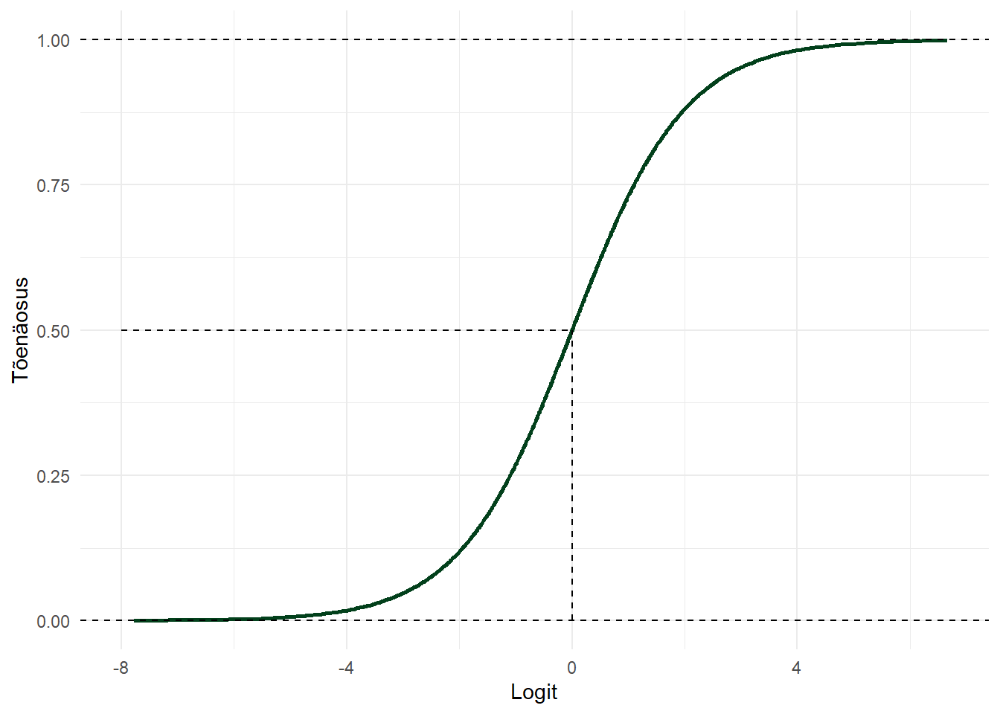

# (PART) Üldistatud lineaarsed mudelid {-} 

# Logistiline regressioon


Logistilise regressiooniga (logit-mudeliga) saame hinnata sõltumatute tunnuste mõju binaarsele sõltuvale tunnusele (töötav/töötu, käis valimas/ei käinud valimas, surnud/ei ole surnud). Teisisõnu, hindame tõenäosust mingi sündmuse toimumiseks lähtuvalt mingitest teistest tunnustest (näiteks kuidas haridus mõjutab hõives olemist).  Sõltuva tunnuse $y$ jaotus on määratletud kui sündmuse toimumise tõenäosus $P(Y=1)=\pi$.  

Tavalise regressioonimudel oli väljendatav kui $\bar{y}=\beta_0+\beta_p x_p$. Miks me ei võiks pidevtunnuselise $y$ keskmist asendada $\pi$'ga: $\bar{\pi}=\beta_0+\beta_k x_k$? Aga sellepärast, et tõenäosus on piiritletud $0$ ja $1$'ga, samas kui lineaarne funktsioon hõlmab kõiki reaalarvulisi väärtusi. Seega on ülimalt tõenäoline, et mingite $x$'i väärtuste puhul on prognoositav $y$ väärtus suurem kui $1$ või väiksem kui $0$. Lisaks tekivad probleemid jääkide struktuuriga (tavaline regressioon eeldab normaaljaotust) ja jääkide dispersiooniga (tavaline regressioon eeldab konstantset hajuvust).

<div class="figure">

<p class="caption">(\#fig:glm-1)Lineaarse regressiooni kasutamine binaarse sõltuva tunnusega</p>
</div>


## Šansid  
Kuidas me saaksime tõenäosuse skaala ($0 \dots1$) teisendada pidevaks skaalaks ($-\infty \dots \infty$)? Et saada lahti maksimaalsest väärtusest ($1$), on võimalik kasutada sündmuse toimumise tõenäosuse asemel sündmuse toimumise šanssi (*odds*). Šanssideks nimetatakse sündmuse toimumise ja mittetoimumise suhet:

$$\text{šansid}=\frac{p}{(1-p)}$$
kus $p$ on siis sündmuse toimumise tõenäosus.  

Näiteks kulli ja kirja viskamisel on kulli saamise šanss $\frac{0.5}{(1-0.5)}=1$. Šanss võtta kaardipakist ruutu on $\frac{0.25}{(1-0.25)}=\frac{1}{3}=0.33$. 

<div class="figure">

<p class="caption">(\#fig:odds)Šansside ja tõenäosuse suhe</p>
</div>

Šansid saab omakorda teisenda tagasi tõenäosuseks:

$$p=\frac{\text{šansid}}{1+\text{šansid}}$$

## Logit    
Kuid šansside puhul jääb tõenäosuse alumine piir ikkagi alles. Ka šansid on altpoolt piiratud (nad ei saa olla väiksemad kui $0$). Lahenduseks on võtta šansside logaritm. Saadud väärtust nimetatakse **logit**-iks (*log odds*):  

$$\text{logit}=\log \bigg(\frac{p}{(1-p)}\bigg)$$

<div class="figure">

<p class="caption">(\#fig:glm-3)Logit-i ja tõenäosuse suhe</p>
</div>

Kui me nüüd teisendame oma tõenäosuse logitiks, ehk siis teisendame 0 ja 1-ga piiratud väärtuse pidevaks tunnuseks, siis saame selle hindamiseks kasutada tuttavat lineaarse regressiooni loogikat. saadav regressiooniseos näeks välja selline:

<div class="figure">

<p class="caption">(\#fig:glm-2)Logistiline regressioon võrdluses lineaarse regressiooniga</p>
</div>

## Logit mudel 

Taoline mudel näeb välja selline:

$$\text{logit}(\pi_i)=\text{log} \left(\dfrac{\pi_i}{1-\pi_i}\right)=\beta_0+\beta_1 x_i$$  

Tihti on sama võrrand estitatud mõnel muul kujul. Näiteks kui võtame mõlemast poolest eksponendi, siis näeb võrrand välja nii:

$$\frac{\pi_i}{1-\pi_i}=e^{({\beta_0}+\beta_1 x_i)}$$
Või kui kasutame eelnevalt esitatud šanssidest tõenäosuste saamise valemit: 

$$\pi_i=Pr(Y_i=1|X_i=x_i)=\dfrac{e^{(\beta_0+\beta_1 x_i)}}{1+e^{(\beta_0+\beta_1 x_i)}}$$  

või siis ka nii:     

$$\pi_i=Pr(Y_i=1|X_i=x_i)=\frac{1}{1+e^{-\beta_0-\beta_1 x_i}}$$

## Mudeli tõlgendus
Tavalise regresioonimudeliga saime prognoosida $y$ väärtust mingite $x$ väärtuste korral (ja $y$ muutust, kui $x$ muutub ühe ühiku võrra). Sama kehtib ka logistilise regressiooni puhul. Kuid mida me siinjuures täpsemalt prognoosime? Tahaksime kindlasti prognoosida (uuritava sündmuse toimumise) tõenäosust. Kuid kuna me teisendasime tõenäosuse logititeks, siis tegelikult saame prognoosida hoopis logitit. Ja ka ühe ühikuline muutus $x$-is ei peegelda mitte $y$ tõenäosuse muutust, vaid logit($y$)-i muutust. Logiteid ei oska me (vähemalt esialgu) kuidagi tõenäosuslikult tõlgendada. Mida siis teha? 

Lahenduseks on võtta *logit*-i võrrandi mõlemast poolest eksponent 

$$exp(logit) = exp(\beta_0+\beta_1 x_i) \implies \frac{\pi_i}{1-\pi_i}=e^{({\beta_0}+\beta_1 x_i)}$$ 

Sellisel juhul saab $y$-t tõlgendada kui šansse ja $\beta$-t kui muutust šanssides (mitu korda $x$-i ühe ühiku muutudes $y$ šansid suurenevad või vähenevad). Seda šansside muutust väljendavat kordajat nimetatakse šansside suhteks.

### Šansside suhe
Šansid saime leida valemiga:  

$$\text{šansid}=\frac{p}{(1-p)}$$  
Valemist võime välja lugeda järgmist:  

1. Šansid on alati positiivsed  
1. Kui šansid on $1$, siis on sündmuse toimumise ja mittetoimumise tõenäosus võrdsed ($p=0.5$).  
1. Kui šansid on suuremad kui $1$, siis on sündmuse toimumise tõenäosus suurem kui mittetoimumise tõenäosus ($p>0.5$) ja vastupidi.  
Näiteks kui sündmuse toimumise tõenäosus on $0.8$, siis on šansid $\frac{0.8}{1-0.8}=\frac{0.8}{0.2}=4$. Seega sündmuse toimumise tõenäosus on $4$ korda suurem kui selle mittetoimumise tõenäosus. Kui sündmuse toimumise tõenäosus on $0.2$, siis on šansid $\frac{0.2}{1-0.2}=\frac{0.2}{0.8}=\frac{1}{4}=0.25$. Sündmuse toimumise tõenäosus on $4$ korda väiksem kui selle mittetoimumise tõenäosus.  

Vaatame näidet, kus hindame hääletamise tõenäosust ning abielu mõju sellele:

                 Hääletab   Ei hääleta
---------------  ---------  -----------
Abielus          0.75       0.25
Ei ole abielus   0.54       0.46

Abielus inimeste puhul on šanss hääletamiseks  $\frac{0,75}{0,25} = \frac{3}{1}= 3$ (iga mittehääletaja kohta on kolm hääletajat).  

Vallaliste puhul on šanss hääletamiseks  $\frac{0,54}{0,46} = 1,17$ (iga mittehääletaja kohta on $1,17$ hääletajat).  

Meid huvitab kuidas sõltumatu tunnuse muutus sündmuse toimumise šansse mõjutab, ehk kui palju muutuvad šansid kui sõltumatu tunnus muutub ühe ühiku võrra. Seda muutust väljendabki šansside suhe (*odds ratio* ehk OR)

$$OR=\frac{y \text{ šanss juhul kui } x \text{ väärtus muutub ühe ühiku võrra}}{y \text{ šanss juhul kui } x \text{ väärtus jääb samaks}}$$

Kui palju on abielus olijate šansid hääletamiseks suuremad kui vallalistel? Šansside suhe on $\frac{3}{1,17}=2,56$. Ehk siis abielus olijate šanss hääletada on kaks ja pool korda suurem. Abielu tunnuse ühe ühiku muutumisega muutuvad šansid $2,56$ korda ehk suurenevad $156\%$.

## Logistiline regressioon R-is

Võtame R-i näidisandmestiku `Titanic`, mis kirjeldab Titanicul hukkunute ja ellujäänute sugu, vanust ja reisijaklassi. Üritame hinnata kuidas ja kas need tunnused mõjutasid ellujäämist.  
GLMi mudeleid saab R'is defineerida `glm()` funktsiooniga. Selle loogika ja argumendid on sarnased `lm()` funktsiooni omadele. Peamiseks erinevuseks on see, et nüüd peame defineerima ka sõltuva tunnuse jaotuse ja linkfunktsiooni. See käib argumendiga `family`. Logistilise regressiooni jaoks peame defineerima `family = binomial(link = 'logit')` (sõltuva tunnuse jaotus on binoomjaotus ja linkfunktsioon on logit).  
Vaatame kõigepealt soo mõju:


```r
# Andmestik on algselt tabeli kujul.

# Saaksime seda ka sellisel kujul analüüsida,
# kuid mugavam ja selgem on, kui keerame ta
# nn tavalisele kujule. Kasutame selleks 
# paketi tidyr funktsiooni uncount()

titanic <- datasets::Titanic %>% 
  as.data.frame() %>% 
  tidyr::uncount(Freq)

# vaatame andmestiku esimesi ridu
head(titanic)
```

```
##   Class  Sex   Age Survived
## 1   3rd Male Child       No
## 2   3rd Male Child       No
## 3   3rd Male Child       No
## 4   3rd Male Child       No
## 5   3rd Male Child       No
## 6   3rd Male Child       No
```

```r
# Ellujäämise tunnus (Survived) on tekstiline. Muudame selle numbriliseks (0/1)
# või loogiliseks (TRUE/FALSE) tunnuseks

titanic$surv <- titanic$Survived == "Yes"

# Ja defineerime mudeli
mudel7 <- glm(surv~Sex, data = titanic, family = binomial())

# Saaksime ka lihtsamalt.
# I(Survived == "Yes") notatsiooniga saame tekstilise tunnuse 
# võrrandi sees loogilisek tunnuseks teisendada 
# glm(I(Survived == "Yes")~Sex, data = titanic, family = binomial())
#   
# Tulemus oleks sama

# Vaatme tulemusi
summary(mudel7)
```

```
## 
## Call:
## glm(formula = surv ~ Sex, family = binomial(), data = titanic)
## 
## Deviance Residuals: 
##     Min       1Q   Median       3Q      Max  
## -1.6226  -0.6903  -0.6903   0.7901   1.7613  
## 
## Coefficients:
##             Estimate Std. Error z value Pr(>|z|)    
## (Intercept)  -1.3128     0.0588  -22.32   <2e-16 ***
## SexFemale     2.3172     0.1196   19.38   <2e-16 ***
## ---
## Signif. codes:  0 '***' 0.001 '**' 0.01 '*' 0.05 '.' 0.1 ' ' 1
## 
## (Dispersion parameter for binomial family taken to be 1)
## 
##     Null deviance: 2769.5  on 2200  degrees of freedom
## Residual deviance: 2335.0  on 2199  degrees of freedom
## AIC: 2339
## 
## Number of Fisher Scoring iterations: 4
```

Väljund on väga sarnane `lm()` väljundile. Leiame seal regressioonikoefitsiendid, nende standardvead, z-väärtused ja z-testi *p*-väärtuse^[z-test puhul on tegemist t-testi analoogiga, mis ei lähtu mitte t-jaotusest, vaid normaaljaotusest. Tõlgendus on aga sama]. Kuid koefitsiendid on nüüd logititskaalal ja seepärast küllaltki raskesti tõlgendatavad. Saame siiski järeldada, et naiste tõenäosus ellu jääda oli suurem kui meestel (koefitsient on positiivne) ja meeste tõenäosus ellu jääda oli väiksem kui 0.5 (vabaliige, ehk meeste ellujäämistõenäose logit, on negatiivne). Mõnevõrra lihtsam on tõlgendada šansside suhet. Selleks peame koefitsientidest eksponendi võtma:


```r
exp(coef(mudel7))
```

```
## (Intercept)   SexFemale 
##   0.2690616  10.1469660
```

Vabaliiget tõlgendame kui referentsgrupi (antud juhul meeste) šansse ellu jääda. Seega mehe šanss Titanicul ellu jääda oli 0.26, ehk siis iga hukkunud mehe kohta jäi ellu 0.26 meest, või vastupidi $1 / 0.269 = 3.7$, iga ellujäänud mehe kohta hukkus 3.7 meest. Saame välja arvutada ka meeste ellujäämise tõenäosuse:

$$\pi=\frac{\text{šansid}}{1+\text{šansid}} = \frac{0.269}{1+0.269} = 0.21$$

Naiste puhul tõlgendame šansside suhet. Ehk kui palju muudab naiseksolemine võrreldes meestega ellujäämise šansse. Tuleb välja, et ligi 10 korda. Seega naiste šansid ellu jääda olid $10.147 \times 0.269 = 2.73$. Iga hukkunud naise kohta jäi 2.7 naist ellu. Naiste ellujäämise tõenäosus oli:

$$\pi=\frac{\text{šansid}}{1+\text{šansid}} = \frac{2.73}{1+2.73} = 0.73$$

Saame selle tõenäosuse ka otse välja arvutada, kui paneme koefitsiendid regressioonivõrrandisse (eelnevalt toodud valemi järgi):

$$\pi=\dfrac{e^{(\beta_0+\beta_1 x_i)}}{1+e^{(\beta_0+\beta_1 x_i)}} = \dfrac{e^{(-1.313+2.317 \times 1)}}{1+e^{(-1.313+2.317 \times 1)}} = 0.73$$

Vaatme ka, kuidas muudab ellujäämise tõenäosust lisaks soole vanus (*Age* on siin kategoriaalne tunnus kategooriatega *Child* ja *Adult*). Eeldame ka soo ja vanuse koosmõju (st kontrollime kas erinevas vanuses meeste ja naiste elujäämistõenäosused erinevad):


```r
mudel8 <- glm(surv~Sex*Age, data = titanic, family = binomial())
summary(mudel8)
```

```
## 
## Call:
## glm(formula = surv ~ Sex * Age, family = binomial(), data = titanic)
## 
## Deviance Residuals: 
##     Min       1Q   Median       3Q      Max  
## -1.6497  -0.6732  -0.6732   0.7699   1.7865  
## 
## Coefficients:
##                    Estimate Std. Error z value Pr(>|z|)    
## (Intercept)         -0.1881     0.2511  -0.749   0.4539    
## SexFemale            0.6870     0.3970   1.731   0.0835 .  
## AgeAdult            -1.1811     0.2584  -4.571 4.86e-06 ***
## SexFemale:AgeAdult   1.7465     0.4167   4.191 2.77e-05 ***
## ---
## Signif. codes:  0 '***' 0.001 '**' 0.01 '*' 0.05 '.' 0.1 ' ' 1
## 
## (Dispersion parameter for binomial family taken to be 1)
## 
##     Null deviance: 2769.5  on 2200  degrees of freedom
## Residual deviance: 2312.8  on 2197  degrees of freedom
## AIC: 2320.8
## 
## Number of Fisher Scoring iterations: 4
```

Täiskasvanuks olemine mõnevõrra langetas ellujäämise tõenäosust, kuid seda ainult meeste puhul (soo ja vanuse interaktsioon on positiivne). Tulemuste tõlgendamiseks võtame jälle koefitsientidest eksponendi:


```r
exp(coef(mudel8))
```

```
##        (Intercept)          SexFemale           AgeAdult SexFemale:AgeAdult 
##          0.8285714          1.9878296          0.3069458          5.7344228
```

Vabaliige kirjeldab ellujäämise šansse juhul kui sõltumatud tunnused on nullid. Ehk siis antud juhul ellujäämise šansse referentsgruppide kombinatsiooni puhul (noored mehed). Seega poiste ellujäämise tõenäosus oli:

$$\pi = \frac{0.83}{1+0.83} = 0.45$$
Tüdrukute (noorte naiste) ellujäämise šansid olid ca kaks korda (1.99) suuremad kui poistel (tõenäosus $\frac{0.83\times1.99}{1+(0.83\times1.99)} = 0.62$). Täiskasvanud meeste šansid olid $0.3\times0.83 = 0.24$  ja seega tõenäosus $\frac{0.24}{1+0.24} = 0.19$. Täiskasvanud naiste puhul peame appi võtma koosmõju koefitsiendi. Täiskavanud naiste šansid moodustuvad $0.83\times1.99\times0.3\times5.7 = 2.8$. Tõenäosusena teeb see $0.74$. 

Näeme, et koosmõju on antud mudeli puhul vägagi sisukas. Meeste puhul täiskavanuks olemine langetas ellujäämise šansse, naiste puhul aga tõstis.


::: {.teie-kord}
Ülesanne!  

* Piaaci andmestikus on tunnus *staatus3*. Võtke see aluseks ja tehke uus loogiline (TRUE/FALSE) tunnus *hoiv*, mis kirjeldaks kas inimene on või ei ole hõivatud.  
* Hinneke logistilise regressiooniga, kas hõivatus on mõjutatud inimese haridusest ja vanusest. 
:::


## Mudeli kvaliteet

Kuidas hinnata mudeli kvaliteeti? Meile ei anta ei jääkide standardviga ega determinatsioonikordajat. Küll on aga väljunis toodud *Null deviance* ja *Residual deviance*. *Deviance* kirjeldab mudeli hälvet ehk seda kui hästi (või õigem oleks öelda kui halvasti) meie mudel andmetega sobitub, ehk kui suur on erinevus meie andmete ja mudeli prognoosi vahel. Mida väiksem on *deviance*, seda väiksem on mudeli viga ehk seda täpsemini sobitub mudel andmetega. 

*Null deviance* kirjeldab küllastunud mudeli hälbimust nullmudelist ning *Residual deviance* ehk jääkhälbimus defineeritud mudeli hälbimust küllastunud mudelist. Nullmudel on ainult vabaliikmega mudel (ehk mudel kus ei ole ühtegi selgitavat tunnust peale $Y$-i keskmise) ja küllastunud mudel on selline, kus on sama palju parameetreid kui andmepunkte (ehk mudel millega on kogu $Y$-i varieeruvus ära kirjeldatud).

### Mudeli sobivus

Mudeli sobivust andmetega (*goodness of fit*) saame hinnata jääkhälbimuse (*Residual deviance*) näitaja abil. Jääkhälbimus näitab kui palju mudeliga hinnatud $Y$ väärtused empiirilistest $Y$ väärtustest erinevad (analoogne asi lineaarse regressiooni puhul oli *residual sum of squares*). Jääkhälbimuse abil saame võrrelda kui palju meie sobitatud mudel erineb küllastunud (*saturated*) mudelist, st mudelist mis sobituks täiel määral andmetega ehk kus jääkälbimus oleks $0$. Jääkhälbimus näitabki sisuliselt meie mudeli ja küllastunud mudeli erinevust.  Juhul kui mudel on andmetega "sobiv", siis peaks jääkhälbimus olema võimalikult väike. Seda, kas see on piisavalt väike, saame testida hi-ruut testiga (arvestades mudeli  vabadusasteid (*degrees of freedom*).


```r
res_dev <- deviance(mudel8)
res_df <- df.residual(mudel8)
pchisq(res_dev, res_df, lower.tail = F)
```

```
## [1] 0.04209986
```

`pchisq()` funktsiooniga saame testitulemusele ka *p*-väärtuse. Näeme, et see on väiksem kui $0.05$, mis tähendab, et meie mudel erineb küllastunud mudelist olulisel määra ja seega ei sobitu andmetega väga hästi (siin tahame, et *p*-väärtus oleks võimalikult suur, st meie mudeli ja küllastunud mudeli vahel ei oleks statistilist erinevust). Reaaleluliste ja suurte andmetega ongi tegelikult väga keeruline hästi sobituvat mudelit leida. Seega üldjuhul me lihtsalt lepime, et meie mudel ei ole täiuslik ja jätame selle testi tähelepanuta.

Üks kasulik nipp on ka võrrelda jääkhälbimuse väärtust ja tema vabadusastmeid. Kui *Residual deviance* on oluliselt suurem kui tema *degrees of freedom*, siis annab see jällegi tunnistust halvast mudelist.

### Mudeli statistiline olulisus

Näeme, et meie sisuka mudeli hälve küllastunud mudelist (*Residual deviance*) on võrreldes nullmudeli erinevusega küllastunud mudelist (*Null deviance*) tunduvalt väiksem^[Peame siin arvestama ka erinevust vabadusastmetes. Kuigi sisuka mudeli hälve on väiksem, on selles ka vähem vabadusastmeid]. See tähendab, et tänu sõltumatutele tunnustele  suudame me sõltuva tunnuse variatsiooni seletada paremini kui ainult keskmise abil. Aga kas mudeli hälve läks väiksemaks piisavalt paju, et me saaksime selle kohta ka statistiliselt olulisi järeldusi teha? Ehk siis kas me saame järeldada, et sõltumatud tunnused seletavad statistiliselt olulisel määral sõltuva tunnuse variatsiooni ja meie mudel on parem kui lihtsalt sõltuva tunnuse keskmine? Saame seda testida  *likelihood ratio* testiga. 

Arvutame esmalt *Null deviance* ja *Residual deviance* erinevuse. Seeläbi saame enda defineeritud mudeli hälbe nullmudelist:


```r
dev_vahe <- mudel8$null.deviance - mudel8$deviance
dev_vahe
```

```
## [1] 456.6809
```

Ja ka vabadusasteme erinevuse:

```r
df_vahe <- mudel8$df.null-mudel8$df.residual
df_vahe
```

```
## [1] 3
```

Hälvete vahe on jaotunud hii-ruut jaotuse alusel, seega saame hii-ruut jaotuse põhjal määrata selle olulisust. Arvutame hälvete vahele olulisustõenäosuse. Kasutame selleks hii-ruut jaotuse funktsiooni `pchisq()`, mis tahab sisendina teatstatisikut (hälvete vahe) ja vabadusastemeid (vabadusastemete vahe). Samuti peame ütlema, et meid huvitab jaotuse parempoolse saba alla jääv tõenäosus.


```r
pchisq(dev_vahe, df_vahe, lower.tail = F)
```

```
## [1] 1.163316e-98
```

Võime kasutada ka `anova()` funktsiooni, kus võrdleme kahte mudelt:


```r
# kasutame update() funktsiooni, millega
# uuendame oma mudelit nii, et selle prediktoriks
# oleks ainult vabaliige (tähistatud ~1)
anova(mudel8,
      update(mudel8, ~1),    
      test="Chisq")
```

```
## Analysis of Deviance Table
## 
## Model 1: surv ~ Sex * Age
## Model 2: surv ~ 1
##   Resid. Df Resid. Dev Df Deviance  Pr(>Chi)    
## 1      2197     2312.8                          
## 2      2200     2769.5 -3  -456.68 < 2.2e-16 ***
## ---
## Signif. codes:  0 '***' 0.001 '**' 0.01 '*' 0.05 '.' 0.1 ' ' 1
```

Või kasutame `lmtest` paketi `lrtest()` funtsiooni:


```r
library(lmtest)
lrtest(mudel8)
```

```
## Likelihood ratio test
## 
## Model 1: surv ~ Sex * Age
## Model 2: surv ~ 1
##   #Df  LogLik Df  Chisq Pr(>Chisq)    
## 1   4 -1156.4                         
## 2   1 -1384.7 -3 456.68  < 2.2e-16 ***
## ---
## Signif. codes:  0 '***' 0.001 '**' 0.01 '*' 0.05 '.' 0.1 ' ' 1
```

Kõikide eelnevate testide puhul huvitab meid eelkõige *p* väärtus. Kui see on piisavalt väike (näiteks väiksem kui $0,05$), siis saame järeldada, et meie testitavad mudelid on piisavalt erinevad ehk siis sõltumatute tunnuste lisamine vähendas *deviance*'i olulisel määral. 

Eelnevas näites on *p*- väärtus on väga väike, seega meie mudel on võrreldes nullmudeliga oluliselt parem.  

Sama loogikaga saame ka testida kas uue sõltumatu tunnuse lisamine teeb mudeli oluliselt paremaks.

Lisaks saame `anova()` funktsiooniga testida kui palju iga sõltumatu tunnus mudelit paremaks tegi ja kas see paranemine oli statistiliselt oluline:


```r
anova(mudel8, test = "Chisq")
```

```
## Analysis of Deviance Table
## 
## Model: binomial, link: logit
## 
## Response: surv
## 
## Terms added sequentially (first to last)
## 
## 
##         Df Deviance Resid. Df Resid. Dev  Pr(>Chi)    
## NULL                     2200     2769.5              
## Sex      1   434.47      2199     2335.0 < 2.2e-16 ***
## Age      1     5.89      2198     2329.1    0.0152 *  
## Sex:Age  1    16.32      2197     2312.8 5.352e-05 ***
## ---
## Signif. codes:  0 '***' 0.001 '**' 0.01 '*' 0.05 '.' 0.1 ' ' 1
```


### Pseudo-$R^2$

Kui tavalise regressiooni puhul hindasime mudeli sobivust andmetega determinatsioonikordaja ($R^2$) abil, siis GLM-ide puhul vastavat näitajat ei ole. Küll on aga nn pseudo-$R^2$ statistikud, mida võib analoogsel viisil kasutada (need ei näita küll päris sama asja, kuid tõlgendus on sama). Üheks selliseks on näiteks Mcfadden'i $R^2$. See jääb 0 ja 1 vahele ning mida suurem selle väärtus on, seda parem on mudeli *fit*. Üldiselt ei küündi see näitaja kunagi päris 1-ni ja nii loetakse näiteks väärtust 0.2-0.4 juba väga heaks *fit*-iks.


```r
library(pscl)
titanic$surv <- titanic$Survived == "Yes"
mudel_r2 <- glm(surv~Sex*Age, data = titanic, family = binomial())
pR2(mudel_r2)
```

```
## fitting null model for pseudo-r2
```

```
##           llh       llhNull            G2      McFadden          r2ML 
## -1156.3879160 -1384.7283644   456.6808969     0.1648991     0.1873769 
##          r2CU 
##     0.2617525
```


## Predict

Sageli tahame oma mudeli alusel prognoosida mingitele kindlatele sõltumatute tunnuste väärtustele sõltuva tunnuse hinnanguid. Saame loomulikult need sõltumatute tunnuste väärtused regressioonivõrrandisse sisse panna ja hinnangu käsitsi välja arvutada. Aga on ka mugavam variant. Nimelt `predict()` funktsioon^[`predict()` funktsiooni saab kasutada ka tavalise regressiooni puhul].  

`predict()` vajab sisendiks mudelit ning referentsandmestikku vajalike sõltumatute tunnuste kategooriate kombinatsioonidega. Referentsandmestiku saame valmis teha käsitsi või kasutada näiteks `expand.grid()` funktsiooni.

Tahame teada `titanic` andmestiku põhjal täiskasvanud meeste tõenäosust ellu jääda:


```r
# Teeme referentsandmestiku
ref_data <- data.frame(Sex = "Male", Age = "Adult")

# Kasutame predict() funktsiooni ja lisame referentsandmestikule
# pred tunnuse, millesse kirjutame prognoosi
# Kuna tegemist on logit mudeliga, siis defaultis
# prognoosib predict() logiteid. Kui tahame teada
# tõenäosusi, siis peame määrama type = 'response'

ref_data$pred <- predict(mudel8, newdata = ref_data, type = "response")
ref_data
```

```
##    Sex   Age      pred
## 1 Male Adult 0.2027594
```

Kui tahame prognoosi rohkematele kategooriate kombinatsioonidele, saame kasutada `expand.grid()` funktsiooni:


```r
# Teeme kõigepealt uue andmestiku, kus on sees kõik 
# tunnuse ja väärtused, mille kohta predictioni tahame
ndata <- expand.grid(Sex = c("Male", "Female"), Age = c("Adult", "Child"))

# Lisame andmestikule predictioni
ndata$pred <- predict(mudel8, newdata = ndata, type = "response")

ndata
```

```
##      Sex   Age      pred
## 1   Male Adult 0.2027594
## 2 Female Adult 0.7435294
## 3   Male Child 0.4531250
## 4 Female Child 0.6222222
```

Nüüd saame oma tulemused näiteks joonisele panna:


```r
ggplot(ndata, aes(x = Sex, 
                  y = pred, 
                  color = Age))+
  geom_point(position = position_dodge(width = 0.5), size = 3)+
  labs(y = "Survival probability")+
  scale_y_continuous(labels = scales::percent)+
  scale_color_manual(values = c("#972D15", "#02401B"))+
  theme_minimal()
```


### Broom

Prognoositud väärtused kõikidele meie andmetes olevatele vaatlustele saame mõnevõrra lihtsamalt kätte paketi *broom* abil. *broom*i funktsioon `augment()` loob mudeli objektist andmestiku, milles on lisaks algsetele tunnusetele ka kõikidele vaatlustele prognoositud väärtudsed (*.fitted*), prognoositud väärtuste standardvead (*.se.fit*), jäägid (*.resid*) jne. 


```r
library(broom)
# Kasutame broomi funktsiooni augment 
mudel_fit <- augment(mudel8, type.predict = "response")
head(mudel_fit)
```

```
## # A tibble: 6 x 9
##   surv  Sex   Age   .fitted .resid .std.resid   .hat .sigma .cooksd
##   <lgl> <fct> <fct>   <dbl>  <dbl>      <dbl>  <dbl>  <dbl>   <dbl>
## 1 FALSE Male  Child   0.453  -1.10      -1.11 0.0156   1.03 0.00334
## 2 FALSE Male  Child   0.453  -1.10      -1.11 0.0156   1.03 0.00334
## 3 FALSE Male  Child   0.453  -1.10      -1.11 0.0156   1.03 0.00334
## 4 FALSE Male  Child   0.453  -1.10      -1.11 0.0156   1.03 0.00334
## 5 FALSE Male  Child   0.453  -1.10      -1.11 0.0156   1.03 0.00334
## 6 FALSE Male  Child   0.453  -1.10      -1.11 0.0156   1.03 0.00334
```


## Marginaalsed efektid

Marginaalsed efeketid (*marginal effects*) kirjeldavad sõltuva tunnuse muutust kui mingi sõltumatu tunnus muutub ühe ühiku võrra. Seega võimaldavad need logistilise regressiooni puhul kasutada lineaarse regressiooniga analoogset tõlgendamisloogikat. Marginaalsete efektide arvutamiseks on erinevaid viise. Üheks levinuimaks meetodiks on nn *Keskmised marginaalsed efektid* (*Average Marginal Effects* ehk AME).  

Oletame, et tahame Titanicu andmestiku alusel hinnata kui palju muutub inimese ellujäämise tõenäosus sõltuvalt tema soost. Logistilise regressioonimudeli abil saame teada vastava šansside suhte. Meid aga huvitaks tõenäosus. Me saame ka tõenäosuse välja arvutada (näiteks `predict()` funktsiooniga), kuid selleks peame defineerima mingi konkreetse grupi, kellele me regressioonivõrrandi abil tõenäosust prognoosime (näiteks saame võrrelda esimese klassi kajutis elvate täiskasvanud meeste ellujäämise tõenäosust esimese klassi kajutis elavate täsikasvanud naiste ellujäämise tõenäosusega). Meid aga huvitaks lihtsalt keskmine tõenäosuse erinevus meeste ja naiste vahel. Kuidas seda saavutada?  

Marginaalsete efektide (täpsemalt selle AME variandi) leidmiseks prognoositakse kõikidele andmestiku vaatlustele mudelipõhine hinnang kahel juhul - esimesel juhul nii, et kõikide vaatluste puhul määratakse nende sooks mees ja teisel juhul nii, et kõikide vaatluste puhul määratakse nende sooks naine. Kõik muud tunnused on mõlemal puhul nii nagu nad algselt olid. Keskmine marginaalne efekt ongi keskmine kahe prognoositud hinnangu vahe.


```r
library(margins)
summary(margins(mudel8))
```

```
##     factor     AME     SE       z      p   lower   upper
##   AgeAdult -0.1710 0.0521 -3.2827 0.0010 -0.2731 -0.0689
##  SexFemale  0.5224 0.0227 23.0123 0.0000  0.4779  0.5669
```

Saame järeldada, et täiskasvanute tõenäosus ellu jääda oli $17\%$ väiksem kui lastel ning naiste tõenäosus ellu jääda oli $52\%$ kõrgem kui meestel.


## Prognoosi täpsus

*Confusion matrix*'i (segaduse maatriks?) abiga saame hinnata oma prognoosi täpsust. Võrdleme tegelikke ja hinnatuid väärtusi. Kasutame jälle `predict()` funktsiooni ning prognoosime seekord kõikidele titanic andmestiku vaatlustele mudelipõhised hinnangud. Seejärel võrdleme neid hinnanguid vaatluste tegelike väärtustega:


```r
# Anname table() funktsioonile ette kaks loogilist vektorit.
# Kui me predict funktsioonile newdata argumeti ei anna,
# siis võtab ta automaatselt mudeli objektist kogu andmestiku
# ja prognoosib hinnangu igale vaatlusele. Kuna prognoos on 
# tõenäosusskaalal, siis teeme selle loogiliseks vektoriks nii,
# et kõik üle 0.5 tõenäosused oleksd T ja väiksemad F
vaadeldud <- titanic$Survived == "Yes"
prognoos <- predict(mudel8, type = "response")> 0.5
table(vaadeldud, prognoos)
```

```
##          prognoos
## vaadeldud FALSE TRUE
##     FALSE  1364  126
##     TRUE    367  344
```

Saadud maatriksist näeme, et prognoosisime oma mudeliga õigesti $1364 + 344 = 1708$ juhul ning valesti $367+126 = 493$ juhul, ehk siis meie mudeli **täpsus** (*accuracy*) on $\frac{1364 + 344}{1364 + 344 + 367+126} = 0.776 = 78\%$.  

Maatriksist saame välja lugeda ka prognoosi **tundlikkuse** (*sensitivity*) ja **spetsiifilisuse** (*specificity*).

**Tundlikkus** väljendab õigesti prognoositud positiivsete väärtuste osakaalu kõikidest positiivsetest väärtustest
$$\text{tundlikkus} = \frac{\text{õige positiivne}}{\text{õige positiivne} + \text{vale negatiivne}} = \frac{344}{(344+367)} = 0.48$$
**Spetsiifilisus** omakorda väljendab õigesti prognoositud negatiivsete väärtuste osakaalu kõikidest negatiivsetest väärtustest

$$\text{spetsiifilisus} = \frac{\text{õige negatiivne}}{\text{õige negatiivne} + \text{vale positiivne}} = \frac{1364}{(1364+126)} = 0.92$$

Saame need arvutused teha ka *caret* paketi ja `confusionMatrix()` funktsiooniga.


```r
library(caret)
# confusionMatrix vajab sisendiuna faktoreid, 
# positive = TRUE arguimendiga ütleme, et ellujäämine oli positiivne sündmus
confusionMatrix(data = as.factor(prognoos), 
                reference = as.factor(vaadeldud), positive = 'TRUE')
```

```
## Confusion Matrix and Statistics
## 
##           Reference
## Prediction FALSE TRUE
##      FALSE  1364  367
##      TRUE    126  344
##                                          
##                Accuracy : 0.776          
##                  95% CI : (0.758, 0.7933)
##     No Information Rate : 0.677          
##     P-Value [Acc > NIR] : < 2.2e-16      
##                                          
##                   Kappa : 0.4381         
##                                          
##  Mcnemar's Test P-Value : < 2.2e-16      
##                                          
##             Sensitivity : 0.4838         
##             Specificity : 0.9154         
##          Pos Pred Value : 0.7319         
##          Neg Pred Value : 0.7880         
##              Prevalence : 0.3230         
##          Detection Rate : 0.1563         
##    Detection Prevalence : 0.2135         
##       Balanced Accuracy : 0.6996         
##                                          
##        'Positive' Class : TRUE           
## 
```


Nii mudeli täpsus, tundlikkus, kui ka spetsiifilisus lähtusid eeldusest, et me klassifitseerisime vaatlused positiivseteks või negatiivseteks lähtuvalt sellest kas nende prognoositud tõenäosus oli suurem või väiksem kui $0.5$ (nn *treshold* või *cutoff value*). Mida suurem on see *cutoff*, seda rohkem õigeid positiivseid väärtusi saame prognoosida. Kuid samas, seda vähem saame prognoosida õigeid negatiivseid väärtusi. Ehk siis tundlikkuse ja spetsiifilisuse vahel on pöördvõrdeline seos. Mida suurem on üks, seda väiksem peab teine olema ja vastupidi. Seda seost saame vaadelda ROCi (*receiver operating characteristics*) graafiku abil.


```r
library(ROCit)
library(broom)
# Kasutame broomi funktsiooni augment 
mudel_fit <- augment(mudel8, type.predict = "response")
roc_obj <- rocit(score = mudel_fit$.fitted, class=mudel_fit$surv)
plot(roc_obj)
```


Mida suurem on pind graafiku kurvi all, seda parema mudeliga meil tegemist on (seda täpsemini võimaldab mudel prognoosida). Seda kurvi alust pindala suurust kasutataksegi prognoosi täpsuse hindamiseks. Vastavat statistikut kutsustaksegi kurvialuseks pindalaks (AUC ehk *area under the curve*). Mida lähemal AUC $1$'le on, seda parema prognoosivõimega mudeliga meil tegemist on.


```r
summary(roc_obj)
```

```
##                             
##  Method used: empirical     
##  Number of positive(s): 711 
##  Number of negative(s): 1490
##  Area under curve: 0.7133
```


