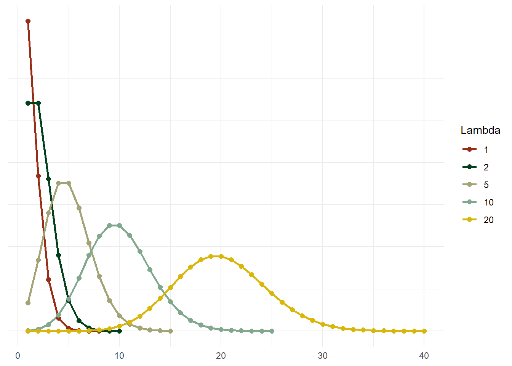
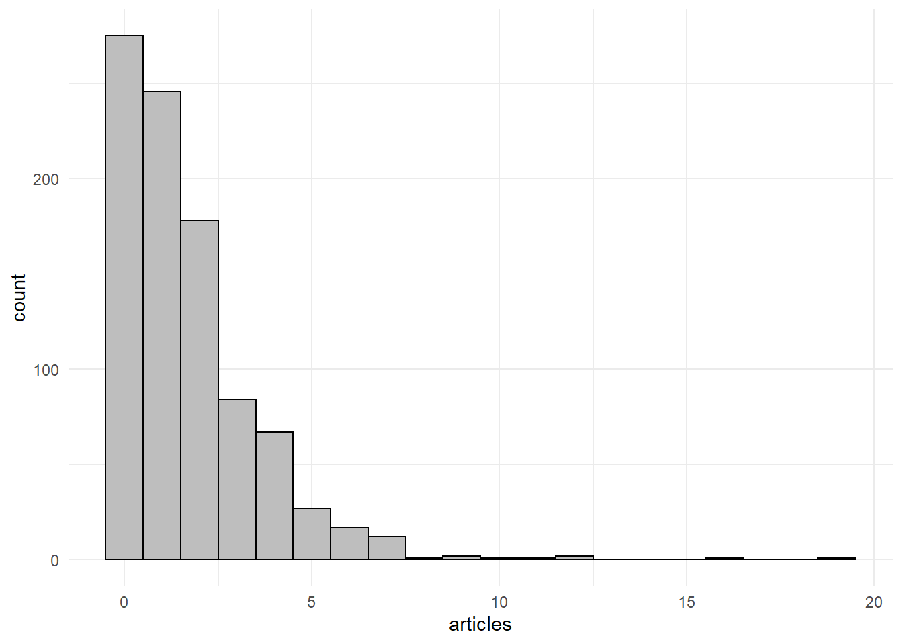
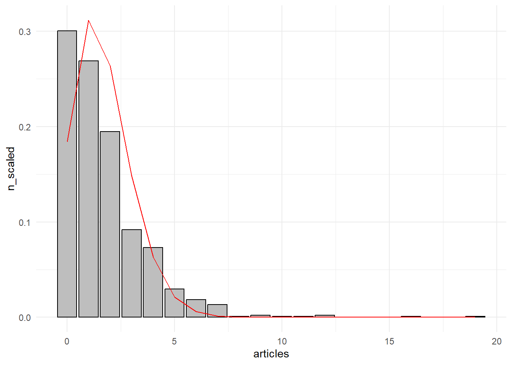
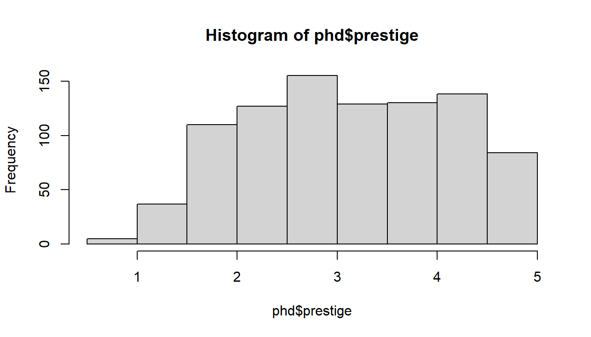
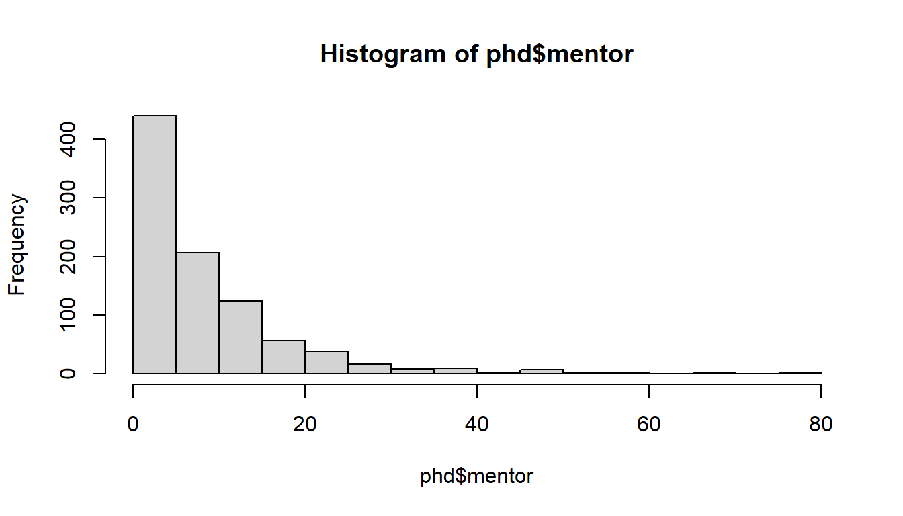
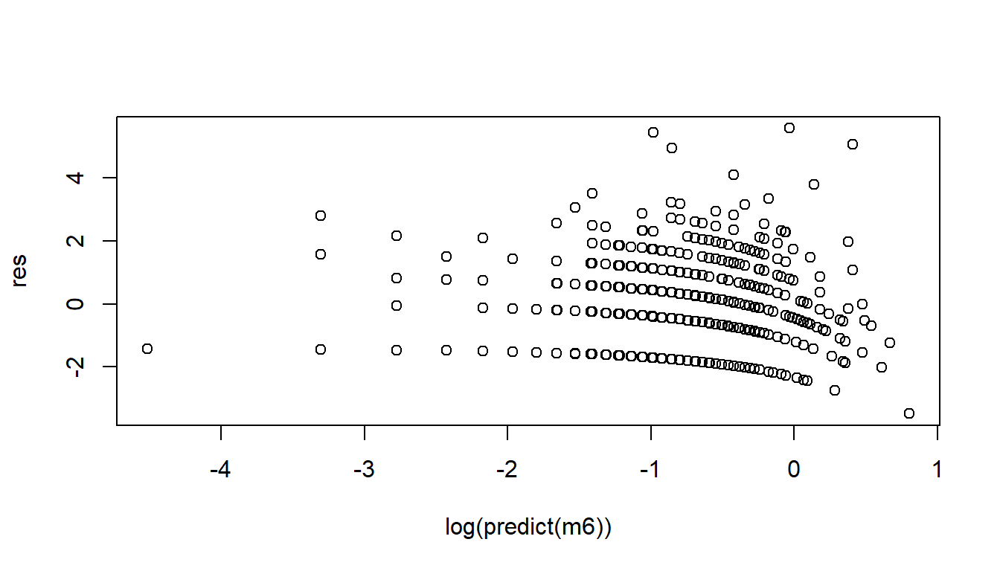
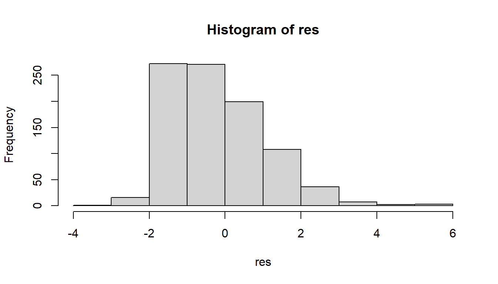

# Poissoni regressioon

Poissoni regressioon kuulub üldistatud lineaarsete mudelite (GLM) raamistikku ja sellega saame hinnata sõltumatute tunnuste mõju mingile loendavale (_count_) sõltuvale tunnusele (mitu inimest on kursusel, mitu inimest on poejärjekorras, mitu last on peres jne)^[Ka kategoriaalsetest tunnustest moodustatud risttabelite sagedused on loendilised väärtused. Taoliste risttabelite sageduste baasil moodustatud mudeleid kutsutakse log-lineaarseteks mudeliteks. Lisaks loenditele kasutatakse Poissoni regressiooni ka määrade (*rates*) mudeldamiseks, kuna määrasid võib käsitleda kui standardiseeritud loendeid. Siinkohal me taolisi mudeleid lähemalt ei käsitle, aga olgu see lihtsalt ära mainitud.].

Sarnaselt logistilise regressiooniga (ja isegi õigustatumalt) tekib küsimus, et miks me ei saa taoliste tunnuste korral kasutada tavalist lineaarset regressiooni? Loend on ju suhteliselt sarnane tavalisele arvtunnusele. Välja arvatud asjaolu, et nii nagu tõenäosus logistilise regressiooni puhul, ei saa ka loend olla negatiivne. Kui me modelleeriksime loendi tunnust tavalise lineaarse regressiooniga, siis võib vabalt juhtuda, et mingite sõltumatute tunnuste väärtuste korral oleks prognoositav sõltuv tunnus väiksem kui 0. See aga ei ole loendilise tunnuse puhul realistlik. Lisaks, nii nagu ka logistilise regressiooni ja binaarsete sõltuvate tunnuste puhul, tekivad probleemid jääkide struktuuriga (tavaline regressioon eeldab normaaljaotust) ja jääkide dispersiooniga (tavaline regressioon eeldab konstantset hajuvust)^[Loendiline tunnus $Y$ järgib Poissoni jaotust, mille puhul $E(Y)=Var(Y)=\lambda$, kus $\lambda$ on nn keskmine loend (keskmine kursuse suurus, järjekorra pikkus, laste arv). Seega Poissoni jaotusega tunnuse puhul peaks keskmine ja dispersioon võrdsed olema ning suurem keskmine tähendab ka suuremat dispersioon.].

<div class="figure">

<p class="caption">(\#fig:pois-dist)Poissoni jaotus erinevate keskmiste loendusväärtuste (Lambda) korral</p>
</div>

Logistilise regressiooni puhul saime tõenäosuse ülemisest piirist lahti seeläbi, et teisendasime tõenäosused šanssideks ning alumise piiri seeläbi, et võtsime šanssidest logaritmid. Loendilise tunnuse puhul meil tunnuse ülemise piiriga probleemi ei ole. Loend võib potentsiaalselt olla lõputu. Alumise piiri puhul saame aga kasutada sedasama logit mudelitest tuttavat logaritmimise nippi. Kui $Y$ on meie hinnatav loendiline sõltuv tunnus ja $x$ seda selgitav sõltumatu tunnus, siis Poissoni regressioonimudel on väljendatav järgmiselt^[$log(Y_i)$ ei ole siin sama mis lineaarse regressiooni puhul log-transformeeritud tunnus (kui me kasutame analüüsis eelnevalt logaritmitud sõltuvat tunnust). Teine ja sellest aspektist võib-olla selgem notatsioon oleks $log(E(Y))=\beta_0+\beta_1 x_i$, millest nähtub, et me peame logaritmima $Y$ oodatavat väärtust (_expected value_) ehk $Y$ keskmist. Keskmine logaritmitud $Y$ ja logaritm keskmisest $Y$-ist ei ole aga samad asjad (võite järgi proovida: `mean(log(c(1,2,3,4)))` vs `log(mean(c(1,2,3,4)))`).]:

$$log(Y_i)=\beta_0+\beta_1 x_i$$
kui me võtame mõlemast võrrandi pooles eksponendi, saame sama asja väljendada ka nii:

$$Y_i = e^{\beta_0+\beta_1 x_i}$$

Eeldame siin, et $Y_i$ järgib Poissoni jaotust. GLM'i sõnavara kasutades ütleme, et mudeli juhuslik komponent (ehk siis sõltuv tunnus) on Poissoni jaotusega ning linkfunktsioonina (funktsiooon, mille abil sõltuva ja sõltumatute tunnuste vaheline mittelineaarne seos muudetakse lineaarseks seoseks) kasutame log-funktsiooni. 

Poissoni jaotuse kuju sõltub tunnuse keskmisest (võrdluseks, normaaljaotuse kuju sõltub tunnuse keskmisest ja standardhälbest). Mida suurem on keskmine, seda enam sarnaneb Poissoni jaotus normaaljaotusele (vt joonis 1). Seega suurte loendite puhul saaksime põhimõtteliselt ka tavalist lineaarset regressiooni kasutada (kuigi negatiivsete väärtuste probleem jääb ka sel juhul). Üldiselt on mõistlik Poissoni regressiooni kasutada siis, kui loendite maksimaalsed väärtused ei ole väga suured ja tunnus on eripäraselt Poissoni jaotuse kujuga. Kui meil on tegemist suuremate väärtustega loendiga (näiteks ülikoolide tudengite arvud), siis saame tunnuse näiteks mingi arvuga läbi jagada.  

Loendilise tunnuse puhul tuleb tihti ette olukordi, kus tunnuses on palju nulle. Näiteks tunnus, mis kirjeldab bakalaureusetudengite laste arvu. Põhimõtteliselt on muidugi tegemist loendilise tunnusega, aga kuna suuremal osal tudengitest veel ei ole lapsi, siis enamik vaatlusi on paratamatult nullid. Sellise tunnuse jaotus ei vasta väga hästi Poissoni jaotusele ja selle kasutamine Poissoni regressioonimudeliga ei anna tõenäoliselt väga head tulemust^[Paljude nullidega tunnuse puhul oleks mõistlikum kasutada näiteks _zero-inflated Poisson_'i regressiooni (`zeroinfl()` funktsioon *pscl* paketis) või _negative binomial_ regressiooni (`glm.nb()` funktsioon *MASS* paketis)]. 

## Mudeli tõlgendus
Kuidas me neid regressioonimudeli $\beta_0$ ja $\beta_1$ koefitsiente tõlgendama peaksime? Lineaarse regressiooni puhul oli asi lihtne: vabaliige ($\beta_0$) oli tõlgendatav $Y$ väärtusena kui $x$ on $0$ ja regressioonikoefitsient ($\beta_1$) näitas $Y$ muutust kui $x$ muutub ühe ühiku võrra. Logistilise regressiooni puhul pidime aga esmalt koefitsientidest eksponendi võtma ja saime neid seejärel tõlgendada šansside ja šansside suhetena. Mis siis sekord?

Kuna meil on jälle tegemist logaritmidega, siis koefitsientide otsene (lineaarse regressiooni moodi) tõlgendamine on keeruline. Mõistlikum on koefitsientidest jällegi eksponent võtta, misjärel saame vabaliiget tõlgendada tavapärasel moel ($Y$ väärtus kui $x$ on $0$) ja regressioonikoefitsienti kui $Y$-i multiplikatiivset muutust kui $x$ muutub ühe ühiku võrra. Ehk kui $\beta_1$ väärtus on näiteks 0.25, siis tema eksponent on $e^{0.25} = exp(0.25) = 1.28$ ja saame järeldada, et kui $x$ kasvab ühe ühiku võrra, siis $Y$ kasvab $1.28$ korda. Teisisõnu, $Y$ kasvab $28\%$. Või kui $\beta_1$ väärtus on $-0.5$, siis tema eksponent on $e^{-0.5} = exp(-0.5) = 0.6$ ja saame järeldada, et kui $x$ kasvab ühe ühiku võrra, siis $Y$ kasvab $0.6$ korda (ehk siis tegelikult kahaneb). Kui $\beta = 0$, siis $e^{0} = 1$ ehk multiplikatiivne efekt on $1$ ($Y\times1$) ja $Y$ $x$-i kasvades või kahanedes ei muutu. Kui $\beta < 0$, siis $Y$ $x$-i kasvades väheneb, kui $\beta > 0$, siis $Y$ $x$-i kasvades kasvab.

## Poissoni regressiooni eeldused

- Sõltuv tunnus $Y$ peaks enam-vähem vastama Poissoni jaotusele (st olema loendiline tunnus).
- Vaatlused peavad olema üksteisest sõltumatud (st kogu vaatluste vaheline seos peaks olema kirjeldatud mudeli sõltumatute tunnuste poolt).
- Dispersioon (*variance*) peaks olema võrdne keskmisega. Juhul kui see eeldus ei ole täidetud, ja tihti juhtub, et ei ole, on meil tegemist nn üledispersiooniga (*overdispersion*). Sellisel juhul tuleks Poissoni mudeli asemel kasutada nn _quasipoisson_'i mudelit.
- Sõltuva tunnuse ja sõltumatute prediktorite seos peaks läbi linkfunktsiooni olema lineaarne.


## Mudeli hindamine R-is

### Andmete kirjeldus ja ettevalmistus

Kasutame näitena _PhDPublications_ andmestikku^[Long, J.S. (1997). The Origin of Sex Differences in Science. Social Forces, 68, 1297--1315.] paketist _AER_. Andmestikus on loendatud biokeemia doktorantide publikatsioonide arv (tunnus _atricles_) kolme aasta jooksul. Sõltumatute tunnustena on kasutada: 

- _gender_,
- _married_ - kas doktorant oli abielus, 
- _kids_ - mitu last doktorandil oli, 
- _prestige_ - kooli maine skoor) ja 
- _mentor_  - juhendaja publikatsioonide arv.


```r
# Kui pakett ei ole installitud, 
# tuleb seda teha käsuga: install.packages("AER")

# Loeme paketi sisse
library(AER)
# Võtame andmestiku
data(PhDPublications)
# Paneme andmestikule lihtsama nime
phd <- PhDPublications
```


Vaatame artiklite tunnust lähemalt:


```r
ggplot(phd)+
  geom_histogram(aes(x = articles), 
                 binwidth = 1, 
                 fill = 'grey', 
                 color = 'black')+
  theme_minimal()
```



Ilmselgelt on tegemist loendilise tunnusega. Samas päris Poissoni jaotusega tegemist vist siiski ei ole, kuna tundub, et nulle on selleks natukene liiga palju. ggploti abil saame joonisele panna ka tunnust iseloomustava teoreetilise Poissoni jaotuse (lähtuvalt tunnuse keskmisest ehk $\lambda$ parameetrist). Vaatame kuidas see võrreldes reaalse jaotusega välja näeb:


```r
# Poissoni jaotuse parameetrina on meil vaja keskmist
keskmine <- mean(phd$articles)
phd %>% 
  # standardiseerime  artiklite arvu, 
  # et saaksime seda jaotusega võrrelda
  group_by(articles) %>% 
  summarise(n = n()) %>% 
  mutate(n_scaled = n/sum(n)) %>% 
ggplot(aes(x = articles, y = n_scaled))+
  # kasutame stat = 'identity', 
  # st kasutame joonisel olemasolevaid väärtusi
  # (mitte ei lase ggplot'il neid välja arvutada)
  geom_histogram(stat = 'identity', 
                 fill = 'grey', 
                 color = 'black')+
  # dpois funktsioon annab meile poissoni tihedusfunktsiooni
  geom_line(aes(x = articles, 
                y = dpois(articles, lambda = keskmine)), 
            color = 'red')+
  theme_minimal()
```



Nagu näeme, siis tõesti, nulle on natuke liiga palju ja artiklite loendi jaotus ei vasta jaotuse alguses päris täpselt Poissoni jaotuse kujule. Aga jätame selle asjaolu hetkel tähelepanuta ja kasutame ikkagi Poissoni regressiooni. 

Vaatame üle ka teised andmestiku tunnused:


```r
phd %>% 
  group_by(gender) %>% 
  summarize(n())
```

```
## # A tibble: 2 x 2
##   gender `n()`
##   <fct>  <int>
## 1 male     494
## 2 female   421
```


```r
phd %>% 
  group_by(married) %>% 
  summarize(n())
```

```
## # A tibble: 2 x 2
##   married `n()`
##   <fct>   <int>
## 1 no        309
## 2 yes       606
```

Soo ja abielu tunnus tunduvad korras olevat, kui välja arvata see, et kuidagi paljud doktorandid paistavad abielus olevat. Aga on nagu on.


```r
phd %>% 
  group_by(kids) %>% 
  summarize(n())
```

```
## # A tibble: 4 x 2
##    kids `n()`
##   <int> <int>
## 1     0   599
## 2     1   195
## 3     2   105
## 4     3    16
```

Laste tunnus on originaalis arvuline. Me kindlasti ei taha nelja väärtusega tunnust arvulisena käsitleda. Parem oleks see faktoriks teha ja seda mudelis kategoriaalsena käsitleda. Antud juhul, kuna lastetuid doktorante on niivõrd palju, oleks vast kõige mõistlik see tunnus üldse binaarseks teha, st kas on või ei ole lapsi (kuigi teoreetiliselt võiks ju eeldada, et laste arv võib mõjutada artiklite kirjutamiseks jäävat aega, siis siin, mulle tundub, on laste arvu variatiivsus selle kasutamiseks liiga väike).


```r
# kasutame laste arvu teisendamiseks ifelse() funktsiooni
# vajadusel vaadake sellekohast abiinfot ?ifelse
phd <- phd %>% 
  mutate(kids2 = ifelse(kids == 0, 'Ei', 'Jah'))

# kontrollime uut tunnust
phd %>% 
  group_by(kids, kids2) %>% 
  summarise(n())
```

```
## # A tibble: 4 x 3
## # Groups:   kids [4]
##    kids kids2 `n()`
##   <int> <chr> <int>
## 1     0 Ei      599
## 2     1 Jah     195
## 3     2 Jah     105
## 4     3 Jah      16
```

Pidevast tunnusest ülevaate saamiseks on mugav kasutada histogrammi: 


```r
hist(phd$prestige)
```



PhD programmi maine küsimus tundub suht OK.


```r
hist(phd$mentor)
```



Juhendaja artiklit arvu tunnus on iseenesest samuti loendav tunnus (kuigi Poissoni jaotust see samuti päris täpselt ei järgi). 


### Poissoni mudeli defineerimine

Vaatame esmalt kuidas sugu artiklite avaldamist mõjutab. Defineerime mudeli kasutades `glm()` funktsiooni ja selles `family = ` argumendina `poisson()` funktsiooni (kõlbaks ka `family = "poisson"` või `family = poisson`). `poisson()` funktsiooni puhul on vaikimisi eeldatud linkfunktsioonina `log`-linki, kuid vajadusel saaksime ka mingit muud linkfunktsiooni kasutada või selle eksplitsiitselt välja tuua: `poisson(link = 'log')`. Salvestame mudeli kõigepealt andmeobjektiks ning seejärel uurime seda `summary()` funktsiooniga.


```r
m1 <- glm(articles~gender, family = poisson(), data = phd)
summary(m1)
```

```
## 
## Call:
## glm(formula = articles ~ gender, family = poisson(), data = phd)
## 
## Deviance Residuals: 
##     Min       1Q   Median       3Q      Max  
## -1.9404  -1.7148  -0.4119   0.4139   7.3221  
## 
## Coefficients:
##              Estimate Std. Error z value Pr(>|z|)    
## (Intercept)   0.63265    0.03279  19.293  < 2e-16 ***
## genderfemale -0.24718    0.05187  -4.765 1.89e-06 ***
## ---
## Signif. codes:  0 '***' 0.001 '**' 0.01 '*' 0.05 '.' 0.1 ' ' 1
## 
## (Dispersion parameter for poisson family taken to be 1)
## 
##     Null deviance: 1817.4  on 914  degrees of freedom
## Residual deviance: 1794.4  on 913  degrees of freedom
## AIC: 3466.1
## 
## Number of Fisher Scoring iterations: 5
```

Nagu näeme, siis Poissoni regressiooni väljund on praktiliselt identne logistilise regressiooni väljundiga (mis on ka loogiline, kuna mõlemad on loodud sama funktsiooniga).

Tõlgendame kõigepealt regressioonikoefitsiente. Nagu eelnevalt mainitud, siis tuleks neist eelnevalt eksponent võtta. Aga ka ilma selleta saame öelda, et naised on meestest vähem artikleid avaldanud. Mehed on antud juhul referentsgrupp ning *genderfemale* koefitsient kirjeldab naiste erinevust meestest. Kuna koefitsient on negatiivne, siis saame järeldada, et keskmine artiklite arv on naiste hulgas väiksem kui meeste hulgas. Aga et teada saada kui palju väiksem, peame koefitsientidest eksponendi võtma:


```r
# koefitsiendid saame mudeli objektist kätte coef() funktsiooniga
exp(coef(m1))
```

```
##  (Intercept) genderfemale 
##    1.8825911    0.7810027
```

Vabaliige on $Y$ väärtus kui $x$ on $0$. Kuna mehed on referentsgrupp (ehk siis $0$), siis kirjeldab vabaliige siinkohal meeste keskmist artiklite arvu. Võime tulemuse `dplyr`'iga verifitseerida:


```r
phd %>% 
  filter(gender == 'male') %>% 
  summarize(mean(articles))
```

```
##   mean(articles)
## 1       1.882591
```

Tundub tõesti nii olevat.

Eksponenti võetud *genderfemale* koefitsient näitab naiste multiplikatiivset erinevust meestest. Ehk siis naiste keskmine artiklite arv peaks olema $1.88 \times 0.78 = 1.47$. Teiste sõnadega naiste keskmine artiklite arv on $1-0.78 = 22\%$ väiksem kui meestel. Kontrollime üle:


```r
phd %>% 
  filter(gender == 'female') %>% 
  summarize(mean(articles))
```

```
##   mean(articles)
## 1       1.470309
```

Jälle sama tulemus.

Mida me veel tulemist näeme ja näha tahame? Eelkõige huvitab meid muidugi see, kas meie tulemused on statistiliselt usaldusväärsed. Regressioonikordajate statistilise olulisuse hindamiseks on meil analoogselt logistilise regressiooni väljundiga kasutada z-test, mis testib kas regressioonikordaja on oluliselt erinev nullist. Näeme nii teststatistikut (z-väärtust), kui ka z-testi iseloomustavat *p*-väärtust. *p* väärtused (tulp `Pr(>|z|)`) on nii vabaliikme kui regressioonikoefitsiendi puhul oluliselt väiksemad kui $0.05$, misläbi saame järeldada, et usaldusnivool $95\%$ on meie mudeli koefitsiendid statistiliselt oluliselt erinevad nullist^[*p*-väärtus ütleb meile, et juhul kui nullhüpotees oleks tõsi (antud juhul on nullhüpoteesiks, et tunnuste vahel ei ole seost, st regressioonikoefitsient on $0$), siis saaksime sellise tulemuse nagu me saime (täpsemalt öeldes sellise z-väärtuse) tõenäosusega mis on võrdne *p*-väärtusega. Kui *p*-väärtus on näiteks $0.05$, siis uuringut korrates saaksime sellise tulemuse $5\%$ kordadest. Antud juhul on *p*-väärtus oluliselt väiksem kui $0.5$, st tõenäosus, et meie regressioonikordaja on tegelikult $0$, on hästi väike.], ehk siis sugu mõjutab oluliselt avaldatud artiklite arvu. Kui koefitsient ei oleks statistiliselt oluline ($p > 0.05$), siis peaksime järeldama, et meie koefitsient ei erine oluliselt nullist ning seost sõltumatu ja sõltuva tunnuse vahel ei ole.  

Sama järelduse saaksime tegelikult teha ka z-väärtuste ja standardvigade (tulp `Std. Error`) põhjal. Mida väiksem on z-väärtus, seda väiksem on *p*. Ja kui z-väärtus on (absoluutarvuna) suurem kui $1.96$, siis on *p* on väiksem kui $0.05$. Ning z-väärtus (ja z-test) omakorda tuleneb standardveast: $\frac{-0.24718}{0.05187} = -4.765$.

Aga vaatame oma mudelit edasi. Lisame ka teised sõltumatud tunnused:


```r
m2 <- glm(articles~gender+prestige+married+kids2+mentor, family = poisson(), data = phd)
summary(m2)
```

```
## 
## Call:
## glm(formula = articles ~ gender + prestige + married + kids2 + 
##     mentor, family = poisson(), data = phd)
## 
## Deviance Residuals: 
##     Min       1Q   Median       3Q      Max  
## -3.4477  -1.5669  -0.3587   0.5705   5.4715  
## 
## Coefficients:
##               Estimate Std. Error z value Pr(>|z|)    
## (Intercept)   0.306243   0.103093   2.971  0.00297 ** 
## genderfemale -0.217925   0.054717  -3.983 6.81e-05 ***
## prestige      0.010275   0.026460   0.388  0.69776    
## marriedyes    0.151697   0.063028   2.407  0.01609 *  
## kids2Jah     -0.249563   0.063342  -3.940 8.15e-05 ***
## mentor        0.025817   0.002019  12.788  < 2e-16 ***
## ---
## Signif. codes:  0 '***' 0.001 '**' 0.01 '*' 0.05 '.' 0.1 ' ' 1
## 
## (Dispersion parameter for poisson family taken to be 1)
## 
##     Null deviance: 1817.4  on 914  degrees of freedom
## Residual deviance: 1640.9  on 909  degrees of freedom
## AIC: 3320.7
## 
## Number of Fisher Scoring iterations: 5
```

Näeme, et ülikooli maine ei mõjuta statistiliselt oluliselt artiklite arvu. Ka abielustaatus on suhteliselt piiripealse mõjuga. Jätame maine tunnuse mudelist välja (tahame alati leida võimalikult lihtsa mudeli, seega tunnused, mis mudelisse ei ei panusta, jätame välja).


```r
m3 <- glm(articles~gender+married+kids2+mentor, family = poisson(), data = phd)
```

Kontrollime igaks juhuks ka `anova()`-ga, kas maine tunnuse väljajätmine ikka oli õigustatud: 


```r
anova(m3, m2, test = 'Chisq')
```

```
## Analysis of Deviance Table
## 
## Model 1: articles ~ gender + married + kids2 + mentor
## Model 2: articles ~ gender + prestige + married + kids2 + mentor
##   Resid. Df Resid. Dev Df Deviance Pr(>Chi)
## 1       910     1641.1                     
## 2       909     1640.9  1  0.15093   0.6976
```

Hii-ruut test ütleb meile, et keerulisema ja lihtsama mudeli vahel ei ole statistiliselt olulist erinevust ($p > 0.05$), seega võime tunnuse vabalt välja jätta.

Näeme, et nii sugu, abielustaatus, laste arv, kui ka juhendaja publikatsioonide arv mõjutavad artiklite arvu oluliselt. Kontrollime igaks juhuks ka soo ja laste olemasolu koosmõju:


```r
m4 <- glm(articles~gender*kids2+married+mentor, family = poisson(), data = phd)
summary(m4)
```

```
## 
## Call:
## glm(formula = articles ~ gender * kids2 + married + mentor, family = poisson(), 
##     data = phd)
## 
## Deviance Residuals: 
##     Min       1Q   Median       3Q      Max  
## -3.4995  -1.5593  -0.3582   0.5639   5.4570  
## 
## Coefficients:
##                       Estimate Std. Error z value Pr(>|z|)    
## (Intercept)            0.34220    0.06249   5.476 4.35e-08 ***
## genderfemale          -0.22492    0.06299  -3.571 0.000356 ***
## kids2Jah              -0.25695    0.07148  -3.595 0.000325 ***
## marriedyes             0.14875    0.06291   2.365 0.018045 *  
## mentor                 0.02601    0.00196  13.268  < 2e-16 ***
## genderfemale:kids2Jah  0.02522    0.12539   0.201 0.840628    
## ---
## Signif. codes:  0 '***' 0.001 '**' 0.01 '*' 0.05 '.' 0.1 ' ' 1
## 
## (Dispersion parameter for poisson family taken to be 1)
## 
##     Null deviance: 1817.4  on 914  degrees of freedom
## Residual deviance: 1641.0  on 909  degrees of freedom
## AIC: 3320.8
## 
## Number of Fisher Scoring iterations: 5
```

Koosmõju koefitsient ei ole statistiliselt oluline, seega jääme mudeli m3 juurde: 


```r
summary(m3)
```

```
## 
## Call:
## glm(formula = articles ~ gender + married + kids2 + mentor, family = poisson(), 
##     data = phd)
## 
## Deviance Residuals: 
##     Min       1Q   Median       3Q      Max  
## -3.5080  -1.5615  -0.3626   0.5614   5.4494  
## 
## Coefficients:
##              Estimate Std. Error z value Pr(>|z|)    
## (Intercept)   0.33873    0.06011   5.635 1.75e-08 ***
## genderfemale -0.21864    0.05470  -3.997 6.42e-05 ***
## marriedyes    0.14953    0.06279   2.381   0.0172 *  
## kids2Jah     -0.25029    0.06332  -3.953 7.73e-05 ***
## mentor        0.02600    0.00196  13.268  < 2e-16 ***
## ---
## Signif. codes:  0 '***' 0.001 '**' 0.01 '*' 0.05 '.' 0.1 ' ' 1
## 
## (Dispersion parameter for poisson family taken to be 1)
## 
##     Null deviance: 1817.4  on 914  degrees of freedom
## Residual deviance: 1641.1  on 910  degrees of freedom
## AIC: 3318.8
## 
## Number of Fisher Scoring iterations: 5
```

Järgmiseks võtame mudeli koefitsientide eksponendid, et neid natukene inimlikumal kujul kuvada ja tõlgendada:


```r
exp(coef(m3))
```

```
##  (Intercept) genderfemale   marriedyes     kids2Jah       mentor 
##    1.4031677    0.8036087    1.1612850    0.7785778    1.0263406
```

Mida need koefitsiendid meile ütlevad? 

- Vabaliige on antud näite puhul artiklite arv juhul kui kõikide sõltumatute tunnuste väärtused on nullid (ehk siis kõik kategoorilised tunnused on referentsväärtusega ja pidevtunnused lihtsalt nullid). Konkreetsel juhul on see ka sisukas tulemus, kuna mudeli ainsa pidevtunnuse nullväärtus on täiesti realistilik (juhendaja artiklite arv võib vabalt $0$ olla). Aga üldiselt see pigem nii ei ole (mida me hakkame peale $Y$ väärtusega, mis kehtib olukorras kus vanus või kehakaal on $0$). Seega, meie mudeli järgi on vallaliste, ilma lasteta meeste, kelle juhendajad pole viimase kolme aasta jooksul ühtegi publikatsiooni avaldanud, artiklite arv keskmiselt 1.4. 
- Naiste keskmine publikatsioonide arv (hoides teisi tunnuseid konstantsetena) on keskmiselt 20% väiksem ($1-0.8 = 0.2 = 20\%$) kui meestel. 
- Abielus doktorantide keskmine publikatsioonide arv on $1.16$ ehk $16\%$ suurem kui vallalistel doktorantidel.
- Laste olemasolu pärsib artiklite avaldamist keskmiselt $22\%$ võrra.
- Iga juhendaja lisanduv artikkel tõstab juhendatava publitseerimisvõimekust $2\%$ võrra.

## Mudeli eelduste kontroll

### Üledispersioon

Mudeli üledispersioon (*overdispersion*) on olukord, kus mudeli dispersioon on suurem kui mudeli aluseks olev jaotusfunktsioon eeldaks. Kui see on nii, siis on mudeli standardvead tõenäoliselt liiga väikesed (ja seega mudeli alusel tehtavad järldused valed). Üledispersiooni olemasolu saame kontrollida võrreldes jääkhälbimust (*Residual deviance*) ja selle vabadusastemid (*degrees of freedom* ehk *df*). Kui need on enam-vähem võrdsed, ehk $\frac{\text{Residual deviance}}{\text{df}} \approx 1$, siis üledispersiooni ei ole. Aga kui see suhe on oluliselt suurem kui $1$, siis on tegemist probleemiga. Juhul kui taoline olukord esineb, peaksime Poissoni mudeli asemel kasutama *quasipoisson*'i mudelit, kus üledispersiooni on eraldi dispersiooni parameetrina mudelis arvesse võetud. Ka meie näite puhul on tegemist kerge üledispersiooniga (mitte küll väga suurega, aga siiski), seega võiksime kasutada quasipoissonit:


```r
m5 <- glm(articles~gender+married+kids2+mentor, family = quasipoisson, data = phd)
summary(m5)
```

```
## 
## Call:
## glm(formula = articles ~ gender + married + kids2 + mentor, family = quasipoisson, 
##     data = phd)
## 
## Deviance Residuals: 
##     Min       1Q   Median       3Q      Max  
## -3.5080  -1.5615  -0.3626   0.5614   5.4494  
## 
## Coefficients:
##               Estimate Std. Error t value Pr(>|t|)    
## (Intercept)   0.338732   0.081482   4.157 3.53e-05 ***
## genderfemale -0.218643   0.074151  -2.949  0.00327 ** 
## marriedyes    0.149527   0.085110   1.757  0.07928 .  
## kids2Jah     -0.250286   0.085834  -2.916  0.00363 ** 
## mentor        0.026000   0.002656   9.788  < 2e-16 ***
## ---
## Signif. codes:  0 '***' 0.001 '**' 0.01 '*' 0.05 '.' 0.1 ' ' 1
## 
## (Dispersion parameter for quasipoisson family taken to be 1.837376)
## 
##     Null deviance: 1817.4  on 914  degrees of freedom
## Residual deviance: 1641.1  on 910  degrees of freedom
## AIC: NA
## 
## Number of Fisher Scoring iterations: 5
```

Näeme, et punkthinnangud ei muutunud, küll aga läksid standardvead suuremaks. See tähendab, et quaipoissoniga meie mudeli täpsusaste kahaneb (või õigemini esialgse, tavalise Poissoni mudeli puhul hindasime me mudeli täpsust üle). Samuti näeme, et tänu sellele ei ole abielustaatuse koefitsient enam $95\%$ usaldusnivoo korral statistiliselt oluline ja peaksime selle tunnuse välja jätma.


```r
m6 <- glm(articles~gender+kids2+mentor, family = quasipoisson, data = phd)
summary(m6)
```

```
## 
## Call:
## glm(formula = articles ~ gender + kids2 + mentor, family = quasipoisson, 
##     data = phd)
## 
## Deviance Residuals: 
##     Min       1Q   Median       3Q      Max  
## -3.4818  -1.5758  -0.3663   0.5443   5.5757  
## 
## Coefficients:
##               Estimate Std. Error t value Pr(>|t|)    
## (Intercept)   0.423844   0.064597   6.561 8.93e-11 ***
## genderfemale -0.233279   0.073885  -3.157  0.00164 ** 
## kids2Jah     -0.179615   0.076785  -2.339  0.01954 *  
## mentor        0.025776   0.002659   9.695  < 2e-16 ***
## ---
## Signif. codes:  0 '***' 0.001 '**' 0.01 '*' 0.05 '.' 0.1 ' ' 1
## 
## (Dispersion parameter for quasipoisson family taken to be 1.843047)
## 
##     Null deviance: 1817.4  on 914  degrees of freedom
## Residual deviance: 1646.8  on 911  degrees of freedom
## AIC: NA
## 
## Number of Fisher Scoring iterations: 5
```


## Mudeli sobivus (*model fit*)

Mudeli sobivust andmetega (*goodness of fit*) saame analoogselt logistilise regressiooniga hinnata jääkhälbimuse (*Residual deviance*) abil:


```r
res_dev <- deviance(m6)
res_df <- df.residual(m6)
pchisq(res_dev, res_df, lower.tail=FALSE)
```

```
## [1] 5.095965e-45
```

Näeme, et *p*-väärtus on väiksem kui $0.05$, mis tähendab, et meie mudel ei sobitu andmetega väga hästi (siin tahame, et *p*-väärtus oleks võimalikult suur). Reaaleluliste andmetega ongi tegelikult väga keeruline hästi sobituvat mudelit leida. Seega üldjuhul me lihtsalt lepime, et meie mudel ei ole täiuslik ja jätame selle testi tähelepanuta.

### Mudeli statistiline olulisus

Mudeli statistilist olulisust saame jällegi hinnata analoogselt logistilisele regressioonil hälbimuse näitajate abil. Võrdleme nullmudeli hälbimust (*Null deviance*) ja jääkhälbimust (*Residual deviance*). Nullmudeli hälbimus hinnatud $Y$ hälbimust tegelikest $Y$ väärtustest juhul kui ühtegi prediktorit mudelis ei ole. Seega kahe hälbimuse vahe näitab kui palju meie mudel tänu sõltumatutele tunnustele paremaks on läinud. See hälbumuste vahe on jälle jaotunud hii-ruut jaotsue alusel, mille vabadusastemeteks on nullmudeli ja hinnatava mudeli vabadusastmete vahe. 


```r
dev_vahe <- m6$null.deviance - m6$deviance
df_vahe <- m6$df.null-m6$df.residual
pchisq(dev_vahe, df_vahe, lower.tail = F)
```

```
## [1] 9.269198e-37
```

*p*-väärtus on väiksem kui $0.05$, seega nullmudel ja meie mudel erinevad olulisel määral ning võime järeldada, et meie mudel on statistiliselt oluline. 

### Jääkide jaotus

Poissoni mudeli üheks eelduseks olid üksteisest sõltumatud ja normaaljaotuse järgi jaotunud jäägid. 

Paneme joonisele mudeli jäägid (hälbimused) ja (log) prognoositud väärtused. Jäägid peaksid üle prognoositud väärtuste suhteliselt ühtlaselt jaotuma ning mingit selgelt eristuvat mustrit ei tohiks täheldada. Antud juhul ei ole olukord just ideaalne, aga ka mitte kõige hullem. Näeme, et prognoositud väärtuste paremas otsas koonduvad jäägid pigem allapoole, samas jääkide variatiivsus on keskjoonest kõrgemal mõnevõrra suurem. Võib eeldada, et nad ei ole päris normaaljaotuse järgi jaotunud.


```r
res <- residuals(m6, type="deviance")
plot(log(predict(m6)), res)
```



Kontrollime seda ka histogrammiga:


```r
hist(res)
```



Ka siit nähtub, et jäägid ei ole tõesti päris normaalselt jaotunud. 

Lõppkokkuvõtteks tuleb tõdeda, et meie mudel ei ole päris ideaalne - ei sobitu kõige paremini andmetega ning ka jääkide struktuur jätab soovida. Põhjus võib olla näiteks selles, et mõni oluline sõltumatu tunnus on mudelist puudu või ka asjaolu, et sõltuva tunnuse jaotus ei vastanud väga hästi Poissoni jaotusele. 
