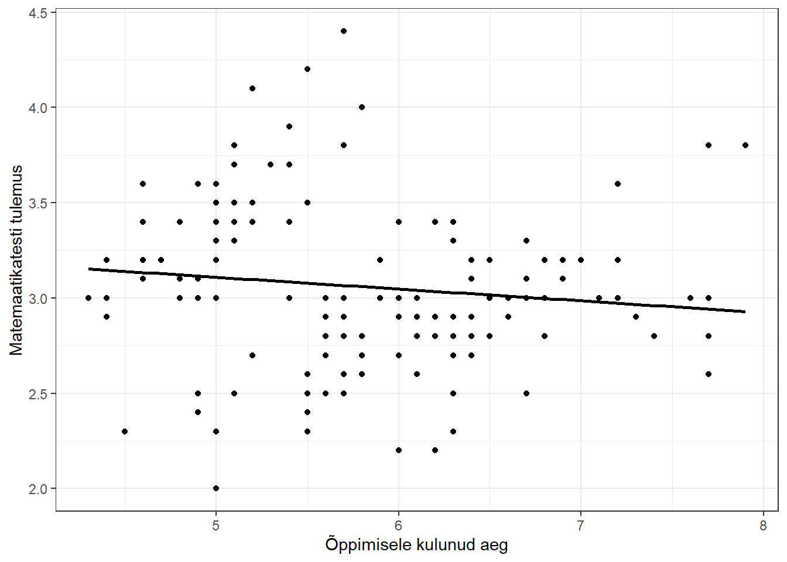
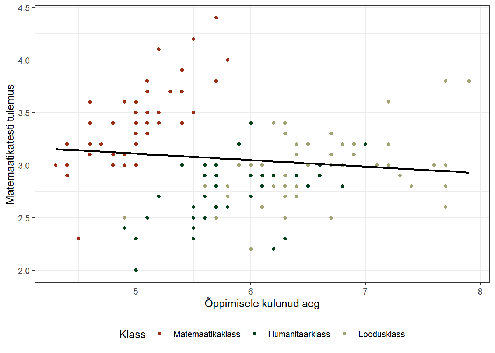
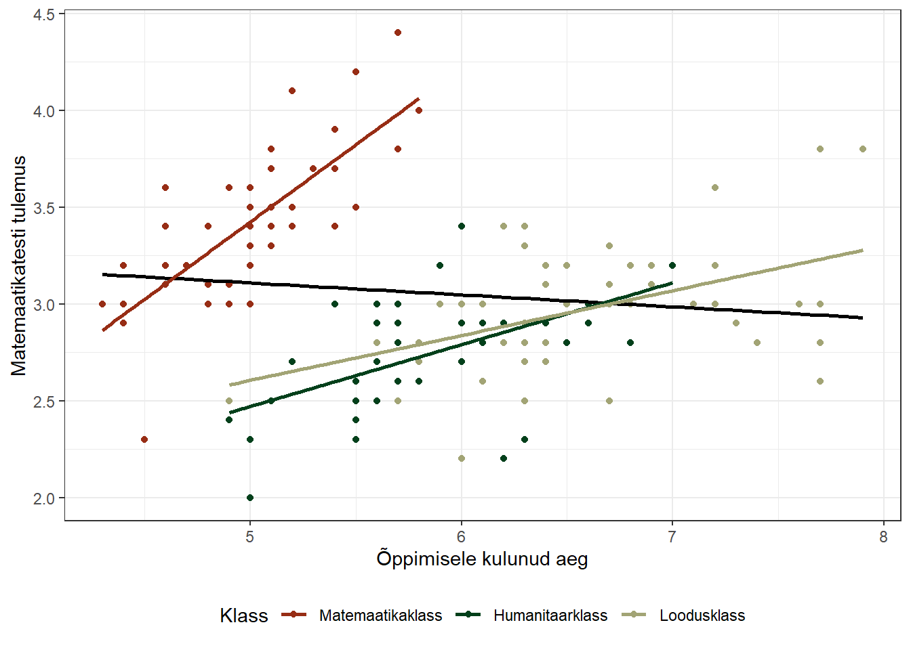
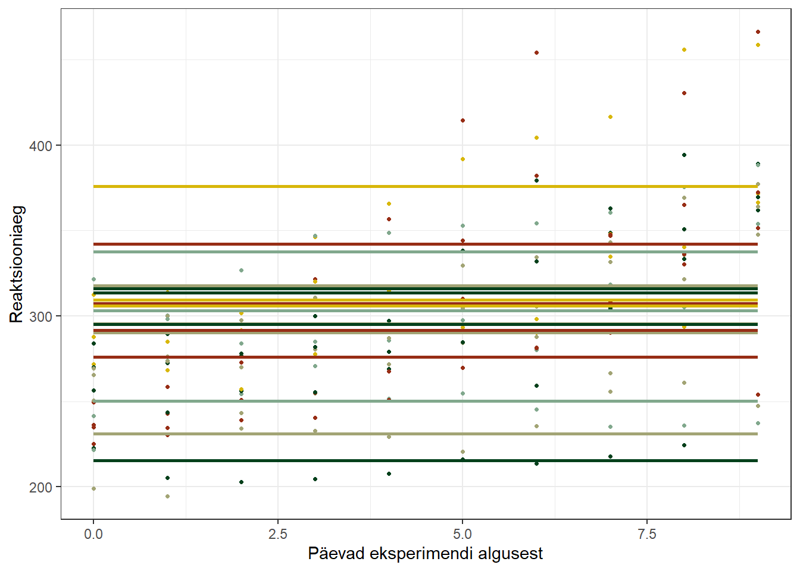
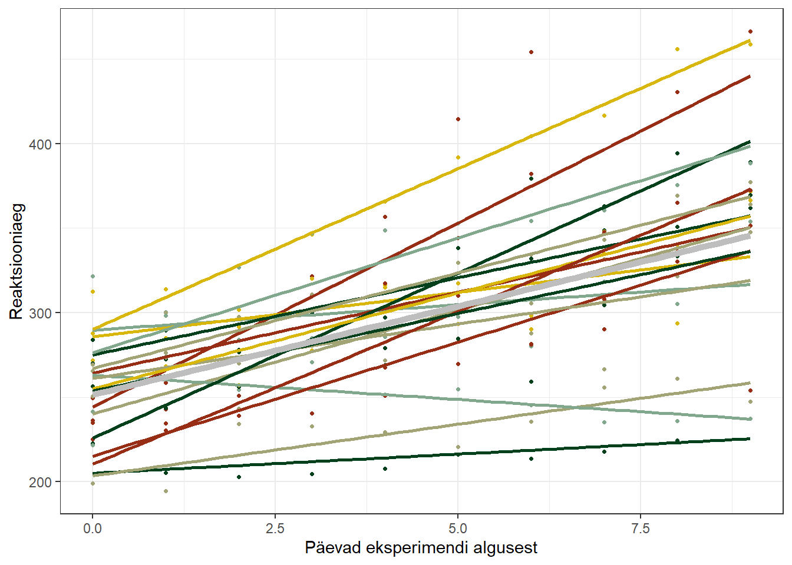
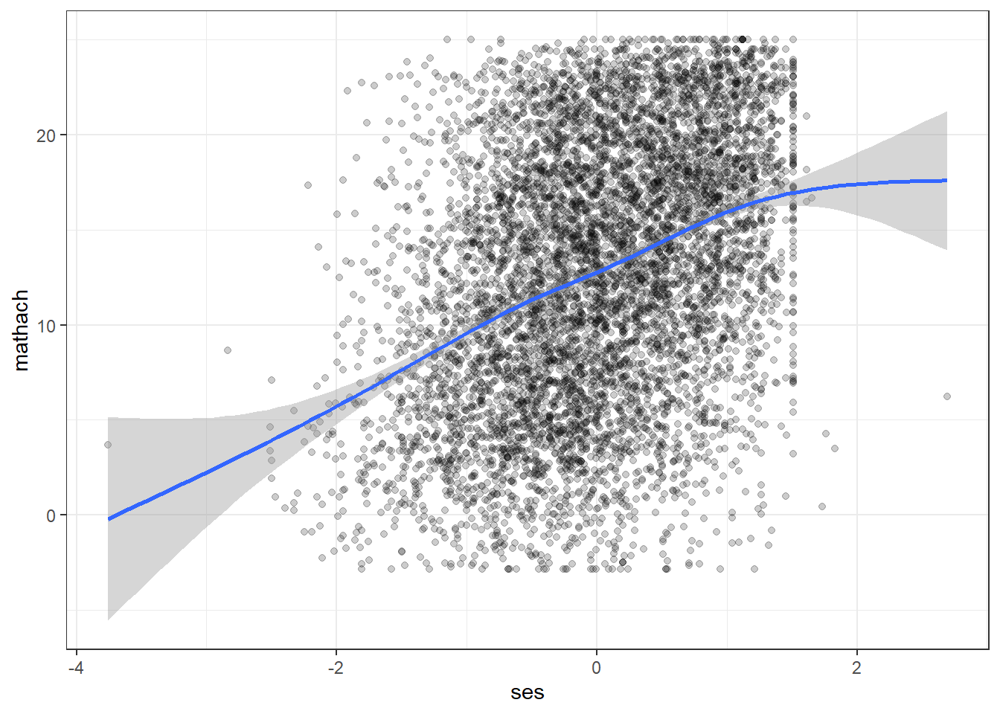
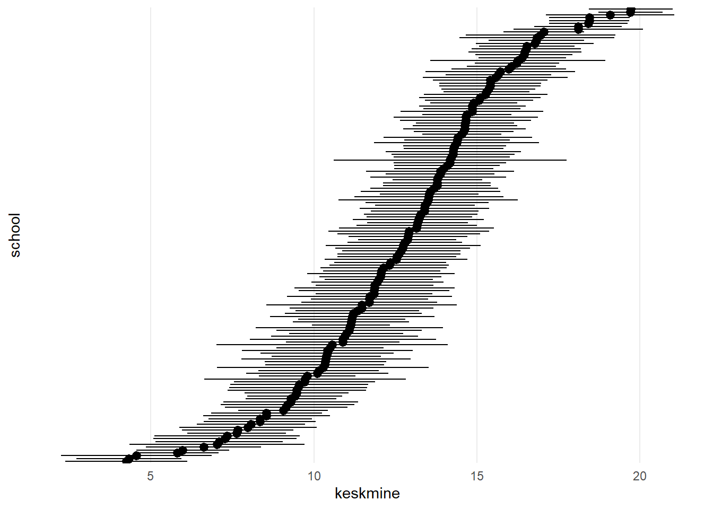
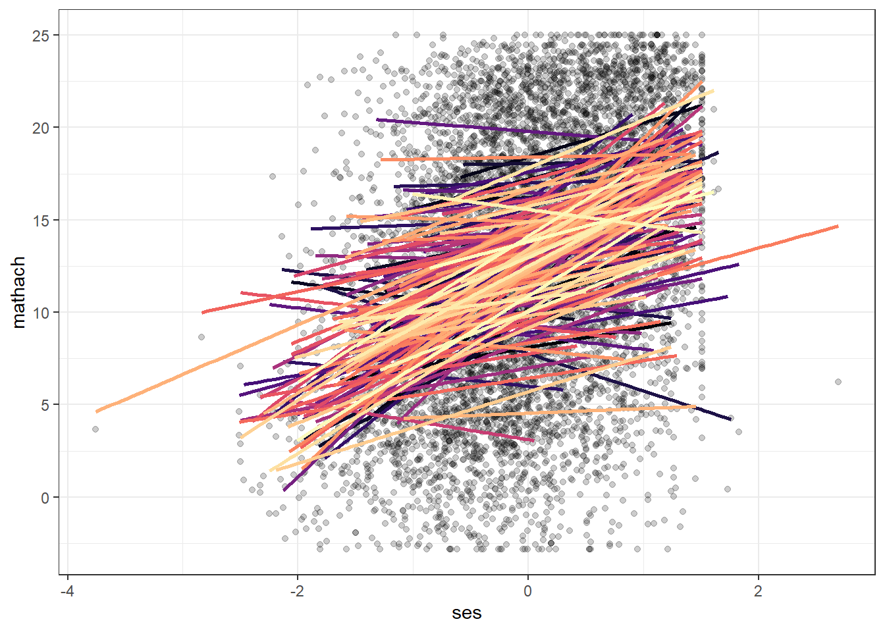

# (PART) Mitmetasandiline regressioon {-} 

# Mitmetasandiline regressioon


## Andmete hierarhiline struktuur

Valdav osa meie uuritavatest nähtustest ning uurimisobjektidest on mingil määral hierarhiliselt struktureeritud või klasterdunud:

- õpilased klasside kaupa
- patsiendid eri arstide juures
- elanikud linnaosades, linnades, regioonides jne
- töötajad ettevõetetes
- paneeluuringutes (longituuduuringutes) vaatluskorrad inimeste kaupa
- jne


Vaatlused klastrite sees kipuvad olema sarnasemad kui klastrite vahel. Samas klassis õppivaid õpilasi ühendavad samad õpetajad ja nende kasutatavad õppemeetodid ning õppematerjalid, üldine klassi mentaliteet jms. Taolised ühised kogemused ühendavad sama klassi õpilasi ja samas eristavad neid teiste klasside õpilastest. Kui näiteks tahame mõõta õpilaste lugemust, ning hinnata, kuivõrd seda mõjutab lapse vanemate kultuuriline kapital, siis peame korrektsete järelduste tegemiseks seda klassidesisest sarnasust ja klassidevahelist erinevust arvesse võtma. Klassis, kus on hea kirjanduse õpetaja või lugemist väärtustav keskkond, võivad ka madala kultuurilise kapitaliga vanemate lapsed lugeda märksa rohkem kui mõnes teises klassis vähem lugemist soodustavas keskkonnas õppivad kõrge kultuurilise kapitaliga vanemate lapsed. 

Võib-olla kõige selgemini on vaatluste hierarhiline struktuur tajutav longituudandmete puhul, kus me mõõdame või vaatleme mingeid omadusi või nähtusi samade respondentide puhul mitmeid kordi mingi aja jooksul. Ehk siis kui tahame näiteks teada kuidas lugemisharjumused muutuvad üle aja, siis võime võime võtta juhuvalimina 100 inimest ning küsida kümne aasta jooksul igal aastal nende selle aasta lugemuse kohta. Nii toimides oleks meil lõpuks koos 1000 erinevat vaatlust või vastust. Kuid on ju ilmne, et me ei saa kõiki neid tuhandet vaatlust sõltumatutena käsitleda. Inimesed, kellele meeldib lugeda, teevad seda tõenäoliselt igal aastal ning inimesed, kes eelistavad muul viisil aega veeta, loevad igal aastal vähem.

Seega andmete hierarhilist struktuuri ja loomulikku klasterdumist arvesse võtmata ei ole meil võimalik korrektselt mingeid mõjusid või tendentse hinnata, sest need mõjud  **sõltuvad** klastreid ühendavatest karakteristikutest. See aga tähendab, et tavaline lineaarne regressioon taoliste mõju hindamiseks ei sobi. Nimelt oli lineaarse regressiooni üheks eelduseks vaatluste (ja jääkide) sõltumatus. Kui me selle eeldustega ei arvesta, siis võivad efektide standardvead olla liiga väikesed, mistõttu võime näha statistiliselt olulisi seoseid seal kus neid tegelikult ei ole. 

Mõningatel eriti hulludel juhtudel võivad lisaks standardvigadele olla valed ka regressiooniseosed ise. Sellisel puhul oleksid meie järelduse mitte ainult ebatäpsed vaid totaalselt valed. Vaatame järgmist näidet, kus on matemaatikatestiks õppimisele kulunud aja kaudu üritatakse seletada testi tulemust^[Tegemist on reaalsete andmetega, kuid olen nende tähendust diaktilistel kaalutlustel muutnud. Reaalselt on need *Iris* andmestiku andmed, $x$-teljel on iiriste kroonlehtede pikkus ja $y$-teljel kroonlehtede laius (vt `help(iris)`)]. Kasutame hinnanguks kõigepealt tavalist lineaarset regressiooni:



Tulemused tundub kuidagi väga imelikud. Mida kauem õpitakse, seda halvem on testi skoor. Kuida seda seletada? Asi on selles, et tegemist on kolme erineva klassi õpilastega, kelle matemaatilised oskused on suhteliselt erinevad:




Kui me seda klasside erinevust arvesse võtame ja igas klassis eraldi regressioonivõrrandi hindame, on tulemused juba märgatavalt loogilisemad:



Kõikides klassides eraldivõetuna on seos õppimisele kulunud aja ja testitulemuse vahel ikkagi positiivne. Lihtsalt korrelatsioonikoefitsiendi suurus (sirge tõus) ja vabaliige (sirge lõikumine $y$-teljega kui $x$ on 0) on kõikides klassides erinev. Seega antud näite puhul oleks meie järeldused, kui me andmete hierarhilist struktuuri arvesse ei võtaks, vastupidised tegelikule olukorrale. Taolist olukorda nimetatakse Simpsoni paradoksiks. Näide on loomulikult mõnevõrra utreeritud, kuid illustreerib hästi andmestiku hierarhilise struktuuriga arvestamise vajalikkust.

### Mida me uurida tahame?

Mida siis teha, kui me teame või eeldame, et meie uurimisobjektid on hierarhiliselt struktureeritud või moodustavad mingite karakteristikute alustel gruppe? Võimalusi on tegelikult mitmeid ning valik nende võimaluste seast sõltub eelkõige nenede hierarhiate või gruppide iseloomust, aga ka sellest, mis meid konkreetselt huvitab. 

Klasterdavatest tunnustest lähtuvalt saame analüüsiühikud jagada tasanditeks. **Esimese tasandi analüüsiühikud** on need mida või keda me otseselt vaatleme või küsitleme. **Teise tasandi analüüsiühikud** grupid, millesse esimese tasandi ühikud kuuluvad. Näiteks kui õpilased on esimese tasandi analüüsiühikud, siis klassid on teise tasandi analüüsiühikud. Või kui patsiendid on esimene tasand, siis neid ühendavad arstid on teine tasand. Tasandeid võib loomulikult olla ka rohkem. Õpilaste puhul saavad kolmandaks tasandiks olla näiteks koolid, neljandaks tasandiks riigid jne.


1. Meie uurimishuvi võib seisneda ainult esimese tasandi mõjude hindamises. Sellisel juhul käitleme teisi tasandeid lihtsalt takistustena, mida peame oma esimese tasandi analüüsis arvesse võtma, kuid mis meid eraldiseisvalt ei huvita (kas õppimisele kulunud aeg üldiselt mõjutab testitulemust). Võime lihtsalt olla huvitatud ka sellest, kas esimese tasandi mõju on võimalik eristada struktuursetest teguritest (teise tasandi mõjust).

2. Meie uurimishuvi võib seisneda ka teise tasandi mõjude hindamisel esimese tasandi väljunditele. Ehk siis kas makrotasandi tegurid mõjutavad indiviiditasandi väljundeid (arvestades sealjuures ka indiviidide erinevusi). Näiteks kas klassi tüüp mõjutab testitulemusi.

3. Lõuks võib meie uurimishuvi seisneda ka teise tasandi tegurite mõjus esimese tasandi mõjudele. Kas klassi tüüp mõjutab seost õppimisele kulunud aja ja testitulemuse vahel? Või kas klassis kasutusel olev õppekava maht mõjutab õppimisele kulunud aja ja testitulemuste vahelist seost? Ehk siis kas mingid struktuursed tegurid mõjutavad indiviiditasandi mõjusid.


### Kuidas vaatluste hierahilisust analüüsis arvesse võtta?

1. Õppimisele kulunud aja ja testitulemuste seoste näite puhul, ehk siis olukorras, kus grupitunnuse kategooriaid on suhteliselt vähe (näites oli neid ainult kolm), oleks kõige mõistlikum kasutada tavalist lineaarset regressiooni, kuid kaasta grupeeriv tunnus sõltumatu tunnusena mudelisse. Sellisel juhul on meil tegemist tavalise mitmese regressiooniga (taolist mudelit, kus meil on nii pidev kui kategoriaalne sõltumatu tunnus, nimetatakse ka ANCOVA (*Analysis of Covariane*) mudeliks). Kui me kaasame mudelisse ka sõltumatute tunnuste vahelised interaktsioonid, saame hinnata ka seda, kas erinevate gruppide regressioonikoefitsiendid erinevad (ehk siis kas gruppide regressioonisirgete tõusud erinevad). Kõnealuses näites see nii ka oli.

2. Kui gruppe on natukene rohkem (näiteks 15 gruppi) ja meid huvitvad eelkõige vaid esimese tasandi mõjud (ehk siis meid ei huvita kuidas grupeeriv tunnus meie uuritavat mõju mõjutab või me eeldame, et ta seda ei mõjuta), siis saame kasutada **fikseeritud mõjudega mudelit** (*fixed effects model*). Näiteks tahame küsitlusandmetega uurida kuidas sissetulekute suurused mõjutavad eluga rahulolu, kuid kuna meie valim on riigiülene, siis peaksime arvestama piirkondlike (näiteks maakondlike) erinevustega sissetulekute suurustes. Meid ei huvita niiväga see sissetulekute erinevus, kuivõrd üldine sissetulekute mõju rahulolule. Seega tahame lihtsalt oma tulemust piirkondlike erinevuste suhtes kontrollida. Fikseeritud mõjudega mudel on tegelikult jällegi tavaline regressioonimudel, millesse on kaasatud grupeeriv kategoriaalne tunnus. Kategoriaalne sõltumatu tunnus on regressioonimudelis alati *dummy*-tunnusena, (see tähendab et kui meil on näiteks 15 kategooriat, siis peame sellest tegema (või no R teeb) 14 binaarset tunnust, mille kaudu meil on kõik 15 kategooriat defineeritud). Seega, kui tahame hinnata mingi sõltumatu pidevtunnuse mõju sõltuvale tunnusele ning andmestiku hierarhilise struktuuri tõttu lisame sinna ka 15 kategooriaga kategoriaalse tunnuse, siis saame mudeli tulemina 15 regressioonikoefitsienti (1 pidevtunnuse koefitsient ja 14 grupeeriva tunnuse koefitsienti). Muidugi võime ka neid neid kategoriaalsete tunnuste koefitsiente tõlgendada (need näitavad kuidas gruppide keskmised referentsgategooriast erinevad), kuid üldjuhul tahame sellise mudeliga lihtsalt oma uuritavat mõju grupeeriva tunnuse suhtes kontrollida (leida grupeerivast tunnusest sõltumatut mõju). Taolise mudeli puhul eeldame vaikimisi, et meie uuritav mõju on kõikide grupeerivate tunnuste lõikes sama (regressioonisirge tõus on kõikides gruppides sama) ja erinevad vaid gruppide keskmised (mudeli kontekstis vabaliikmed). Kui see nii ei ole, siis peaksime mudelisse kaasma ka koosmõjud. Kuid sellisel juhul palju õnne meile nende interaktsioonide tõlgendamiel. Kui lisaks grupeerivale tunnusele on mudelis vaid üks sõltumatu tunnus, siis oleks see tegelikult tehtav (eriti kui referentskategooria on hästi valitud), kuid üldiselt on meil ju mudelis rohkem kui üks sõltumatu tunnus.

3. Kui meid huvitavad eelkõige teise tasandi mõjud, siis saame kasutada nn **kaheastmeliste mudelit** (*two-stage model*). Näiteks kui tahame teada kuidas omavalitsuste investeeringud infrastruktuuri mõjutavad nende elanike eluga rahulolu ja nende elanike sissetulekute mõju eluga rahulolule. Kaheastmeliste mudelite puhul moodustatakse igas klastris või grupis omaette regresioonimudel, seejärel võetakse nende mudelite koefitsiendid ning kasutatake neid omakorda sisenitena teise astme regressioonimudelis. Meie näite puhul peaksime igas KOVis moodustama mudeli, millega hindame sissetulekute mõju eluga rahulolule. Eesti puhul oleks siis vaja moodustada 79 mudelit. Seejärel võtame kõikide mudelite koefitsiendid ning kasutame neid teise tasandi mudelis sõltuva tunnusena. Teise tasandi sõltumatuks tunnuseks oleks KOVide investeeringute suurused. Taolise lähenemisega saame juhul, kui esimeses tasandis on piisavalt vaatlusi, küllaltki adekvaatse ning keerulisemate mudelitega võrreldava tulemuse. Mudeli kasuks räägib eelkõige see, et tegemist on väga lihtsa ja arusaadava moodusega teise tasandi effektide tuletamiseks. Kuid vägagi ilmsed on ka taolise lähenemise kitsaskohad. Gruppe kokku agregeerides kaotame väga palju informatsiooni. Ja mida vähem on meil informatsiooni, seda vähem kindlad me oma järeldustes olla saame. See reegel kehtib ka laiemalt - mida rohkem me oma algseid andmeid agregeerime, seda ebatäpsemad meie järeldused saavad olema. 

4. Kui meid huvitavad jällegi ainult esimese tasandi mõjud, kuid samas me teame, et meie andmestik on hierahiliselt struktureeritud (ja võib-olla meil ei ole selle hierarhilise struktuuri kohta väga palju infot), siis saame regressioonimudeli hindamisel kasutada nn robustseid standardvigu (*robust standard errors*, *clustered standard errors*). See on puhtalt analüütiline lahendus, mille kaudu me saame oma mudeli tulemuse võimaliku klasterdumise eest kindlustada.

5. Viimaks on meil võimalik kasutada ka **mitmetasandilist analüüsi/mudelit** (*multilevel analysis/models*, nimetatakse ka *hierarchical linear models*, *linear mixed-effect models*, *mixed models*, *nested data models*, *random coefficient models* või *random-effects models*). Järgenvalt vaatamegi seda meetodit lähemalt.


## Mitmetasandiline analüüs

Mitmetasandiline analüüs võimaldab:  

1. ühiskonna või muu uurimisobjekti struktureeritust, heterogeensust ja kontekstuaalsust mõjude hindamisel arvesse võtta  
2. ja hinnata sotsiaalse, kultuurilise, institutsionaalse või muu konteksti mõju uuritavatele nähtustele ja uurimisobjektidele 

Eelkõige huvitab meid mitmetasandilise analüüsi juures just see teine punkt - gruppide erinevuste (nii grupisiseste mõjude kui gruppide keskmiste erinevuste) selgitamine kõrgema tasandi sõltumatute tunnuste abil. Mitmetasandiline analüüs on oma olemuselt sarnande eelnevalt kirjeldatud kaheastmelisele mudelile, kus saime teise tasandi tunnuste abil (näiteks KOVide investeeringute suurused) seletada gruppidevahelist regressioonikoefitsientide varieeruvust. Kuid erinevalt kaheastmelisest mudelist ei agregeerita siin gruppide koefitsiente enne teise tasandi juurde asumist, vaid käsitletakse esimese ja teise (või ka kolmana või neljana vne) tasandite variatiivsust samas mudelis. Seega ei kaota me mudeli hindamisel meile vajalikku informatsiooni ning järeldused saavad olla täpsemad.

### Fikseeritud ja juhuslikud efektid

Mitmetasandilises analüüsis käsitleme regressioonikoefitsiente ja vabaliiget mitte konkreetsete ja fikseeritutena, vaid vaid mingi **teise tasandi grupeeriva tunnuse lõikes varieeruvatena**. Regressiooni koefitsientides (vabaliige ja regressioonikordajad) eristatakse fikseeritud (*fixed*) ja juhuslikku (*random*) osa:

- __fikseeritud osa__ on koefitsientide gruppideülesed üldkeskmised;
- __juhuslik osa__ näitab gruppide koefitsientide varieeruvust ümber üldkeskmiste.

Mida see sisuliselt tähendab? Oletame, et meil on regressioonivõrrand iga grupi kohta:

$$Y_{ij} = \beta_{0j} + \beta_{1j}X_{ij}+\epsilon_{ij}$$
kus:

$Y_{ij}$ on esimese tasandi sõltuva tunnuse väärtus indiviidi $i$ ja grupi $j$ jaoks;    
$\beta_{0j}$ on grupi $j$ vabaliige;    
$\beta_{1j}$ on regressioonikordaja grupis $j$;    
$X_{ij}$ on esimese tasandi sõltumatu tunnuse väärtus grupi $j$ kuuluva indiviidi $i$ jaoks;    
$\epsilon_{ij}$ on regressiooni jääk (viga) indiviidi $i$ jaoks, kes kuulub gruppi $j$.

<br>

Me saame gruppide vabvaliikmetes eristada gruppideülest keskmist vabaliiget $\gamma_{00}$ ja iga grupi hälbimust sellest keskmisest $u_{0j}$ (ehk siis iga grupi erinevust üldkeskmisest vabaliikmest):

$$Y_{ij} = \underbrace{\beta_{0j}}_{\beta_{0j}= \gamma_{00}+ u_{0j}} + \beta_{1j}X_{ij}+\epsilon_{ij}$$
kus:  

$\gamma_{00}$ on esimese tasandi vabaliikmete keskmine ehk vabaliikme fikseeritud osa;    
$u_{0j}$ on gruppide erinevus keskmisest vabaliikmest ehk vabaliikme juhuslik osa.  

<br>

Samamoodi saame gruppide regressioonikoefitsientide puhul eristada gruppideülest keskmist koefitsienti $\gamma_{10}$ ja iga grupi hälbimust sellest keskmisest $u_{1j}$:

$$Y_{ij} = \beta_{0j} + \underbrace{\beta_{1j}}_{\beta_{1j}= \gamma_{10}+ u_{1j}}X_{ij}+\epsilon_{ij}$$
kus: 

$\gamma_{10}$ on esimese tasandi regressioonikoefitsientide gruppideülene keskmine ehk regressioonikordaja fikseeritud osa;    
$u_{1j}$ on gruppide erinevus keskmisest regressioonikordajast ehk regrssioonikordaja juhuslik osa.

<br>

Kuna nii vabaliikme kui regressionikoefitseindi puhul on meil nüüd varieeruvad juhuslikud osad (võime neist mõelda kui tavalise regressiooni sõltvatest tunnustest), siis saame nende variatiivsust teise tasandi sõltumatute tunnuste abil regressioonga  selgitada. Lisame teise tasandi sõltumatu tunnuse $W_j$, millega üritame seletada esimese tasandi vabaliikme varieeruvust:

$$Y_{ij} = \underbrace{\beta_{0j}}_{\beta_{0j}= \gamma_{00}+ \gamma_{01}W_j + u_{0j}} + \beta_{1j}X_{ij}+\epsilon_{ij}$$
kus:

$\gamma_{01}$ on regressioonikordaja, mille läbi teise tasandi sõltumatu tunnus $W_j$ selgitab esimese tasandi vabaliikmete varieeruvust;  
$u_{0j}$ on teise tasandi regressioonivõrrandi viga ehk siis see osa vabaliikmete varieeruvusest, mida me teise tasandi sõltumatu tunnusega selgitada ei suuda.  

Täpselt samamoodi saame toimida ka regressioonikoefitseindi juhusliku osaga, mille varieeruvust on jällegi võimalik teise tasandi sõltumatu tunnuse $W_j$ abil selgitada:

$$Y_{ij} = \beta_{0j} + \underbrace{\beta_{1j}}_{\beta_{1j}= \gamma_{10}+ \gamma_{11}W_j + u_{1j}}X_{ij}+\epsilon_{ij}$$
kus:

$\gamma_{11}$ on regressioonikordaja, mille läbi teise tasandi sõltumatu tunnus $W_j$ selgitab esimese tasandi regressioonikoefitseintide varieeruvust;  
$u_{1j}$ on teise tasandi regressioonivõrrandi viga ehk siis see osa regressioonikoefitseintide varieeruvusest, mida me teise tasandi sõltumatu tunnusega selgitada ei suuda.  

<br>

Kui me nüüd nii vabaliikmete kui ka regressioonikoefitsientide fikseeritud ja juhuslikud osad kokku paneme:

$$Y_{ij} = \underbrace{\beta_{0j}}_{\gamma_{00}+ \gamma_{01}W_j + u_{0j}} + \underbrace{\beta_{1j}}_{\gamma_{10}+ \gamma_{11}W_j + u_{1j}}X_{ij}+\epsilon_{ij}$$

siis saamegi mitmetasandilise regressiooni võrrandi:

$$Y_{ij} = \gamma_{00}+ \gamma_{01}W_j  + \gamma_{10}X_{ij}+ \gamma_{11}W_jX_{ij} + u_{0j} + u_{1j}X_{ij} + \epsilon_{ij}$$

kus võime eristada fikseeritud osa ja juhuslikku osa:


$$Y_{ij} = \underbrace{\gamma_{00}+ \gamma_{01}W_j  + \gamma_{10}X_{ij}+ \gamma_{11}W_jX_{ij}}_{\text{fikseeritud osa}} +  \underbrace{u_{0j} + u_{1j}X_{ij} + \epsilon_{ij}}_{\text{juhuslik osa}}$$

Võrrand võib esmapilgul väga kirju ja segane tunduda, kuid kui eelnev tuletuskäik rahulikult läbi mõelda ning kreeka tähtedest end mitte häirida lasta, siis on kõik tegelikult väga loogiline ning võiks neile, kes tavalise lineaarse regressiooniga tuttavad on, mõistetav olla.  

### Mitmetasandilise analüüsi etapid

Mitmetasandilisi mudeleid koostatakse üldjuhul etapiviisiliselt, alustades lihtsamast mudelist ning liikudes edasi keerulisemate mudelite poole:

1. Esmalt hinnatakse __nullmudel__ (*null model* või *empty model*), millega hinnatakse vaid gruppidest tulenevat esimese tasandi sõltuva tunnuse varieeruvust. Kui esimese tasandi sõltuv tunnus gruppide vahel statistiliselt oluliselt ei varieeru, siis ei ole mõtet mitmetasandilise analüüsiga edasi minna (kuna siis me ju ei saa tasandeid eristada).

$$Y_{i,j} = \gamma_{00} + u_{0j} + \epsilon_{ij}$$

2. Kui nullmudel indikeerib gruppidevahelist erinevust, siis hinnatakse __juhusliku vabaliikmega mudel__ (*random intercept model*), kus lisatakse esimese tasandi sõltumatu tunnus ning hinntakse vabaliikme varieeruvust gruppide vahel.

$$Y_{i,j} = \gamma_{00}+ \gamma_{11}X_{ij} + u_{0j} + \epsilon_{ij}$$

3. Kui ka juhusliku vabaliikmega mudel näitab, et vabaliikmed varieeruvad gruppide vahel, siis saab moodustada __juhusliku regressioonikordajaga mudeli__ (*random slope model*), kus lastakse ka esimese tasandi regressioonikordajad gruppide vahel varieeruma.

$$Y_{i,j} = \gamma_{00}+ \gamma_{11}X_{ij} + u_{0j} + u_{1j}X_{ij} + \epsilon_{ij}$$

4. Kui vabaliikmed või regressioonikordajad varieeruvad olulisel määral, siis saame vajadusel ja võimalusel nende variatsiooni mingite teise tasandi sõltumatute tunnustega selgitada, ehk siis lülitada mudelisse ka teise tsandi prediktorid (kui näeme variatiivsust vabaliikmete hulgas, kuid mitte regressioonikordajate hulgas, siis saame teise tasandi prediktoreid kasutada loomulikult vaid vabaliikmete selgitamiseks).

Teise tasandi prediktor selgitamas vabaliikme varieeruvust:

$$Y_{i,j} = \gamma_{00}+ \gamma_{01}W_j + \gamma_{10}X_{ij} + u_{0j} + u_{1j}X_{ij} + \epsilon_{ij}$$

Teise tasandi prediktor selgitamas nii vabaliikme kui regressioonikordaja varieeruvust (esimese ja teise tsandi prediktorite koosmõju):

$$Y_{i,j} = \gamma_{00}+ \gamma_{01}W_j  + \gamma_{10}X_{ij}+ \gamma_{11}W_jX_{ij}+  u_{0j} + u_{1j}X_{ij} + \epsilon_{ij}$$


Vaatame selgitava näitena ühe uneuuringu raames tehtud eksperimendi andmestikku^[Gregory Belenky, Nancy J. Wesensten, David R. Thorne, Maria L. Thomas, Helen C. Sing, Daniel P. Redmond, Michael B. Russo and Thomas J. Balkin (2003) Patterns of performance degradation and restoration during sleep restriction and subsequent recovery: a sleep dose-response study. *Journal of Sleep Research* **12**, 1–12. Andmestik on kättesaadav paketis *lme4* nimega `sleepstudy`]. Eksperimendiga uuriti kuidas unepuudus reaktsioonikiirust mõjutab. Respondentide reaktsioonikiirust mõõdeti kümnel järjestikusel päeval. Enne esimest mõõtmist (0 päev) lasti respondetidel magada nii kaua nagu nad tavaliselt magavad. Kõikidel järgevatel öödel lasti neil magada kolm tundi. Tulemustena esitatav reaktsioonikiirus on keskmine reaktsiooniaeg erinevate testide alusel, mis päeva jooksul sooritati.

Andtud juhul on siis tegemist longituudandmetikuga (kutsutakse ka paneelandmestikuks), kus teise tasandi ühikuks on respondent ning esimese tasandi vaatlused on grupeeritud indiviidide kaupa.

Vaatame kõigepealt kuidas näeks välja tavaline lineaarne regressioon:


Pilt näeb välja küllaltki ettearvatav - mida pikemalt und piiratakse, seda suuremaks läheb reaktsiooniaeg. Kuid kuna me teame, et tegemist on paneelandmetega, siis tagamaks oma järelduste korrektsust, peame vähemalt kontrollima teise tasandi efektide olemasolu ja potentsiaalset mõju. Defineerime **nullmudeli**: 



Näeme, et inimeste keskmised reaktsiooniajad (võtmata arvesse undefitsiidi pikkust) erinevad päris olulisel määral (reaalses analüüsis peame muidugi sellele järeldusele jõudma teststatistiku abil). Seega on õigustatud **juhusliku vabaliikmega mudeli** defineerimine, kus me jätame regressioonikordajad kõikidel respondentidel samaks, kuid laseme vabaliikmed varieeruma:


Näeme, et ka vabaliikmed varieeruvad indiviidide vahel päris suurel määral ning liigume edasi **juhuliku regressioonikordajaga mudeli** juurde:




Ka regressioonikordajad varieeruvad indiviidide vahel päris olulisel määral. Ühe inimese puhul unedefitsiit isegi vähendab reaktsiooniaega ja päris mitme puhul on muutused üle aja marginaalsed, eristudes seeläbi keskmisest reaktsioonikiirusest.

Edasi saaksime vaadata millised individuaalsed karakteristikud seda mõju erinevust mõjutavad. Kuna tegemist on paneeluuringuga, kus teise tasandi ühikuks on indiviid, siis on ka võimalikud teise tasandi sõltumatud tunnused indiviiditunnused. Näiteks sugu, vanus vms.


## Mitmetasandilise analüüsi eeldused

- Esimese tasandi ühikud peavad moodustama teise tasandi ühikute suhtes (pseudo)populatsiooni  
- Teise tasandi ühikud on valim teise tasandi ühikute populatsioonist 
  + Kas teise tasandi ühikuid saab mõista juhuvalimina?
  + Kas teise tasandi ühikuid on piisavalt palju (vähemalt 20, parem kui vähemalt 50), et nende põhjal järeldusi teha?
- Esimese tasandi jäägid peaksid olema jaotunud normaaljaotuse alusel (keskmisega 0)
- Jääkide dispersioon peaks gruppide lõikes võrdne olema
- Teise tasandi jäägid peaksid esimese tasandi jääkidest sõltumatud olema
- Tavalised lineaarse regressiooni eeldused
  + Sõltuva ja sõltumatute tunnuste seosed peaksid olema lineaarsed
  + Sõltumatud tunnused peaksid olema mõõdetud ilma mõõtmisveata


## Mitemtasandiline analüüs Ris

Ris on mitmetasandilise analüüsi teostamiseks mitmeid pakette. Kasutame siinkohal `lme4` paketti ja sellest `lmer()` funktsiooni. `lme4` pakett ei anna meile koefitsientide *p*-väärtusi. Et neid saada, tuleb laadida ka pakett `lmerTest`^[Tegelikult piisab ka lihtsalt `lmerTest` paketi laadimisest, kuna see laeb automaatselt ka `lme4` paketi.].

Kõigepealt laeme sessiooniks sisse vajalikud paketid (kui need ei ole installitud, siis tuleb seda teha käsuga `install.packages()`)


``` r
library(nlme) # siit saame andmed
library(ggplot2) # joonised
library(dplyr) # andmete töötlemine
library(lme4) # mitmetasanilise analüüsi pakett
library(lmerTest) # võimaldab mudelile ka p väärtused külge saada
```

Kasutame andmestikuna `MathAchieve` näidisandmestikku paketist `nlme`. Andmestik sisaldab USAs 1982. aastal läbi viidud küsitluse "High School and Beyond" tulemusi hõlmates 7185 keskkoliõpilast 160-st koolist. Ehk siis esimene tasand on õpilased ja teine tasand koolid. Andmestik sisaldab muu hulgas õpilasete perede sotsiaalmajanduslikku seisu indeksit ning matemaatikatesti tulemust. 
Üritame analüüsida kas pere sotsiaalmajanduslik seis mõjutab matemaatikatesti tulemust ja kas see seos varieerub koolide vahel ning kui jah, siis leida seda variatiivsust selgitavad tegurid. 

### Andmete ettevalmistus
Anname andmetele natukene lihtsama nime ja vaatame millega tegu:


``` r
andmed <- nlme::MathAchieve %>% 
  as.data.frame()
str(andmed)
```

```
## 'data.frame':	7185 obs. of  6 variables:
##  $ School  : Ord.factor w/ 160 levels "8367"<"8854"<..: 59 59 59 59 59 59 59 59 59 59 ...
##  $ Minority: Factor w/ 2 levels "No","Yes": 1 1 1 1 1 1 1 1 1 1 ...
##  $ Sex     : Factor w/ 2 levels "Male","Female": 2 2 1 1 1 1 2 1 2 1 ...
##  $ SES     : num  -1.528 -0.588 -0.528 -0.668 -0.158 ...
##  $ MathAch : num  5.88 19.71 20.35 8.78 17.9 ...
##  $ MEANSES : num  -0.428 -0.428 -0.428 -0.428 -0.428 -0.428 -0.428 -0.428 -0.428 -0.428 ...
```
Tunnused on järgmised:  

- *School* - kooli id
- *Minority* - kas õpilane kuulub vähemuse hulka
- *Sex* - sugu
- *SES* - õpilase pere sotsialmajanduslik staatus (standardiseeritud)
- *MathAch* - matemaatikatesti tulemus
- *MEANSES* - kooli keskmine SES skoor (teise ehk kooli tasandi tunnus)

Lisaks on `nlme` paketis ka andmestik `MathAchSchool`, mis sisaldab veel erinevaid kooli tasandi tunnuseid. Võtame sellest andmestikus tunnused:

- *School* - koolid id
- *Sector* - kas *Public* või *Chatholic* kool
- *PRACAD* - protsent õpilastest, kes õpivad nn "akadeemilisel suunal"
- *MEANSES* - kooli keskmine SES skoor


``` r
koolid <- nlme::MathAchSchool %>% 
  as.data.frame() %>% 
  select(School, Sector, PRACAD, MEANSES)
head(koolid)
```

```
##      School   Sector PRACAD MEANSES
## 1224   1224   Public   0.35  -0.428
## 1288   1288   Public   0.27   0.128
## 1296   1296   Public   0.32  -0.420
## 1308   1308 Catholic   0.96   0.534
## 1317   1317 Catholic   0.95   0.351
## 1358   1358   Public   0.25  -0.014
```


Taoline mitmetasandiliste andmete organiseerimise viis, kus erinevate tasandite tunnused on erinevates failides, on küllaltki tavapärane. Seega esimeseks sammuks on nii siin, kui ka mitmetasanilise analüüsi puhul üldiselt need kaks andmestikku kokku liita. Kasutame selleks *dplyr*-i `left_join()` funktsiooni.  

Mõlemat andmestikku ühendavaks id tunnuseks on *School*. Kuid kuna need tunnused on erinevatest klassidest (üks on *ordered factor*, teine tavaline *factor*), siis teeme nad mõlemad kõigepealt *character* tunnusteks


``` r
andmed$School <- as.character(andmed$School)
koolid$School <- as.character(koolid$School)
# Nüüd saame andmestikud kokku panna
andmed <- left_join(andmed, koolid, by = 'School')
# Vaatame ka tulemust
head(andmed)
```

```
##   School Minority    Sex    SES MathAch MEANSES.x Sector PRACAD MEANSES.y
## 1   1224       No Female -1.528   5.876    -0.428 Public   0.35    -0.428
## 2   1224       No Female -0.588  19.708    -0.428 Public   0.35    -0.428
## 3   1224       No   Male -0.528  20.349    -0.428 Public   0.35    -0.428
## 4   1224       No   Male -0.668   8.781    -0.428 Public   0.35    -0.428
## 5   1224       No   Male -0.158  17.898    -0.428 Public   0.35    -0.428
## 6   1224       No   Male  0.022   4.583    -0.428 Public   0.35    -0.428
```

Kuna *MEANSES* tunnus oli mõlemas andmestikus, siis on see uues andmestikus kaks korda (vastavalt suffixitega .x ja .y). Kustutame neist esimese ja muudame *MEANSES.y* nime tagasi *MEANSES*-iks.


``` r
andmed$MEANSES.x <- NULL
andmed <- andmed %>% 
  rename(MEANSES = MEANSES.y)
```

Paneme kõik tunnuste nimed väikestesse tähtedesse^[Lihtsalt, et oleks kergem neid trükkida]:


``` r
names(andmed) <- tolower(names(andmed))
```


### Ülevaade andmetest

Nagu enne igat analüüsi, uurime kõigepealt andmeid. Vaatame graafiliselt kuidas sotsiaalmajanduslik indeks matemaatika testi tulemusega seostub:


``` r
# punktide jaoks geom_point()
# mittelineaarse regressioonijoone jaoks geom_smooth()
andmed %>% 
  ggplot(aes(x = ses, y = mathach))+
  geom_point(alpha = 0.2)+
  geom_smooth()+
  theme_bw()
```




Tundub et üldine seos on täitsa olemas ja see on ka suhteliselt lineaarne.

Järgmiseks vaatame kas koolide keskmised matemaatikasjoorid erinevad. Neid oleks hea vaadata koos usalduspiiridega, seega peame need enne välja arvutame. Andmete töötlemiseks kasutame `dplyr`-i funktsioone:


``` r
andmed %>% 
  group_by(school) %>%
  summarise(keskmine = mean(mathach), 
            sd = sd(mathach), 
            n = n()) %>% 
  mutate(l_ci = keskmine - 1.96 * sd/sqrt(n),
         u_ci = keskmine + 1.96 * sd/sqrt(n)) %>%
  mutate(school = as.factor(school),
         school = reorder(school, keskmine)) %>% 
  ggplot(aes(x = keskmine, 
             xmin = l_ci, 
             xmax = u_ci, 
             y = school))+
  geom_pointrange()+
  theme_minimal()+
  theme(panel.grid.minor = element_blank(),
        panel.grid.major.y = element_blank(),
        axis.text.y = element_blank())
```



Jah, keskmised tunduvad kooliti erinevat. On palju koole mille usalduspiirid ei kattu. Järgmiseks vaatame, kas ka sotsiaalmajandusliku seisundi ja testi tulemuste seosed kooliti erinevad:


``` r
andmed %>% 
  ggplot(aes(x = ses, y = mathach))+
  geom_point(alpha = 0.2)+
  geom_smooth(aes(color = school), se = F, show.legend = F, method = 'lm')+
  theme_bw()+
  scale_colour_viridis_d(option = 'A')
```



Tundub, et ka regressioonikoefitsiendid erinevad.

Vaatame põgusalt üle ka teiste sõltumatute tunnuste jaotused. Eelkõige seetõttu, et kontrollida neid võimalike vigade suhtes.


``` r
table(andmed$sex, useNA = 'always')
```

```
## 
##   Male Female   <NA> 
##   3390   3795      0
```


``` r
hist(andmed$ses)
```


``` r
table(andmed$sector, useNA = 'ifany')
```

```
## 
##   Public Catholic 
##     3642     3543
```


``` r
hist(andmed$pracad)
```


``` r
hist(andmed$meanses)
```


Interpretatsiooni huvides oleks regressioonimudelis mõistlik kasutada sotsiaalmajanduslikku indeksi tunnust, mis on koolide keskmiste alusel tsentreeritud. Kuna vabaliige on sõltuva tunnuse ($y$) väärtus juhul, kui sõltumatu tunnus ($x$) on 0, siis ilma tsentreerimata on vabaliikme väärtus suhteliselt sisutühi. Kui me selle koolide keskmiste lõikes tsentreerime, näitab vabaliige kooli matemaatikatesti tulemust kooli keskmise sotsiaalmajandusliku indeksi väärtuse korral. 


``` r
andmed <- andmed %>% 
  mutate(tses = ses - meanses)
```


### Nullmudel

Esmalt defineerime nullmudeli, ehk mudeli, millega hindame vaid keskmist matemaatikatesti tulemust (ja kuna tegemist on ML mudeliga, siis võtame sealjuures arvesse ka koolide erinevust):


``` r
m0 <- lmer(mathach ~ 1 + (1|school), data = andmed)
```

`lmer` mudeli defineerimine on natukene erinev tavapärasest `ml` või `glm` mudeli defineerimisest.

- `athach ~ 1` - sõltuv tunnus koos tildega ja 1 tähistamas vabaliiget. See on identne `ml` mudeliga. Tavaliselt me lihtsalt `ml` mudelis vabaliiget eraldi välja ei too, kuna ainult vabaliikmega `ml` mudeli tulem oleks lihtsalt sõltuva tunnuse keskmine. Aga kuna siin mudelis meil ühtegi sõltumatut tunnust veel ei ole, siis peame vabaliikme eksplitsiitselt ära märkima.
- `(1|school)` - sulgude sees kirjeldatud mudeli juhuslik osa, ehk siis need tunnused, mida me tahame varieeruvatena näha. 1 tähistab jällegi vabaliiget, mis tähendab, et me laseme gruppide vabaliikmetel varieeruda. | märgi järel tuleb mudeli grupeeriv tunnus. Antud juhul on selleks *school*.

Vaatame mudeli tulemusi:


``` r
summary(m0)
```

```
## Linear mixed model fit by REML. t-tests use Satterthwaite's method [
## lmerModLmerTest]
## Formula: mathach ~ 1 + (1 | school)
##    Data: andmed
## 
## REML criterion at convergence: 47116.8
## 
## Scaled residuals: 
##     Min      1Q  Median      3Q     Max 
## -3.0631 -0.7539  0.0267  0.7606  2.7426 
## 
## Random effects:
##  Groups   Name        Variance Std.Dev.
##  school   (Intercept)  8.614   2.935   
##  Residual             39.148   6.257   
## Number of obs: 7185, groups:  school, 160
## 
## Fixed effects:
##             Estimate Std. Error       df t value Pr(>|t|)    
## (Intercept)  12.6370     0.2444 156.6473   51.71   <2e-16 ***
## ---
## Signif. codes:  0 '***' 0.001 '**' 0.01 '*' 0.05 '.' 0.1 ' ' 1
```

Peamised tulemused on toodud *Random effects:* ja *Fixed effects:* kirjete all. 

- Koolide keskmine matemaatikatesti tulemus on 12.6
- Koolide keskmiste dispersioon üldkeskmisest testitulemusest on 8.6 (ja keskmine hälbimus 2.9).  
- Õpilaste keskmine dispersioon koolide keskmistest testitulemustest on 39.1 (ja keskmine hälbimus 6.3).   

Nende tulemuste alusel saame arvutda intraklassi korrelatsiooni (*interclass correlatsion* ehk ICC), mis näitab mitu protsenti sõltuva tunnuse varieeruvusest on selgitatav grupitunnuse poolt


``` r
8.614/(8.614+39.148)
```

```
## [1] 0.1803526
```

*ca* 18% testitulemuste variatiivusest on selgitatav koolie erinevustega.

Saame juhuslikud efektid (ehk antud juhul koolide keskmiste erinevused üldisest keskmisest) ka välja võtta ning näiteks joonisele panna.


``` r
ranef(m0)$school |> 
  head(5)
```

```
##      (Intercept)
## 1224  -2.6639348
## 1288   0.7394098
## 1296  -4.5684656
## 1308   2.9485171
## 1317   0.4939461
```

``` r
ranef(m0)$school$`(Intercept)` |> 
  hist()
```


Saame välja võtta ka kõikide koolid koefitsiendid (antud juhul eri koolide keskmised, ehk koolideülene üldkeskmnine + iga kooli juhuslik efekt).


``` r
coef(m0)$school |> 
  head(5)
```

```
##      (Intercept)
## 1224    9.973039
## 1288   13.376384
## 1296    8.068508
## 1308   15.585491
## 1317   13.130920
```

``` r
coef(m0)$school$`(Intercept)` |> 
  hist()
```


Kui vaatame,  mis on eri koolide koefitsientide üldkeskmine, siis näeme, et see ongi seesama mudeli väljundis *Fixed effects* all olev vabaliikme väärtus.


``` r
coef(m0)$school$`(Intercept)` |> 
  mean()
```

```
## [1] 12.63697
```

### Juhusliku vabaliikmega mudel

Lisame mudelile ka sotsiaalmajandusliku indeksi (tsentreeritud variandi), misläbi saame mudeli, kus vabaliikmed gruppide vahel varieeruvad (nagu eelmises mudelis), kuid regressioonikoefitsent on kõigil sama:


``` r
m1 <- lmer(mathach ~ 1 + tses + (1|school), data = andmed)
```


``` r
summary(m1)
```

```
## Linear mixed model fit by REML. t-tests use Satterthwaite's method [
## lmerModLmerTest]
## Formula: mathach ~ 1 + tses + (1 | school)
##    Data: andmed
## 
## REML criterion at convergence: 46724
## 
## Scaled residuals: 
##      Min       1Q   Median       3Q      Max 
## -3.09686 -0.73224  0.01941  0.75720  2.91473 
## 
## Random effects:
##  Groups   Name        Variance Std.Dev.
##  school   (Intercept)  8.672   2.945   
##  Residual             37.010   6.084   
## Number of obs: 7185, groups:  school, 160
## 
## Fixed effects:
##              Estimate Std. Error        df t value Pr(>|t|)    
## (Intercept)   12.6493     0.2445  156.7433   51.74   <2e-16 ***
## tses           2.1912     0.1087 7022.0245   20.17   <2e-16 ***
## ---
## Signif. codes:  0 '***' 0.001 '**' 0.01 '*' 0.05 '.' 0.1 ' ' 1
## 
## Correlation of Fixed Effects:
##      (Intr)
## tses 0.003
```


- Sotsiaalmajandusliku indeksi efekti suurus on 2,2 ja mõju on statistiliselt oluline (*p* < 0,05). Ehk siis kui sotsiaalmajanduslik indeks kasvab ühe punkti võrra, kasvab matemaatikatesti tulemus 2,2 punkti võrra (võttes arvesse ka koolide erinevust).
- Vabaliikmete dispersioon on 8,672 (ja standardhälve 2,9). 
- Esimese tasandi vead läksid natuke väiksemaks (39,1 > 37,0), mis on ka loogiline, kuna iga lisanduv sõltumatu tunnus peaks regressioonijääke vähendama.


Saame mudeleid võrrelda `anova()` funktsiooni ja LRT-testiga:


``` r
anova(m0, m1)
```

```
## Data: andmed
## Models:
## m0: mathach ~ 1 + (1 | school)
## m1: mathach ~ 1 + tses + (1 | school)
##    npar   AIC   BIC logLik deviance Chisq Df Pr(>Chisq)    
## m0    3 47122 47142 -23558    47116                        
## m1    4 46728 46756 -23360    46720 395.4  1  < 2.2e-16 ***
## ---
## Signif. codes:  0 '***' 0.001 '**' 0.01 '*' 0.05 '.' 0.1 ' ' 1
```

m1 mudel on statistiliselt oluliselt parem kui m0 mudel. 

### Juhusliku regressioonikordajaga mudel

Laseme sotsiaalmajandusliku indeksi regressioonikorda samuti vabalt varieeruma. Selleks lisame vastava tunnuse, mille koefitsiente tahame vabaks lasta, juhuslike efektide sulgudesse:


``` r
m2 <- lmer(mathach ~ 1 + tses + (1+tses|school), data = andmed)
```


``` r
summary(m2)
```

```
## Linear mixed model fit by REML. t-tests use Satterthwaite's method [
## lmerModLmerTest]
## Formula: mathach ~ 1 + tses + (1 + tses | school)
##    Data: andmed
## 
## REML criterion at convergence: 46714.2
## 
## Scaled residuals: 
##      Min       1Q   Median       3Q      Max 
## -3.09680 -0.73194  0.01858  0.75388  2.89928 
## 
## Random effects:
##  Groups   Name        Variance Std.Dev. Corr
##  school   (Intercept)  8.682   2.9465       
##           tses         0.694   0.8331   0.02
##  Residual             36.700   6.0581       
## Number of obs: 7185, groups:  school, 160
## 
## Fixed effects:
##             Estimate Std. Error       df t value Pr(>|t|)    
## (Intercept)  12.6493     0.2445 156.7391   51.73   <2e-16 ***
## tses          2.1932     0.1283 155.2180   17.10   <2e-16 ***
## ---
## Signif. codes:  0 '***' 0.001 '**' 0.01 '*' 0.05 '.' 0.1 ' ' 1
## 
## Correlation of Fixed Effects:
##      (Intr)
## tses 0.012
```

- Sotsiaalmajandusliku indeksi regresioonikordaja dispersioon on 0,69 (ja standardhälve 0,83)

Saame jällegi koolide *tses* koefitsiendid eraldi välja võtta ja joonisele panna. Lisame joonisele ka keskmise *tses* koefitsiendi


``` r
coef(m2)$school |> 
  ggplot()+
  aes(x = tses)+
  geom_histogram(fill = "#39505C", color = 'white')+
  stat_summary(aes(xintercept = after_stat(x), y = 0), 
               fun = mean, geom = "vline", 
               orientation = "y", 
               color = "#bd4446", linewidth = 2)+
  theme_bw()
```


Juhuslike effektide jaoks meil väljundis mingit olulisuse testi ei ole. Aga saame kasutada `lmerTest` paketi `ranova()` funktsiooni, mis testib erinevate juhuslike efektide panust mudelisse:


``` r
ranova(m2)
```

```
## ANOVA-like table for random-effects: Single term deletions
## 
## Model:
## mathach ~ tses + (1 + tses | school)
##                             npar logLik   AIC    LRT Df Pr(>Chisq)   
## <none>                         6 -23357 46726                        
## tses in (1 + tses | school)    4 -23362 46732 9.7617  2    0.00759 **
## ---
## Signif. codes:  0 '***' 0.001 '**' 0.01 '*' 0.05 '.' 0.1 ' ' 1
```

Sotsiaalmajandusliku indeksi effekt on oluline (*p* < 0,05).

Saame seda testida ka LRT-testiga:


``` r
anova(m1,m2)
```

```
## Data: andmed
## Models:
## m1: mathach ~ 1 + tses + (1 | school)
## m2: mathach ~ 1 + tses + (1 + tses | school)
##    npar   AIC   BIC logLik deviance  Chisq Df Pr(>Chisq)   
## m1    4 46728 46756 -23360    46720                        
## m2    6 46723 46764 -23356    46711 9.4331  2   0.008946 **
## ---
## Signif. codes:  0 '***' 0.001 '**' 0.01 '*' 0.05 '.' 0.1 ' ' 1
```


### Teise tasandi sõltumatud muutujad

Lisame teise tasandi sõltumatu muutujana kooli keskmise sotsiaalmajandusliku indeksi ja kooli tüübi:


``` r
m3 <- lmer(mathach ~ 1 + tses + meanses + sector + (1+tses|school), data = andmed)
```


``` r
summary(m3)
```

```
## Linear mixed model fit by REML. t-tests use Satterthwaite's method [
## lmerModLmerTest]
## Formula: mathach ~ 1 + tses + meanses + sector + (1 + tses | school)
##    Data: andmed
## 
## REML criterion at convergence: 46543.3
## 
## Scaled residuals: 
##     Min      1Q  Median      3Q     Max 
## -3.1719 -0.7279  0.0123  0.7562  2.9307 
## 
## Random effects:
##  Groups   Name        Variance Std.Dev. Corr
##  school   (Intercept)  2.3878  1.5453       
##           tses         0.7007  0.8371   0.18
##  Residual             36.7097  6.0589       
## Number of obs: 7185, groups:  school, 160
## 
## Fixed effects:
##                Estimate Std. Error       df t value Pr(>|t|)    
## (Intercept)     12.0451     0.1986 160.3808  60.639  < 2e-16 ***
## tses             2.1950     0.1284 154.8896  17.092  < 2e-16 ***
## meanses          5.2463     0.3683 151.3246  14.244  < 2e-16 ***
## sectorCatholic   1.3722     0.3055 149.8780   4.491  1.4e-05 ***
## ---
## Signif. codes:  0 '***' 0.001 '**' 0.01 '*' 0.05 '.' 0.1 ' ' 1
## 
## Correlation of Fixed Effects:
##             (Intr) tses   meanss
## tses         0.060              
## meanses      0.245 -0.004       
## sectorCthlc -0.696  0.002 -0.356
```

- Kui kooli keskmine sotsiaalmajanduslik indeks tõuseb 1 punkti võrra, siis tõuseb kooli keskmine matemaatikatesti tulemus 5.9 punkti võrra.  
- Katoliiklikus koolis on keskmine matemaatika testitulemus ca 1.4 punkti parem kui tavakoolis.


``` r
anova(m2, m3)
```

```
## Data: andmed
## Models:
## m2: mathach ~ 1 + tses + (1 + tses | school)
## m3: mathach ~ 1 + tses + meanses + sector + (1 + tses | school)
##    npar   AIC   BIC logLik deviance  Chisq Df Pr(>Chisq)    
## m2    6 46723 46764 -23356    46711                         
## m3    8 46554 46609 -23269    46538 172.84  2  < 2.2e-16 ***
## ---
## Signif. codes:  0 '***' 0.001 '**' 0.01 '*' 0.05 '.' 0.1 ' ' 1
```

### Esimese ja teise tasandi sõltumatute tunnuste koosmõjud

Lõpuks lisame mudelisse ka esimese tasandi sõltumatu tunnuse (*tses*) ja teise tasandi sõltumatute tunnuste (*meanses* ja *sector*) koosmõjud, mille abil saame hinnata kas teise tasandi tunnused mõjutavbad esimese tasandi mõjusid:


``` r
m4 <- lmer(mathach ~ 1 + tses * meanses + tses * sector + (1+tses |school), data = andmed)
```


``` r
summary(m4)
```

```
## Linear mixed model fit by REML. t-tests use Satterthwaite's method [
## lmerModLmerTest]
## Formula: mathach ~ 1 + tses * meanses + tses * sector + (1 + tses | school)
##    Data: andmed
## 
## REML criterion at convergence: 46503.7
## 
## Scaled residuals: 
##      Min       1Q   Median       3Q      Max 
## -3.15921 -0.72319  0.01706  0.75439  2.95822 
## 
## Random effects:
##  Groups   Name        Variance Std.Dev. Corr
##  school   (Intercept)  2.3819  1.5433       
##           tses         0.1014  0.3184   0.39
##  Residual             36.7211  6.0598       
## Number of obs: 7185, groups:  school, 160
## 
## Fixed effects:
##                     Estimate Std. Error       df t value Pr(>|t|)    
## (Intercept)          12.1136     0.1988 159.8921  60.931  < 2e-16 ***
## tses                  2.9388     0.1551 139.3042  18.948  < 2e-16 ***
## meanses               5.3391     0.3693 150.9689  14.457  < 2e-16 ***
## sectorCatholic        1.2167     0.3064 149.5994   3.971 0.000111 ***
## tses:meanses          1.0389     0.2989 160.5528   3.476 0.000656 ***
## tses:sectorCatholic  -1.6426     0.2398 143.3449  -6.850 2.01e-10 ***
## ---
## Signif. codes:  0 '***' 0.001 '**' 0.01 '*' 0.05 '.' 0.1 ' ' 1
## 
## Correlation of Fixed Effects:
##             (Intr) tses   meanss sctrCt tss:mn
## tses         0.080                            
## meanses      0.245  0.020                     
## sectorCthlc -0.697 -0.056 -0.356              
## tses:meanss  0.019  0.282  0.079 -0.028       
## tss:sctrCth -0.056 -0.694 -0.029  0.082 -0.351
```

- *tses* koefitsient 2,94 on nüüd sotsiaalmajandusliku indeksi keskmine effekt testitulemusele tavakoolis. Katoliiklikus koolis on see efekt 1,64 võrra väiksem. Ehk siis katoliiklikus koolis ei mõjuta pere sotsiaalmajanduslik taust õpitulemusi nii palju kui tavakoolis.  
- Mida kõrgem on kooli keskmine sotsiaalmajanduslik indeks, seda suurem mõju on pere majanduslikul taustal õpitulemustele. Ühe punktine kasv kooli keskmises tähendab 1,049 punktist mõju kasvu.


