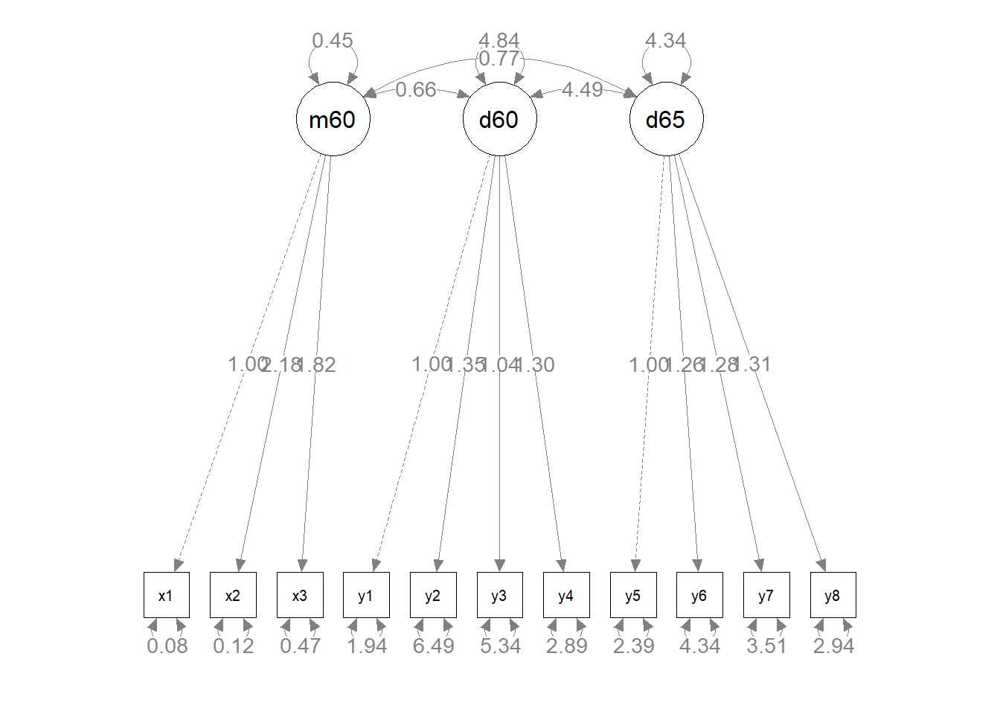

# (PART) SEM {-} 

# Struktuurivõrrandite mudelid


Kui me räägime sotsiaalteadustes mingitest kausaalsetest mõjudest, siis peame arvestama, et väga harva (pigem mitte kunagi) õnnestub meil hinnata mingi muutuja puhast mõju teisele muutujale. Taoline olukord eeldaks, et muutujate vaheline korrelatsioon oleks 1: ühe tunnuse muutus peaks olema täielikult sõltuvuses teise tunnuse muutusest ja vastupidi. Sotsiaalsete süsteemide mitmekesisus ning neis toimivate psüühikate idiosünkraatiline loomus ei luba meil praktiliselt kunagi eeldada taolist "puhast" põhjuslikkust. Kõik meie uuritavad nähtused on alati mõjutatud tohutust hulgast erinevatest teguritest ja toimijatest.

Regressioonimudeli abil on meil võimalik mõjude hindamisel võtta arvesse erinevaid taustategureid ja uuritavat mõju nende suhtes kontrollida või isegi analüüsida erinevate tegurite koosmõjusid, kuid (vähemalt praktikas) ei õnnestu meil mitte kunagi arvesse võtta kõiki võimalikke mõjusid ning kirjeldada 100% regressioonimudeli sõltuva tunnuse variatsioonist. Mudeli $R^2$, mis kirjeldab mudeli seletatud variatsiooni, ei ole kunagi 1. Me räägime heast mudelist juba siis, kui selle $R^2$ on 0.2 või 0.3, ehk me seletame sõltuva tunnuse variatsioonist 20% või 30%. See aga tähendab, et 80% või 70% tunnuse muutumise põhjustest jääb meile teadmata^[See muidugi ei tähenda, et me peaksime regressioonimudeli, mille $R^2$ on 0.2, prügikasti viskama. Üldjuhul ei olegi vaja meil tarvs kogu sõltuva tunnuse variatsiooni kirjeldada. Tahame lihtsalt teada kas mingi mõju eksisteerib või mitte. Näiteks kui leiame, et pikaaegsete töötute koolitamine tõstab nende hõivesse sisenemise tõenäosust 10% võrra, siis meid ei huvita, et seda hõiesse sisenemist mõjutavad veel mustmiljon muud tegurit. Meil on olemas kinnitus, et koolitustest on kasu ja meil on mõtet seda alustada võijätkata.]. Mingi osa sellest seletamata jäävast variatsioonist on põhjustatud  teguritest, mida me ei ole osanud mõõta. Selles osas peame peame järgmisel korral lihtsalt paremini üritama ja kaasma mudelisse võimalikult palju relevantseid tunnuseid. Teine osa on aga selline variatsioon, mida me ei saagi ammendavalt seletada. See tuleneb uuritavate eripärastest isiklikest kogemustest ja hetketujust, vastamise kontekstist või muust sarnasest. Taolist selgitamata variatsiooni nimetatakse **mõõtmisveaks** (*measurement error*). 

Tavalise regressiooni puhul ei ole meil väga palju võimalusi mõõtmisviga vähendada või seda kuidagi korrigeerida. Siinkohal tuleb meile aga appi struktuurivõrrandite modelleerimine (*structural equation modelling* ehk lühidalt SEM). SEMi abil on võimalik modelleerida meid huvitavat nähtust ilma mõõtmisveata (või vähemalt seda oluliselt vähendades). Siin on küll üks aga. Nähtus, mida me uurime, peab sellisel juhul olema mõõdetud mitme tunnusega. Kui see aga nii on, siis on SEMi abil võimalik tuvastada selle nähtuse nn **puhas hinnang** (*true score*). Kui erinevad tunnused mõõdavad ühte nähtust, siis saame nende erinevate tunnuste ühise variatsiooni abil tuvastada sellest nähtusest tuleneva variatsiooni ja mõõtmisvea kõrvale jätta.  

Mõõtmisveaga arvestamine ei ole muidugi ainukene põhjus SEM-i kasutamiseks. Tihti on uuritav nähtus lihtsalt nii mitme tahuline, et seda ei saagi ühe tunnuse abil mõõta. Või on tegemist mingi mentaalse konstruktiga, millele otse küsides ligi ei pääse ja mis eeldabki erinevate nurkade alt eri küsimusi.  Samuti saame SEM-i abil uurida väga komplekseid sotsiaalseid või psüühilisi süsteeme ja erinevate mõjude mustreid. 

Struktuurivõrrandite modelleerimine  ei ole üks konkreetne meetod, vaid laiem modelleerimisraamistik, mis ühendab endas erinevaid konkreetsemaid meetodeid. Oluliseimateks neist on faktoranalüüs (*factor analysis*) ja rajaanalüüs (*path analysis*), mis mõlemad on omakorda edasiarendused tavalisest regressioonist (seega oleks hea, kui enne nende kasutamist oleks regressioonist mingi arusaam). Vaatame lähemalt, mida need kaks SEM-i alusmeedodid endast kujutavad. 

## Rajaanalüüs
Regressioonanalüüsiga saame hinnata millised tunnused ja kui palju mõjutavad mingit sõltuvat tunnust. Meie huvi objektiks on sõltuvale tunnusele suunatud otsesed mõjud. See on aga paratamatult mõnevõrra lihtsustatud pilt märksa keerulisemast mõjude virvarrist. Rajaanalüüs võimaldab meil sotsiaalse elu paratamatut kompleksust mõnevõrra eksplitsiitsemalt välja tuua ja analüüsida. Täpsemalt võimaldab see meil hinnata lisaks otsestele mõjudele ka kaudseid mõjusid ning seeläbi luua terviklikum pilt mingite protsesside taga olevatest kausaalsetest süsteemidest. Me saame analüüsida erinevate tegurite omavaheliste mõjude mustrit ning testida mingite mõjuahelate olemasolu. Kõige lihtsam on sellest aru saada joonise näitel:

<div class="figure" style="text-align: center">

<p class="caption">(\#fig:f1)Rajaanalüüsi diagramm</p>
</div>

Joonisel \@ref(fig:f1) on kujutatud väga lihtne rajaanalüüsi mudeli diagramm (puhtalt hüpoteetiline). Meil on hüpotees, et vanemate haridustase mõjutab inimese sissetulekut (eeldame, et isa ja ema haridustase on korreleeritud sissetulekuga). Kuid see mõju ei ole otsene, vaid vahendatud läbi isiku hariduse. Vanemate haridus mõjutab inimese haridustaset, mis omakorda mõjutab sissetulekut. Sisuliselt on meil tegemist kahe regressioonimudeliga, mis on rajaanalüüsiks kokku pandud: 1) mudel, kus sõltumatuteks tunnusteks on isa ja ema haridus ning sõltuvaks tunnuseks haridus; 2) mudel, kus sõltumatuks tunnuseks on haridus ja sõltuvaks tunnuseks sissetulek.  

Sõltumatuid tunnuseid nimetatakse rajaanalüüsi kontekstis **eksogeenseteks tunnusteks**. Need on tunnused, mis ei ole mitte ühegi teise tunnuse poolt seletatud (ükski nool ei lähe nende poole). Antud mudelis on eksogeenseteks tunnusteks isa ja ema haridus. Sõltuvaid tunnuseid kutsustakse rajaanalüüsis endogeenseteks tunnusteks. **Endogeensed tunnused** on seletatud mingite teiste tunnuste poolt (vähemalt üks nool läheb selle tunnuse poole), kuid võivad ka ise olla sõltumatuks tunnuseks mingile muule tunnusele. Antud mudeli on endogeensed tunnused haridus ja sissetulek.  

### Mõjud

Rajaanalüüsi kontekstis analüüsime ja eristame erinevat tüüpi mõjusid. Kõige laiemalt võttes võib eristada otseseid mõjusid ja kaudseid mõjusid. Lisaks võib eristada kõrvalmõjusid, ühismõjusid ja vastastikmõjusid (korrelatsioonid). 


**Otsene mõju** (*direct effect*) on mõju, mida me üldjuhul taga ajamegi (joonis \@ref(fig:om)). See toimib siis kui mingi tegur mõjutab otseselt mingit nähtust. Näiteks temperatuur mõjutab otseselt elavhõbeda mahtu. Tavline regressioon hindab otsesest mõjust - palju muutub $y$ kui $x$ muutub ühe ühiku võrra. Joonisel \@ref(fig:om) kujutatud vaimse võimekuse mõju kõrgkooli sissesaamise tõenäosusele võiks ju teoreetiliselt olla otsene. Kuid kas see ka nii on? Kõrgkooli sissesaamine eeldab lisaks vaimsele võimekusele ka teatud õppeedukuse kriteeriumite täitmist või näiteks soosivat kodust keskkonda jne.

<div class="figure" style="text-align: center">

<p class="caption">(\#fig:om)Otsene mõju</p>
</div>


**Kaudset mõju** või ka vahendatud mõju (*indirect effect*) eeldame siis kui mingi tunnuse mõju ei ole enam otsene, vaid mõne muu muutuja poolt vahendatud (joonis  \@ref(fig:km)). Gümnaasiumi tase võiks ju olla prediktoriks õpilase kõrgkooli sissesaamise tõenäosuse hindamiseks, kuid tegelikult peaksime eeldama, et gümnaasiumi tase otseselt ei määra ülikooli sissesaamise tõenäosust, vaid pigem loob keskkonnda selle tõenäosuse kujunemiseks. 

<div class="figure" style="text-align: center">

<p class="caption">(\#fig:km)Kaudne mõju</p>
</div>


**Kõrvalmõjuga** (*spurious effect*) on tegemist siis kui mingite tunnuste vahel on küll seos, kuid see seos on tegelikult põhjustatud mingist muust tunnusest, mis mõjutab korraga kõiki seotuid tunnuseid (joonis \@ref(fig:kom)). Näiteks gümnaasiumi tase on tõenäoliselt tugevas positiivses korrelatsionis kõrgkooli sissesaamise tõenäosusega. Kuid võime spekuleerida, et need mõlemad tunnused on mõjutatud hoopis õpilaste õppeedukusest, mis mõjutab nii gümnaasiumi taset kui kõrgkooli sisseastumiseksamite sooritust. Seega gümnaasiumi taseme ja kõrgkooli sisseastumiseksamite sooritus vaheline korrelatsioon on põhjustatud õppeedukusest. 

<div class="figure" style="text-align: center">

<p class="caption">(\#fig:kom)Kõrvalmõju</p>
</div>


**Ühismõju** (*joint effect*) on midagi kaudse mõju ja kõrvalmõju vahepealset (joonis \@ref(fig:ym)). Meil on kaks vastasmõjus (korreleeritud) tunnust - Sotsiaalmajanduslik staatus ja sotsiaalne kapital, milles esimene mõjutab edasiõppimise tõenäosust ja teine gümnaasiumi taset (a la eliitkool või mitte). Kuna sotsiaalmajanduslik staatus ja sotsiaalne kapital on korreleeritud, siis ühe muutudes muutub ka teine ning seega muutuvad ka nii edasiõppimise tõenäosus kui ka gümnaasiumi tase. Kui me jätaksime sotsiaalmajanduliku staatuse ja sotsiaalse kapitali mängust välja, siis peaksime järeldama, et edasiõppimise tõenäosus ja gümnaasiumi tase on seotud (kuigi tegelikult ei ole). Ühismõjuga peame arvestame alati kui on tegemist korrelatsiooniga. 

<div class="figure" style="text-align: center">

<p class="caption">(\#fig:ym)Ühismõju</p>
</div>


### Rajaanalüüsi loogika

Vaatame järgmisena ühte natukene kompleksemat rajaanalüüsi mudelit (joonis \@ref(fig:r1)).


<div class="figure" style="text-align: center">

<p class="caption">(\#fig:r1)Rajaanalüüsi diagramm</p>
</div>


Kas oskate selle diagrammi põhjal määrata otsesed, kaudsed, kõrval- ja ühismõjud?

- otsed mõjud: $b_1$, $b_2$, $b_3$, $b_4$
- kaudsed mõjud: $b_1b_4$, $b_2b_4$
- kõrvalmõjud: $b_2b_3$
- ühismõjud: $b_1 \phi b_3$, $\phi b_1$, $\phi b_3$, $\phi b_2$, $\phi b_1 b_4$, $\phi b_2 b_4$

Millised on eksogeensed ja endogeensed tunnused?

- eksogeensed: *Sissetulek* ja *Haridus*
- endogeensed: *Staatus* ja *Maailmavaade*

Kuidas sellist rajaanalüüsi mudelit hinnata? Nagu eelnevalt oli jutuks, on rajaanalüüsi puhul tegemist regressioonanalüüsi edasiarendusega, kus ühte mudelisse on pandud mitu regressioonivõrrandit. Seega saame mõjude suurused kätte, kui defineerime kõik rajaanalüüsis määratletud regressioonivõrrandid. Selleks peame otsima üles kõik endogeensed (sõltuvad) tunnused ning defineerima igale neist regressioonivõrrandi, mille sõltumatuteks tunnusteks on kõik neid otseselt mõjutavad tunnused. Antud juhul tuleks meil defineerida kaks regressioonivõrrandit (sest endogeenseid tunnuseid on kaks):

$$Staatus = b_1Sissetulek + b_2 Haridus + \epsilon$$
$$Maailmavaade = b_3 Haridus + b_4 Staatus + \epsilon$$

Kui me need regressioonivõrrandid Ri abil ära hindaks, siis saadud regressioonikoefitsiendid (standardiseeritud koefitsiendid) oleksidki vastavad rajaanalüüsis defineeritud otseste mõjude suurused. Kaudsed, kõrval- ja ühismõjud saame kui korrutame neid moodustavad otsed mõjud. Näiteks kaudne mõju *Sissetuleku* ja *Maailmavaate* vahel on $b_1 \times b_4$. Kõrvalmõju *Staatuse* ja *Maailmavaate* vahel on $b_2 \times b_3$.  

Nagu näha, siis ühismõju $\phi$ (korrelatsiooni) *Sissetuleku* ja *Hariduse* vahel me ei defineerinud, kuna sellel mõjul ei ole otsest suunda, mida regressioonivõrrand eeldab. Aga loomulikult saame vajadusel selle korrelatsiooni välja arvutada. Samuti ei ole mudelites vabaliikmeid ($b_0$) kuna meie eesmärk on antud hetkel keskenduda ainult mõjudele. Vabaliikmed on aga vajalikud eelkõige keskmiste arvutamiseks. 

Tasub meeles pidada, et **rajaanalüüs ei võimalda kinnitada või määrata kausaalsuse olemasolu**. See on ikkagi ainult meetod, mille abil saame kontrollida oma teooriast tulenevaid hüpoteetilisi mõjusid. Kausaalsuse eeldused saavad põhineda ainult teoreetilistel eeldustel, mitte meetodil. 

### Korrelatsiooni dekompositsioon

Siiani oleme käsitlenud rajaanalüüsi eraldiseisva meetodina (nagu seda tihti ka kasutatakse). Nüüd aga liigume natuke lähemale rajaanalüüsi kasutamisele SEMi raamistikus. SEM põhineb korrelatsioonide (või kovariatsioonide) analüüsil. Tuleb välja, et me saame oma rajaanalüüsi mudelit väljendada struktuurivõrranditena, millega on võimalik reprodutseerida algsed tunnustevahelised korrelatsioonid. Iga kahe tunnuse vahelise korrelatsiooni (tähistatud kui $r$) saame lahutada neljaks meile juba tuttavaks komponendiks:

$$r = \text{otsene mõju} + \text{kaudne mõju} + \text{kõrvalmõju} + \text{ühismõju}$$

Seda omadust nimetatakse **dekompositsiooni reegliks** ja see võimaldab meil SEM-i raamistikus siduda andmed (korrelatsioonimaatriksi) hinnatava SEM-i mudeli parameetritega. Seega, kui meil on defineeritud kõikide mudelis olevate tunnuste vahelised teoreetilised mõjud^[võib juhtuda, et me defineerime ka näiteks ainult otsese mõju. Sellisel juhul on teised mõjud $0$ ja $r = \text{otsene mõju} + 0 + 0 + 0$], siis saame nende tunnuste korrelatsioonimaatriksi alusel arvutada nende mõjude suurused. Näidismudelis oli 4 tunnust, mis tähendab, et nende vahel on 6 korrelatsiooni (joonis \@ref(fig:r11)). 

<div class="figure" style="text-align: center">

<p class="caption">(\#fig:r11)Rajaanalüüsi diagramm</p>
</div>

Need korrelatsioonid on lähtuvalt mudelis defineeritud mõjudest dekomponeeritavad järgmiselt:

$r(Sissetulek, Haridus) = \text{ühismõju} = \phi \hspace{9.5cm}$
$r(Sissetulek, Staatus) = \text{otsene mõju} + \text{ühismõju} = b_1 + \phi b_2 \hspace{5cm}$
$r(Sissetulek, Maailmavaade) = \text{kaudne mõju} + \text{ühismõju} = b_1b_4 + \phi b_3 + \phi b_2b_4 \hspace{1cm}$
$r(Haridus, Staatus) = \text{otsene mõju} + \text{ühismõju} = b_2 + \phi b_1 \hspace{6cm}$
$r(Sissetulek, Staatus) = \text{otsene mõju} + \text{kaudne mõju} + \text{ühismõju} = b_3 + b_2b_4 + \phi b_1b_4$
$r(Staatus, Maailmavaade) = \text{otsene mõju} + \text{kõrvalmõju} + \text{ühismõju} = b_4 + b_2b_3 + b_1 \phi b_3$

Kui me need võrrandid lahendame (kus tundmatuteks on $b_1$, $b_2$, $b_3$, $b_4$), siis saamegi lähutvalt korrelatsioonimaatriksist tuletada kõikide mõjude koefitsiendid. Ei hakka seda siin tegema, kuid keskkoolist (või oli see isegi põhikoolis) peaks meeles olema, et see on võimalik.

### Rajaanalüüsi eeldused

Nagu kõikidel meetoditl, on ka rajaanalüüsil rida eeldusi:  

- Kuna rajaanalüüs koosneb lineaarse regressiooni mudelitest, siis kehtivad neile ka regressiooni eeldused. Endogeensed (sõltuvad) tunnused peaksid olema enamvähem normaaljaotusega, tunnustevahelised seosed peaksid olema lineaarsed (tavalises rajaanalüüsis ei saa kasutada ka näiteks polünoome), regressiooni jäägid (*residuals*) ei tohiks olla korreleeritud eksogeensete (sõltumatute) tunnustega.  
- Kausaalsus peab olema ühesuunaline. Seda omadust nimetatakse ka rekursiivsuseks ning see tähendab, et kausaalsuse alguspunkt ja lõppunkt ei tohi olla samad (me ei saa modeleerida kana ja muna omavahelisi mõjusid: kana > muna > kana > muna > ...).  
- Mudelis ei tohi olla multikollineaarsust. See tähendab, et tunnused, mille vahelist suhet ei ole mudeliga defineeritud ei tohiks olla tugevalt korreleeritud (kui nad on, siis peaksime vastavad seosed ka mudelis defineerima).  

Need eeldused kehtivad nn tavalise rajaanalüüsi kohta. On erinevaid spetsiifilisemaid (ja keerulisemaid) mudeleid, mille puhul nendest eeldustest saab kõrvale viilida.


## Faktoranalüüs

Faktoranalüüsi all mõeldakse üldjuhul (tegelikult küll järjest vähem) **eksploratiivset faktoranalüüsi** (*explorative factor analysis* ehk EFA)^[Eksploaratiivne faktoranalüüs aetakse omakorda tihti segamini peakomponentide meetodiga (*principal component analysis* ehk PCA). Need on oma eesmärkide ja kasutatavuse poolest küll sarnased meetodid, kuid tehniliselt siiski küllaltki erinevad]. SEMi raamistikus peame aga faktoranalüüsi all silmas **kinnitavat faktoranalüüsi** (*confirmatory factor analysis* ehk CFA). Nii EFA kui CFA eesmärgiks on uurida mingeid hüpoteetilisi kontseptsioone nagu näiteks kultuuriline kapital, eluga rahulolu või sotsiaalmajanduslik staatus. Need on kontseptsioonid, mida me ei saa otse, ühe küsimusega mõõta, sest nad on niivõrd mitmetahulised ja komplekssed ning tihti ka subjektiivsed või kontekstsuaalsed. Küll saame aga mõõta nende kontseptsioonide erinevaid tahke. Näiteks kui tahame uurida eluga rahulou, siis võime küsida inimestelt nende rahulolu tööga, isikliku eluga, ühiskondliku staatusega jne. Faktoranalüüsi (nii EFA kui CFA) eesmärgiks ongi nendest erinevatest kontseptsiooni tahkudest tuletada seda kontseptsiooni kirjeldav latentne tunnus. Neid erinevaid küsimusi nimetatakse **faktorindikaatoriteks** ja tuletatud latentset tunnust **faktoriks**. Siinkohal tasub tähele panna indikaatorite ja faktorite kausaalse seose järjestust. Mis põhjustab mida? Kuigi indikaatorid on meil nö varem käes ja nende abil me tuletame faktorid, siis tegelik kausaalne järjestus on vastupidine. Mingi hüpoteetiline latentne konstrukt mõjutab indikaatoreid.  

Miks me ei saa lihtsalt välja arvutada nende erinevate tunnuste keskmist ning võtta seda kui uuritava kontstrukti koondtunnust? Siin saab välja tuua kaks põhjust. Esiteks, kuna üldjuhul on need meie uuritavad kontstruktid (sotsiaal-) psühholoogilised ja mõõdetud küsitluste abil, siis on need väga variatiivsed ja sisaldavd paratamatult teatud **mõõtmisviga**. Ehk siis meie koondtunnus võib mingitel juhtudel olla väga vale. CFA ja ka EFA võimaldavad mõõtmisviga (vähemalt teatud määrani) elimineerida. Teiseks võib juhtuda, et me oleme küll omast arust välja mõelnud väga geniaalsed küsimused mingi konstrukti mõõtmiseks, kuid tuleb välja, et respondentide arvates ei ole tegemist üldse mingi üheselt määratletava kontstruktiga. Et näiteks raholulu tööga ei ole üldse seotud rahuloluga isikliku eluga ja need on täiesti erinevad mentaalsed kontseptsioonid. Kui aga mingit meie hüpoteetilist konstrukti mõõtma mõeldud tunnuste vahel ei ole korrelatsiooni, siis see tähendab, et meie koondtunnus ei mõõdaks üldse midagi mõistlikku. Vähemalt mitte seda, mida me plaanisime mõõta.  

Nii CFA kui EFA lähtuvad latentsete tunnuste tuletamisel mõõdetud tunnuste vahelisest korrelatsioonist (või enamikel juhtudel tegelikult kovariatasioonist^[Kovariatsioon (*covariation*) on standardiseerimata korrelatsioon.]) ning hea (st nii statistilistele kvaliteedikriteeriumitele vastava kui ka kontseptuaalselt aktsepteeritava) faktori eelduseks on indikaatorite vaheliste seoste olemasolu. Nende peamine olemus seisnebki indikaatorite ühise variatsiooni leidmises ning seeläbi nende suhete struktuuri (kovariatsiooni struktuuri) kirjeldamises. Ja kui eluga rahulolu tõesti jagunebki kaheks teineteisega mitteseotud rahulolu tüübiks, siis on need tüübid faktoranalüüsiga tuvastatavad ja eristatavad. Ka võib juhtuda, et tunnused, millega me rahulolu mõõdame, panustavad erineval määral üldisesse rahulolusse. Faktoranalüüsiga on võimalik arvestada erinevate tunnuste erinevate mõjude suurusega. Tavalise üldkeskmisega see võimalik ei ole. 

Siiani oleme rääkinud CFA-st ja EFA-st paralleelselt. Mis neid siis eristab? Nagu nimigi ütleb, on EFA puhtalt kirjeldav meetod. Selle abil saab mingite tunnuste kovariatsioonimaatriksi alusel leida neid tunnuseid ühendavaid ja eristavaid faktoreid. Piltlikult öeldes, me anname EFA-le mingi hunniku tunnuseid ja saame vastu neist moodustuvad faktorid^[See kõik on tegelikult muidugi märksa keerulisem.]. CFA puhul tuleb meil aga konkreetne faktorstruktuur eelnevalt defineerida ning CFA võimaldab meil vaid kontrollida kas meie struktuur on adekvaatne ja ka tegelikkuses kehtiv. Kui EFA puhul laaduvad kõik tunnused kõikidesse faktoritesse, siis CFA puhul laadub üks tunnus üldjuhul ainult ühte faktorisse (kuigi faktoreid võib mudelis muidugi mitu olla). Ehk siis igal tunnusel on oma kindel eelnevalt defineeritud faktor.

Tundub, nagu oleks EFA märksa mõistlikum meetod, mida kasutada - teeb ise kõik töö ära ja meil jääb üle vaid tulemused välja kirjutada. Kuid kui lähemalt mõtlema hakata, siis on CFA tegelikult teadusliku meetodiga tunduvalt kooskõlalisem. Teadlastena on meil teooriad, millest lähtuvalt püstitame testitavad hüpoteesid. CFA võimaldabki meil neid teoreetilisi hüpoteese testida ning neist laiemapõhjalisemaid järeldusi teha. Samas kui EFA abil saame vaid kirjeldada mingit konkreetset andmestikku ja selles leiduvaid seoseid, mis võivad väga vabalt olla tingitud konkreetse andmestiku eripäradest ja olla puhtalt juhuslikud.


### Kinnitav faktoranalüüs

CFA selgitamiseks ja kommunikeerimiseks on kõige mõistlikum kasutada diagramme. Joonisel \@ref(fig:fm) on kujutatud kolme faktoriline CFA mudel. 

<div class="figure" style="text-align: center">

<p class="caption">(\#fig:fm)Kinnitava faktoranalüüsi mudel</p>
</div>


- Indikaatortunnused on $x1$-$x9$ ja nad on kujutatud kastide sees. Kastid annavad märku, et tegemist on vaadeldud/mõõdetud tunnustega. 
- Indikaatorid on seletatud kolme latentse faktori poolt: $Faktor_1$, $Faktor_2$ ja $Faktor_3$. Faktorid on ringide sees, mis annab märku, et tegemist on mudeli poolt hinnatud (*estimated*) tunnustega.
- Faktorite mõjude suurused ehk faktorlaadungid on tähistatud kui $\lambda_1$ - $\lambda_9$^[$\lambda$ hääldatakse kui *lambda*]. Need on sisuliselt regressioonikordajad, mis kirjeldavad kui palju indikaator muutub, kui faktor muutub ühe ühiku võrra.
- Iga indikaatori juures on vea määrad ehk jäägid $\epsilon_1$-$\epsilon_9$, mis koondavad informatsiooni, mida me faktoritega selgitada ei suuda, ehk siis iga indikaatori unikaalset variatsiooni. Mudeli seisukohast on mudeliga mitteseletatav variatsioon viga. Jäägid on jällegi ringide sees, andes märku, et need on mudeli poolt hinnatud ja mitte otseselt mõõdetud.
- Faktorite vahel on kahesuunalised nooled, mis tähistavad faktoritevahelist korrelatsiooni. Faktorid võivad põhimõtteliselt olla korreleeritud, kuigi me üldjuhul tahaksime, et see korrelatsioon oleks väike, st faktorid oleksid võimnalikult eripärased. Indikaatorite ja vigade vahel korrelatsioone aga olla ei tohiks. Kogu indikaatorite vaheline korrelatsioon peab olema selgitatud faktorite kaudu.

Tasub jälgida noolte suundi. Nooled liiguvad faktorite ja jääkide poolt indikaatorite poole. Põhimõtteliselt on siin tegemist üheksa regressioonimudeliga, kus faktorid on sõltumatud tunnused, indikaatorid sõltuvad tunnused ning faktorlaadungid regressioonikoefitsiendid:

$$x_1 = \lambda_1 Faktor_1 + \epsilon_1$$
$$x_2 = \lambda_2 Faktor_1 + \epsilon_2$$
$$\cdots$$
$$x_9 = \lambda_9 Faktor_3 + \epsilon_9$$


### Kinnitava faktoranalüüsi loogika

CFA aluseks on korrelatsioonimaatriks (tavaliselt pigem küll kovariatsioonimaatriks). Kuidas me nende korrelatsioonide abil faktorid, faktorlaadungid ja kõik muu kätte saame? Loogika on siin sarnane rajanalüüsi puhul täheldatule. Me kasutame dekompositsiooni reeglit, et lahutada regressioonid mõju komponentideks. Mõjude suunad ja struktuur on faktormudelis eelnevalt defineeritud. Seejärel saame jälle moodustada struktuurivõrrandid. Kui need lahendada siis saamegi kätte mõjude suurused (faktorlaadungid).  

Vaatame ühefaktorilist mudelit, mis on moodustatud kolme indikaatori põhjal (joonis \@ref(fig:fm1)). 

<div class="figure" style="text-align: center">

<p class="caption">(\#fig:fm1)Faktormudeli moodustamine</p>
</div>


Kolm indikaatorit annavad meile kolm korrelatsioonikoefitsienti (tabel \@ref(tab:k1)).


```{=html}
<div class="tabwid"><style>.cl-463faf36{}.cl-46343b38{font-family:'Arial';font-size:11pt;font-weight:normal;font-style:normal;text-decoration:none;color:rgba(0, 0, 0, 1.00);background-color:transparent;}.cl-46343b4c{font-family:'Arial';font-size:11pt;font-weight:normal;font-style:italic;text-decoration:none;color:rgba(0, 0, 0, 1.00);background-color:transparent;}.cl-46343b4d{font-family:'Arial';font-size:6.6pt;font-weight:normal;font-style:normal;text-decoration:none;color:rgba(0, 0, 0, 1.00);background-color:transparent;position: relative;top:3.3pt;}.cl-463894a8{margin:0;text-align:left;border-bottom: 0 solid rgba(0, 0, 0, 1.00);border-top: 0 solid rgba(0, 0, 0, 1.00);border-left: 0 solid rgba(0, 0, 0, 1.00);border-right: 0 solid rgba(0, 0, 0, 1.00);padding-bottom:5pt;padding-top:5pt;padding-left:5pt;padding-right:5pt;line-height: 1;background-color:transparent;}.cl-4638c7b6{width:0.404in;background-color:transparent;vertical-align: middle;border-bottom: 0.75pt solid rgba(102, 102, 102, 1.00);border-top: 0.75pt solid rgba(102, 102, 102, 1.00);border-left: 0.75pt solid rgba(102, 102, 102, 1.00);border-right: 0.75pt solid rgba(102, 102, 102, 1.00);margin-bottom:0;margin-top:0;margin-left:0;margin-right:0;}.cl-4638c7c0{width:0.498in;background-color:transparent;vertical-align: middle;border-bottom: 0.75pt solid rgba(102, 102, 102, 1.00);border-top: 0.75pt solid rgba(102, 102, 102, 1.00);border-left: 0.75pt solid rgba(102, 102, 102, 1.00);border-right: 0.75pt solid rgba(102, 102, 102, 1.00);margin-bottom:0;margin-top:0;margin-left:0;margin-right:0;}.cl-4638c7ca{width:0.583in;background-color:transparent;vertical-align: middle;border-bottom: 0.75pt solid rgba(102, 102, 102, 1.00);border-top: 0.75pt solid rgba(102, 102, 102, 1.00);border-left: 0.75pt solid rgba(102, 102, 102, 1.00);border-right: 0.75pt solid rgba(102, 102, 102, 1.00);margin-bottom:0;margin-top:0;margin-left:0;margin-right:0;}.cl-4638c7cb{width:0.404in;background-color:transparent;vertical-align: middle;border-bottom: 0.75pt solid rgba(102, 102, 102, 1.00);border-top: 0 solid rgba(0, 0, 0, 1.00);border-left: 0.75pt solid rgba(102, 102, 102, 1.00);border-right: 0.75pt solid rgba(102, 102, 102, 1.00);margin-bottom:0;margin-top:0;margin-left:0;margin-right:0;}.cl-4638c7d4{width:0.498in;background-color:transparent;vertical-align: middle;border-bottom: 0.75pt solid rgba(102, 102, 102, 1.00);border-top: 0 solid rgba(0, 0, 0, 1.00);border-left: 0.75pt solid rgba(102, 102, 102, 1.00);border-right: 0.75pt solid rgba(102, 102, 102, 1.00);margin-bottom:0;margin-top:0;margin-left:0;margin-right:0;}.cl-4638c7d5{width:0.583in;background-color:transparent;vertical-align: middle;border-bottom: 0.75pt solid rgba(102, 102, 102, 1.00);border-top: 0 solid rgba(0, 0, 0, 1.00);border-left: 0.75pt solid rgba(102, 102, 102, 1.00);border-right: 0.75pt solid rgba(102, 102, 102, 1.00);margin-bottom:0;margin-top:0;margin-left:0;margin-right:0;}.cl-4638c7d6{width:0.404in;background-color:transparent;vertical-align: middle;border-bottom: 0.75pt solid rgba(102, 102, 102, 1.00);border-top: 0.75pt solid rgba(102, 102, 102, 1.00);border-left: 0.75pt solid rgba(102, 102, 102, 1.00);border-right: 0.75pt solid rgba(102, 102, 102, 1.00);margin-bottom:0;margin-top:0;margin-left:0;margin-right:0;}.cl-4638c7de{width:0.498in;background-color:transparent;vertical-align: middle;border-bottom: 0.75pt solid rgba(102, 102, 102, 1.00);border-top: 0.75pt solid rgba(102, 102, 102, 1.00);border-left: 0.75pt solid rgba(102, 102, 102, 1.00);border-right: 0.75pt solid rgba(102, 102, 102, 1.00);margin-bottom:0;margin-top:0;margin-left:0;margin-right:0;}.cl-4638c7df{width:0.583in;background-color:transparent;vertical-align: middle;border-bottom: 0.75pt solid rgba(102, 102, 102, 1.00);border-top: 0.75pt solid rgba(102, 102, 102, 1.00);border-left: 0.75pt solid rgba(102, 102, 102, 1.00);border-right: 0.75pt solid rgba(102, 102, 102, 1.00);margin-bottom:0;margin-top:0;margin-left:0;margin-right:0;}.cl-4638c7e8{width:0.404in;background-color:transparent;vertical-align: middle;border-bottom: 0.75pt solid rgba(102, 102, 102, 1.00);border-top: 0.75pt solid rgba(102, 102, 102, 1.00);border-left: 0.75pt solid rgba(102, 102, 102, 1.00);border-right: 0.75pt solid rgba(102, 102, 102, 1.00);margin-bottom:0;margin-top:0;margin-left:0;margin-right:0;}.cl-4638c7e9{width:0.498in;background-color:transparent;vertical-align: middle;border-bottom: 0.75pt solid rgba(102, 102, 102, 1.00);border-top: 0.75pt solid rgba(102, 102, 102, 1.00);border-left: 0.75pt solid rgba(102, 102, 102, 1.00);border-right: 0.75pt solid rgba(102, 102, 102, 1.00);margin-bottom:0;margin-top:0;margin-left:0;margin-right:0;}.cl-4638c7ea{width:0.583in;background-color:transparent;vertical-align: middle;border-bottom: 0.75pt solid rgba(102, 102, 102, 1.00);border-top: 0.75pt solid rgba(102, 102, 102, 1.00);border-left: 0.75pt solid rgba(102, 102, 102, 1.00);border-right: 0.75pt solid rgba(102, 102, 102, 1.00);margin-bottom:0;margin-top:0;margin-left:0;margin-right:0;}</style><table data-quarto-disable-processing='true' class='cl-463faf36'>
<caption style="display:table-caption;">(#tab:k1)<span>Korrelatsioonimaatriks</span></caption>
<thead><tr style="overflow-wrap:break-word;"><th class="cl-4638c7b6"><p class="cl-463894a8"><span class="cl-46343b38"></span></p></th><th class="cl-4638c7c0"><p class="cl-463894a8"><span class="cl-46343b4c">y</span><span class="cl-46343b4d">1</span></p></th><th class="cl-4638c7ca"><p class="cl-463894a8"><span class="cl-46343b4c">y</span><span class="cl-46343b4d">2</span></p></th><th class="cl-4638c7b6"><p class="cl-463894a8"><span class="cl-46343b4c">y</span><span class="cl-46343b4d">3</span></p></th></tr></thead><tbody><tr style="overflow-wrap:break-word;"><td class="cl-4638c7cb"><p class="cl-463894a8"><span class="cl-46343b4c">y</span><span class="cl-46343b4d">1</span></p></td><td class="cl-4638c7d4"><p class="cl-463894a8"><span class="cl-46343b38">1</span></p></td><td class="cl-4638c7d5"><p class="cl-463894a8"><span class="cl-46343b38"></span></p></td><td class="cl-4638c7cb"><p class="cl-463894a8"><span class="cl-46343b38"></span></p></td></tr><tr style="overflow-wrap:break-word;"><td class="cl-4638c7d6"><p class="cl-463894a8"><span class="cl-46343b4c">y</span><span class="cl-46343b4d">2</span></p></td><td class="cl-4638c7de"><p class="cl-463894a8"><span class="cl-46343b38">0.2</span></p></td><td class="cl-4638c7df"><p class="cl-463894a8"><span class="cl-46343b38">1</span></p></td><td class="cl-4638c7d6"><p class="cl-463894a8"><span class="cl-46343b38"></span></p></td></tr><tr style="overflow-wrap:break-word;"><td class="cl-4638c7e8"><p class="cl-463894a8"><span class="cl-46343b4c">y</span><span class="cl-46343b4d">3</span></p></td><td class="cl-4638c7e9"><p class="cl-463894a8"><span class="cl-46343b38">0.3</span></p></td><td class="cl-4638c7ea"><p class="cl-463894a8"><span class="cl-46343b38">0.24</span></p></td><td class="cl-4638c7e8"><p class="cl-463894a8"><span class="cl-46343b38">1</span></p></td></tr></tbody></table></div>
```
    

Millised mõjud meil mudelis on? Lisaks kolmele otsele mõjule (faktori ja indikaatorite vahel) on meil kolm kaudset mõju. Kuna mudelis indikaatorite vahel korrelatsioone defineeritud ei ole, siis peavad kõik indikaatorite vahelised korrelatsioonid olema vahendatud faktori poolt:  


$$r(y_1, y_2) = \text{kaudne mõju} = \lambda_1 \lambda_2$$  
$$r(y_2, y_3) = \text{kaudne mõju} = \lambda_2 \lambda_3$$  
$$r(y_1, y_3) = \text{kaudne mõju} = \lambda_1 \lambda_3$$  


Kuna reaalsed indikaatorite vahelised korrelatsioonid on meil teada, siis saame need struktuurivõrrandid lahendada. Kolme võrrandiga ja kolme tundmatuga võrrand on küllaltki lihtne, seega teeme lahenduskäigu kiirelt läbi. Meil on struktuurivõrrandid:

$$r(y_1, y_2) = \lambda_1 \lambda_2 = 0.2$$  
$$r(y_2, y_3) = \lambda_2 \lambda_3 = 0.24$$  
$$r(y_1, y_3) = \lambda_1 \lambda_3 = 0.3$$

Mis on $\lambda_2$ väärtus?
$$\frac{\lambda_1 \lambda_2}{\lambda_1 \lambda_3} = \frac{0.2}{0.3} \Rightarrow \lambda_2 = \frac{0.2 \lambda_3}{0.3}$$ 

Ja kuna
$$\lambda_2 \lambda_3 = 0.24$$

siis saame asendada $\lambda_2$-e eelmise võrrandiga: 
$$0.24 = \lambda_3(\frac{0.2 \lambda_3}{0.3})$$

Nüüd on meil ühe tundmatuga võrrand, mille saame lahendada: 
$$\lambda_3 = \sqrt{0.24(\frac{0.3}{0.2})} = 0.6$$

Teised faktorlaadungid saame kätte juba lihtsalt:
$$\lambda_2 = \frac{0.24}{\lambda_3} = \frac{0.24}{0.6} = 0.4$$
$$\lambda_1 = \frac{0.3}{\lambda_3} = \frac{0.3}{0.6} = 0.5$$

Ja nii lihtne see ongi. Me suudame tunnustevaheliste korrelatsioonide abil leida faktorlaadungid, mis ühendavad neid tunnuseid mingi latentse tunnusega. 

Puudu on veel jäägid $\epsilon_1$ - $\epsilon_3$. Korrelatsioonikoefitsiendi puhul on meil tegemist ruutjuurega seletatud variatsioonist. Mõlemad korrelatsiooni osapooled selgitavad teise osapoole variatiivsusest $r^2$ %-i. Ja kuna faktorlaadungid (standardiseeritud kujul) on lihtsalt korrelatsioonid faktori ja indikaatorite vahel^[Samamoodi nagu ühe sõltumatu tunnusega regressioonikoefitsient on korrelatsioon sõltuva ja sõltumatu tunnuse vahel], siis saame nende abil leida nii faktori poolt seletatud kui ka seletamata indikaatorite variatiivsuse.

$$\epsilon_1 = 1- \lambda_1^2 = 1- 0.5^2 = 0.75$$
$$\epsilon_2 = 1- \lambda_2^2 = 1- 0.4^2 = 0.84$$
$$\epsilon_3 = 1- \lambda_3^2 = 1- 0.6^2 = 0.64$$

Ja lõplik, meie päris enda välja arvutatud faktormudeli diagramm^[Üks asi on tegelikult puudu. Me ei arvutanud faktori dispersiooni. Kuna meie mudeli sisendiks oli korrelatsioonimaatriks, siis me otseselt ei pidanudki seda arvutama ega seda käsitlema. Korrelatsioonimaatriksist sisendi puhul on selleks dispersiooniks 1. Kuid alati see nii ei ole. Miks faktori dispersioon oluline on ja millal see 1 ei ole, sellest natukene hiljem.]:


<div class="figure" style="text-align: center">

<p class="caption">(\#fig:fm2)Faktormudeli moodustamine</p>
</div>


### Vabadusastmed

Faktorlaadungite leidmiseks pidime kasutama kõiki kolme korrelatsioonikoefitsienti. Oleks korrelatsioone olnud üks vähem, siis me ei oleks saanud võrrandeid lahendada. Mis aga juhtuks kui mudelis oleks veel üks indikaator? Sellisel juhul oleks korrelatsioonimaatriksis 6 koefitsienti ($4 \times 4 \div2 - 4$) ning peaksime hindama 4 faktorlaadungit.  Seega saaksime juurde 3 korrelatsiooni, kuid peaksime hindama vaid ühe lisaparameetri (tabel \@ref(tab:k3)).


```{=html}
<div class="tabwid"><style>.cl-474e5c92{}.cl-473fedb0{font-family:'Arial';font-size:11pt;font-weight:normal;font-style:normal;text-decoration:none;color:rgba(0, 0, 0, 1.00);background-color:transparent;}.cl-473fedba{font-family:'Arial';font-size:11pt;font-weight:normal;font-style:italic;text-decoration:none;color:rgba(0, 0, 0, 1.00);background-color:transparent;}.cl-473fedc4{font-family:'Arial';font-size:6.6pt;font-weight:normal;font-style:normal;text-decoration:none;color:rgba(0, 0, 0, 1.00);background-color:transparent;position: relative;top:3.3pt;}.cl-474865b2{margin:0;text-align:left;border-bottom: 0 solid rgba(0, 0, 0, 1.00);border-top: 0 solid rgba(0, 0, 0, 1.00);border-left: 0 solid rgba(0, 0, 0, 1.00);border-right: 0 solid rgba(0, 0, 0, 1.00);padding-bottom:5pt;padding-top:5pt;padding-left:5pt;padding-right:5pt;line-height: 1;background-color:transparent;}.cl-4748937a{width:0.404in;background-color:transparent;vertical-align: middle;border-bottom: 0.75pt solid rgba(102, 102, 102, 1.00);border-top: 0.75pt solid rgba(102, 102, 102, 1.00);border-left: 0.75pt solid rgba(102, 102, 102, 1.00);border-right: 0.75pt solid rgba(102, 102, 102, 1.00);margin-bottom:0;margin-top:0;margin-left:0;margin-right:0;}.cl-47489384{width:0.498in;background-color:transparent;vertical-align: middle;border-bottom: 0.75pt solid rgba(102, 102, 102, 1.00);border-top: 0.75pt solid rgba(102, 102, 102, 1.00);border-left: 0.75pt solid rgba(102, 102, 102, 1.00);border-right: 0.75pt solid rgba(102, 102, 102, 1.00);margin-bottom:0;margin-top:0;margin-left:0;margin-right:0;}.cl-47489385{width:0.583in;background-color:transparent;vertical-align: middle;border-bottom: 0.75pt solid rgba(102, 102, 102, 1.00);border-top: 0.75pt solid rgba(102, 102, 102, 1.00);border-left: 0.75pt solid rgba(102, 102, 102, 1.00);border-right: 0.75pt solid rgba(102, 102, 102, 1.00);margin-bottom:0;margin-top:0;margin-left:0;margin-right:0;}.cl-47489386{width:0.387in;background-color:transparent;vertical-align: middle;border-bottom: 0.75pt solid rgba(102, 102, 102, 1.00);border-top: 0.75pt solid rgba(102, 102, 102, 1.00);border-left: 0.75pt solid rgba(102, 102, 102, 1.00);border-right: 0.75pt solid rgba(102, 102, 102, 1.00);margin-bottom:0;margin-top:0;margin-left:0;margin-right:0;}.cl-4748938e{width:0.404in;background-color:transparent;vertical-align: middle;border-bottom: 0.75pt solid rgba(102, 102, 102, 1.00);border-top: 0 solid rgba(0, 0, 0, 1.00);border-left: 0.75pt solid rgba(102, 102, 102, 1.00);border-right: 0.75pt solid rgba(102, 102, 102, 1.00);margin-bottom:0;margin-top:0;margin-left:0;margin-right:0;}.cl-4748938f{width:0.498in;background-color:transparent;vertical-align: middle;border-bottom: 0.75pt solid rgba(102, 102, 102, 1.00);border-top: 0 solid rgba(0, 0, 0, 1.00);border-left: 0.75pt solid rgba(102, 102, 102, 1.00);border-right: 0.75pt solid rgba(102, 102, 102, 1.00);margin-bottom:0;margin-top:0;margin-left:0;margin-right:0;}.cl-47489398{width:0.583in;background-color:transparent;vertical-align: middle;border-bottom: 0.75pt solid rgba(102, 102, 102, 1.00);border-top: 0 solid rgba(0, 0, 0, 1.00);border-left: 0.75pt solid rgba(102, 102, 102, 1.00);border-right: 0.75pt solid rgba(102, 102, 102, 1.00);margin-bottom:0;margin-top:0;margin-left:0;margin-right:0;}.cl-47489399{width:0.387in;background-color:transparent;vertical-align: middle;border-bottom: 0.75pt solid rgba(102, 102, 102, 1.00);border-top: 0 solid rgba(0, 0, 0, 1.00);border-left: 0.75pt solid rgba(102, 102, 102, 1.00);border-right: 0.75pt solid rgba(102, 102, 102, 1.00);margin-bottom:0;margin-top:0;margin-left:0;margin-right:0;}.cl-474893a2{width:0.404in;background-color:transparent;vertical-align: middle;border-bottom: 0.75pt solid rgba(102, 102, 102, 1.00);border-top: 0.75pt solid rgba(102, 102, 102, 1.00);border-left: 0.75pt solid rgba(102, 102, 102, 1.00);border-right: 0.75pt solid rgba(102, 102, 102, 1.00);margin-bottom:0;margin-top:0;margin-left:0;margin-right:0;}.cl-474893a3{width:0.498in;background-color:transparent;vertical-align: middle;border-bottom: 0.75pt solid rgba(102, 102, 102, 1.00);border-top: 0.75pt solid rgba(102, 102, 102, 1.00);border-left: 0.75pt solid rgba(102, 102, 102, 1.00);border-right: 0.75pt solid rgba(102, 102, 102, 1.00);margin-bottom:0;margin-top:0;margin-left:0;margin-right:0;}.cl-474893ac{width:0.583in;background-color:transparent;vertical-align: middle;border-bottom: 0.75pt solid rgba(102, 102, 102, 1.00);border-top: 0.75pt solid rgba(102, 102, 102, 1.00);border-left: 0.75pt solid rgba(102, 102, 102, 1.00);border-right: 0.75pt solid rgba(102, 102, 102, 1.00);margin-bottom:0;margin-top:0;margin-left:0;margin-right:0;}.cl-474893ad{width:0.387in;background-color:transparent;vertical-align: middle;border-bottom: 0.75pt solid rgba(102, 102, 102, 1.00);border-top: 0.75pt solid rgba(102, 102, 102, 1.00);border-left: 0.75pt solid rgba(102, 102, 102, 1.00);border-right: 0.75pt solid rgba(102, 102, 102, 1.00);margin-bottom:0;margin-top:0;margin-left:0;margin-right:0;}.cl-474893ae{width:0.404in;background-color:transparent;vertical-align: middle;border-bottom: 0.75pt solid rgba(102, 102, 102, 1.00);border-top: 0.75pt solid rgba(102, 102, 102, 1.00);border-left: 0.75pt solid rgba(102, 102, 102, 1.00);border-right: 0.75pt solid rgba(102, 102, 102, 1.00);margin-bottom:0;margin-top:0;margin-left:0;margin-right:0;}.cl-474893b6{width:0.498in;background-color:transparent;vertical-align: middle;border-bottom: 0.75pt solid rgba(102, 102, 102, 1.00);border-top: 0.75pt solid rgba(102, 102, 102, 1.00);border-left: 0.75pt solid rgba(102, 102, 102, 1.00);border-right: 0.75pt solid rgba(102, 102, 102, 1.00);margin-bottom:0;margin-top:0;margin-left:0;margin-right:0;}.cl-474893b7{width:0.583in;background-color:transparent;vertical-align: middle;border-bottom: 0.75pt solid rgba(102, 102, 102, 1.00);border-top: 0.75pt solid rgba(102, 102, 102, 1.00);border-left: 0.75pt solid rgba(102, 102, 102, 1.00);border-right: 0.75pt solid rgba(102, 102, 102, 1.00);margin-bottom:0;margin-top:0;margin-left:0;margin-right:0;}.cl-474893c0{width:0.387in;background-color:transparent;vertical-align: middle;border-bottom: 0.75pt solid rgba(102, 102, 102, 1.00);border-top: 0.75pt solid rgba(102, 102, 102, 1.00);border-left: 0.75pt solid rgba(102, 102, 102, 1.00);border-right: 0.75pt solid rgba(102, 102, 102, 1.00);margin-bottom:0;margin-top:0;margin-left:0;margin-right:0;}</style><table data-quarto-disable-processing='true' class='cl-474e5c92'>
<caption style="display:table-caption;">(#tab:k3)<span>Korrelatsioonimaatriks</span></caption>
<thead><tr style="overflow-wrap:break-word;"><th class="cl-4748937a"><p class="cl-474865b2"><span class="cl-473fedb0"></span></p></th><th class="cl-47489384"><p class="cl-474865b2"><span class="cl-473fedba">y</span><span class="cl-473fedc4">1</span></p></th><th class="cl-47489385"><p class="cl-474865b2"><span class="cl-473fedba">y</span><span class="cl-473fedc4">2</span></p></th><th class="cl-47489384"><p class="cl-474865b2"><span class="cl-473fedba">y</span><span class="cl-473fedc4">3</span></p></th><th class="cl-4748937a"><p class="cl-474865b2"><span class="cl-473fedba">y</span><span class="cl-473fedc4">4</span></p></th><th class="cl-47489386"><p class="cl-474865b2"><span class="cl-473fedba">X</span></p></th></tr></thead><tbody><tr style="overflow-wrap:break-word;"><td class="cl-4748938e"><p class="cl-474865b2"><span class="cl-473fedba">y</span><span class="cl-473fedc4">1</span></p></td><td class="cl-4748938f"><p class="cl-474865b2"><span class="cl-473fedb0">1</span></p></td><td class="cl-47489398"><p class="cl-474865b2"><span class="cl-473fedb0"></span></p></td><td class="cl-4748938f"><p class="cl-474865b2"><span class="cl-473fedb0"></span></p></td><td class="cl-4748938e"><p class="cl-474865b2"><span class="cl-473fedb0"></span></p></td><td class="cl-47489399"><p class="cl-474865b2"><span class="cl-473fedb0"></span></p></td></tr><tr style="overflow-wrap:break-word;"><td class="cl-474893a2"><p class="cl-474865b2"><span class="cl-473fedba">y</span><span class="cl-473fedc4">2</span></p></td><td class="cl-474893a3"><p class="cl-474865b2"><span class="cl-473fedb0">0.2</span></p></td><td class="cl-474893ac"><p class="cl-474865b2"><span class="cl-473fedb0">1</span></p></td><td class="cl-474893a3"><p class="cl-474865b2"><span class="cl-473fedb0"></span></p></td><td class="cl-474893a2"><p class="cl-474865b2"><span class="cl-473fedb0"></span></p></td><td class="cl-474893ad"><p class="cl-474865b2"><span class="cl-473fedb0"></span></p></td></tr><tr style="overflow-wrap:break-word;"><td class="cl-474893ae"><p class="cl-474865b2"><span class="cl-473fedba">y</span><span class="cl-473fedc4">3</span></p></td><td class="cl-474893b6"><p class="cl-474865b2"><span class="cl-473fedb0">0.3</span></p></td><td class="cl-474893b7"><p class="cl-474865b2"><span class="cl-473fedb0">0.24</span></p></td><td class="cl-474893b6"><p class="cl-474865b2"><span class="cl-473fedb0">1</span></p></td><td class="cl-474893ae"><p class="cl-474865b2"><span class="cl-473fedb0"></span></p></td><td class="cl-474893c0"><p class="cl-474865b2"><span class="cl-473fedb0"></span></p></td></tr><tr style="overflow-wrap:break-word;"><td class="cl-474893ae"><p class="cl-474865b2"><span class="cl-473fedba">y</span><span class="cl-473fedc4">4</span></p></td><td class="cl-474893b6"><p class="cl-474865b2"><span class="cl-473fedb0">0.3</span></p></td><td class="cl-474893b7"><p class="cl-474865b2"><span class="cl-473fedb0">0.2</span></p></td><td class="cl-474893b6"><p class="cl-474865b2"><span class="cl-473fedb0">0.4</span></p></td><td class="cl-474893ae"><p class="cl-474865b2"><span class="cl-473fedb0">1</span></p></td><td class="cl-474893c0"><p class="cl-474865b2"><span class="cl-473fedb0"></span></p></td></tr><tr style="overflow-wrap:break-word;"><td class="cl-474893a2"><p class="cl-474865b2"><span class="cl-473fedba">X</span></p></td><td class="cl-474893a3"><p class="cl-474865b2"><span class="cl-473fedb0">0.5</span></p></td><td class="cl-474893ac"><p class="cl-474865b2"><span class="cl-473fedb0">0.4</span></p></td><td class="cl-474893a3"><p class="cl-474865b2"><span class="cl-473fedb0">0.6</span></p></td><td class="cl-474893a2"><p class="cl-474865b2"><span class="cl-473fedb0">?</span></p></td><td class="cl-474893ad"><p class="cl-474865b2"><span class="cl-473fedb0">1</span></p></td></tr></tbody></table></div>
```


Neljanda faktorlaadungi saame välja arvutada ühe lisandunud korrelatsiooni abil:

$$\lambda_4 = \frac{r(y_1, y_4)}{\lambda_1} = \frac{0.3}{0.5}$$

Ehk siis mudelis on nüüd kuus ühikut infot, millest kõigi parameetrite hindamiseks on vaja vaid nelja ühikut. Neid üle jäänud infoühikuid nimetatakse **vabadusastemeteks** (*degrees of freedom* või *df*). Kui vabadusastemid on rohkem kui 0, siis ütleme, et meie mudel on **üleidentifitseeritud**. Kui vabadusastmeid on täpselt 0, siis on mudel **identifitseeritud**. Ja kui vabadusastemid on vähem kui 0, ehk siis meil on vähem infoühikuid kui parameetreid, siis mudel ei ole identifitseeritud. Sellisel juhul me ei saa tuletada andmetest unikaalseid parameetreid ja ei saa mudelit hinnata. Näiteks ei ole võimalik hinnata kahe indikaatoriga mudelit. Sellisel juhul oleks korrelatsioone üks, kuid parameetreid kaks.


### Mudeli sobivus

Tahame üldjuhul alati, et mudel oleks üleidentifitseeritud. Kui meil on infoühikuid üle, siis saame neid kasutada mudeli kvaliteedi hindamiseks. Täpsemalt saame hinnata, kuivõrd hästi mudel sobitub meie andmetega. 
Antud juhul jäi meil üle kaks korrelatsiooni. Lisaks selle, et meil on need algsed korrelatsioonid teada, saame need tuletada ka juba välja arvutatud faktorlaadungitest:

$$r(y_2, y_4) = 0.2 \text{  ja  } r(y_2, y_4) = \lambda_2 \lambda_4$$
$$r(y_3, y_4) = 0.4 \text{  ja  } r(y_3, y_4) = \lambda_3 \lambda_4$$


Kui need mõlemad väärtused, algne korrelatsioon ja tuletatud korrelatsioon, on samad, siis saame järeldada, et meie defineeritud struktuur kirjeldab täpselt andmetes olevaid seoseid. Kui need aga ei kattu, siis oleme mingil määral oma mudeli valesti defineerinud.  

Arvutame algsete korrelatsioonide ja tuletatud korrelatsioonide vahed:
$$r(y_2, y_4) - \lambda_2 \lambda_4 = 0.2 - 0.4\times0.6 = -0.04$$
$$r(y_3, y_4) - \lambda_3 \lambda_4 = 0.4 - 0.6\times0.6 = 0.04$$
Need erinevused on mudeli jäägid (*residuals*). Saame nad arvutada kõikide korreltasioonikordajate jaoks (sellisel juhul kasutame parameetrite arvutamiseks lihtsalt teisi korrelatsioone). Kui need jäägid on suured, siis see tähendab, et meie defineeritud mudel ei vasta andmetele (ja on valesti defineeritud). See tähendab, et meie mudeli parameetrid võivad olla valed, nende standardvead võivad olla valed ja seega ka mudelist tehtavad järeldused võivad olla valed.

Korrelatsioonimaatriksit (või kovariatsioonimaatriksit), mis moodustub nendest mudeli põhjal tuletatud korrelatsioonidest, nimetatakse **mudelipõhiseks maatriksiks** (*model-implied matrix* või *fitted matrix*). Algsete korrelatsioonide ning tuletatud korrelatsioonide vahe maatriksit nimetatakse **jääkide maatriksiks** (*residual matrix*).

Kui mudel sobitub andmetega väga hästi, siis ei tähenda see automaatselt, et meil on tegemist hea mudeliga. Võib juhtuda, et hästi sobituva mudeli puhul ei ole meie faktorlaadungid olulised (ehk siis indikaatorid ei ole omavahel seotud) või on mudel teoreetiliselt mittesobiv.


### Veel mudeli identifikatsioonist

Me oleme näidetena käsitlenud korrelatsioonimaatriksitel põhinevaid mudeleid, kuid tegelikult kasutatakse enamikul juhtudel mudeli alustena kovariatsioonimaatrikseid. Lisaks saab mudelitesse lisada ka indikaatorite keskmisi (neid käsitletakse sel juhul analoogselt regressioonimudelite vabaliikmetega). Mõningad keerulisemad mudelid eeldavad kogu andmestiku olemasolu. Tegelikult see sisendi kuju ei olegi väga tähtis, sest reaalsuses anname me SEM-i programmidesse sisendina nii ehk naa kogu andmestiku ning programm keerab selle ise vajalikku vormi. 

Kuid keerulisemate sisenditega kaasneb ka muutus mudelite identifitseerimise loogikas. Kui sisendiks on kovariatsioonimaatriks, siis saame kaasa ka iga indikaatori dispersiooni. Ehk meil on kasutada rohkem infot, kuid samas peame hindama ka rohkem parameetreid. Kui mudelis on ka keskmised (vabaliikmed), siis peame hindama iga indikaatori vabaliikme ning ka faktortunnuse keskmise. Ehk kui meil on keskmistega mudel kolme indikaatoriga, siis meil oleks vaja nelja keskmist, kuid on ainult kolm. Probleem on ka faktori dispersiooniga. Kuna faktor on latentne tunnus siis ei ole sellel mingit konkreetset skaalat ning meil ei ole mingit referentspunkti, millest lähtuda.

Võtame järgmise näite. Meil on 5 tunnusega ühefaktoriline mudel. Kasutada on 20 infoühikut:  

- 5 keskmist
- 5 dispersiooni
- 10 kovariatsiooni

Faktormudelis (keskmistega mudelis) peab olema defineeritud 17 parameetrit:  

- 5 faktorlaadungit
- 5 jääkide variatsiooni
- 5 vabaliiget
- 1 faktori keskmine
- 1 faktori dispersioon

Kuigi meil on 3 vabadusastet, pole mudel ometi identifitseeritud. Puudu on üks dispersioon ja üks keskmine.

Mida siis teha? Variante on tegelikult mitu. Kui tegemist on ilma keskmisteta mudeliga, siis peame valima ühe kahest variandist:  

- Fikseerime iga faktori puhul ühe faktorlaadungi $1$-ks. Sellega anname faktori skaalale referentspunkti, mis võimaldab määrata dispersiooni.
- Fikseerime faktori dispersiooni $1$-ks (oma näites kasutasime vaikimisi seda varianti)

Kui meil on tegemist keskmistega mudeliga, siis peame lisaks kasutama veel ühte kahest piirangust:  

- Fikseerime ühe vabaliikme $0$-ks
- Fikseerime faktori keskmise $0$-ks

SEM-i programmid üldjuhul kasutavad neid piiranguid vajaduse korral automaatselt. Seega me ei peaks väga palju selle identifitseerimise pärast pead valutama. Tasub lihtsalt sellest asjast teadlik olla. Üldjuhul on automaatselt kasutatavateks piiranguteks ühe faktorlaadungi $1$-na fikseerimine ning keskmistega mudeli korral faktori keskmise fikseerimine.

## Sruktuurivõrrandite mudelid

Lõpuks oleme jõudnud ka põhiteema, SEM-i, juurde. Kuid õnneks siin enam väga millestki rääkida ei olegi. SEM-iks nimetataksegi mudelit, milles on kinnitav faktoranalüüs ja rajaanalüüs kokku pandud. See tähendab mudelit, kus on mingid latentsed tunnused ning analüüsitakse latentsete tunnuste vahelisi või latentsete tunnuste ja eksogeensete tunnuste vahelisi mõjusid. SEM-i mudel jaguneb **mõõtmismudeliks** (faktoranalüüs) ja **struktuurimudeliks** (rajaanalüüs või ka tavaline regressioon) (joonis \@ref(fig:sem1)).  

<div class="figure" style="text-align: center">

<p class="caption">(\#fig:sem1)Struktuurivõrrandite mudeli diagramm</p>
</div>


Joonisel \@ref(fig:sem1) on kujutatud küllaltki lihtne SEM-i mudel. Mõõtmismudelina on defineeritud kaks kolme indikaatoriga faktorit. Struktuurimudelis on defineeritud Faktor 1-e mõju Faktor 2-le ($\beta_1$). Lisaks on struktuurimudelis eksogeenne tunnus  $x$, mis mõjutab nii Faktor 1-te ($\beta_2$) kui ka Faktor 2-te ($\beta_3$)  


## Struktuurivõrrandite mudelid Ris

R-is on SEM-i jaoks mitmeid pakette. Neist peamised on *lavaan*, *sem* ja *openMX*. Neist kõige võimekam (minu subjektiivse arvamuse järgi) ja tõenäoliselt ka populaarseim on *lavaan*. Tegemist on väga intensiivselt arendatava paketiga, mida näitab ka asjaolu, et kuigi pakett on ligi 10 aastat vana, siis on see ikka veel beeta-versioon staatuses. Ehk siis uusi võimalusi tuleb pidevalt peale ning pakett ei ole siiani "valmis" saanud. [*lavaan*-i kodulehelt](http://lavaan.ugent.be/) on võimalik paketi kohta täpsemalt lugeda. Seal on ka hulgaliselt *tutoriale* ja muid materjale.  

*lavaan* on oma süntaksilt, väljundilt ja ka tehniliselt küllaltki sarnande MPlus-i programmile. Mplus on päris kindlasti kõige parem, arenenum ja suurimate võimalustega SEM-i tarkvara, kuid paraku mitte vabavara, nagu R ja *lavaan*. Kuid kui on vaja mingeid keerulisemaid või spetsiifilisemaid  mudeleid teha, siis tasub sinnapoole vaadata. Jällegi, [MPlus-i kodulehelt](https://www.statmodel.com/) saab lisaks programmile seonduvale lugeda ka palju muud põnevat SEM-i kohta.  

Kõigepealt loeme sisse vajalikud paketid. Ja nagu alati, kui mõnda paketti ei ole eelnevalt installitud, siis tuleb seda teha (`install.packages()` funktsiooniga, kus paketi nimi peab olema jutumärkides).


``` r
library(lavaan)
library(semPlot)
library(dplyr)
```


### lavaani süntaks

*lavaan*-is tuleb mudeli võrrand defineerida *formula* formaadis tekstilise objektina. See tähendab, et kogu mudeli definitsioon peaks olema jutumärkide sees (ja Rstudio peaks selle roheliseks värvima).

Tavaline regressioon on defineeritav identselt tavalisele regressioonile `lm` funktsioonis, kus sõltuv tunnus on eraldatud sõltumatutsest tildega ja sõltumatud tunnused üksteisest plussmärgiga (koosmõjude puhul * või : märgiga):


``` r
mod <- 'y ~ x1 + x2'
mod <- 'y ~ x1 * x2' # koosmõjudega mudel 
```

SEM'is tuleb meil pea alati defineerida mitu võrrandit. Sellisel juhul peavad nad kõik olema ühe tekstilise objekti sees ning erinevatel ridadel:


``` r
mod <- 'y1 ~ x1 + x2
        y2 ~ x2 + x3 + x4
        y1 ~ y2'
```

Faktorid tuleb defineerida `=~` märgiga:


``` r
mod <- 'f1 =~ y1 + y2 + y3
        f2 =~ y4 + y5 + y6'
```

Variatsioonid ja kovariatsioonid saab vajadusel defineerida kahe tildega:


``` r
mod <- '
y1 ~~ y2
f1 ~~ f2
'
```


Andmestikuna kasutame *lavaan*-iga kaasa olevat näidisandmestikkus *PoliticalDemocracy*. Andmestik sisaldab demokraatia ja majanduse mõõdikuid erinevate riikide kohta. Täpsemalt saab andmestiku kohta lugeda selle abifailist `help(PoliticalDemocracy)`


``` r
# paneme andmed mugavama nime alla
dt <- PoliticalDemocracy
# muudame ka mõned tunnuste nimed arusaadavamaks
dt <- dt %>% 
  rename(free_press_60 = y1, fair_elect_60 = y3, fair_elect_65 = y7, gnp_60 = x1)
```


### Regressioon

Kuigi *lavaan* on mõeldud eelkõige SEM-i jaoks, siis saab sellega väga edukalt ka tavalist regressiooni jooksutada. Mis on ka iseenesest mõistetav, arvestades asjaolu, et SEM ju suures osas ongi laiendatud regressioonanalüüs. Vaatame kuidas on valimisvabadus seotud pressivabadusega. Selleks peame kõigepealt defineerima mudeli ning seejärel seda jooksutama funktsiooniga `sem()`. Tulemusi näeme 'summary()' funktsiooniga nagu tavalise regressiooni puhulgi. 


``` r
# Defineeerime mudeli
mod <- 'fair_elect_60 ~ free_press_60'

# Jooksutame mudelit
fit <- sem(mod, data = dt)
summary(fit)
```

```
## lavaan 0.6-19 ended normally after 1 iteration
## 
##   Estimator                                         ML
##   Optimization method                           NLMINB
##   Number of model parameters                         2
## 
##   Number of observations                            75
## 
## Model Test User Model:
##                                                       
##   Test statistic                                 0.000
##   Degrees of freedom                                 0
## 
## Parameter Estimates:
## 
##   Standard errors                             Standard
##   Information                                 Expected
##   Information saturated (h1) model          Structured
## 
## Regressions:
##                    Estimate  Std.Err  z-value  P(>|z|)
##   fair_elect_60 ~                                     
##     free_press_60     0.849    0.106    8.000    0.000
## 
## Variances:
##                    Estimate  Std.Err  z-value  P(>|z|)
##    .fair_elect_60     5.731    0.936    6.124    0.000
```

Saame kätte regressioonikoefitsiendi, selle p väärtuse ja sõltuva tunnuse disprsiooni. Kuid puudu on vabaliige. Kuna SEM on üldjoontes kovariatsiooni struktuuride analüüsimise raamistik, siis vaikimisi vabaliiget mudelisse ei kaasta. Üldiselt SEM'i mudelite puhul see meid niiväga ka ei huvita. Me tahame näha pigem mõjusid ja seoseid. Kuid vajadusel saame vabaliikme lisada `meanstructure = T` argumendiga.  
Veel on puudu $R^2$. Selle saame samuti juurde panna `rsquare=T` argumendiga. 
Ka F-testi meile ei näidata. Ja seda ka ei saa, kuna hindamine toimub *maximum likelihood* meetodiga. Samamoodi ei saa me F-testi `glm()` funktsiooniga.  
Paneme mainitud argumendid juurde ja jooksutame koodi uuesti:


``` r
# defineeerime mudeli
mod <- 'fair_elect_60 ~ free_press_60'

# Jooksutame mudelit
fit <- sem(mod, data = dt, meanstructure = T)
summary(fit, rsquare=T)
```

```
## lavaan 0.6-19 ended normally after 1 iteration
## 
##   Estimator                                         ML
##   Optimization method                           NLMINB
##   Number of model parameters                         3
## 
##   Number of observations                            75
## 
## Model Test User Model:
##                                                       
##   Test statistic                                 0.000
##   Degrees of freedom                                 0
## 
## Parameter Estimates:
## 
##   Standard errors                             Standard
##   Information                                 Expected
##   Information saturated (h1) model          Structured
## 
## Regressions:
##                    Estimate  Std.Err  z-value  P(>|z|)
##   fair_elect_60 ~                                     
##     free_press_60     0.849    0.106    8.000    0.000
## 
## Intercepts:
##                    Estimate  Std.Err  z-value  P(>|z|)
##    .fair_elect_60     1.924    0.642    2.996    0.003
## 
## Variances:
##                    Estimate  Std.Err  z-value  P(>|z|)
##    .fair_elect_60     5.731    0.936    6.124    0.000
## 
## R-Square:
##                    Estimate
##     fair_elect_60     0.460
```

Nüüd on olemas nii $R^2$ kui vabaliige. Vaatame, kas tulemused on sarnased `lm()` funktsioonile.


``` r
summary(lm(fair_elect_60 ~ free_press_60, data = dt))
```

```
## 
## Call:
## lm(formula = fair_elect_60 ~ free_press_60, data = dt)
## 
## Residuals:
##     Min      1Q  Median      3Q     Max 
## -6.7629 -1.0838  0.2313  1.7092  3.9162 
## 
## Coefficients:
##               Estimate Std. Error t value Pr(>|t|)    
## (Intercept)     1.9245     0.6511   2.956   0.0042 ** 
## free_press_60   0.8488     0.1075   7.893 2.24e-11 ***
## ---
## Signif. codes:  0 '***' 0.001 '**' 0.01 '*' 0.05 '.' 0.1 ' ' 1
## 
## Residual standard error: 2.426 on 73 degrees of freedom
## Multiple R-squared:  0.4604,	Adjusted R-squared:  0.453 
## F-statistic: 62.29 on 1 and 73 DF,  p-value: 2.24e-11
```

Suhteliselt sarnased. Mõningane erinevus tulenebki erinevatest hindamismeetoditest ja võimalik et mingitest ümardamistest vms. Tavalise regresiooniga saame ka RSE (*Residual standard error*) ehk jääkide standardvea. See näitab regressiooni jääkide, mudeli (ehk sõltuva tunnuse) seletamata jäänud variatsiooni keskmist suurust. Kuigi *lavaan*-i väljundis seda numbrit ei ole, siis see väärtus on seal ikkagi olemas. Nimelt sõltuva tunnuse dispersiooni näol. Disepersioon on standardhälve ruudus, seega:

``` r
sqrt(5.731)
```

```
## [1] 2.393951
```


### Rajaanalüüs

Defineerime rajaanalüüsi mudeli, milles vaatame kuidas valimisvabadus 1965 aastal on mõjutatud valimisvabadusest 1960 aastal, pressivabadusest 1960 aastal ja rahvamajanduse kogutoodangust (GNP) 1960 aastal. Eeldame et valimisvabadus 1960 aastal on omakorda mõjutatud ajakirjandusvabadusest 1960 aastal pressivabadus 1960 aastal on mõjutatud rahvamajanduse kogutoodangust (GNP). See ei ole nüüd mingi väga sisuline hüpotees. Kuid võiks ju eeldada, et vabad valimised on eelduseks järgmistele vabadele valimistele, pressivabadus on eelduseks nii praegustele kui järgmistele valimistele ning rikkamad rikkamates (arenenumates) riikides on nii valimiste kui ajakirjandusega paremad lood.  
Keerulisemaid mudeleid on kirjalikult suhteliselt keeruline defineerida. Siin aitab see, kui need eelnevalt näiteks üles joonistada. Nii on kõik silme ees ning lihtsam neid ka kirja panna.  


``` r
mod <- 'fair_elect_65 ~ fair_elect_60 + free_press_60 + gnp_60
        fair_elect_60 ~ free_press_60 
        free_press_60 ~ gnp_60'

fit <- sem(mod, data = dt)

# Kasutame standardiseeritud lahendit
summary(fit, standardized=T)
```

```
## lavaan 0.6-19 ended normally after 1 iteration
## 
##   Estimator                                         ML
##   Optimization method                           NLMINB
##   Number of model parameters                         8
## 
##   Number of observations                            75
## 
## Model Test User Model:
##                                                       
##   Test statistic                                 0.756
##   Degrees of freedom                                 1
##   P-value (Chi-square)                           0.385
## 
## Parameter Estimates:
## 
##   Standard errors                             Standard
##   Information                                 Expected
##   Information saturated (h1) model          Structured
## 
## Regressions:
##                    Estimate  Std.Err  z-value  P(>|z|)   Std.lv  Std.all
##   fair_elect_65 ~                                                       
##     fair_elect_60     0.341    0.107    3.181    0.001    0.341    0.341
##     free_press_60     0.495    0.140    3.532    0.000    0.495    0.396
##     gnp_60            0.568    0.381    1.490    0.136    0.568    0.127
##   fair_elect_60 ~                                                       
##     free_press_60     0.849    0.106    8.000    0.000    0.849    0.679
##   free_press_60 ~                                                       
##     gnp_60            1.367    0.382    3.580    0.000    1.367    0.382
## 
## Variances:
##                    Estimate  Std.Err  z-value  P(>|z|)   Std.lv  Std.all
##    .fair_elect_65     4.936    0.806    6.124    0.000    4.936    0.466
##    .fair_elect_60     5.731    0.936    6.124    0.000    5.731    0.540
##    .free_press_60     5.796    0.947    6.124    0.000    5.796    0.854
```

Standardiseeritud lahend on tulbas *Std.all*. Näeme, et meie hüpoteesid pidasid suures osas paika. Kõik mõjud on positiivsed ja olulised (p > 0.5). Erandiks on rahvamajanduse kogutoodangu mõju valimisvabadusele 65 aastal. Seega oleks otstarbekas see mõju mudelist välja jätta.

Lihtsam on rajaanalüüsist aru saada rajadiagrammi põhjal. Funktsioon `semPath()` võimaldam mudeli alusel selle diagrammi mugavlt välja joonistada- See ei tee just kõige ilusamaid jooniseid, avaldamiseks päris ei sobi, kuid ülevaate saab selle kaudu kätte.  


``` r
semPaths(fit, node.width = 2, edge.label.cex = 1, what = "paths", whatLabels = 'stand')
```


Jätame GNP mõju valimisvabadusele 65 aastal välja ja jooksutame mudeli uuesti (salvestame selle ka teise mudeliobjekti):


``` r
mod <- 'fair_elect_65 ~ fair_elect_60 + free_press_60
        fair_elect_60 ~ free_press_60 
        free_press_60 ~ gnp_60'

fit1 <- sem(mod, data = dt)

# Kasutame standardiseeritud lahendit
summary(fit1, standardized=T)
```

```
## lavaan 0.6-19 ended normally after 1 iteration
## 
##   Estimator                                         ML
##   Optimization method                           NLMINB
##   Number of model parameters                         7
## 
##   Number of observations                            75
## 
## Model Test User Model:
##                                                       
##   Test statistic                                 2.922
##   Degrees of freedom                                 2
##   P-value (Chi-square)                           0.232
## 
## Parameter Estimates:
## 
##   Standard errors                             Standard
##   Information                                 Expected
##   Information saturated (h1) model          Structured
## 
## Regressions:
##                    Estimate  Std.Err  z-value  P(>|z|)   Std.lv  Std.all
##   fair_elect_65 ~                                                       
##     fair_elect_60     0.357    0.109    3.283    0.001    0.357    0.356
##     free_press_60     0.542    0.136    3.985    0.000    0.542    0.433
##   fair_elect_60 ~                                                       
##     free_press_60     0.849    0.106    8.000    0.000    0.849    0.679
##   free_press_60 ~                                                       
##     gnp_60            1.367    0.382    3.580    0.000    1.367    0.382
## 
## Variances:
##                    Estimate  Std.Err  z-value  P(>|z|)   Std.lv  Std.all
##    .fair_elect_65     5.080    0.830    6.124    0.000    5.080    0.477
##    .fair_elect_60     5.731    0.936    6.124    0.000    5.731    0.540
##    .free_press_60     5.796    0.947    6.124    0.000    5.796    0.854
```

Kasutame `anova()` funktsiooni, et hinnata, kas saime parema mudeli:


``` r
anova(fit, fit1)
```

```
## 
## Chi-Squared Difference Test
## 
##      Df    AIC    BIC  Chisq Chisq diff   RMSEA Df diff Pr(>Chisq)
## fit   1 1037.0 1055.5 0.7562                                      
## fit1  2 1037.2 1053.4 2.9217     2.1655 0.12466       1     0.1411
```

p väärtus on > 0.05, mis tähendab, et keerulisem mudel (fit) ei erine oluliselt lihtsamast mudelist (fit1). Seega jääme lihtsama mudeli juurde (kui keeruline ja lihtne mudel seletavad ühepalju variatiivsust, siis eelistame alati lihtsamat).  

### Mudeli väljund

*lavaan*-i mudeli objektis on teglikult peidus märksa enam infot kui `summary()` funktsioon vakimisi välja annab. Erinevatele testidele ja sobivusindeksitele saab ligi kui `summary()` funktsioonis kasutada argumenti `fit.measures=T`


``` r
summary(fit1, fit.measures=T)
```

```
## lavaan 0.6-19 ended normally after 1 iteration
## 
##   Estimator                                         ML
##   Optimization method                           NLMINB
##   Number of model parameters                         7
## 
##   Number of observations                            75
## 
## Model Test User Model:
##                                                       
##   Test statistic                                 2.922
##   Degrees of freedom                                 2
##   P-value (Chi-square)                           0.232
## 
## Model Test Baseline Model:
## 
##   Test statistic                               116.586
##   Degrees of freedom                                 6
##   P-value                                        0.000
## 
## User Model versus Baseline Model:
## 
##   Comparative Fit Index (CFI)                    0.992
##   Tucker-Lewis Index (TLI)                       0.975
## 
## Loglikelihood and Information Criteria:
## 
##   Loglikelihood user model (H0)               -511.574
##   Loglikelihood unrestricted model (H1)       -510.113
##                                                       
##   Akaike (AIC)                                1037.148
##   Bayesian (BIC)                              1053.370
##   Sample-size adjusted Bayesian (SABIC)       1031.308
## 
## Root Mean Square Error of Approximation:
## 
##   RMSEA                                          0.078
##   90 Percent confidence interval - lower         0.000
##   90 Percent confidence interval - upper         0.256
##   P-value H_0: RMSEA <= 0.050                    0.294
##   P-value H_0: RMSEA >= 0.080                    0.616
## 
## Standardized Root Mean Square Residual:
## 
##   SRMR                                           0.047
## 
## Parameter Estimates:
## 
##   Standard errors                             Standard
##   Information                                 Expected
##   Information saturated (h1) model          Structured
## 
## Regressions:
##                    Estimate  Std.Err  z-value  P(>|z|)
##   fair_elect_65 ~                                     
##     fair_elect_60     0.357    0.109    3.283    0.001
##     free_press_60     0.542    0.136    3.985    0.000
##   fair_elect_60 ~                                     
##     free_press_60     0.849    0.106    8.000    0.000
##   free_press_60 ~                                     
##     gnp_60            1.367    0.382    3.580    0.000
## 
## Variances:
##                    Estimate  Std.Err  z-value  P(>|z|)
##    .fair_elect_65     5.080    0.830    6.124    0.000
##    .fair_elect_60     5.731    0.936    6.124    0.000
##    .free_press_60     5.796    0.947    6.124    0.000
```

Nüüd tundub, et seda infot on jälle liiga palju. Kuid käime väljundi lõik lõigu haaval läbi ja vaatame, mis selles kasulikku on.


```
## lavaan 0.6-19 ended normally after 1 iteration
## 
##   Estimator                                         ML
##   Optimization method                           NLMINB
##   Number of model parameters                         7
## 
##   Number of observations                            75
```

Esmalt antakse meile teada mõned tehnilised detailid. Esimesest reast peaksime teada saama, et mudeli hindamisel ei olnud probleeme. Järgmistest ridades, et hindamisel kasutati *maximum likelihood* meetodit (saaksime kasutada kui meetodeid, kuid ML on vast kõige levinum). Meil on 75 vaatlust ning mudeli vabadusastmeid on 7.


```
## Model Test User Model:
##                                                       
##   Test statistic                                 2.922
##   Degrees of freedom                                 2
##   P-value (Chi-square)                           0.232
```

*Model Test User Model* on hii ruut test, mis võrdleb mudeli sobitatud kovariatsioonimaatriksit (*implised covariance matrix*) algse andmetel põhineva kovariatsioonimaatriksiga. Nullhüotees on siin see, et maatriksid ei ole erinevad, ehk siis see, mida me tegelikult tahamegi - reprodutseerida oma mudeli struktuuri abil andmestikus leiduvaid seoseid. Seega meile sobiks, kui p väärtus oleks siin > 0.05. Probleem on aga see, et enamike mudelite puhul, kus meil on palju vaatlusi, on see test suhteliselt kasutu. Hii-ruut test on suurte andmestike puhul lihtsalt natuke liiga tundlik ning annab meile ka suhteliselt hästi sobituvate maatriksite puhil negatiivse tulemuse (p < 0.05). Seetõttu, kui valim oleks suurem (üle 400), siis ei peaks sellele testile ülemäära palju tähelepanu pöörama.


```
## Model Test Baseline Model:
## 
##   Test statistic                               116.586
##   Degrees of freedom                                 6
##   P-value                                        0.000
```

*Model Test Baseline Model* testiga võrreldakse nn sõltumatuse mudelit või nullmudelit (kus tunnuste vahel ei ole kovariatsioone) meie defineeritud mudeliga. Kui p väärtus on väike, siis meie mudel erineb oluliselt nullmudelist, mis tähendab, et meie mudelis on olulisi seoseid.


```
## User Model versus Baseline Model:
## 
##   Comparative Fit Index (CFI)                    0.992
##   Tucker-Lewis Index (TLI)                       0.975
```

CFI ja TLI on sobivusindeksid. Nad võiksid olla suuremad kui 0.95 (mõne allika järgi ka suuremad kui 0.9). 


```
##   Loglikelihood user model (H0)               -511.574
##   Loglikelihood unrestricted model (H1)       -510.113
##                                                       
##   Akaike (AIC)                                1037.148
##   Bayesian (BIC)                              1053.370
##   Sample-size adjusted Bayesian (SABIC)       1031.308
```

AIC ja BIC on informatsioonikriteeriumid. Need ei ole iseseisvalt eriti informatiivsed (vaatamata nimele), kuid on kasulikud erinevate mudelite võrdlemisel. Väiksem väärtus on parem.


```
## Root Mean Square Error of Approximation:
## 
##   RMSEA                                          0.078
##   90 Percent confidence interval - lower         0.000
##   90 Percent confidence interval - upper         0.256
##   P-value H_0: RMSEA <= 0.050                    0.294
```

RMSEA võrdleb defineeritud mudelit ja küllastunud mudelit. See võiks olla väiksem kui 0.05. Mõnede allikate järgi on ka kuni 0.08 veel enamvähem.


```
##   P-value H_0: RMSEA >= 0.080                    0.616
## 
## Standardized Root Mean Square Residual:
```

SRMR on tuletatud erinevusest defineeritud mudeli ja küllastunud mudeli (*saturated model*) kovariatsioonimaatriksite vahel. Väiksem kui 0.08 on hea.

Kõige tavapärasemad raporteeritavad sobivusnäitajad on CFI, TLI, RMSEA ja SRMR. Loomulikult me tahaksime, et kõik sobivuskriteeriumid oleksid täidetud, kuid tihti leoitakse ka mudeliga, mille mõni kriteerium on natuke üle või alla piirmäära. Seda seetõttu, et ükski neist piirmääradest ei ole absoluutne. Erinevad allikad viitavad erinevatele määradele ning seega on need kriteeriumid küllaltki ebamäärased. Kui aga kõik või enamik neist siitavad ebasobivale mudelile, siis tasub muidugi olla oma mudeli suhtes kriitiline.

### Mudeli intspekteerimine

Isegi siis, kuisobivusindeksid mahtusid meie piirmäärade sisse, peab alati mudelit lähemalt intspekteerima. Sobivusnäitajad annavad märku mudeli üldisest sobivusest (*global fit*). Lisaks sellele on nn kohalik sobivus (*local fit*), mis käsitleb erinevate konkreetsete parameetrite andmetega sobivust. Selleks saame esmalt vaadata ja võrrelda mudeli sobitatud kovariatsioonimaatriksit (*implised covariance matrix*) algse andmetel põhineva kovariatsioonimaatriksiga. Mõistlik oleks vaadata nende standardiseeritud variante ehk korrelatsioonimaatrikseid. Algse korrelatsioonimaatriksi saame funktsiooniga  `lavCor()`:


``` r
lavCor(fit1)
```

```
##               fr__65 fr_l_60 fr_p_60 gnp_60
## fair_elect_65  1.000                       
## fair_elect_60  0.650   1.000               
## free_press_60  0.674   0.679   1.000       
## gnp_60         0.389   0.327   0.382  1.000
```

Sobitatud korrelatsioonimaatriksi funktsiooniga `inspect()`:


``` r
inspect(fit1, what="cor.all")
```

```
##               fr__65 fr_l_60 fr_p_60 gnp_60
## fair_elect_65  1.000                       
## fair_elect_60  0.650   1.000               
## free_press_60  0.674   0.679   1.000       
## gnp_60         0.258   0.259   0.382  1.000
```

Saame võõrelda nende erinevusi, lahutame ühest teise (kuna tegemist on maatriksitega, siis saame seda lihtsalt teha):


``` r
lavCor(fit1) - inspect(fit1, what="cor.all")
```

```
##               fr__65 fr_l_60 fr_p_60 gnp_60
## fair_elect_65  0.000                       
## fair_elect_60  0.000   0.000               
## free_press_60  0.000   0.000   0.000       
## gnp_60         0.131   0.068   0.000  0.000
```

Veelgi lihtsam moodus oleks kasutada `residuals()`funktsiooni (kui tahame korrelatsioonide erinevust, siis argumen `type = 'cor'`)


``` r
residuals(fit1, type = 'cor')
```

```
## $type
## [1] "cor.bollen"
## 
## $cov
##               fr__65 fr_l_60 fr_p_60 gnp_60
## fair_elect_65  0.000                       
## fair_elect_60  0.000   0.000               
## free_press_60  0.000   0.000   0.000       
## gnp_60         0.131   0.068   0.000  0.000
```

Jääkide maatriksist peaks otsima suuremaid väärtusi, mis annavad tunnistust, et mingi tunnuste vahelised seosed ei ole meie defineeritud mudelis vajalikul määral esindatud. Lähtuvalt sellest saame me oma mudelisse seoseid lisada. Peame muidugi arvestama nende teoreetilise adekvaatsusega ning ka statistilise olulisusega. Jätsime enne GNP ja valimisvabaduse seose mudelist välja kuna see ei olnud statistiliselt oluline. Jääkide maatriks näitab, et mingi seos nende vahel siiski on. Antud juhul mitte piisav, et see otsese mõjuna mudelisse kaasata. Kuid võime näiteks kaaluda mõnda kaudset mõju.

Lisaks jääkide maatriksile saame kohalikku sobivust analüüsida modifikatsiooniindeksite põhjal:


``` r
modindices(fit1)
```

```
##              lhs op           rhs    mi    epc sepc.lv sepc.all sepc.nox
## 10 fair_elect_65 ~~ free_press_60 2.113 -2.384  -2.384   -0.439   -0.439
## 11 fair_elect_60 ~~ free_press_60 0.752 -1.511  -1.511   -0.262   -0.262
## 12 fair_elect_65  ~        gnp_60 2.113  0.562   0.562    0.125    0.172
## 14 fair_elect_60  ~        gnp_60 0.752  0.356   0.356    0.080    0.109
## 15 free_press_60  ~ fair_elect_65 2.778 -0.503  -0.503   -0.630   -0.630
## 16 free_press_60  ~ fair_elect_60 0.752 -0.264  -0.264   -0.330   -0.330
## 17        gnp_60  ~ fair_elect_65 2.778  0.063   0.063    0.282    0.282
## 18        gnp_60  ~ fair_elect_60 0.752  0.033   0.033    0.148    0.148
```

Siin tasun vaadata veergu *mi*, mis näitab kui palju meie mudel läheks paremaks kui mõne seose mudelisse lisaks või ära jätaks (`~` näitab regressioonseost, `~~` näitab kovariatsiooni).

### Kinnitav faktoranalüüs

Kinnitava faktoranalüüsi jaoks on *lavaan*-is funktsioon `cfa()` (see on tegelikult suures osas identne `sem()` funktsiooniga, mõned vaikeväärtused on lihtsalt muudetud). Mudeli loomine ja jooksutamine on analoogne rajaanalüüsiga. Ka sobivusindeksid, testid ja hilisema mudeli intspekteerimise funktsioonid on samad.

Kasutame näidisena samat demoktia indikaatorite andmestikku ja moodustame kolm faktorit (majandusnäitajate faktor, demokraatia 1960 faktor ja demokraatia 1965 faktor) 


``` r
# Tõmbame andmestiku uuesti sisse, kuid seekord ei muuda nimesid (hoiame ruumi kokku)
dt <- PoliticalDemocracy

# Defineerime mudeli
mod <- ' 
     maj60 =~ x1 + x2 + x3
     dem60 =~ y1 + y2 + y3 + y4
     dem65 =~ y5 + y6 + y7 + y8
'

fit <- cfa(mod, data = dt)
summary(fit, fit.measures = TRUE, standardized = T)
```

```
## lavaan 0.6-19 ended normally after 47 iterations
## 
##   Estimator                                         ML
##   Optimization method                           NLMINB
##   Number of model parameters                        25
## 
##   Number of observations                            75
## 
## Model Test User Model:
##                                                       
##   Test statistic                                72.462
##   Degrees of freedom                                41
##   P-value (Chi-square)                           0.002
## 
## Model Test Baseline Model:
## 
##   Test statistic                               730.654
##   Degrees of freedom                                55
##   P-value                                        0.000
## 
## User Model versus Baseline Model:
## 
##   Comparative Fit Index (CFI)                    0.953
##   Tucker-Lewis Index (TLI)                       0.938
## 
## Loglikelihood and Information Criteria:
## 
##   Loglikelihood user model (H0)              -1564.959
##   Loglikelihood unrestricted model (H1)      -1528.728
##                                                       
##   Akaike (AIC)                                3179.918
##   Bayesian (BIC)                              3237.855
##   Sample-size adjusted Bayesian (SABIC)       3159.062
## 
## Root Mean Square Error of Approximation:
## 
##   RMSEA                                          0.101
##   90 Percent confidence interval - lower         0.061
##   90 Percent confidence interval - upper         0.139
##   P-value H_0: RMSEA <= 0.050                    0.021
##   P-value H_0: RMSEA >= 0.080                    0.827
## 
## Standardized Root Mean Square Residual:
## 
##   SRMR                                           0.055
## 
## Parameter Estimates:
## 
##   Standard errors                             Standard
##   Information                                 Expected
##   Information saturated (h1) model          Structured
## 
## Latent Variables:
##                    Estimate  Std.Err  z-value  P(>|z|)   Std.lv  Std.all
##   maj60 =~                                                              
##     x1                1.000                               0.669    0.920
##     x2                2.182    0.139   15.714    0.000    1.461    0.973
##     x3                1.819    0.152   11.956    0.000    1.218    0.872
##   dem60 =~                                                              
##     y1                1.000                               2.201    0.845
##     y2                1.354    0.175    7.755    0.000    2.980    0.760
##     y3                1.044    0.150    6.961    0.000    2.298    0.705
##     y4                1.300    0.138    9.412    0.000    2.860    0.860
##   dem65 =~                                                              
##     y5                1.000                               2.084    0.803
##     y6                1.258    0.164    7.651    0.000    2.623    0.783
##     y7                1.282    0.158    8.137    0.000    2.673    0.819
##     y8                1.310    0.154    8.529    0.000    2.730    0.847
## 
## Covariances:
##                    Estimate  Std.Err  z-value  P(>|z|)   Std.lv  Std.all
##   maj60 ~~                                                              
##     dem60             0.660    0.206    3.202    0.001    0.448    0.448
##     dem65             0.774    0.208    3.715    0.000    0.555    0.555
##   dem60 ~~                                                              
##     dem65             4.487    0.911    4.924    0.000    0.978    0.978
## 
## Variances:
##                    Estimate  Std.Err  z-value  P(>|z|)   Std.lv  Std.all
##    .x1                0.082    0.020    4.180    0.000    0.082    0.154
##    .x2                0.118    0.070    1.689    0.091    0.118    0.053
##    .x3                0.467    0.090    5.174    0.000    0.467    0.240
##    .y1                1.942    0.395    4.910    0.000    1.942    0.286
##    .y2                6.490    1.185    5.479    0.000    6.490    0.422
##    .y3                5.340    0.943    5.662    0.000    5.340    0.503
##    .y4                2.887    0.610    4.731    0.000    2.887    0.261
##    .y5                2.390    0.447    5.351    0.000    2.390    0.355
##    .y6                4.343    0.796    5.456    0.000    4.343    0.387
##    .y7                3.510    0.668    5.252    0.000    3.510    0.329
##    .y8                2.940    0.586    5.019    0.000    2.940    0.283
##     maj60             0.448    0.087    5.169    0.000    1.000    1.000
##     dem60             4.845    1.088    4.453    0.000    1.000    1.000
##     dem65             4.345    1.051    4.134    0.000    1.000    1.000
```


Mida me väljundist näeme? Vaatame kõigepealt parameetreid


```
## 
## Parameter Estimates:
## 
##   Standard errors                             Standard
##   Information                                 Expected
##   Information saturated (h1) model          Structured
## 
## Latent Variables:
##                    Estimate  Std.Err  z-value  P(>|z|)
##   maj60 =~                                            
##     x1                1.000                           
##     x2                2.182    0.139   15.714    0.000
##     x3                1.819    0.152   11.956    0.000
##   dem60 =~                                            
##     y1                1.000                           
##     y2                1.354    0.175    7.755    0.000
##     y3                1.044    0.150    6.961    0.000
##     y4                1.300    0.138    9.412    0.000
##   dem65 =~                                            
##     y5                1.000                           
##     y6                1.258    0.164    7.651    0.000
##     y7                1.282    0.158    8.137    0.000
```

*Estimate* veerg annab meile faktorlaadungid (standardiseerimata). Kõikide faktorite esimene laadung on fikseeritud $1$-ks (mudeli identifikatsiooni pärast). Kõik laadungid on positiivsed ja statistiliselt olulised (p < 0.05). Problemaatiline võib olla $x2$ laadung, mis oluliselt suurem kui $x1$ laadung. Me üldiselt tahaksime, et kõik laadungid oleksid enamvähem ühesuurused, st kõik indikaatorid panustaksid faktorisse ühepalju.


```
## 
## Covariances:
##                    Estimate  Std.Err  z-value  P(>|z|)
##   maj60 ~~                                            
##     dem60             0.660    0.206    3.202    0.001
##     dem65             0.774    0.208    3.715    0.000
##   dem60 ~~                                            
##     dem65             4.487    0.911    4.924    0.000
```

Latentsete tunnuste vahelised covariatsioonid on kõik positiivsed ja olulised. dem60 ja dem65 on tugevalt seotud, mis on muidugi loogiline aga samas võib mudeli sobivuse seisukohast olla problemaatiline.


```
## 
## Variances:
##                    Estimate  Std.Err  z-value  P(>|z|)
##    .x1                0.082    0.020    4.180    0.000
##    .x2                0.118    0.070    1.689    0.091
##    .x3                0.467    0.090    5.174    0.000
##    .y1                1.942    0.395    4.910    0.000
##    .y2                6.490    1.185    5.479    0.000
##    .y3                5.340    0.943    5.662    0.000
##    .y4                2.887    0.610    4.731    0.000
##    .y5                2.390    0.447    5.351    0.000
##    .y6                4.343    0.796    5.456    0.000
##    .y7                3.510    0.668    5.252    0.000
##    .y8                2.940    0.586    5.019    0.000
##     maj60             0.448    0.087    5.169    0.000
##     dem60             4.845    1.088    4.453    0.000
##     dem65             4.345    1.051    4.134    0.000
```

Ja lõpuks dispersioonid, mis indikaatorite puhul näitavad iga indikaatori nn unikaalset varieeruvust (mudeli seisukohast viga). Ehk seda varieeruvust, mida me faktoritega selgitada ei suuda. Me tahame, et need oleksid võimalikult väikesed ($y2$ ja $y3$ jäägid tunduvad suhteliselt suuremad). Faktorite dispersioonid näitavad faktorite varieeruvust.

Saame kõike seda infot vaadata ka diagrammi kujul:


``` r
semPaths(fit, node.width = 1, edge.label.cex = 1, what = "paths", whatLabels = 'est')
```



Kui vaatame sobivusindekseid, siis hii-ruut test < 0.05 (halb), CFI > 0.95 (hea), TLI < 0.95 (halb), RMSEA > 0.05 (halb) ja SRMR < 0.08 (hea). Ehk siis suhteliselt ebamäärased tulemused (nagu nad tavaliselt ka on). Kuid tundub, et peame üritama oma mudelit natukene paremaks teha. Vaatame mudeli jääke.


``` r
residuals(fit, type = 'cor')
```

```
## $type
## [1] "cor.bollen"
## 
## $cov
##        x1     x2     x3     y1     y2     y3     y4     y5     y6     y7     y8
## x1  0.000                                                                      
## x2 -0.001  0.000                                                               
## x3 -0.003  0.002  0.000                                                        
## y1  0.034 -0.047 -0.083  0.000                                                 
## y2 -0.099 -0.082 -0.086 -0.038  0.000                                          
## y3  0.037  0.005 -0.050  0.083 -0.085  0.000                                   
## y4  0.114  0.068  0.054 -0.033  0.066  0.002  0.000                            
## y5  0.155  0.089  0.043  0.075 -0.054  0.022 -0.024  0.000                     
## y6 -0.054 -0.068 -0.047  0.003  0.123 -0.113  0.000 -0.064  0.000              
## y7 -0.029 -0.040 -0.044 -0.002 -0.028  0.085 -0.008  0.020 -0.032  0.000       
## y8  0.032 -0.002 -0.039 -0.034 -0.024 -0.054  0.025 -0.050  0.090  0.018  0.000
```

Silma torkavad jäägid, mis tulenevad $x1$ ja $y5$, $x1$ ja $y4$, $y2$ ja $y6$ ning $y3$ ja $y6$ korrelatsioonidest.

Vaatame ka modifikatsiooniindekseid:


``` r
# Kasutame minimum.value = 5 parameetrit, et filtreerida välja kõige olulisemad modifikatsiooniindeksid
modindices(fit, minimum.value = 5)
```

```
##     lhs op rhs    mi    epc sepc.lv sepc.all sepc.nox
## 79   y1 ~~  y3 5.204  1.024   1.024    0.318    0.318
## 81   y1 ~~  y5 8.183  0.884   0.884    0.410    0.410
## 88   y2 ~~  y6 9.279  2.129   2.129    0.401    0.401
## 93   y3 ~~  y6 6.574 -1.590  -1.590   -0.330   -0.330
## 104  y6 ~~  y8 8.668  1.513   1.513    0.423    0.423
```

Saame siit sisuliselt sama sisendi, mida ka jääkide maatriksi abil täheldasime (`~~` märk annab märku, et mudel läheks paremaks kui antud tunnuste vahel oleks defineeritud kovariatsioon). Mida siis teha, kui me näeme, et mudel läheks oluliselt paremaks kui me kaasaks mudelise mõned indikaatorite vahelised korrelatsioonid (teooria osast peaks meeles olema, et korrektsete faktorlaadungite saamiseks ei tohiks indikaatorid korreleeritud olla)? Üldiselt peab ütlema, et mudeli sobivuse nimel seda tihti ka tehakse (isegi väga tihti). Aga igal juhul, kui seda teha, siis peaks olema ka mingi teoreetiline põhjus, mis mõne tunnuse vaheline seos ei ole määratletud ainult faktoriga. On muidugi ka võimalus mõni problemaatiline tunnus mudelist välja visata, aga ka see peaks olema teoreetiliselt põhjendatud.

Muudame oma mudelit nii, et defineerime $y2$ ja $y6$ vahelise kovariatsiooni:


``` r
# Defineerime mudeli
mod <- ' 
     maj60 =~ x1 + x2 + x3
     dem60 =~ y1 + y2 + y3 + y4
     dem65 =~ y5 + y6 + y7 + y8
     
     y2 ~~ y6
'

fit1 <- cfa(mod, data = dt)
summary(fit1, fit.measures = TRUE, standardized = T)
```

```
## lavaan 0.6-19 ended normally after 53 iterations
## 
##   Estimator                                         ML
##   Optimization method                           NLMINB
##   Number of model parameters                        26
## 
##   Number of observations                            75
## 
## Model Test User Model:
##                                                       
##   Test statistic                                62.958
##   Degrees of freedom                                40
##   P-value (Chi-square)                           0.012
## 
## Model Test Baseline Model:
## 
##   Test statistic                               730.654
##   Degrees of freedom                                55
##   P-value                                        0.000
## 
## User Model versus Baseline Model:
## 
##   Comparative Fit Index (CFI)                    0.966
##   Tucker-Lewis Index (TLI)                       0.953
## 
## Loglikelihood and Information Criteria:
## 
##   Loglikelihood user model (H0)              -1560.207
##   Loglikelihood unrestricted model (H1)      -1528.728
##                                                       
##   Akaike (AIC)                                3172.415
##   Bayesian (BIC)                              3232.670
##   Sample-size adjusted Bayesian (SABIC)       3150.725
## 
## Root Mean Square Error of Approximation:
## 
##   RMSEA                                          0.087
##   90 Percent confidence interval - lower         0.042
##   90 Percent confidence interval - upper         0.127
##   P-value H_0: RMSEA <= 0.050                    0.079
##   P-value H_0: RMSEA >= 0.080                    0.641
## 
## Standardized Root Mean Square Residual:
## 
##   SRMR                                           0.051
## 
## Parameter Estimates:
## 
##   Standard errors                             Standard
##   Information                                 Expected
##   Information saturated (h1) model          Structured
## 
## Latent Variables:
##                    Estimate  Std.Err  z-value  P(>|z|)   Std.lv  Std.all
##   maj60 =~                                                              
##     x1                1.000                               0.670    0.920
##     x2                2.179    0.138   15.734    0.000    1.460    0.973
##     x3                1.818    0.152   11.976    0.000    1.218    0.872
##   dem60 =~                                                              
##     y1                1.000                               2.216    0.851
##     y2                1.313    0.175    7.488    0.000    2.909    0.742
##     y3                1.061    0.148    7.189    0.000    2.351    0.721
##     y4                1.293    0.137    9.443    0.000    2.865    0.861
##   dem65 =~                                                              
##     y5                1.000                               2.100    0.809
##     y6                1.233    0.164    7.510    0.000    2.590    0.770
##     y7                1.283    0.155    8.268    0.000    2.695    0.826
##     y8                1.302    0.152    8.594    0.000    2.735    0.848
## 
## Covariances:
##                    Estimate  Std.Err  z-value  P(>|z|)   Std.lv  Std.all
##  .y2 ~~                                                                 
##    .y6                2.164    0.791    2.734    0.006    2.164    0.383
##   maj60 ~~                                                              
##     dem60             0.672    0.208    3.234    0.001    0.453    0.453
##     dem65             0.790    0.210    3.756    0.000    0.561    0.561
##   dem60 ~~                                                              
##     dem65             4.482    0.911    4.920    0.000    0.963    0.963
## 
## Variances:
##                    Estimate  Std.Err  z-value  P(>|z|)   Std.lv  Std.all
##    .x1                0.081    0.019    4.163    0.000    0.081    0.153
##    .x2                0.121    0.070    1.732    0.083    0.121    0.054
##    .x3                0.467    0.090    5.172    0.000    0.467    0.239
##    .y1                1.876    0.396    4.734    0.000    1.876    0.276
##    .y2                6.921    1.261    5.487    0.000    6.921    0.450
##    .y3                5.093    0.915    5.564    0.000    5.093    0.480
##    .y4                2.862    0.623    4.595    0.000    2.862    0.259
##    .y5                2.324    0.444    5.237    0.000    2.324    0.345
##    .y6                4.607    0.846    5.447    0.000    4.607    0.407
##    .y7                3.390    0.663    5.116    0.000    3.390    0.318
##    .y8                2.911    0.594    4.904    0.000    2.911    0.280
##     maj60             0.449    0.087    5.176    0.000    1.000    1.000
##     dem60             4.911    1.094    4.488    0.000    1.000    1.000
##     dem65             4.411    1.058    4.171    0.000    1.000    1.000
```

Tundub, et saime mõnevõrra paremate indeksitega mudeli. Kontrollime seda ka `anova()` funktsiooniga.


``` r
anova(fit, fit1)
```

```
## 
## Chi-Squared Difference Test
## 
##      Df    AIC    BIC  Chisq Chisq diff   RMSEA Df diff Pr(>Chisq)   
## fit1 40 3172.4 3232.7 62.958                                         
## fit  41 3179.9 3237.9 72.462     9.5033 0.33672       1   0.002051 **
## ---
## Signif. codes:  0 '***' 0.001 '**' 0.01 '*' 0.05 '.' 0.1 ' ' 1
```

Mudelite võrdluse hii-ruut test ütleb, et peaksime siiski eelistama teist mudelit. Mudelid on oluliselt erinevad, kusjuures teine (vähemate parameetritega) mudel on on oluliselt parem (hii-ruut väärtus on madalam). Ka AIC ja BIC väärtused annavad meile sarnase indikatsiooni (väiksem väärtus on parem). Kuna aga kõik sobivusindeksid ei vastanud meie setud piirmääradele, siis peaksime veel mõned kovariatsioonid mudelisse lisama.


``` r
# Defineerime mudeli
mod <- ' 
     maj60 =~ x1 + x2 + x3
     dem60 =~ y1 + y2 + y3 + y4
     dem65 =~ y5 + y6 + y7 + y8
     
     y2 ~~ y6
     y1 ~~ y5
     y6 ~~ y8
'

fit1 <- cfa(mod, data = dt)
summary(fit1, fit.measures = TRUE, standardized = T)
```

```
## lavaan 0.6-19 ended normally after 62 iterations
## 
##   Estimator                                         ML
##   Optimization method                           NLMINB
##   Number of model parameters                        28
## 
##   Number of observations                            75
## 
## Model Test User Model:
##                                                       
##   Test statistic                                46.259
##   Degrees of freedom                                38
##   P-value (Chi-square)                           0.168
## 
## Model Test Baseline Model:
## 
##   Test statistic                               730.654
##   Degrees of freedom                                55
##   P-value                                        0.000
## 
## User Model versus Baseline Model:
## 
##   Comparative Fit Index (CFI)                    0.988
##   Tucker-Lewis Index (TLI)                       0.982
## 
## Loglikelihood and Information Criteria:
## 
##   Loglikelihood user model (H0)              -1551.858
##   Loglikelihood unrestricted model (H1)      -1528.728
##                                                       
##   Akaike (AIC)                                3159.715
##   Bayesian (BIC)                              3224.605
##   Sample-size adjusted Bayesian (SABIC)       3136.356
## 
## Root Mean Square Error of Approximation:
## 
##   RMSEA                                          0.054
##   90 Percent confidence interval - lower         0.000
##   90 Percent confidence interval - upper         0.102
##   P-value H_0: RMSEA <= 0.050                    0.427
##   P-value H_0: RMSEA >= 0.080                    0.212
## 
## Standardized Root Mean Square Residual:
## 
##   SRMR                                           0.047
## 
## Parameter Estimates:
## 
##   Standard errors                             Standard
##   Information                                 Expected
##   Information saturated (h1) model          Structured
## 
## Latent Variables:
##                    Estimate  Std.Err  z-value  P(>|z|)   Std.lv  Std.all
##   maj60 =~                                                              
##     x1                1.000                               0.670    0.920
##     x2                2.180    0.138   15.750    0.000    1.460    0.973
##     x3                1.818    0.152   11.964    0.000    1.218    0.872
##   dem60 =~                                                              
##     y1                1.000                               2.168    0.828
##     y2                1.350    0.184    7.337    0.000    2.927    0.748
##     y3                1.085    0.156    6.967    0.000    2.352    0.722
##     y4                1.340    0.147    9.126    0.000    2.905    0.873
##   dem65 =~                                                              
##     y5                1.000                               2.073    0.797
##     y6                1.191    0.173    6.892    0.000    2.470    0.736
##     y7                1.300    0.162    8.021    0.000    2.696    0.826
##     y8                1.296    0.160    8.120    0.000    2.687    0.834
## 
## Covariances:
##                    Estimate  Std.Err  z-value  P(>|z|)   Std.lv  Std.all
##  .y2 ~~                                                                 
##    .y6                2.221    0.742    2.995    0.003    2.221    0.377
##  .y1 ~~                                                                 
##    .y5                0.787    0.355    2.219    0.027    0.787    0.341
##  .y6 ~~                                                                 
##    .y8                1.499    0.566    2.650    0.008    1.499    0.371
##   maj60 ~~                                                              
##     dem60             0.646    0.204    3.172    0.002    0.445    0.445
##     dem65             0.807    0.212    3.804    0.000    0.581    0.581
##   dem60 ~~                                                              
##     dem65             4.355    0.961    4.531    0.000    0.969    0.969
## 
## Variances:
##                    Estimate  Std.Err  z-value  P(>|z|)   Std.lv  Std.all
##    .x1                0.082    0.019    4.186    0.000    0.082    0.154
##    .x2                0.120    0.070    1.717    0.086    0.120    0.053
##    .x3                0.467    0.090    5.179    0.000    0.467    0.240
##    .y1                2.151    0.441    4.873    0.000    2.151    0.314
##    .y2                6.727    1.241    5.419    0.000    6.727    0.440
##    .y3                5.090    0.921    5.524    0.000    5.090    0.479
##    .y4                2.632    0.613    4.293    0.000    2.632    0.238
##    .y5                2.467    0.476    5.180    0.000    2.467    0.365
##    .y6                5.161    0.922    5.597    0.000    5.161    0.458
##    .y7                3.389    0.682    4.973    0.000    3.389    0.318
##    .y8                3.171    0.650    4.881    0.000    3.171    0.305
##     maj60             0.448    0.087    5.173    0.000    1.000    1.000
##     dem60             4.702    1.095    4.296    0.000    1.000    1.000
##     dem65             4.298    1.059    4.060    0.000    1.000    1.000
```

Tundub, et nüüd on meie mudel märka sobilikum. Kõik sobivusindeksid, välja arvatud RMSEA (kuigi ka see peaaegu), mahuvad meie seatud piiridesse.

### SEM

Meil on nüüdseks olemas sobilik faktormudel (ehk mõõtmismudel). Järgmisena vaatame, kuidas faktorite vahelisi seoseid defineerida (tegelikult on ka faktormudelis faktorid omavahel korreleeritud, kuid meid huvitab kausaalsete mõjude testimine). Põhimõtteliselt kasutame faktortunnuseid sõltumatute ja sõltuvate tunnustena regressioonanalüüsis. Vaatame kuidas *dem65* on mõjutatud *dem60* ja *maj60* faktoritest. Lisaks eeldame, et *dem60* on samuti mõjutatud *maj60*-st. Selleks tuleb meil lisaks eelnevale faktormudelile defineerida nende vahelised regressioonid. Ja kasutame nüüd `sem()` funktsiooni.


``` r
mod <- ' 
     maj60 =~ x1 + x2 + x3
     dem60 =~ y1 + y2 + y3 + y4
     dem65 =~ y5 + y6 + y7 + y8
     
     y2 ~~ y6
     y1 ~~ y5
     y6 ~~ y8

     dem60 ~ maj60
     dem65 ~ maj60 + dem60

'

fit <- sem(mod, data = dt)
summary(fit, fit.measures = TRUE)
```

```
## lavaan 0.6-19 ended normally after 53 iterations
## 
##   Estimator                                         ML
##   Optimization method                           NLMINB
##   Number of model parameters                        28
## 
##   Number of observations                            75
## 
## Model Test User Model:
##                                                       
##   Test statistic                                46.259
##   Degrees of freedom                                38
##   P-value (Chi-square)                           0.168
## 
## Model Test Baseline Model:
## 
##   Test statistic                               730.654
##   Degrees of freedom                                55
##   P-value                                        0.000
## 
## User Model versus Baseline Model:
## 
##   Comparative Fit Index (CFI)                    0.988
##   Tucker-Lewis Index (TLI)                       0.982
## 
## Loglikelihood and Information Criteria:
## 
##   Loglikelihood user model (H0)              -1551.858
##   Loglikelihood unrestricted model (H1)      -1528.728
##                                                       
##   Akaike (AIC)                                3159.715
##   Bayesian (BIC)                              3224.605
##   Sample-size adjusted Bayesian (SABIC)       3136.356
## 
## Root Mean Square Error of Approximation:
## 
##   RMSEA                                          0.054
##   90 Percent confidence interval - lower         0.000
##   90 Percent confidence interval - upper         0.102
##   P-value H_0: RMSEA <= 0.050                    0.427
##   P-value H_0: RMSEA >= 0.080                    0.212
## 
## Standardized Root Mean Square Residual:
## 
##   SRMR                                           0.047
## 
## Parameter Estimates:
## 
##   Standard errors                             Standard
##   Information                                 Expected
##   Information saturated (h1) model          Structured
## 
## Latent Variables:
##                    Estimate  Std.Err  z-value  P(>|z|)
##   maj60 =~                                            
##     x1                1.000                           
##     x2                2.180    0.138   15.750    0.000
##     x3                1.818    0.152   11.964    0.000
##   dem60 =~                                            
##     y1                1.000                           
##     y2                1.350    0.184    7.337    0.000
##     y3                1.085    0.156    6.967    0.000
##     y4                1.340    0.147    9.126    0.000
##   dem65 =~                                            
##     y5                1.000                           
##     y6                1.191    0.173    6.892    0.000
##     y7                1.300    0.162    8.021    0.000
##     y8                1.296    0.160    8.120    0.000
## 
## Regressions:
##                    Estimate  Std.Err  z-value  P(>|z|)
##   dem60 ~                                             
##     maj60             1.441    0.388    3.714    0.000
##   dem65 ~                                             
##     maj60             0.579    0.213    2.713    0.007
##     dem60             0.847    0.098    8.675    0.000
## 
## Covariances:
##                    Estimate  Std.Err  z-value  P(>|z|)
##  .y2 ~~                                               
##    .y6                2.221    0.742    2.995    0.003
##  .y1 ~~                                               
##    .y5                0.787    0.355    2.219    0.027
##  .y6 ~~                                               
##    .y8                1.499    0.566    2.650    0.008
## 
## Variances:
##                    Estimate  Std.Err  z-value  P(>|z|)
##    .x1                0.082    0.019    4.186    0.000
##    .x2                0.120    0.070    1.717    0.086
##    .x3                0.467    0.090    5.179    0.000
##    .y1                2.151    0.441    4.873    0.000
##    .y2                6.727    1.241    5.419    0.000
##    .y3                5.090    0.921    5.524    0.000
##    .y4                2.632    0.613    4.293    0.000
##    .y5                2.467    0.476    5.180    0.000
##    .y6                5.161    0.922    5.597    0.000
##    .y7                3.389    0.682    4.973    0.000
##    .y8                3.171    0.650    4.881    0.000
##     maj60             0.448    0.087    5.173    0.000
##    .dem60             3.771    0.897    4.204    0.000
##    .dem65             0.144    0.197    0.727    0.467
```

Sobivusindeksid võrreldes eelmise mudeliga ei muutu. See on sellepärast, et kõik seosed, mis me defineerisime regressioonseostena, olid faktormudelis hinnatud korrelatsioonidena. Suures osas on väljund sama, mis faktoranalüüsi puhul. Juurde tuli vaid regressiooniosa.


```
## 
## Regressions:
##                    Estimate  Std.Err  z-value  P(>|z|)   Std.lv  Std.all
##   dem60 ~                                                               
##     maj60             1.441    0.388    3.714    0.000    0.445    0.445
##   dem65 ~                                                               
##     maj60             0.579    0.213    2.713    0.007    0.187    0.187
```

Näeme, et kõik regressioonid on statistiliselt olulised. Mida kõrgem on *maj60* seda kõrgem on ka *dem60* ning mida kõrgemad on *maj60* ja *dem60*, seda kõrgem on *dem65*. Koefitsientide suurused ei ole reeglina väga hästi tõlgendatavad. Meid pigem huvitab nende suund ja statistiline olulisus.

Saame oma mudelit jällegi ka graafiliselt vaadata.


``` r
semPaths(fit, node.width = 1, edge.label.cex = 1, what = "paths", whatLabels = 'est')
```


### Mudeli spetsifikatsioonid

Päris palju asju toimub *lavaan*-is nn "kapoti all". Mingid argumendid on vaikeväärtustena, mingid parameetrid on fikseeritud jne. Et kõigest sellest natuke aimu saada, on võimalik vaadata kuidas *lavaan* meie defineeritud mudeli täpselt spetsifitseeris. `inspect()` funktsiooniga saab kätte kõik mudeli poolt hinnatud parameetrid. 


``` r
inspect(fit)
```

```
## $lambda
##    maj60 dem60 dem65
## x1     0     0     0
## x2     1     0     0
## x3     2     0     0
## y1     0     0     0
## y2     0     3     0
## y3     0     4     0
## y4     0     5     0
## y5     0     0     0
## y6     0     0     6
## y7     0     0     7
## y8     0     0     8
## 
## $theta
##    x1 x2 x3 y1 y2 y3 y4 y5 y6 y7 y8
## x1 15                              
## x2  0 16                           
## x3  0  0 17                        
## y1  0  0  0 18                     
## y2  0  0  0  0 19                  
## y3  0  0  0  0  0 20               
## y4  0  0  0  0  0  0 21            
## y5  0  0  0 10  0  0  0 22         
## y6  0  0  0  0  9  0  0  0 23      
## y7  0  0  0  0  0  0  0  0  0 24   
## y8  0  0  0  0  0  0  0  0 11  0 25
## 
## $psi
##       maj60 dem60 dem65
## maj60    26            
## dem60     0    27      
## dem65     0     0    28
## 
## $beta
##       maj60 dem60 dem65
## maj60     0     0     0
## dem60    12     0     0
## dem65    13    14     0
```

Numbritena on üles loetletud kõik hinnatud parameetrid.

- *$lambda* on laadungite maatriks. On näha millised tunnused laaduvad millisesse faktorisse.
- *$theta* on kovariatsioonimaatriks. Diagonaalis on kõikide indikaatorite hinnatud dispersioonid. Kõik indikaatorite kovariatsioonid on 0 (välja arvatud need, mis me ise defineerisime), ehk neid ei ole hinnatud ja eeldatakse, et need on $0$
- *$psi* on latentsete tunnuste kovariatsioonimaatriks
- *$beta* on regressioonikoefitsientide maatriks

Saame näha ka hinnatud parameetreid


``` r
inspect(fit, "est")
```

```
## $lambda
##    maj60 dem60 dem65
## x1 1.000 0.000 0.000
## x2 2.180 0.000 0.000
## x3 1.818 0.000 0.000
## y1 0.000 1.000 0.000
## y2 0.000 1.350 0.000
## y3 0.000 1.085 0.000
## y4 0.000 1.340 0.000
## y5 0.000 0.000 1.000
## y6 0.000 0.000 1.191
## y7 0.000 0.000 1.300
## y8 0.000 0.000 1.296
## 
## $theta
##       x1    x2    x3    y1    y2    y3    y4    y5    y6    y7    y8
## x1 0.082                                                            
## x2 0.000 0.120                                                      
## x3 0.000 0.000 0.467                                                
## y1 0.000 0.000 0.000 2.151                                          
## y2 0.000 0.000 0.000 0.000 6.727                                    
## y3 0.000 0.000 0.000 0.000 0.000 5.090                              
## y4 0.000 0.000 0.000 0.000 0.000 0.000 2.632                        
## y5 0.000 0.000 0.000 0.787 0.000 0.000 0.000 2.467                  
## y6 0.000 0.000 0.000 0.000 2.221 0.000 0.000 0.000 5.161            
## y7 0.000 0.000 0.000 0.000 0.000 0.000 0.000 0.000 0.000 3.389      
## y8 0.000 0.000 0.000 0.000 0.000 0.000 0.000 0.000 1.499 0.000 3.171
## 
## $psi
##       maj60 dem60 dem65
## maj60 0.448            
## dem60 0.000 3.771      
## dem65 0.000 0.000 0.144
## 
## $beta
##       maj60 dem60 dem65
## maj60 0.000 0.000     0
## dem60 1.441 0.000     0
## dem65 0.579 0.847     0
```


