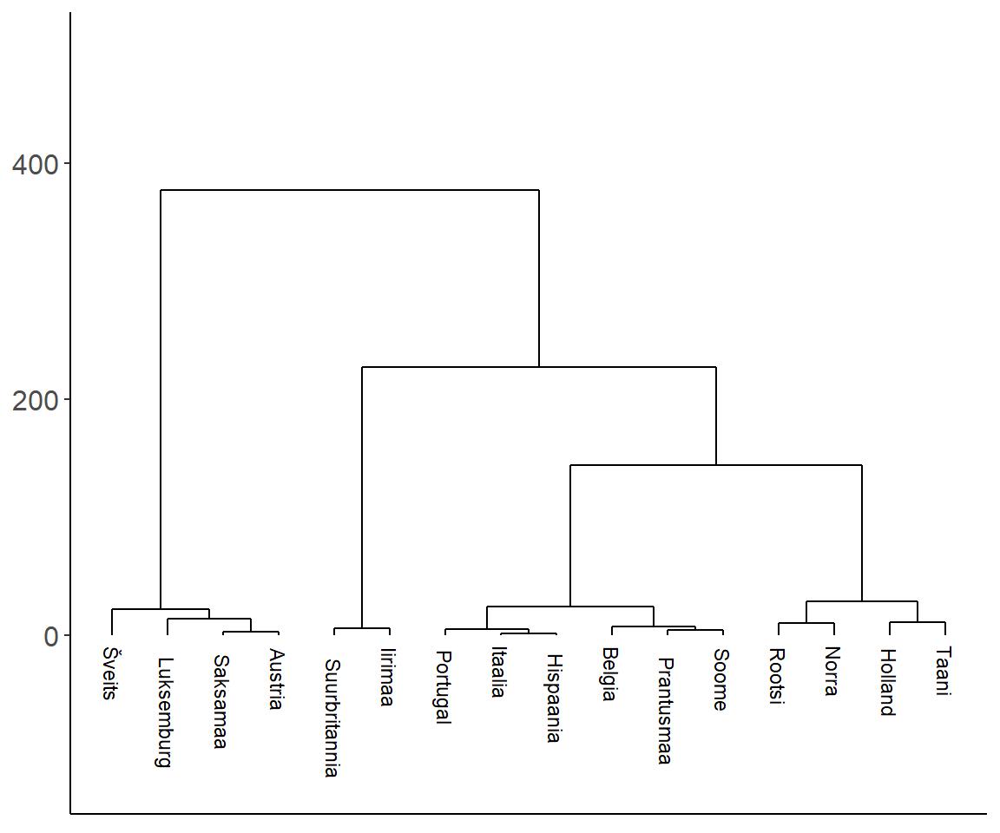
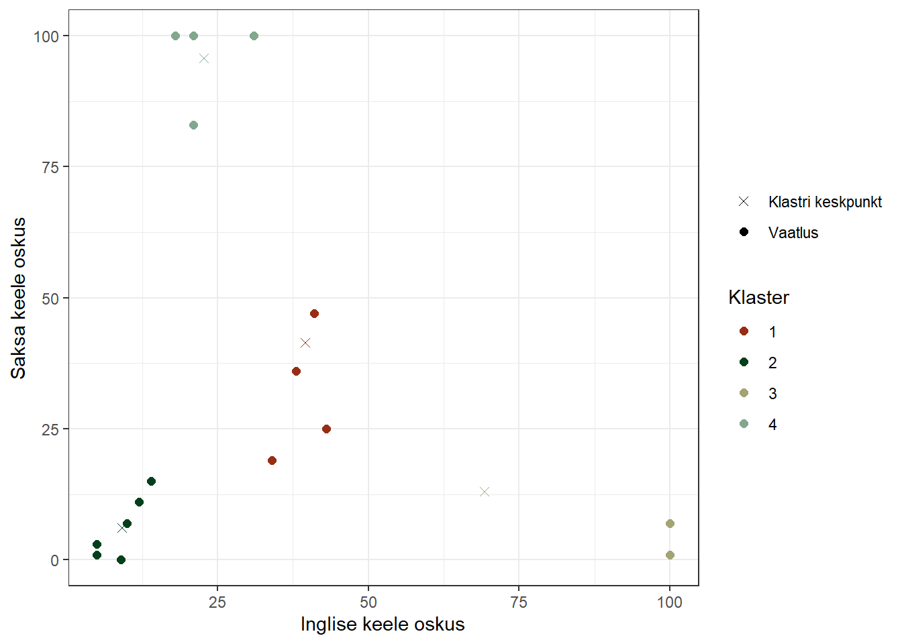

# (PART) Klasteranalüüs {-} 

# Klasteranalüüs


## Mis see klasteranalüüs on?

Klasteranalüüs võimaldab objekte mingite neid kirjeldavate tunnuste alusel grupeerida ehk moodustada neist klastreid. Eesmärgiks on grupeerida grupid nii, et objektid oleksid gruppide siseselt võimalikult sarnased ning gruppide vahel võimalikult erinevad.

Kui me tahaksime 52 kaardilist kaardipakki jagada nelja gruppi, siis palju potentsiaalseid võimalusi meil seda teha oleks? Tuleb välja, et umbes $8.450993 \times 10^{28}$ võimalust. Aga mitu neist võimalustest oleksid tähenduslikud?

Klasteranalüüsi eesmärgiks ongi leida nende potentsiaalselt lõputute grupeerimisvõimaluste seast sobivaim. Teoreetiliselt oleks võimalus leida parimad klastrid, kui proovida läbi kõik võimalikud kombinatsioonid ja mingite kriteeriumite alusel hinnata nende kombinatsioonide kvaliteeti ning seeläbi leida sobivaim (andmetega kõige enam sobituv) lahend. See oleks aga väga ressursimahukas. Seetõttu on klasterdamiseks arendatud teatavad heuristilised võtted, mis küll ei garanteeri kõige optimaalsemat lahendit, kuid siiski lahendi, mis on parem kui enamik.

Klasteranalüüsi eesmärgid jagunevad laias laastus kaheks:  

- Uuritava fenomeni mõistmine  
- Andmete komplekssuse vähendamine nende edasise analüüsi sisendiks

Seega on klasteranalüüs eelkõige kirjeldav või abistav meetod. See ei ole otseselt mõeldud mõjude hindamiseks või hüpoteeside testimiseks (küll võib see olla sisendiks analüüsidele, mis seda teha võimaldavad, nagu näiteks regressioonanalüüsile). Seega on klasteranalüüs suhteliselt sarnane eksploratiivse faktoanalüüsiga (aga mitte kinnitava faktoranalüüsiga) ja peakomponentide meetodiga, mille eesmärkideks on samuti andmetes sisalduva kompleksuse vähendamine ja nn latentsete tunnuste otsimine. Aga kui faktoranalüüsi puhul on latentseteks tunnusteks pidevtunnuselised faktorid, siis klasteranalüüsi kontekstis otsitakse kategoriaalset latentset tunnust ehk mingit grupitunnust. Ja veel, kui faktoranalüüsiga üritame leida tunnuste vahelist ühisosa, siis klasteranalüüsiga üritame üldjuhul koodada sarnaseid vaatlusi (kuigi tegelikult saab klasterdada ka tunnuseid).

Klasteranalüüsi kasutusvaldkond on väga lai. Näiteks:  

- Bioinformaatika ja geenitehnoloogia - grueeritakse näiteks erinevaid geenikombinatsioone  
- Turundus - otsitrakse erinevaid tarbimismustrid (näiteks Netflix profileerib kasutajaid lähtuvalt vaatamisharjumustest)  
- Võrgustiku-uuringud - otsitakse näiteks sarnaseid kontaktide võrgustikke  
- Kriminoloogia - konstrueeritakse hälbivuse tüpoloogiaid, eristatakse kuritegelikke piirkondi sõltuvalt seal toime pandud kuritegude iseloomust  
- Kultuuriuuringud - tüpologiseeritakse inimesi sarnaste hoiakute või uskusmustega põhjal  
- Jne  

Nagu eelnevatest näidetest näha, siis leiab klasteranalüüs kasutust eelkõige olukordades, kus on tegemist suurte ja müraste andmemassiividega. Ehk siis tänapäeval, kus on järjest rohkem andmeid, mis tihti on suured ja mürased, on ka klasteranalüüs järjest aktuaalsem. Klasteranalüüs moodustabki oma olemuselt olulise osa masinõppest ja selle raames on on arendatud ja arendatakse pidevalt edasi mitmesuguseid keerukaid klasterdamisalgorütme. Meie aga vaatame järgnevalt paari lihtsamat ja nn "traditsioonilisemat" meetodit, mille rakendusvaldkonnaks võib vabalt olla ka tavalise küsitlusuuringu analüüs.


### Klasterdamismeetodid

Klasterdamismeetodid jagunevad üldjuhul kolme suuremasse kategooriasse:

- __Hierarhilised meetodid__, kus me võtame algselt üksikud vaatlused ja hakkame neid lähtuvalt nende sarnasusest kokku panema
- __Mitte-hierarhilised ehk jaotavad (*partitioning*) meetodid__, kus jaotame objektid erinevatesse klastritesse ja hindame mingi kriteeriumi alusel moodustunud klastrite sobivust andmetega
- __Mudelipõhised meetodid__, kus käsitleme analüüsitavate tunnuste jaotusi alampopulatsioonide (klastrite) jaotuste summadena.

### Kuidas mõõta objektide erinevust/sarnasust?

Klasterdades grupeeritakse objekte lähtuvalt nendevaheliste erinevuste (_dissimilarity_) suurustest. Erinevuste kvantifitseerimiseks on mitmeid meetodeid, mille valik sõltub:  

- tunnuste iseloomust (arvtunnus, kategoriaalne tunnus, binaarne tunnus);
- tunnuse skaalast (järjestus, intervall, nominaalne);
- uuritava nähtuse olemusest.

Enim kasutatavad erinevuse mõõdikud on:  

- ruumiline kaugus (näiteks eukleidiline kaugus või manhattan'i kaugus);
- korrelatsioon (näiteks Pearsoni, Spearmani või Kendalli korrealtsioon).

Neist omakorda kõige levinum on **eukleidiline kaugus**: 

$$d(p,q) = \sqrt{(q_1-p_1)^2 + (q_2-p_2)^2 + \cdots + (q_n-p_n)^2}  = \sqrt{\sum_{i=1}^n (q_i-p_i)^2}$$

Eukleidilise kauguse puhul on tgelikult tegemist kõige tavalisema, põhikoolist tuttava, Phytagorose teoreemiga, kus hüpotenuusi ruut võrdub kaatetide ruutude summaga. Eukleidiline kaugus kahe punkti vahel ongi see hüpotenuus ning kaatetideks on punktide kaugused erinevatel telgedel:


Vaatame näitena andmestikku, kus vaatlusteks on Euroopa riigid, mis on eristatud kahe tunnuse - inglise keele ja saksa keele oskus alusel.


Lähtuvalt neist kahest tunnusest saame arvutada kõikide riikide omavahelised kaugused. Näiteks Rootsi ja norra vaheline kaugus moodustub nii:


ehk siis:

$$d(Norra, Rootsi) = \sqrt{(43-34)^2 + (25-19)^2} = \sqrt{81 + 36}  = 10.8$$


Kahe riigi kaugus niisama ei ütle meile eriti midagi. Küll aga muutub see sisukaks siis, kui võrdleme seda teiste riikide vaheliste kaugustega. Seega tuleb meil välja arvutada kõikide riikide omavahelised kaugused ja moodutada neist nn **kauguste maatriks**.

```{=html}
<template id="c71695c5-007e-4038-95c4-b1e8eb2298bf"><style>
.tabwid table{
  border-spacing:0px !important;
  border-collapse:collapse;
  line-height:1;
  margin-left:auto;
  margin-right:auto;
  border-width: 0;
  display: table;
  border-color: transparent;
  caption-side: top;
}
.tabwid-caption-bottom table{
  caption-side: bottom;
}
.tabwid_left table{
  margin-left:0;
}
.tabwid_right table{
  margin-right:0;
}
.tabwid td {
    padding: 0;
}
.tabwid a {
  text-decoration: none;
}
.tabwid thead {
    background-color: transparent;
}
.tabwid tfoot {
    background-color: transparent;
}
.tabwid table tr {
background-color: transparent;
}
.katex-display {
    margin: 0 0 !important;
}
</style><div class="tabwid"><style>.cl-2618dade{}.cl-25fefdda{font-family:'Arial';font-size:8pt;font-weight:normal;font-style:normal;text-decoration:none;color:rgba(0, 0, 0, 1.00);background-color:transparent;}.cl-26093700{margin:0;text-align:left;border-bottom: 0 solid rgba(0, 0, 0, 1.00);border-top: 0 solid rgba(0, 0, 0, 1.00);border-left: 0 solid rgba(0, 0, 0, 1.00);border-right: 0 solid rgba(0, 0, 0, 1.00);padding-bottom:5pt;padding-top:5pt;padding-left:5pt;padding-right:5pt;line-height: 1;background-color:transparent;}.cl-26093701{margin:0;text-align:left;margin-right:auto;writing-mode: vertical-rl;-ms-writing-mode:tb-rl;-webkit-writing-mode:vertical-rl;border-bottom: 0 solid rgba(0, 0, 0, 1.00);border-top: 0 solid rgba(0, 0, 0, 1.00);border-left: 0 solid rgba(0, 0, 0, 1.00);border-right: 0 solid rgba(0, 0, 0, 1.00);padding-bottom:5pt;padding-top:5pt;padding-left:5pt;padding-right:5pt;line-height: 1;background-color:transparent;}.cl-2609852a{width:0.75in;background-color:transparent;vertical-align: middle;border-bottom: 2pt solid rgba(102, 102, 102, 1.00);border-top: 2pt solid rgba(102, 102, 102, 1.00);border-left: 0 solid rgba(0, 0, 0, 1.00);border-right: 0 solid rgba(0, 0, 0, 1.00);margin-bottom:0;margin-top:0;margin-left:0;margin-right:0;}.cl-2609852b{width:0.15in;background-color:transparent;vertical-align: middle;border-bottom: 2pt solid rgba(102, 102, 102, 1.00);border-top: 2pt solid rgba(102, 102, 102, 1.00);border-left: 0 solid rgba(0, 0, 0, 1.00);border-right: 0 solid rgba(0, 0, 0, 1.00);margin-bottom:0;margin-top:0;margin-left:0;margin-right:0;}.cl-2609852c{width:0.75in;background-color:transparent;vertical-align: middle;border-bottom: 0 solid rgba(0, 0, 0, 1.00);border-top: 0 solid rgba(0, 0, 0, 1.00);border-left: 0 solid rgba(0, 0, 0, 1.00);border-right: 0 solid rgba(0, 0, 0, 1.00);margin-bottom:0;margin-top:0;margin-left:0;margin-right:0;}.cl-2609852d{width:0.15in;background-color:transparent;vertical-align: middle;border-bottom: 0 solid rgba(0, 0, 0, 1.00);border-top: 0 solid rgba(0, 0, 0, 1.00);border-left: 0 solid rgba(0, 0, 0, 1.00);border-right: 0 solid rgba(0, 0, 0, 1.00);margin-bottom:0;margin-top:0;margin-left:0;margin-right:0;}.cl-2609852e{width:0.75in;background-color:transparent;vertical-align: middle;border-bottom: 2pt solid rgba(102, 102, 102, 1.00);border-top: 0 solid rgba(0, 0, 0, 1.00);border-left: 0 solid rgba(0, 0, 0, 1.00);border-right: 0 solid rgba(0, 0, 0, 1.00);margin-bottom:0;margin-top:0;margin-left:0;margin-right:0;}.cl-2609852f{width:0.15in;background-color:transparent;vertical-align: middle;border-bottom: 2pt solid rgba(102, 102, 102, 1.00);border-top: 0 solid rgba(0, 0, 0, 1.00);border-left: 0 solid rgba(0, 0, 0, 1.00);border-right: 0 solid rgba(0, 0, 0, 1.00);margin-bottom:0;margin-top:0;margin-left:0;margin-right:0;}</style><table class='cl-2618dade'><thead><tr style="overflow-wrap:break-word;"><td class="cl-2609852a"><p class="cl-26093700"><span class="cl-25fefdda">Riik</span></p></td><td class="cl-2609852b"><p class="cl-26093701"><span class="cl-25fefdda">Saksamaa</span></p></td><td class="cl-2609852b"><p class="cl-26093701"><span class="cl-25fefdda">Itaalia</span></p></td><td class="cl-2609852b"><p class="cl-26093701"><span class="cl-25fefdda">Prantusmaa</span></p></td><td class="cl-2609852b"><p class="cl-26093701"><span class="cl-25fefdda">Holland</span></p></td><td class="cl-2609852b"><p class="cl-26093701"><span class="cl-25fefdda">Belgia</span></p></td><td class="cl-2609852b"><p class="cl-26093701"><span class="cl-25fefdda">Luksemburg</span></p></td><td class="cl-2609852b"><p class="cl-26093701"><span class="cl-25fefdda">Suurbritannia</span></p></td><td class="cl-2609852b"><p class="cl-26093701"><span class="cl-25fefdda">Portugal</span></p></td><td class="cl-2609852b"><p class="cl-26093701"><span class="cl-25fefdda">Austria</span></p></td><td class="cl-2609852b"><p class="cl-26093701"><span class="cl-25fefdda">Šveits</span></p></td><td class="cl-2609852b"><p class="cl-26093701"><span class="cl-25fefdda">Rootsi</span></p></td><td class="cl-2609852b"><p class="cl-26093701"><span class="cl-25fefdda">Taani</span></p></td><td class="cl-2609852b"><p class="cl-26093701"><span class="cl-25fefdda">Norra</span></p></td><td class="cl-2609852b"><p class="cl-26093701"><span class="cl-25fefdda">Soome</span></p></td><td class="cl-2609852b"><p class="cl-26093701"><span class="cl-25fefdda">Hispaania</span></p></td><td class="cl-2609852b"><p class="cl-26093701"><span class="cl-25fefdda">Iirimaa</span></p></td></tr></thead><tbody><tr style="overflow-wrap:break-word;"><td class="cl-2609852c"><p class="cl-26093700"><span class="cl-25fefdda">Saksamaa</span></p></td><td class="cl-2609852d"><p class="cl-26093700"><span class="cl-25fefdda">0</span></p></td><td class="cl-2609852d"><p class="cl-26093700"><span class="cl-25fefdda"></span></p></td><td class="cl-2609852d"><p class="cl-26093700"><span class="cl-25fefdda"></span></p></td><td class="cl-2609852d"><p class="cl-26093700"><span class="cl-25fefdda"></span></p></td><td class="cl-2609852d"><p class="cl-26093700"><span class="cl-25fefdda"></span></p></td><td class="cl-2609852d"><p class="cl-26093700"><span class="cl-25fefdda"></span></p></td><td class="cl-2609852d"><p class="cl-26093700"><span class="cl-25fefdda"></span></p></td><td class="cl-2609852d"><p class="cl-26093700"><span class="cl-25fefdda"></span></p></td><td class="cl-2609852d"><p class="cl-26093700"><span class="cl-25fefdda"></span></p></td><td class="cl-2609852d"><p class="cl-26093700"><span class="cl-25fefdda"></span></p></td><td class="cl-2609852d"><p class="cl-26093700"><span class="cl-25fefdda"></span></p></td><td class="cl-2609852d"><p class="cl-26093700"><span class="cl-25fefdda"></span></p></td><td class="cl-2609852d"><p class="cl-26093700"><span class="cl-25fefdda"></span></p></td><td class="cl-2609852d"><p class="cl-26093700"><span class="cl-25fefdda"></span></p></td><td class="cl-2609852d"><p class="cl-26093700"><span class="cl-25fefdda"></span></p></td><td class="cl-2609852d"><p class="cl-26093700"><span class="cl-25fefdda"></span></p></td></tr><tr style="overflow-wrap:break-word;"><td class="cl-2609852c"><p class="cl-26093700"><span class="cl-25fefdda">Itaalia</span></p></td><td class="cl-2609852d"><p class="cl-26093700"><span class="cl-25fefdda">98.3</span></p></td><td class="cl-2609852d"><p class="cl-26093700"><span class="cl-25fefdda">0</span></p></td><td class="cl-2609852d"><p class="cl-26093700"><span class="cl-25fefdda"></span></p></td><td class="cl-2609852d"><p class="cl-26093700"><span class="cl-25fefdda"></span></p></td><td class="cl-2609852d"><p class="cl-26093700"><span class="cl-25fefdda"></span></p></td><td class="cl-2609852d"><p class="cl-26093700"><span class="cl-25fefdda"></span></p></td><td class="cl-2609852d"><p class="cl-26093700"><span class="cl-25fefdda"></span></p></td><td class="cl-2609852d"><p class="cl-26093700"><span class="cl-25fefdda"></span></p></td><td class="cl-2609852d"><p class="cl-26093700"><span class="cl-25fefdda"></span></p></td><td class="cl-2609852d"><p class="cl-26093700"><span class="cl-25fefdda"></span></p></td><td class="cl-2609852d"><p class="cl-26093700"><span class="cl-25fefdda"></span></p></td><td class="cl-2609852d"><p class="cl-26093700"><span class="cl-25fefdda"></span></p></td><td class="cl-2609852d"><p class="cl-26093700"><span class="cl-25fefdda"></span></p></td><td class="cl-2609852d"><p class="cl-26093700"><span class="cl-25fefdda"></span></p></td><td class="cl-2609852d"><p class="cl-26093700"><span class="cl-25fefdda"></span></p></td><td class="cl-2609852d"><p class="cl-26093700"><span class="cl-25fefdda"></span></p></td></tr><tr style="overflow-wrap:break-word;"><td class="cl-2609852c"><p class="cl-26093700"><span class="cl-25fefdda">Prantusmaa</span></p></td><td class="cl-2609852d"><p class="cl-26093700"><span class="cl-25fefdda">93.6</span></p></td><td class="cl-2609852d"><p class="cl-26093700"><span class="cl-25fefdda">6.4</span></p></td><td class="cl-2609852d"><p class="cl-26093700"><span class="cl-25fefdda">0</span></p></td><td class="cl-2609852d"><p class="cl-26093700"><span class="cl-25fefdda"></span></p></td><td class="cl-2609852d"><p class="cl-26093700"><span class="cl-25fefdda"></span></p></td><td class="cl-2609852d"><p class="cl-26093700"><span class="cl-25fefdda"></span></p></td><td class="cl-2609852d"><p class="cl-26093700"><span class="cl-25fefdda"></span></p></td><td class="cl-2609852d"><p class="cl-26093700"><span class="cl-25fefdda"></span></p></td><td class="cl-2609852d"><p class="cl-26093700"><span class="cl-25fefdda"></span></p></td><td class="cl-2609852d"><p class="cl-26093700"><span class="cl-25fefdda"></span></p></td><td class="cl-2609852d"><p class="cl-26093700"><span class="cl-25fefdda"></span></p></td><td class="cl-2609852d"><p class="cl-26093700"><span class="cl-25fefdda"></span></p></td><td class="cl-2609852d"><p class="cl-26093700"><span class="cl-25fefdda"></span></p></td><td class="cl-2609852d"><p class="cl-26093700"><span class="cl-25fefdda"></span></p></td><td class="cl-2609852d"><p class="cl-26093700"><span class="cl-25fefdda"></span></p></td><td class="cl-2609852d"><p class="cl-26093700"><span class="cl-25fefdda"></span></p></td></tr><tr style="overflow-wrap:break-word;"><td class="cl-2609852c"><p class="cl-26093700"><span class="cl-25fefdda">Holland</span></p></td><td class="cl-2609852d"><p class="cl-26093700"><span class="cl-25fefdda">56.6</span></p></td><td class="cl-2609852d"><p class="cl-26093700"><span class="cl-25fefdda">56.9</span></p></td><td class="cl-2609852d"><p class="cl-26093700"><span class="cl-25fefdda">50.6</span></p></td><td class="cl-2609852d"><p class="cl-26093700"><span class="cl-25fefdda">0</span></p></td><td class="cl-2609852d"><p class="cl-26093700"><span class="cl-25fefdda"></span></p></td><td class="cl-2609852d"><p class="cl-26093700"><span class="cl-25fefdda"></span></p></td><td class="cl-2609852d"><p class="cl-26093700"><span class="cl-25fefdda"></span></p></td><td class="cl-2609852d"><p class="cl-26093700"><span class="cl-25fefdda"></span></p></td><td class="cl-2609852d"><p class="cl-26093700"><span class="cl-25fefdda"></span></p></td><td class="cl-2609852d"><p class="cl-26093700"><span class="cl-25fefdda"></span></p></td><td class="cl-2609852d"><p class="cl-26093700"><span class="cl-25fefdda"></span></p></td><td class="cl-2609852d"><p class="cl-26093700"><span class="cl-25fefdda"></span></p></td><td class="cl-2609852d"><p class="cl-26093700"><span class="cl-25fefdda"></span></p></td><td class="cl-2609852d"><p class="cl-26093700"><span class="cl-25fefdda"></span></p></td><td class="cl-2609852d"><p class="cl-26093700"><span class="cl-25fefdda"></span></p></td><td class="cl-2609852d"><p class="cl-26093700"><span class="cl-25fefdda"></span></p></td></tr><tr style="overflow-wrap:break-word;"><td class="cl-2609852c"><p class="cl-26093700"><span class="cl-25fefdda">Belgia</span></p></td><td class="cl-2609852d"><p class="cl-26093700"><span class="cl-25fefdda">85.3</span></p></td><td class="cl-2609852d"><p class="cl-26093700"><span class="cl-25fefdda">15</span></p></td><td class="cl-2609852d"><p class="cl-26093700"><span class="cl-25fefdda">8.9</span></p></td><td class="cl-2609852d"><p class="cl-26093700"><span class="cl-25fefdda">41.9</span></p></td><td class="cl-2609852d"><p class="cl-26093700"><span class="cl-25fefdda">0</span></p></td><td class="cl-2609852d"><p class="cl-26093700"><span class="cl-25fefdda"></span></p></td><td class="cl-2609852d"><p class="cl-26093700"><span class="cl-25fefdda"></span></p></td><td class="cl-2609852d"><p class="cl-26093700"><span class="cl-25fefdda"></span></p></td><td class="cl-2609852d"><p class="cl-26093700"><span class="cl-25fefdda"></span></p></td><td class="cl-2609852d"><p class="cl-26093700"><span class="cl-25fefdda"></span></p></td><td class="cl-2609852d"><p class="cl-26093700"><span class="cl-25fefdda"></span></p></td><td class="cl-2609852d"><p class="cl-26093700"><span class="cl-25fefdda"></span></p></td><td class="cl-2609852d"><p class="cl-26093700"><span class="cl-25fefdda"></span></p></td><td class="cl-2609852d"><p class="cl-26093700"><span class="cl-25fefdda"></span></p></td><td class="cl-2609852d"><p class="cl-26093700"><span class="cl-25fefdda"></span></p></td><td class="cl-2609852d"><p class="cl-26093700"><span class="cl-25fefdda"></span></p></td></tr><tr style="overflow-wrap:break-word;"><td class="cl-2609852c"><p class="cl-26093700"><span class="cl-25fefdda">Luksemburg</span></p></td><td class="cl-2609852d"><p class="cl-26093700"><span class="cl-25fefdda">10</span></p></td><td class="cl-2609852d"><p class="cl-26093700"><span class="cl-25fefdda">100.4</span></p></td><td class="cl-2609852d"><p class="cl-26093700"><span class="cl-25fefdda">95.3</span></p></td><td class="cl-2609852d"><p class="cl-26093700"><span class="cl-25fefdda">53.9</span></p></td><td class="cl-2609852d"><p class="cl-26093700"><span class="cl-25fefdda">86.7</span></p></td><td class="cl-2609852d"><p class="cl-26093700"><span class="cl-25fefdda">0</span></p></td><td class="cl-2609852d"><p class="cl-26093700"><span class="cl-25fefdda"></span></p></td><td class="cl-2609852d"><p class="cl-26093700"><span class="cl-25fefdda"></span></p></td><td class="cl-2609852d"><p class="cl-26093700"><span class="cl-25fefdda"></span></p></td><td class="cl-2609852d"><p class="cl-26093700"><span class="cl-25fefdda"></span></p></td><td class="cl-2609852d"><p class="cl-26093700"><span class="cl-25fefdda"></span></p></td><td class="cl-2609852d"><p class="cl-26093700"><span class="cl-25fefdda"></span></p></td><td class="cl-2609852d"><p class="cl-26093700"><span class="cl-25fefdda"></span></p></td><td class="cl-2609852d"><p class="cl-26093700"><span class="cl-25fefdda"></span></p></td><td class="cl-2609852d"><p class="cl-26093700"><span class="cl-25fefdda"></span></p></td><td class="cl-2609852d"><p class="cl-26093700"><span class="cl-25fefdda"></span></p></td></tr><tr style="overflow-wrap:break-word;"><td class="cl-2609852c"><p class="cl-26093700"><span class="cl-25fefdda">Suurbritannia</span></p></td><td class="cl-2609852d"><p class="cl-26093700"><span class="cl-25fefdda">122</span></p></td><td class="cl-2609852d"><p class="cl-26093700"><span class="cl-25fefdda">95.1</span></p></td><td class="cl-2609852d"><p class="cl-26093700"><span class="cl-25fefdda">90</span></p></td><td class="cl-2609852d"><p class="cl-26093700"><span class="cl-25fefdda">71.3</span></p></td><td class="cl-2609852d"><p class="cl-26093700"><span class="cl-25fefdda">86.4</span></p></td><td class="cl-2609852d"><p class="cl-26093700"><span class="cl-25fefdda">115.8</span></p></td><td class="cl-2609852d"><p class="cl-26093700"><span class="cl-25fefdda">0</span></p></td><td class="cl-2609852d"><p class="cl-26093700"><span class="cl-25fefdda"></span></p></td><td class="cl-2609852d"><p class="cl-26093700"><span class="cl-25fefdda"></span></p></td><td class="cl-2609852d"><p class="cl-26093700"><span class="cl-25fefdda"></span></p></td><td class="cl-2609852d"><p class="cl-26093700"><span class="cl-25fefdda"></span></p></td><td class="cl-2609852d"><p class="cl-26093700"><span class="cl-25fefdda"></span></p></td><td class="cl-2609852d"><p class="cl-26093700"><span class="cl-25fefdda"></span></p></td><td class="cl-2609852d"><p class="cl-26093700"><span class="cl-25fefdda"></span></p></td><td class="cl-2609852d"><p class="cl-26093700"><span class="cl-25fefdda"></span></p></td><td class="cl-2609852d"><p class="cl-26093700"><span class="cl-25fefdda"></span></p></td></tr><tr style="overflow-wrap:break-word;"><td class="cl-2609852c"><p class="cl-26093700"><span class="cl-25fefdda">Portugal</span></p></td><td class="cl-2609852d"><p class="cl-26093700"><span class="cl-25fefdda">100.7</span></p></td><td class="cl-2609852d"><p class="cl-26093700"><span class="cl-25fefdda">5</span></p></td><td class="cl-2609852d"><p class="cl-26093700"><span class="cl-25fefdda">7.1</span></p></td><td class="cl-2609852d"><p class="cl-26093700"><span class="cl-25fefdda">56.9</span></p></td><td class="cl-2609852d"><p class="cl-26093700"><span class="cl-25fefdda">15.8</span></p></td><td class="cl-2609852d"><p class="cl-26093700"><span class="cl-25fefdda">102.4</span></p></td><td class="cl-2609852d"><p class="cl-26093700"><span class="cl-25fefdda">91.3</span></p></td><td class="cl-2609852d"><p class="cl-26093700"><span class="cl-25fefdda">0</span></p></td><td class="cl-2609852d"><p class="cl-26093700"><span class="cl-25fefdda"></span></p></td><td class="cl-2609852d"><p class="cl-26093700"><span class="cl-25fefdda"></span></p></td><td class="cl-2609852d"><p class="cl-26093700"><span class="cl-25fefdda"></span></p></td><td class="cl-2609852d"><p class="cl-26093700"><span class="cl-25fefdda"></span></p></td><td class="cl-2609852d"><p class="cl-26093700"><span class="cl-25fefdda"></span></p></td><td class="cl-2609852d"><p class="cl-26093700"><span class="cl-25fefdda"></span></p></td><td class="cl-2609852d"><p class="cl-26093700"><span class="cl-25fefdda"></span></p></td><td class="cl-2609852d"><p class="cl-26093700"><span class="cl-25fefdda"></span></p></td></tr><tr style="overflow-wrap:break-word;"><td class="cl-2609852c"><p class="cl-26093700"><span class="cl-25fefdda">Austria</span></p></td><td class="cl-2609852d"><p class="cl-26093700"><span class="cl-25fefdda">3</span></p></td><td class="cl-2609852d"><p class="cl-26093700"><span class="cl-25fefdda">97.9</span></p></td><td class="cl-2609852d"><p class="cl-26093700"><span class="cl-25fefdda">93.3</span></p></td><td class="cl-2609852d"><p class="cl-26093700"><span class="cl-25fefdda">57.8</span></p></td><td class="cl-2609852d"><p class="cl-26093700"><span class="cl-25fefdda">85.1</span></p></td><td class="cl-2609852d"><p class="cl-26093700"><span class="cl-25fefdda">13</span></p></td><td class="cl-2609852d"><p class="cl-26093700"><span class="cl-25fefdda">124</span></p></td><td class="cl-2609852d"><p class="cl-26093700"><span class="cl-25fefdda">100.4</span></p></td><td class="cl-2609852d"><p class="cl-26093700"><span class="cl-25fefdda">0</span></p></td><td class="cl-2609852d"><p class="cl-26093700"><span class="cl-25fefdda"></span></p></td><td class="cl-2609852d"><p class="cl-26093700"><span class="cl-25fefdda"></span></p></td><td class="cl-2609852d"><p class="cl-26093700"><span class="cl-25fefdda"></span></p></td><td class="cl-2609852d"><p class="cl-26093700"><span class="cl-25fefdda"></span></p></td><td class="cl-2609852d"><p class="cl-26093700"><span class="cl-25fefdda"></span></p></td><td class="cl-2609852d"><p class="cl-26093700"><span class="cl-25fefdda"></span></p></td><td class="cl-2609852d"><p class="cl-26093700"><span class="cl-25fefdda"></span></p></td></tr><tr style="overflow-wrap:break-word;"><td class="cl-2609852c"><p class="cl-26093700"><span class="cl-25fefdda">Šveits</span></p></td><td class="cl-2609852d"><p class="cl-26093700"><span class="cl-25fefdda">17</span></p></td><td class="cl-2609852d"><p class="cl-26093700"><span class="cl-25fefdda">81.6</span></p></td><td class="cl-2609852d"><p class="cl-26093700"><span class="cl-25fefdda">76.8</span></p></td><td class="cl-2609852d"><p class="cl-26093700"><span class="cl-25fefdda">41.2</span></p></td><td class="cl-2609852d"><p class="cl-26093700"><span class="cl-25fefdda">68.4</span></p></td><td class="cl-2609852d"><p class="cl-26093700"><span class="cl-25fefdda">19.7</span></p></td><td class="cl-2609852d"><p class="cl-26093700"><span class="cl-25fefdda">109.6</span></p></td><td class="cl-2609852d"><p class="cl-26093700"><span class="cl-25fefdda">83.9</span></p></td><td class="cl-2609852d"><p class="cl-26093700"><span class="cl-25fefdda">17.3</span></p></td><td class="cl-2609852d"><p class="cl-26093700"><span class="cl-25fefdda">0</span></p></td><td class="cl-2609852d"><p class="cl-26093700"><span class="cl-25fefdda"></span></p></td><td class="cl-2609852d"><p class="cl-26093700"><span class="cl-25fefdda"></span></p></td><td class="cl-2609852d"><p class="cl-26093700"><span class="cl-25fefdda"></span></p></td><td class="cl-2609852d"><p class="cl-26093700"><span class="cl-25fefdda"></span></p></td><td class="cl-2609852d"><p class="cl-26093700"><span class="cl-25fefdda"></span></p></td><td class="cl-2609852d"><p class="cl-26093700"><span class="cl-25fefdda"></span></p></td></tr><tr style="overflow-wrap:break-word;"><td class="cl-2609852c"><p class="cl-26093700"><span class="cl-25fefdda">Rootsi</span></p></td><td class="cl-2609852d"><p class="cl-26093700"><span class="cl-25fefdda">78.2</span></p></td><td class="cl-2609852d"><p class="cl-26093700"><span class="cl-25fefdda">43.9</span></p></td><td class="cl-2609852d"><p class="cl-26093700"><span class="cl-25fefdda">37.6</span></p></td><td class="cl-2609852d"><p class="cl-26093700"><span class="cl-25fefdda">22.1</span></p></td><td class="cl-2609852d"><p class="cl-26093700"><span class="cl-25fefdda">30.7</span></p></td><td class="cl-2609852d"><p class="cl-26093700"><span class="cl-25fefdda">76</span></p></td><td class="cl-2609852d"><p class="cl-26093700"><span class="cl-25fefdda">59.8</span></p></td><td class="cl-2609852d"><p class="cl-26093700"><span class="cl-25fefdda">42.2</span></p></td><td class="cl-2609852d"><p class="cl-26093700"><span class="cl-25fefdda">79.1</span></p></td><td class="cl-2609852d"><p class="cl-26093700"><span class="cl-25fefdda">62</span></p></td><td class="cl-2609852d"><p class="cl-26093700"><span class="cl-25fefdda">0</span></p></td><td class="cl-2609852d"><p class="cl-26093700"><span class="cl-25fefdda"></span></p></td><td class="cl-2609852d"><p class="cl-26093700"><span class="cl-25fefdda"></span></p></td><td class="cl-2609852d"><p class="cl-26093700"><span class="cl-25fefdda"></span></p></td><td class="cl-2609852d"><p class="cl-26093700"><span class="cl-25fefdda"></span></p></td><td class="cl-2609852d"><p class="cl-26093700"><span class="cl-25fefdda"></span></p></td></tr><tr style="overflow-wrap:break-word;"><td class="cl-2609852c"><p class="cl-26093700"><span class="cl-25fefdda">Taani</span></p></td><td class="cl-2609852d"><p class="cl-26093700"><span class="cl-25fefdda">66.2</span></p></td><td class="cl-2609852d"><p class="cl-26093700"><span class="cl-25fefdda">46.7</span></p></td><td class="cl-2609852d"><p class="cl-26093700"><span class="cl-25fefdda">40.3</span></p></td><td class="cl-2609852d"><p class="cl-26093700"><span class="cl-25fefdda">11.4</span></p></td><td class="cl-2609852d"><p class="cl-26093700"><span class="cl-25fefdda">31.9</span></p></td><td class="cl-2609852d"><p class="cl-26093700"><span class="cl-25fefdda">64.4</span></p></td><td class="cl-2609852d"><p class="cl-26093700"><span class="cl-25fefdda">68.4</span></p></td><td class="cl-2609852d"><p class="cl-26093700"><span class="cl-25fefdda">46.2</span></p></td><td class="cl-2609852d"><p class="cl-26093700"><span class="cl-25fefdda">67.1</span></p></td><td class="cl-2609852d"><p class="cl-26093700"><span class="cl-25fefdda">50</span></p></td><td class="cl-2609852d"><p class="cl-26093700"><span class="cl-25fefdda">12.1</span></p></td><td class="cl-2609852d"><p class="cl-26093700"><span class="cl-25fefdda">0</span></p></td><td class="cl-2609852d"><p class="cl-26093700"><span class="cl-25fefdda"></span></p></td><td class="cl-2609852d"><p class="cl-26093700"><span class="cl-25fefdda"></span></p></td><td class="cl-2609852d"><p class="cl-26093700"><span class="cl-25fefdda"></span></p></td><td class="cl-2609852d"><p class="cl-26093700"><span class="cl-25fefdda"></span></p></td></tr><tr style="overflow-wrap:break-word;"><td class="cl-2609852c"><p class="cl-26093700"><span class="cl-25fefdda">Norra</span></p></td><td class="cl-2609852d"><p class="cl-26093700"><span class="cl-25fefdda">82</span></p></td><td class="cl-2609852d"><p class="cl-26093700"><span class="cl-25fefdda">33.1</span></p></td><td class="cl-2609852d"><p class="cl-26093700"><span class="cl-25fefdda">26.8</span></p></td><td class="cl-2609852d"><p class="cl-26093700"><span class="cl-25fefdda">28.9</span></p></td><td class="cl-2609852d"><p class="cl-26093700"><span class="cl-25fefdda">20.4</span></p></td><td class="cl-2609852d"><p class="cl-26093700"><span class="cl-25fefdda">81.1</span></p></td><td class="cl-2609852d"><p class="cl-26093700"><span class="cl-25fefdda">67.1</span></p></td><td class="cl-2609852d"><p class="cl-26093700"><span class="cl-25fefdda">31.4</span></p></td><td class="cl-2609852d"><p class="cl-26093700"><span class="cl-25fefdda">82.6</span></p></td><td class="cl-2609852d"><p class="cl-26093700"><span class="cl-25fefdda">65.3</span></p></td><td class="cl-2609852d"><p class="cl-26093700"><span class="cl-25fefdda">10.8</span></p></td><td class="cl-2609852d"><p class="cl-26093700"><span class="cl-25fefdda">17.5</span></p></td><td class="cl-2609852d"><p class="cl-26093700"><span class="cl-25fefdda">0</span></p></td><td class="cl-2609852d"><p class="cl-26093700"><span class="cl-25fefdda"></span></p></td><td class="cl-2609852d"><p class="cl-26093700"><span class="cl-25fefdda"></span></p></td><td class="cl-2609852d"><p class="cl-26093700"><span class="cl-25fefdda"></span></p></td></tr><tr style="overflow-wrap:break-word;"><td class="cl-2609852c"><p class="cl-26093700"><span class="cl-25fefdda">Soome</span></p></td><td class="cl-2609852d"><p class="cl-26093700"><span class="cl-25fefdda">89.5</span></p></td><td class="cl-2609852d"><p class="cl-26093700"><span class="cl-25fefdda">10.6</span></p></td><td class="cl-2609852d"><p class="cl-26093700"><span class="cl-25fefdda">4.5</span></p></td><td class="cl-2609852d"><p class="cl-26093700"><span class="cl-25fefdda">46.2</span></p></td><td class="cl-2609852d"><p class="cl-26093700"><span class="cl-25fefdda">4.5</span></p></td><td class="cl-2609852d"><p class="cl-26093700"><span class="cl-25fefdda">91</span></p></td><td class="cl-2609852d"><p class="cl-26093700"><span class="cl-25fefdda">88.1</span></p></td><td class="cl-2609852d"><p class="cl-26093700"><span class="cl-25fefdda">11.4</span></p></td><td class="cl-2609852d"><p class="cl-26093700"><span class="cl-25fefdda">89.2</span></p></td><td class="cl-2609852d"><p class="cl-26093700"><span class="cl-25fefdda">72.6</span></p></td><td class="cl-2609852d"><p class="cl-26093700"><span class="cl-25fefdda">34</span></p></td><td class="cl-2609852d"><p class="cl-26093700"><span class="cl-25fefdda">36.1</span></p></td><td class="cl-2609852d"><p class="cl-26093700"><span class="cl-25fefdda">23.4</span></p></td><td class="cl-2609852d"><p class="cl-26093700"><span class="cl-25fefdda">0</span></p></td><td class="cl-2609852d"><p class="cl-26093700"><span class="cl-25fefdda"></span></p></td><td class="cl-2609852d"><p class="cl-26093700"><span class="cl-25fefdda"></span></p></td></tr><tr style="overflow-wrap:break-word;"><td class="cl-2609852c"><p class="cl-26093700"><span class="cl-25fefdda">Hispaania</span></p></td><td class="cl-2609852d"><p class="cl-26093700"><span class="cl-25fefdda">100.3</span></p></td><td class="cl-2609852d"><p class="cl-26093700"><span class="cl-25fefdda">2</span></p></td><td class="cl-2609852d"><p class="cl-26093700"><span class="cl-25fefdda">7.8</span></p></td><td class="cl-2609852d"><p class="cl-26093700"><span class="cl-25fefdda">58.4</span></p></td><td class="cl-2609852d"><p class="cl-26093700"><span class="cl-25fefdda">16.6</span></p></td><td class="cl-2609852d"><p class="cl-26093700"><span class="cl-25fefdda">102.4</span></p></td><td class="cl-2609852d"><p class="cl-26093700"><span class="cl-25fefdda">95.2</span></p></td><td class="cl-2609852d"><p class="cl-26093700"><span class="cl-25fefdda">4.1</span></p></td><td class="cl-2609852d"><p class="cl-26093700"><span class="cl-25fefdda">99.8</span></p></td><td class="cl-2609852d"><p class="cl-26093700"><span class="cl-25fefdda">83.5</span></p></td><td class="cl-2609852d"><p class="cl-26093700"><span class="cl-25fefdda">44.9</span></p></td><td class="cl-2609852d"><p class="cl-26093700"><span class="cl-25fefdda">48.1</span></p></td><td class="cl-2609852d"><p class="cl-26093700"><span class="cl-25fefdda">34.1</span></p></td><td class="cl-2609852d"><p class="cl-26093700"><span class="cl-25fefdda">12.2</span></p></td><td class="cl-2609852d"><p class="cl-26093700"><span class="cl-25fefdda">0</span></p></td><td class="cl-2609852d"><p class="cl-26093700"><span class="cl-25fefdda"></span></p></td></tr><tr style="overflow-wrap:break-word;"><td class="cl-2609852e"><p class="cl-26093700"><span class="cl-25fefdda">Iirimaa</span></p></td><td class="cl-2609852f"><p class="cl-26093700"><span class="cl-25fefdda">126.7</span></p></td><td class="cl-2609852f"><p class="cl-26093700"><span class="cl-25fefdda">95</span></p></td><td class="cl-2609852f"><p class="cl-26093700"><span class="cl-25fefdda">90.2</span></p></td><td class="cl-2609852f"><p class="cl-26093700"><span class="cl-25fefdda">74.8</span></p></td><td class="cl-2609852f"><p class="cl-26093700"><span class="cl-25fefdda">87.1</span></p></td><td class="cl-2609852f"><p class="cl-26093700"><span class="cl-25fefdda">120.7</span></p></td><td class="cl-2609852f"><p class="cl-26093700"><span class="cl-25fefdda">6</span></p></td><td class="cl-2609852f"><p class="cl-26093700"><span class="cl-25fefdda">91</span></p></td><td class="cl-2609852f"><p class="cl-26093700"><span class="cl-25fefdda">128.5</span></p></td><td class="cl-2609852f"><p class="cl-26093700"><span class="cl-25fefdda">113.9</span></p></td><td class="cl-2609852f"><p class="cl-26093700"><span class="cl-25fefdda">61.8</span></p></td><td class="cl-2609852f"><p class="cl-26093700"><span class="cl-25fefdda">71.2</span></p></td><td class="cl-2609852f"><p class="cl-26093700"><span class="cl-25fefdda">68.4</span></p></td><td class="cl-2609852f"><p class="cl-26093700"><span class="cl-25fefdda">88.6</span></p></td><td class="cl-2609852f"><p class="cl-26093700"><span class="cl-25fefdda">95</span></p></td><td class="cl-2609852f"><p class="cl-26093700"><span class="cl-25fefdda">0</span></p></td></tr></tbody></table></div></template>
<div class="flextable-shadow-host" id="35d149f6-39e3-44b8-939f-4dbcc636b13e"></div>
<script>
var dest = document.getElementById("35d149f6-39e3-44b8-939f-4dbcc636b13e");
var template = document.getElementById("c71695c5-007e-4038-95c4-b1e8eb2298bf");
var caption = template.content.querySelector("caption");
var fantome = dest.attachShadow({mode: 'open'});
var templateContent = template.content;
fantome.appendChild(templateContent);
</script>

```

Miks meil seda üldse vaja on? Saame ju punktdiagrammilt silmagagi näha millised riigid on üksteisest kaugemal ja millised lähemal. Kahe tunnuse ehk dimensiooni puhul on see tõesti nii. Ka kolme tunnuse/dimensiooni puhul saame hakkama. Aga kui meil oleks neli tunnust? Või 100 tunnust? Kauguste maatriksi saame aga arvutada ka 100 tunnuse puhul, kirjeldes sellega 100-dimensionaalset ruumi.

## Hierarhiline klasteranalüüs

Hierarhilised klasteranalüüsi loogika on järgmine:

1. Alustatakse individuaalsetest objektidest, kus iga objekt on algselt üks klaster
2. Kaks kõige sarnasemat klastrit (lähtuvalt nendevahelisest kaugusest) grupeeritakse kokku
3. Klastrite grupeerimist jätkatakse kuni on alles vaid üks klaster

Graafiliselt näeb see välja nii:



Taolist klastrite moodustamise joonist nimetatakse **dendogrammiks**.

### Klastrite ühendamise meetodid (_linkage_)

Kuid nüüd tekib üks probleem. Esimese tasandi puhul, kus iga objekt on omaette klastris, on asjad lihtsad - paneme kokku need klastrid, milledes olevate objektide omavaheline kaugus on väikseim. Kuid kuidas me hindame klastrite vahelist kaugust, kui klastrites on rohkem kui üks objekt? Näiteks mis on Rootsi ja Norra klastri ning Hollandi ja Taani klastri omavaheline kaugus? 

Selleks puhuks on välja mõeldud vastavad erinevad klastrite ühendamise meetodid. Neid on suhteliselt palju kuid toome mõned näitena ära:

**Single linkage**, kus klastrite vaheline kaugus tuletatakse klastrite kõige lähemate objektide omavahelisest kaugusest: 


**Complete linkage**, kus klastrite vaheline kaugus tuletatakse klastrite kõige kaugemate objektide omavahelisest kaugusest: 


**Centroid linkage**, kus klastrite vaheline kaugus tuletatakse klastrite objektide keskpunktide omavahelisest kaugusest: 


Kõige populaarsem ja parimaid tulemusi andma kippuv meetod on aga vist Wardi meetod, kus pannakse kokku need klastrid, mille puhul klastrite sisese variatiivsuse kasv on minimaalne.

### Klastrite arvu valik

Kui oleme klasteranalüüsi läbi viinud, ehk siis arvutanud kauguste maatriksi ja selle põhjal mingi klastrite ühendamise meetodiga tuletanud klasterlahendi (ehk siis tegelikult selle eelnevalt toodud dendogrammi), siis mis edasi? Hierahilise klasteranalüüsi puhul on meil alati kõige kõrgemal tasandil lõpuks üks klaster. Sellega ei ole aga midagi tarka peale hakata. 

Järgmiseks etapiks olekski klastrite arvu määramine. See on aga puhtalt subjektiivne tegevust. On küll olemas mõned meetodid ja testid, millega optimaalset klastrite arvu määrata, kuid need kipuvad tihti vastakaid tulemusi andma. Ehk siis lõppkokkuvõttes tuleb klastrite arvu valik meil ikkagi ise teha ja selle eest ka vastutada. Klastrite defineerimiseks tuleb meil lihtsalt dendogrammist joon läbi tõmmata, misläbi määrame ära, et objektid, mis on joonest allpool ühendatud, kuuluvad samasse klastrisse. Ja objektid, mille ühenduskoht jääb joonest kõrgemale, kuuluvad erinevatesse klastritesse.

Eelneva näite puhul tundub kõige mõistlikum see joon tõmmata nelja klastrilise lahendi kõrguselt.


### Hierarhilise klasteranalüüsi puudused

- Lahendi leidmine on arvutuslikult väga ressursimahukas
- Klastrite arvu määramine on väga subjektiivne
- Tulemus sõltub väga palju erinevuse mõõtmise meetodist ning klastrite ühendamise meetodist 


## K-keskmiste (k-means) klasterdamine

K-kesmiste klasterdamise puhul tuleb enne meetodi rakendamist teada mitut klastrit tahetakse. Seejärel jaotab klasterdamisalgoritm kõik klasterdatavad objektid vastavalt määratud klastrite arvule klastritesse. Ja teeb seda nii, et objektid klastrite sees oleksid võimalikult sarnased ning klastrite vahel võimalikult erinevad. Tegemist on hästi lihtsa algoritmiga, mis tähendab et see ei nõua eriti palju uarvutuslikku ressurssi ja sobib seetõttu ka suurte andmestike puhul

K-keskmiste algoritm lähtub järgmistest sammudest:

1. Määratakse klastrite arv
2. Valitakse juhuslikud klastrite keskpunktid (tsentroidid)
3. Igale objektile arvutatakse kaugus kõikidest klastrist ja objekt määratakse lähimasse klastrisse
4. Igale klastrile arvutatakse uus tsentroid (seega juhuslikud keskpunktid asendatakse objektidest lähtuvate keskpunktidega)
5. Iga objekti kaugus kõigi klastrite keskpunktidest arvutatakse uuesti ja objektid määratakse jälle lähimasse klastrisse
6. Arvutatakse jälle uued klastrite keskpunktid
7. Punkte 5 ja 6 korratakse nii kaua, kuni objektid enam klastrite vahel ei liigu

Käime need sammud juba eelnevalt vaadatud riikide keelteoskuse näidet aluseks võttes läbi:


Eeldame, et riigid jaotuvad nelja klastrisse (selle eelduse tegemisel võib aluseks olla meie eelnev valdkonnateadmine, hierarhilise klasteranalüüsi tulem vms). Jaotame esmalt kõik riigi suvaliselt nende nelja klastri vahel.


Seejärel arvutame igale (suvalisele) klastrile keskpunkti. Klastri keskpunktiks on lihtsalt klastrisse kuuluvate objektide keskmised koordinaadid. Kahe tunnuse korral on keskpunkt määratletud kahe dismensiooni koordinaatidega. Meil on iga klastri jaoks vaja leida selle objektide keskmine x-väärtus ja keskmine y-väärtus.


Järgmisena grupeerime kõik objektid ümber lähtuvalt sellest, millise klastri keskpunkt neile kõige lähemal on.


Ja arvutame uuesti klastrite keskpunktid.


Ning grupeerime jälle objektid ümber lähtuvalt neile kõige lähemast klastri keskpunktist.




Arvutame uuesti klastrite keskpunktid.


Teeme seda seni kuni objektid enam klastrite vahel ei liigu. Antud näite puhul kuluks selleks kaks ümbergrupeerimist ehk kaks iteratsiooni. Rohkemate objektide ja rohkemate dimensioonide korral tuleb neid iteratsioone muidugi rohkem, kuid loogika jääb alati samaks.


### K-keskmiste klasteranalüüsi puudused

K-keskmiste algoritm üritab minimeerida ruuthälvete summat, st objektide hälbeid klastrite keskpunktidest. Eesmärgiks on leida lahend, millest vähema ruuthälvete summadega lahendit ei ole. Seda eesmärki on reaalsuses aga küllaltki raske tagada. Tihti on lahendiks nn lokaalne optimum, samas kui meie otsime nn globaalset optiumi. See tuleneb sellest, et algne klastritesse määramine on juhuslik ning puhtalt juhuslikult võime me objektid esialgsetesse klastritesse jagada nii, et globaalselt optimaalse, ehk parima võimaliku tulemi saavutamine ei ole võimalik. Seetõttu peaks iga mudelit erinevate juhuslike algväärtustega mitmeid kordi jooksutama ning kui tulemid erinevad, siis valima lahendi, mida esineb kõige rohkem.  

Kuna klastrite arv peab olema teada enne klasterdamist, siis ei saa me olla kindlad, et meie määratud klastrite arv on optimaalne. Siin on lahenduseks jälegi mitmete erinevate klastrite arvudega mudelite jooksutamine. Siin on abiks jällegi erinevad testid ja diagnostikad, millega erinevatest mudelitest parim välja valida. 

K-keskmiste klasterdamine ei toimi hästi mürase andestike ja erindite korral ning ei sobi ebakonventsionaalsete kujudega klastrite leidmiseks. Kuna meetod lähtub klastrite keskpunktidest, siis eeldab see et kõik konkreetse klastri objektid on suhteliselt ühtlaselt selle keskpunkti ümber kogunenud.


## Klasteranalüüsi tulemi valiidsus

Klasterdamine on eelkõige eksploratiivne analüüs. Kuid tulemused, et neist saaks sisukaid järeldusi teha, peavad siiski olema mingil viisil valideeritud. Eelkõige peavad tulemused olema stabiilsed. Selle tagamiseks võib:
- Jagades andmed kaheks ja proovida meetodit mõlema osa peal
- Kasutades mitut erinevat meetodit
